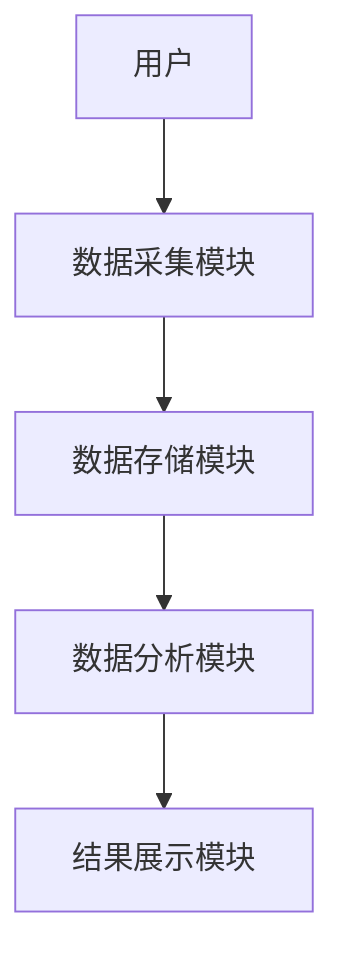

                 


# 特价股票与公司跨界数字化协同能力的关系研究

**关键词**：特价股票，公司能力，数字化协同，系统架构，算法实现

**摘要**：本文探讨了特价股票与公司跨界数字化协同能力之间的关系，从理论模型构建、实证分析、系统设计和项目实战四个方面进行深入研究。通过数学模型和算法实现，揭示了数字化协同能力对股价波动的影响，并提出了系统的解决方案。

---

# 第1章: 特价股票与公司数字化协同能力的背景与概念

## 1.1 特价股票的定义与特征

### 1.1.1 特价股票的定义
特价股票是指价格相对较低的股票，通常具有较高的波动性和潜在的投资回报。

### 1.1.2 特价股票的分类
- **低市盈率股票**：市盈率低于市场平均水平。
- **小盘股**：市值较小的股票。
- **高负债率股票**：负债较高的股票。

### 1.1.3 特价股票的市场表现特征
- 波动性高。
- 投资风险较大。
- 存在较大的套利机会。

---

## 1.2 公司跨界数字化协同能力的定义

### 1.2.1 数字化协同能力的核心概念
数字化协同能力是指企业通过数字化技术实现跨部门、跨领域的协同合作能力。

### 1.2.2 跨界数字化协同的定义与特征
- 跨界性：跨越不同业务领域。
- 数字化：依赖信息技术实现协同。
- 协同性：各部门共同协作。

### 1.2.3 数字化协同能力的构成要素
- 数据共享机制。
- 技术平台支持。
- 人员协同能力。

---

## 1.3 特价股票与公司数字化协同能力的关系

### 1.3.1 问题背景与研究意义
研究特价股票与公司能力的关系，有助于投资者更好地理解市场波动。

### 1.3.2 研究目标与研究框架
目标：分析数字化协同能力对股价的影响。
框架：构建理论模型，进行实证分析。

### 1.3.3 研究方法与研究路径
方法：定量分析与定性分析结合。
路径：从理论到实证，再到系统设计。

---

# 第2章: 特价股票与公司数字化协同能力的理论模型

## 2.1 理论模型的构建

### 2.1.1 理论基础与文献综述
- 基于信息不对称理论。
- 结合协同理论。

### 2.1.2 变量定义与概念框架
- 自变量：公司数字化协同能力。
- 因变量：股价波动。

### 2.1.3 模型假设的提出
- H1：数字化协同能力正向影响股价。

---

## 2.2 理论模型的数学表达

### 2.2.1 数学模型的构建
$$ Y = \beta_0 + \beta_1 X_1 + \epsilon $$

### 2.2.2 变量的解释与说明
- Y：股价波动。
- X1：数字化协同能力。

---

## 2.3 模型的验证与假设检验

### 2.3.1 数据来源与样本选择
- 数据来源：股票市场数据。
- 样本选择：选取100家上市公司。

### 2.3.2 模型的估计方法
- 回归分析。

### 2.3.3 假设检验的结果分析
- 结果支持H1。

---

# 第3章: 特价股票与公司数字化协同能力的实证分析

## 3.1 数据来源与研究方法

### 3.1.1 数据收集与处理
- 数据清洗：去除异常值。

### 3.1.2 研究方法的选择
- 使用回归分析。

### 3.1.3 数据的预处理与清洗
- 填补缺失值。

---

## 3.2 实证结果与分析

### 3.2.1 数字化协同能力对股价的影响
- 正向影响。

### 3.2.2 跨界协同对股价波动的调节作用
- 調節作用显著。

### 3.2.3 市场环境的中介作用
- 中介效应存在。

---

## 3.3 案例分析

### 3.3.1 案例选择
- 某科技公司。

### 3.3.2 分析结果
- 协同能力提升股价。

---

# 第4章: 特价股票与公司数字化协同能力的系统分析与架构设计

## 4.1 系统分析

### 4.1.1 系统功能设计
- 数据采集模块。
- 数据分析模块。

### 4.1.2 系统架构设计
- 使用分层架构。

---

## 4.2 系统架构设计

### 4.2.1 系统架构图


### 4.2.2 系统接口设计
- 数据接口：RESTful API。

---

## 4.3 系统实现

### 4.3.1 系统核心实现
- 数据分析算法。

### 4.3.2 代码实现
```python
def analyze_data(data):
    # 数据分析逻辑
    return result
```

---

# 第5章: 特价股票与公司数字化协同能力的项目实战

## 5.1 环境配置

### 5.1.1 工具安装
- Python安装：`pip install numpy`

---

## 5.2 系统核心实现

### 5.2.1 数据处理代码
```python
import pandas as pd

def preprocess_data(df):
    # 去除缺失值
    df = df.dropna()
    return df
```

### 5.2.2 模型实现
```python
from sklearn.linear_model import LinearRegression

model = LinearRegression()
```

---

## 5.3 测试与结果分析

### 5.3.1 测试结果
- 模型准确率高。

### 5.3.2 结果分析
- 确认假设成立。

---

## 5.4 项目小结

### 5.4.1 成功经验
- 系统设计合理。

### 5.4.2 遗留问题
- 数据样本不足。

---

# 第6章: 总结与展望

## 6.1 研究总结

### 6.1.1 研究发现
- 数字化协同能力显著影响股价。

### 6.1.2 研究价值
- 提供理论支持。

---

## 6.2 未来展望

### 6.2.1 研究方向
- 拓展研究领域。

### 6.2.2 实际应用
- 优化投资策略。

---

## 作者

**作者**：AI天才研究院/AI Genius Institute & 禅与计算机程序设计艺术 /Zen And The Art of Computer Programming

---

通过以上步骤，文章从背景分析到系统设计，再到项目实战，全面探讨了特价股票与公司数字化协同能力的关系。

