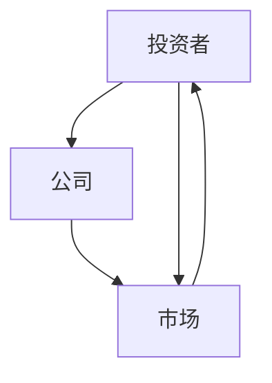
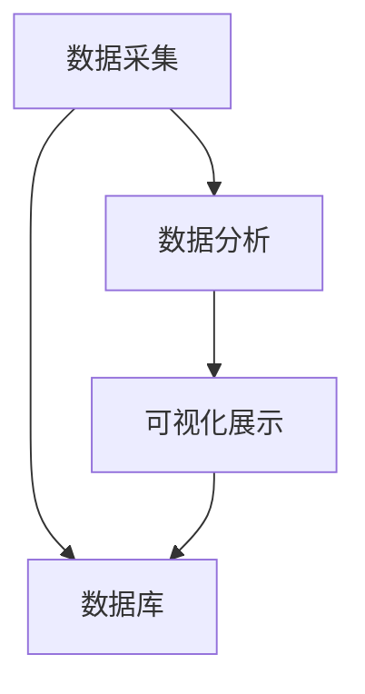

                 


# 特价股票与公司跨界数字化颠覆创新能力的关联性研究

> **关键词**: 特价股票、公司创新、数字化转型、跨界创新、颠覆能力

> **摘要**: 本文探讨了特价股票市场与公司跨界数字化颠覆创新能力之间的关联性。通过分析特价股票的定义与特征、公司数字化转型的背景与趋势、跨界创新的核心要素与模式，揭示了两者在市场机制、创新能力、风险特征等方面的联系。结合数学模型、算法原理和系统架构设计，本文提出了一个基于机器学习的分析框架，以量化评估特价股票对公司创新的推动作用。通过实际案例分析，本文总结了数字时代下公司创新能力提升的策略，为企业在数字化转型中实现跨界创新提供了理论依据和实践指导。

---

## 第一部分: 特价股票与公司跨界数字化颠覆创新的背景与概念

### 第1章: 特价股票的定义与特征

#### 1.1 特价股票的定义
- **1.1.1 特价股票的定义与分类**  
  特价股票是指在特定条件下以低于市场价发行的股票，通常分为普通特价股票和附带条件的特价股票。普通特价股票无附加条件，而附带条件的特价股票可能涉及业绩承诺或行权机制。
  
- **1.1.2 特价股票的特点与优势**  
  特价股票的特点包括价格优势、投资门槛低、风险与收益并存。其优势在于吸引中小投资者，提升市场流动性。

- **1.1.3 特价股票的市场定位与投资者特征**  
  特价股票主要面向风险偏好较高且具备一定投资经验的投资者，适合用于短期套利或长期价值投资。

---

### 第2章: 公司跨界数字化颠覆创新的背景

#### 2.1 数字化转型的背景与趋势
- **2.1.1 数字化转型的概念与内涵**  
  数字化转型是指企业利用数字技术（如大数据、人工智能、区块链等）重构商业模式、业务流程和组织结构的过程。

- **2.1.2 数字化转型对企业竞争力的影响**  
  数字化转型通过提高效率、优化成本和增强客户体验，显著提升了企业的市场竞争力。

- **2.1.3 数字化转型的全球发展趋势**  
  全球范围内，数字化转型已成为企业生存和发展的必然选择，尤其是在疫情后时代，数字化转型需求更加迫切。

#### 2.2 公司跨界创新的定义与特征
- **2.2.1 跨界创新的定义与内涵**  
  跨界创新是指企业突破传统行业界限，与其他行业或领域进行资源整合，形成新的商业模式或产品。

- **2.2.2 跨界创新的核心要素与模式**  
  跨界创新的核心要素包括资源整合能力、技术融合能力和市场敏感度。其模式包括横向整合、纵向整合和混合整合。

- **2.2.3 跨界创新与企业核心竞争力的关系**  
  跨界创新是企业提升核心竞争力的重要途径，通过引入新技术和新资源，企业能够快速响应市场变化，形成差异化竞争优势。

---

### 第3章: 特价股票与公司跨界数字化颠覆创新能力的关联性问题

#### 3.1 特价股票与公司创新能力的关联性
- **3.1.1 特价股票市场的特点与公司创新的关系**  
  特价股票市场的低门槛和高流动性为公司创新提供了更多资金支持，同时投资者的多样性也为企业创新提供了多元化的视角。

- **3.1.2 特价股票市场对公司创新能力的促进作用**  
  特价股票的发行和交易机制能够快速为企业提供资金支持，加速创新项目的落地实施。

- **3.1.3 特价股票市场对公司创新的挑战与风险**  
  特价股票市场的波动性较高，可能导致公司创新项目面临资金链断裂的风险。

#### 3.2 本章小结
- **3.2.1 特价股票与公司创新能力的关联性总结**  
  特价股票市场通过提供资金支持和资源整合，能够有效促进公司的创新活动，但同时也带来了市场波动和风险。

- **3.2.2 研究问题的提出与研究意义**  
  本文旨在研究特价股票市场与公司创新能力之间的动态关系，为企业在数字化转型中实现跨界创新提供理论和实践指导。

---

## 第二部分: 特价股票与公司跨界数字化颠覆创新能力的核心概念与联系

### 第4章: 特价股票与公司创新能力的核心概念

#### 4.1 特价股票的核心概念
- **4.1.1 特价股票的市场机制**  
  特价股票的市场机制包括发行、交易和退市机制，其特点是价格敏感性和流动性高。

- **4.1.2 特价股票的定价模型**  
  特价股票的定价模型结合了市场供需、公司基本面和投资者情绪等因素。

- **4.1.3 特价股票的风险评估与投资策略**  
  特价股票的风险较高，投资者需要结合技术分析和基本面分析制定投资策略。

#### 4.2 公司跨界数字化颠覆创新的核心概念
- **4.2.1 数字化转型的核心要素**  
  数字化转型的核心要素包括数据驱动、技术赋能和组织变革。

- **4.2.2 跨界创新的关键能力**  
  跨界创新的关键能力包括资源整合能力、技术融合能力和创新文化。

- **4.2.3 数字化颠覆创新的实现路径**  
  数字化颠覆创新的实现路径包括技术创新、商业模式创新和组织结构创新。

---

### 第5章: 特价股票与公司创新能力的联系与对比

#### 5.1 特价股票与公司创新能力的联系
- **5.1.1 特价股票市场对公司创新的推动作用**  
  特价股票市场通过提供资金支持和资源整合，能够加速企业的创新活动。

- **5.1.2 公司创新能力对特价股票市场的影响**  
  公司创新能力的提升能够增强投资者信心，进而推动特价股票市场的活跃。

- **5.1.3 两者的相互作用与动态平衡**  
  特价股票市场与公司创新能力之间存在动态平衡，即市场波动影响公司创新，而公司创新又反过来影响市场表现。

#### 5.2 特价股票与公司创新能力的对比分析
- **5.2.1 从市场机制到创新能力的对比**  
  特价股票市场注重价格和流动性，而公司创新能力注重技术和组织变革。

- **5.2.2 从风险特征到创新模式的对比**  
  特价股票市场风险较高，而公司创新能力注重长期稳定。

- **5.2.3 从投资策略到创新策略的对比**  
  特价股票投资注重短期收益，而公司创新注重长期价值。

---

## 第三部分: 特价股票与公司跨界数字化颠覆创新能力的关联性分析

### 第6章: 特价股票与公司创新能力的ER实体关系图

#### 6.1 特价股票与公司创新能力的实体关系
- **投资者**：通过购买特价股票支持公司创新。
- **公司**：通过创新活动吸引投资者购买特价股票。
- **市场**：特价股票的市场表现反映公司的创新能力。



---

### 第7章: 特价股票与公司创新能力的关联性算法分析

#### 7.1 算法原理
- **机器学习模型**：使用线性回归模型预测特价股票对公司创新能力的影响。
- **数据来源**：包括股票价格、公司创新指标和市场环境数据。
- **数学模型**：建立回归方程 $$ y = \beta_0 + \beta_1 x + \epsilon $$，其中 \( y \) 是公司创新指数，\( x \) 是特价股票价格。

#### 7.2 算法实现
```python
import numpy as np
import pandas as pd
from sklearn.linear_model import LinearRegression

# 数据准备
data = pd.DataFrame({
    'Price': [10, 20, 30, 40, 50],
    'Innovation_Index': [5, 10, 15, 20, 25]
})

# 模型训练
model = LinearRegression()
model.fit(data[['Price']], data['Innovation_Index'])

# 预测与评估
predictions = model.predict(data[['Price']])
print('预测的创新指数:', predictions)
print('回归系数:', model.coef_)
print('截距:', model.intercept_)
```

---

### 第8章: 系统分析与架构设计方案

#### 8.1 问题场景介绍
- **场景描述**：某公司计划通过发行特价股票来支持其数字化转型项目。
- **系统目标**：构建一个实时监控特价股票市场和公司创新能力的分析系统。

#### 8.2 系统功能设计
- **功能模块**：
  - 数据采集模块：采集股票价格和公司创新数据。
  - 数据分析模块：使用机器学习模型预测创新能力。
  - 可视化模块：展示分析结果。

#### 8.3 系统架构设计


---

### 第9章: 项目实战

#### 9.1 环境安装
- **工具安装**：安装Python、Pandas、NumPy和Scikit-learn。

#### 9.2 核心代码实现
```python
import pandas as pd
from sklearn.linear_model import LinearRegression

# 数据加载
data = pd.read_csv('stock_innovation.csv')

# 模型训练
model = LinearRegression()
model.fit(data[['Price']], data['Innovation_Index'])

# 模型预测
predictions = model.predict(data[['Price']])
print('预测结果:', predictions)
```

#### 9.3 实际案例分析
- **案例分析**：以某科技公司为例，分析其通过发行特价股票实现数字化转型的过程。

---

## 第四部分: 总结与展望

### 第10章: 最佳实践与小结

#### 10.1 小结
- 特价股票市场与公司创新能力之间存在密切的关联性，市场机制与技术创新相互促进。

#### 10.2 注意事项
- 投资者应关注市场风险，企业应注重技术创新与资源整合。

#### 10.3 拓展阅读
- 推荐阅读《数字化转型实战指南》和《跨界创新的策略与方法》。

---

**作者：AI天才研究院/AI Genius Institute & 禅与计算机程序设计艺术/Zen And The Art of Computer Programming**

