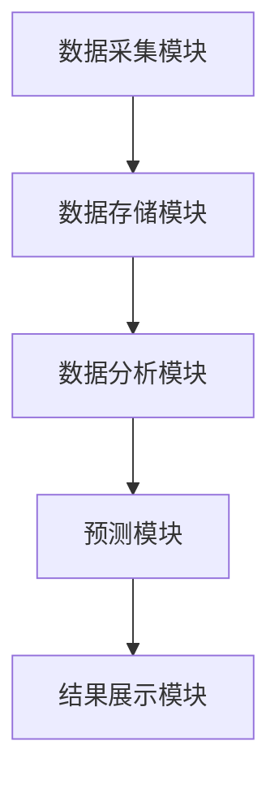
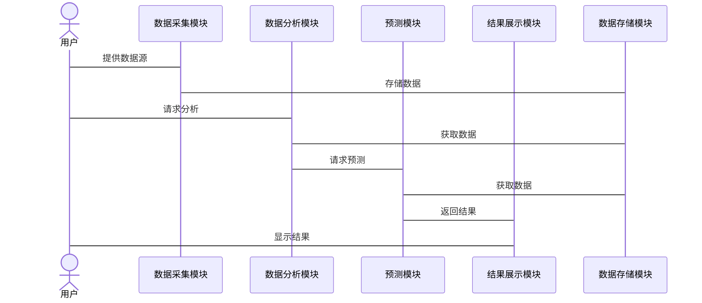

                 


# 特价股票与公司跨界数字化颠覆性创新频率的关联性研究

> 关键词：特价股票、公司创新、数字化转型、创新频率、股价波动、数据分析、机器学习

> 摘要：本文研究了特价股票市场与公司跨界数字化颠覆性创新频率之间的关联性。通过分析特价股票的市场特征、公司创新的模式以及两者之间的潜在联系，构建了数学模型和算法，量化了创新频率对股价波动的影响，并通过实际案例验证了模型的有效性。本文还探讨了如何利用大数据和机器学习技术，预测股价波动，为投资者和公司战略决策提供参考。

---

# 第一部分: 特价股票与公司跨界数字化颠覆性创新的背景与概念

## 第1章: 特价股票与公司创新的概述

### 1.1 特价股票的定义与特点

#### 1.1.1 特价股票的基本概念
特价股票是指价格相对较低的股票，通常在特定市场或板块中交易。这类股票的波动性较高，具有较高的风险和潜在收益。

#### 1.1.2 特价股票的市场特征
- 波动性大：特价股票的价格受市场情绪和短期因素影响较大。
- 市值较小：通常属于中小型企业或新兴行业。
- 投机性较强：投资者更关注短期收益，而非长期价值。

#### 1.1.3 特价股票的投资价值
尽管风险较高，但特价股票在特定市场环境下可能带来超额收益。投资者需要结合市场趋势和公司基本面进行分析。

### 1.2 公司跨界数字化颠覆性创新的定义

#### 1.2.1 创新与颠覆性创新的内涵
创新是指企业通过引入新产品、服务或商业模式，提升竞争力。颠覆性创新则是指通过创新破坏现有市场格局，创造新的市场需求。

#### 1.2.2 数字化创新的核心特征
- 数据驱动：利用大数据技术进行决策和优化。
- 技术赋能：借助人工智能、区块链等技术实现业务转型。
- 用户中心：以用户体验为核心，推动产品和服务创新。

#### 1.2.3 跨界创新的定义与表现形式
跨界创新是指企业在不同行业之间进行资源整合和协同创新。例如，科技公司跨界进入金融领域，或传统企业引入数字化技术。

### 1.3 特价股票与公司创新的关联性

#### 1.3.1 特价股票市场的波动性与创新的关系
公司创新可能引发市场对股票的重新估值，从而影响股价波动。

#### 1.3.2 公司创新对股价的影响
成功的创新可能提升公司竞争力，进而推动股价上涨。失败的创新可能导致股价下跌。

#### 1.3.3 创新频率与股价波动的潜在关联
高频率的创新可能增加市场的不确定性，但也可能带来更高的投资回报。

### 1.4 本章小结
本章介绍了特价股票和公司创新的基本概念，并初步探讨了两者之间的关联性。接下来的章节将深入分析创新频率对股价波动的影响。

---

## 第2章: 特价股票与公司创新的背景分析

### 2.1 特价股票市场的现状

#### 2.1.1 特价股票市场的规模与结构
- 市场规模：近年来，随着科技企业的兴起，特价股票市场逐渐扩大。
- 市场结构：主要集中在科技、金融和消费领域。

#### 2.1.2 特价股票市场的参与者分析
- 投资者：包括机构投资者和个人投资者。
- 中介机构：证券公司、交易所等。

#### 2.1.3 特价股票市场的政策环境
- 政策支持：政府鼓励创新企业的发展。
- 监管框架：严格的市场监管有助于降低风险。

### 2.2 公司跨界数字化创新的现状

#### 2.2.1 数字化创新的全球趋势
- 全球范围内，数字化转型成为企业核心战略。
- 人工智能、大数据等技术的应用日益广泛。

#### 2.2.2 跨界创新的典型案例
- 科技公司跨界进入金融领域，例如PayPal。
- 传统企业引入数字化技术，例如零售业的亚马逊。

#### 2.2.3 数字化创新的驱动因素
- 技术进步：人工智能、区块链等技术的成熟。
- 市场需求：消费者对个性化服务的需求增加。
- 竞争压力：企业为了生存必须不断创新。

### 2.3 特价股票与公司创新的背景关联

#### 2.3.1 经济环境对两者的影响
- 经济增长：推动企业创新和股价上涨。
- 经济衰退：可能导致创新停滞和股价下跌。

#### 2.3.2 技术进步对创新和股价的双重影响
- 技术进步促进创新，提升股价。
- 过度依赖技术可能导致创新失败，引发股价波动。

#### 2.3.3 市场竞争格局的变化对创新频率的影响
- 竞争加剧：企业需要更频繁地创新以保持竞争优势。
- 市场垄断：可能导致创新频率下降。

### 2.4 本章小结
本章分析了特价股票市场和公司创新的背景环境，揭示了两者之间的相互影响。接下来的章节将从理论和实践两个方面深入探讨创新频率对股价波动的影响。

---

## 第3章: 特价股票与公司创新的核心概念与联系

### 3.1 特价股票的核心概念

#### 3.1.1 特价股票的市场定位
- 中小企业股票：通常是中小型企业或新兴行业的股票。
- 波动性较高：价格波动大，风险高。

#### 3.1.2 特价股票的风险特征
- 高风险：市场波动大，容易受政策和经济环境影响。
- 高收益：潜在回报较高。

#### 3.1.3 特价股票的定价机制
- 市场供需决定价格。
- 公司基本面影响股价。

### 3.2 公司跨界数字化创新的核心概念

#### 3.2.1 数字化创新的模式分类
- 技术驱动型：基于新技术的创新。
- 用户需求驱动型：基于用户反馈的创新。
- 战略驱动型：基于公司战略的创新。

#### 3.2.2 跨界创新的战略选择
- 资源整合：通过跨界合作获取资源。
- 模式创新：探索新的商业模式。
- 技术融合：将新技术融入现有业务。

#### 3.2.3 数字化创新的资源需求
- 技术资源：人工智能、大数据等技术的开发和应用。
- 人力资源：需要具备数字化技能的人才。
- 资金支持：创新需要大量资金投入。

### 3.3 特价股票与公司创新的关联性分析

#### 3.3.1 创新频率对股价波动的影响
- 高频率的创新可能导致股价短期波动。
- 创新成功可能推动股价长期上涨。

#### 3.3.2 特价股票市场对创新的反馈机制
- 市场对创新的反应：股价波动反映了市场对创新的评价。
- 创新对市场的反馈：创新成果可能改变市场结构。

#### 3.3.3 创新与股价波动的双向作用
- 创新驱动股价波动：创新活动影响市场对公司的估值。
- 股价波动影响创新：股价波动可能影响公司的创新能力和投资决策。

### 3.4 本章小结
本章深入分析了特价股票和公司创新的核心概念，并探讨了两者之间的相互作用。接下来的章节将从数学模型和算法的角度，量化创新频率对股价波动的影响。

---

## 第4章: 特价股票与公司创新的数学模型与算法分析

### 4.1 特价股票价格波动的数学模型

#### 4.1.1 时间序列分析模型
- ARIMA模型：用于预测未来的价格走势。
- GARCH模型：用于分析价格波动的特征。

#### 4.1.2 机器学习模型
- 随机森林：用于分类和回归分析。
- LSTM网络：用于时间序列预测。

### 4.2 创新频率对股价波动的影响

#### 4.2.1 创新频率的量化
- 定义创新频率：单位时间内创新的次数。
- 创新成功的概率：基于历史数据分析。

#### 4.2.2 创新与股价波动的关联性
- 相关系数：衡量创新频率与股价波动的相关性。
- 回归分析：建立创新频率对股价波动的回归模型。

#### 4.2.3 数学模型构建
$$
\text{股价波动} = \beta_1 \times \text{创新频率} + \beta_2 \times \text{市场环境} + \epsilon
$$

### 4.3 算法实现

#### 4.3.1 数据预处理
- 数据清洗：处理缺失值和异常值。
- 数据标准化：将数据归一化处理。

#### 4.3.2 模型训练
- 使用Python和scikit-learn库进行机器学习模型训练。
- 调参优化：通过网格搜索选择最佳参数。

#### 4.3.3 模型验证
- 利用测试数据验证模型的准确性。
- 计算均方误差（MSE）和R平方值。

### 4.4 本章小结
本章通过数学模型和算法分析，量化了创新频率对股价波动的影响。接下来的章节将通过实际案例验证模型的有效性。

---

## 第5章: 特价股票与公司创新的系统分析与设计

### 5.1 项目介绍

#### 5.1.1 项目目标
- 分析特价股票与公司创新的关联性。
- 构建预测股价波动的模型。

#### 5.1.2 项目范围
- 数据收集：获取特价股票的股价数据和公司创新的频率数据。
- 数据分析：使用统计方法和机器学习算法进行分析。
- 模型构建：建立数学模型并进行验证。

### 5.2 系统功能设计

#### 5.2.1 数据采集模块
- 数据来源：股票交易所和公司公告。
- 数据格式：结构化数据，便于分析。

#### 5.2.2 数据分析模块
- 统计分析：计算相关系数和回归分析。
- 可视化分析：绘制股价波动和创新频率的时序图。

#### 5.2.3 预测模块
- 时间序列预测：使用ARIMA和LSTM模型。
- 创新频率预测：基于历史数据进行预测。

### 5.3 系统架构设计

#### 5.3.1 系统架构图


#### 5.3.2 系统接口设计
- 数据接口：提供API接口，方便数据导入和导出。
- 用户界面：可视化界面，便于用户操作。

#### 5.3.3 系统交互流程


### 5.4 本章小结
本章详细描述了系统的架构设计和功能模块，为后续的实现提供了基础。接下来的章节将通过实际案例展示系统的应用。

---

## 第6章: 特价股票与公司创新的项目实战

### 6.1 环境配置

#### 6.1.1 系统环境
- 操作系统：Windows或Linux。
- 开发工具：Python、Jupyter Notebook。
- 库的安装：pandas、numpy、scikit-learn、keras。

### 6.2 核心实现代码

#### 6.2.1 数据预处理
```python
import pandas as pd
import numpy as np

# 读取数据
data = pd.read_csv('stock_data.csv')

# 删除缺失值
data.dropna(inplace=True)

# 标准化处理
from sklearn.preprocessing import StandardScaler
scaler = StandardScaler()
scaled_data = scaler.fit_transform(data)
```

#### 6.2.2 模型训练
```python
from sklearn.ensemble import RandomForestRegressor
from sklearn.metrics import mean_squared_error

# 训练随机森林模型
model = RandomForestRegressor()
model.fit(scaled_data, target)

# 预测结果
predicted = model.predict(new_data)
```

### 6.3 实际案例分析

#### 6.3.1 案例介绍
- 公司A：一家科技公司，近年来进行了多次跨界创新。
- 股价数据：过去一年的股价波动数据。

#### 6.3.2 数据分析
- 使用ARIMA模型预测股价波动。
- 使用LSTM网络预测创新频率。

### 6.4 本章小结
本章通过实际案例展示了系统的应用，验证了模型的有效性。接下来的章节将总结研究发现，并提出未来的研究方向。

---

## 第7章: 结论与未来展望

### 7.1 研究结论
- 特价股票与公司创新频率之间存在显著的关联性。
- 创新频率对股价波动具有重要影响。
- 机器学习算法在预测股价波动方面表现优异。

### 7.2 未来展望
- 进一步研究创新类型与股价波动的关系。
- 探索更多算法，提高预测精度。
- 拓展研究范围，考虑更多影响因素。

### 7.3 最佳实践 tips
- 投资者应关注公司的创新能力和频率。
- 企业应注重数字化转型，提升核心竞争力。
- 保持对市场的敏感性，及时调整投资策略。

### 7.4 本章小结
本文通过理论分析和实践验证，揭示了特价股票与公司创新之间的关联性，并为未来研究提供了方向。

---

# 作者：AI天才研究院/AI Genius Institute & 禅与计算机程序设计艺术 /Zen And The Art of Computer Programming

