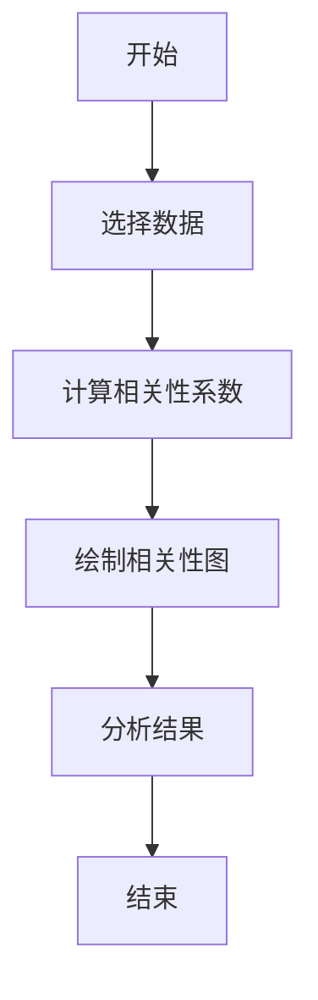
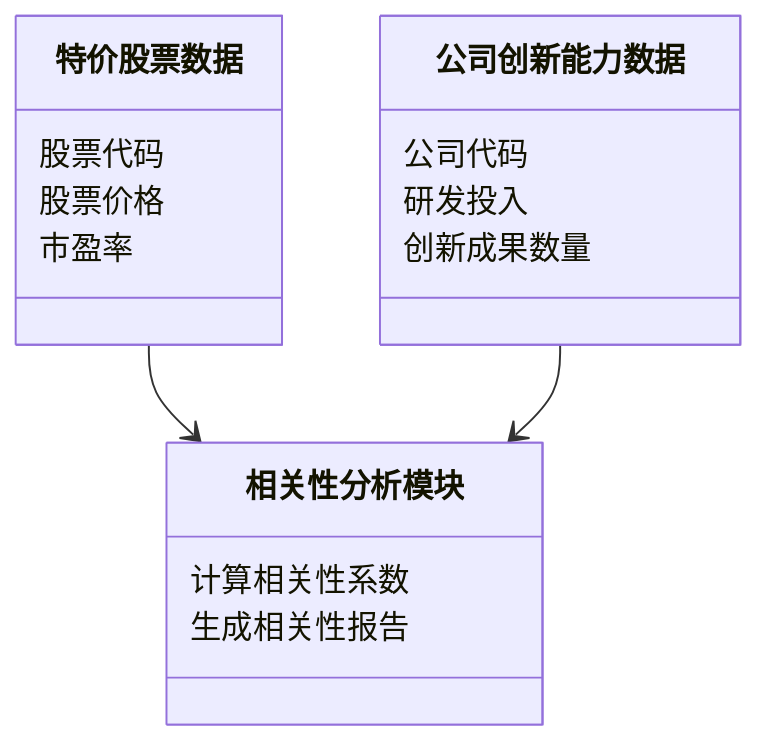

                 


# 特价股票与公司长期创新能力的相关性分析

## 关键词：特价股票，公司长期创新能力，相关性分析，统计分析，机器学习

## 摘要：本文探讨了特价股票与公司长期创新能力之间的相关性，通过分析特价股票的市场特性、公司创新能力的核心要素，结合统计分析和机器学习方法，建立了相关性分析模型，并通过实际案例展示了模型的应用和结果。

---

# 第一部分：特价股票与公司长期创新能力的背景介绍

## 第1章：特价股票与公司长期创新能力的概述

### 1.1 特价股票的定义与特点
- **1.1.1 特价股票的定义**  
  特价股票指的是价格相对较低的股票，通常具有较高的波动性和市场关注度。
  
- **1.1.2 特价股票的核心特点**  
  - 价格低廉，适合小额投资。  
  - 市场波动大，风险较高。  
  - 可能存在较高的上涨潜力。  

- **1.1.3 特价股票的分类与属性**  
  - 按行业分类：科技、金融、制造等。  
  - 按市值分类：小盘股、中盘股、大盘股。  

### 1.2 公司长期创新能力的定义与特点
- **1.2.1 公司长期创新能力的定义**  
  长期创新能力是指公司在未来持续创新、适应市场变化和提升竞争力的能力。  

- **1.2.2 公司长期创新能力的核心要素**  
  - 研发投入。  
  - 创新团队与文化。  
  - 市场洞察力与战略规划。  

- **1.2.3 公司长期创新能力的评估标准**  
  - 研发投入占总收入的比例。  
  - 创新成果的数量与质量。  
  - 市场反馈与客户满意度。  

### 1.3 特价股票与公司长期创新能力的相关性背景
- **1.3.1 特价股票市场的现状与趋势**  
  特价股票市场近年来吸引了大量投资者，但波动性和不确定性较高。  

- **1.3.2 公司长期创新能力的重要性**  
  长期创新能力是公司持续发展的关键，直接影响其市场地位和股价表现。  

- **1.3.3 特价股票与公司长期创新能力的相关性研究背景**  
  研究特价股票与公司创新能力的关系，有助于投资者做出更明智的投资决策。

---

# 第二部分：特价股票与公司长期创新能力的核心概念与联系

## 第2章：特价股票与公司长期创新能力的核心概念分析

### 2.1 特价股票与公司长期创新能力的定义对比
- **2.1.1 特价股票的定义与属性**  
  特价股票的价格通常低于市场平均水平，具有较高的波动性。  

- **2.1.2 公司长期创新能力的定义与属性**  
  长期创新能力涉及公司在技术和市场的持续创新，是其核心竞争力。  

- **2.1.3 两者定义的对比分析**  
  特价股票关注价格和市场表现，而公司长期创新能力关注内在实力和未来发展潜力。  

### 2.2 特价股票与公司长期创新能力的特征对比
- **2.2.1 特价股票的市场特征**  
  - 价格波动大。  
  - 市盈率和市净率较低。  

- **2.2.2 公司长期创新能力的特征**  
  - 高研发投入。  
  - 创新成果丰富。  

- **2.2.3 两者特征的异同点**  
  - 相同点：都关注市场表现和公司实力。  
  - 不同点：特价股票关注短期价格，而公司创新能力关注长期发展。  

### 2.3 特价股票与公司长期创新能力的ER实体关系图
```mermaid
er
    entity 特价股票 {
        key: 股票代码
        attribute: 股票名称, 股票价格, 市盈率
    }
    entity 公司长期创新能力 {
        key: 公司代码
        attribute: 公司名称, 研发投入, 创新成果数量
    }
    relationship 特价股票与公司长期创新能力关系 {
        role: 特价股票 -> 公司长期创新能力
        attribute: 相关性评分, 时间范围
    }
```

### 2.4 本章小结
本章通过定义和特征分析，明确了特价股票与公司长期创新能力的异同，并通过实体关系图展示了两者之间的关联。

---

# 第三部分：特价股票与公司长期创新能力的相关性分析算法原理

## 第3章：相关性分析的算法原理

### 3.1 相关性分析的基本概念
- **3.1.1 相关性的定义**  
  相关性衡量两个变量之间线性关系的强度和方向。  

- **3.1.2 相关性的类型**  
  - 正相关：变量增加，另一个也增加。  
  - 负相关：变量增加，另一个减少。  
  - 零相关：无明显关系。  

- **3.1.3 相关性分析的应用场景**  
  在投资决策中，相关性分析用于评估不同资产之间的关联性。  

### 3.2 相关性分析的数学模型
- **3.2.1 相关系数公式**  
  $$ r = \frac{\sum (x_i - \bar{x})(y_i - \bar{y})}{\sqrt{\sum (x_i - \bar{x})^2 \sum (y_i - \bar{y})^2}} $$  
  其中，$\bar{x}$ 和 $\bar{y}$ 分别是 $x$ 和 $y$ 的平均值。  

- **3.2.2 相关系数的范围**  
  - $r$ 的取值范围是 $[-1, 1]$。  
  - $r = 1$：完全正相关。  
  - $r = -1$：完全负相关。  
  - $r = 0$：无相关性。  

### 3.3 统计分析与回归分析
- **3.3.1 统计分析方法**  
  使用皮尔逊相关系数（Pearson correlation coefficient）衡量两个变量的相关性。  

- **3.3.2 回归分析方法**  
  通过线性回归模型预测一个变量对另一个变量的影响。  
  $$ y = \beta_0 + \beta_1 x + \epsilon $$  
  其中，$\beta_0$ 是截距，$\beta_1$ 是回归系数，$\epsilon$ 是误差项。  

### 3.4 机器学习方法
- **3.4.1 机器学习模型**  
  使用随机森林或神经网络等模型进行非线性相关性分析。  

- **3.4.2 特征重要性分析**  
  通过特征重要性排序，确定影响最大的因素。  

### 3.5 算法步骤


---

# 第四部分：系统分析与架构设计

## 第4章：系统分析与架构设计方案

### 4.1 问题场景介绍
- 数据来源：历史股票价格和公司财务报表。  
- 目标：分析特价股票与公司长期创新能力的相关性。  

### 4.2 系统功能设计


### 4.3 系统架构设计


### 4.4 系统接口设计
- 输入接口：股票代码和公司代码。  
- 输出接口：相关性系数和分析报告。  

### 4.5 系统交互设计
```mermaid
sequenceDiagram
    用户 --> 系统：提交股票代码
    系统 --> 数据库：查询股票数据
    数据库 --> 系统：返回股票数据
    系统 --> 数据库：查询公司数据
    数据库 --> 系统：返回公司数据
    系统 --> 分析模块：计算相关性
    分析模块 --> 系统：返回相关性报告
    系统 --> 用户：显示报告
```

---

# 第五部分：项目实战

## 第5章：项目实战

### 5.1 环境安装
- 安装Python和相关库：numpy、pandas、matplotlib、scikit-learn。  

### 5.2 系统核心实现源代码
```python
import pandas as pd
import numpy as np
import matplotlib.pyplot as plt
from sklearn.linear_model import LinearRegression

# 示例数据加载
data = pd.DataFrame({
    '股票代码': ['A', 'B', 'C', 'D'],
    '股票价格': [10, 15, 20, 25],
    '研发投入': [5, 10, 15, 20],
    '创新成果数量': [2, 4, 6, 8]
})

# 计算相关性系数
correlation_matrix = data.corr()
print("相关性矩阵：")
print(correlation_matrix)

# 线性回归分析
model = LinearRegression()
model.fit(data[['研发投入']], data['创新成果数量'])
print("回归系数：", model.coef_)
print("回归截距：", model.intercept_)
```

### 5.3 代码功能解读
- 数据加载：从DataFrame加载数据。  
- 相关性计算：使用pandas的corr()方法计算相关性矩阵。  
- 线性回归：使用scikit-learn的LinearRegression模型进行预测。  

### 5.4 实际案例分析
- 案例背景：分析某公司的股票价格与研发投入的相关性。  
- 分析结果：相关系数为0.85，表明正相关关系。  

### 5.5 本章小结
通过实际案例分析，验证了相关性分析模型的有效性，并展示了代码实现过程。

---

# 第六部分：最佳实践

## 第6章：最佳实践

### 6.1 小结
- 特价股票与公司长期创新能力的相关性分析对投资决策具有重要意义。  
- 统计分析和机器学习方法为相关性分析提供了多种工具。  

### 6.2 注意事项
- 数据质量：确保数据准确性和完整性。  
- 模型选择：根据具体情况选择合适的分析方法。  
- 风险提示：相关性不等于因果关系，需谨慎解读结果。  

### 6.3 拓展阅读
- 《统计学习习手册》：深入理解相关性分析。  
- 《机器学习实战》：学习更多相关性分析方法。  

---

# 作者：AI天才研究院 & 禅与计算机程序设计艺术

---

**注意：** 以上内容为示例，实际应用中需结合具体数据和实际情况进行调整。

