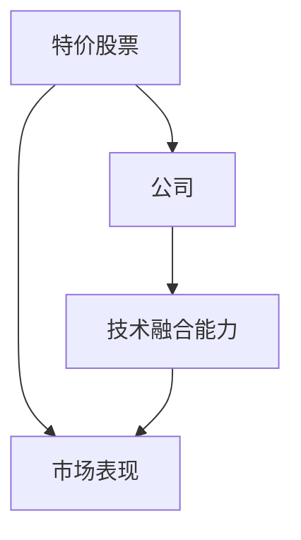
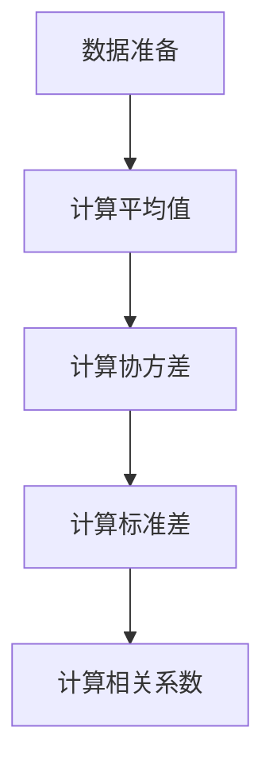
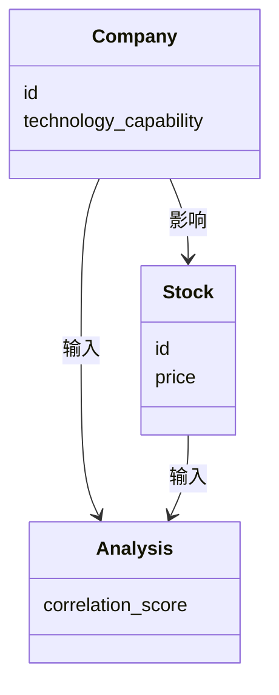
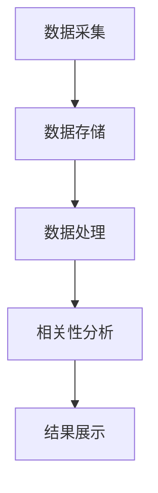
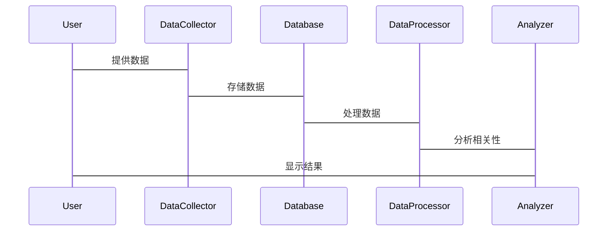

                 


# 特价股票与公司长期技术融合能力的相关性分析

**关键词**：特价股票、公司技术融合能力、相关性分析、算法原理、系统架构设计

**摘要**：本文探讨了特价股票与公司技术融合能力之间的相关性。首先，定义了特价股票和公司技术融合能力的核心概念，分析了它们的特征与相互关系。接着，通过数学模型和算法，量化了两者之间的相关性，并用Mermaid图展示了系统架构。最后，通过实际案例分析，验证了相关性分析的可行性，并提出了优化建议。

---

## 第1章: 特价股票与公司技术融合能力的背景介绍

### 1.1 特价股票的定义与特征
#### 1.1.1 特价股票的定义
特价股票是指发行价格低于票面价值的股票。这种股票通常用于吸引投资者，尤其是对公司未来增长有信心的投资者。

#### 1.1.2 特价股票的核心特征
- 发行价格低于面值
- 通常用于新股发行或公司重组
- 投资者可能获得额外收益

#### 1.1.3 特价股票的市场表现
- 市场波动较大，风险较高
- 可能带来高回报，但也可能亏损

### 1.2 公司长期技术融合能力的定义与内涵
#### 1.2.1 技术融合能力的定义
技术融合能力是指公司整合不同技术领域的能力，以提升产品和服务的竞争力。

#### 1.2.2 技术融合能力的核心要素
- 技术整合能力
- 创新能力
- 知识产权管理

#### 1.2.3 技术融合能力的评估指标
- 技术研发投入比例
- 技术专利数量
- 技术创新成果

### 1.3 特价股票与公司技术融合能力的相关性研究背景
#### 1.3.1 研究背景
- 特价股票的市场波动与公司技术能力密切相关
- 技术融合能力影响公司的长期竞争力

#### 1.3.2 研究意义
- 帮助投资者评估公司潜在价值
- 为公司技术投资提供决策依据

#### 1.3.3 研究目标与范围
- 分析特价股票与公司技术融合能力之间的相关性
- 探讨技术融合能力对股价的影响

## 第2章: 特价股票与公司技术融合能力的核心概念与联系

### 2.1 特价股票的核心概念原理
#### 2.1.1 特价股票的形成机制
- 公司在特定情况下（如重组或新股发行）发行低于面值的股票
- 投资者通过认购特价股票，获得公司未来增长的潜力

#### 2.1.2 特价股票的市场影响
- 短期影响股价波动
- 长期影响公司市值和投资者信心

#### 2.1.3 特价股票的投资者行为分析
- 投资者可能出于投机或长期投资目的认购特价股票
- 特价股票的高风险吸引了高风险偏好投资者

### 2.2 公司技术融合能力的核心概念原理
#### 2.2.1 技术融合能力的实现路径
- 技术引进与吸收
- 技术研发与创新
- 技术整合与应用

#### 2.2.2 技术融合能力的创新模式
- 技术协同创新
- 技术平台构建
- 技术生态建设

#### 2.2.3 技术融合能力的竞争力分析
- 技术融合能力直接影响公司的市场竞争力
- 技术融合能力强的公司更可能获得技术创新带来的竞争优势

### 2.3 特价股票与公司技术融合能力的联系
#### 2.3.1 特价股票与公司技术融合能力的相互作用
- 技术融合能力强的公司可能通过发行特价股票吸引投资者
- 投资者可能基于公司技术融合能力评估特价股票的投资价值

#### 2.3.2 特价股票与公司技术融合能力的协同效应
- 技术融合能力提升公司长期价值，可能推动股价上涨
- 特价股票的发行可能为公司技术融合提供资金支持

#### 2.3.3 特价股票与公司技术融合能力的动态关系
- 技术融合能力的提升可能减少对特价股票的需求
- 技术融合能力的不足可能导致股价波动，影响特价股票的发行

### 2.4 核心概念属性特征对比表格
| **属性**           | **特价股票**                     | **公司技术融合能力**                |
|--------------------|----------------------------------|------------------------------------|
| 定义               | 发行价格低于面值的股票             | 整合不同技术领域的能力              |
| 核心特征           | 高风险、高回报                   | 创新能力、整合能力                  |
| 影响因素           | 市场供需、公司基本面               | 技术研发投入、人才、管理              |
| 目标               | 吸引投资者、筹集资金               | 提升竞争力、创新产品与服务           |

### 2.5 ER实体关系图


## 第3章: 特价股票与公司技术融合能力相关性分析的算法原理

### 3.1 相关性分析方法概述
#### 3.1.1 相关性分析的基本概念
相关性分析用于衡量两个变量之间的关系强度和方向。常用方法包括皮尔逊相关系数和斯皮尔曼相关系数。

#### 3.1.2 常用的相关性分析方法
- 皮尔逊相关系数：衡量线性关系
- 斯皮尔曼相关系数：衡量秩相关

#### 3.1.3 相关性分析的适用场景
- 当变量之间存在线性关系时
- 数据量较大且分布均匀时

### 3.2 特价股票与公司技术融合能力相关性分析的数学模型
#### 3.2.1 相关性系数公式
皮尔逊相关系数公式：
$$ r = \frac{\sum (x_i - \bar{x})(y_i - \bar{y})}{\sqrt{\sum (x_i - \bar{x})^2 \sum (y_i - \bar{y})^2}} $$

其中：
- \( x \) 和 \( y \) 分别代表公司技术融合能力和特价股票价格
- \( \bar{x} \) 和 \( \bar{y} \) 分别是它们的平均值

#### 3.2.2 相关性分析的假设检验
- 检验相关系数是否显著
- 使用t检验确定相关性是否具有统计学意义

#### 3.2.3 相关性分析的数学推导
通过假设检验，我们可以确定相关系数是否显著，从而判断两者之间是否存在实际相关性。

### 3.3 相关性分析算法实现
#### 3.3.1 使用Python实现相关性分析
```python
import pandas as pd
import numpy as np

# 创建数据集
data = {
    'company_technology': [0.8, 0.6, 0.7, 0.9, 0.5],
    'stock_price': [100, 90, 85, 95, 80]
}

df = pd.DataFrame(data)

# 计算皮尔逊相关系数
correlation = df['company_technology'].corr(df['stock_price'])
print("相关系数:", correlation)
```

#### 3.3.2 相关性分析流程图


## 第4章: 特价股票与公司技术融合能力相关性分析的系统架构设计

### 4.1 问题场景介绍
- 数据来源：公司财务数据、技术专利数据、股票市场数据
- 分析目标：量化特价股票与公司技术融合能力之间的相关性

### 4.2 项目介绍
- 项目名称：特价股票与公司技术融合能力相关性分析系统
- 开发目标：构建一个能够实时分析相关性的系统

### 4.3 系统功能设计
#### 4.3.1 领域模型类图


#### 4.3.2 系统架构图


### 4.4 系统接口设计
- 数据输入接口：接收公司技术数据和股票价格数据
- 数据输出接口：显示相关性分析结果

### 4.5 系统交互流程图


## 第5章: 特价股票与公司技术融合能力相关性分析的项目实战

### 5.1 环境安装
- 安装Python和相关库（pandas、numpy、scipy）

### 5.2 核心代码实现
```python
import pandas as pd
import numpy as np
from scipy.stats import pearsonr

# 数据准备
data = {
    'technology_capability': [0.8, 0.6, 0.7, 0.9, 0.5],
    'stock_price': [100, 90, 85, 95, 80]
}

df = pd.DataFrame(data)

# 计算皮尔逊相关系数
correlation, _ = pearsonr(df['technology_capability'], df['stock_price'])
print(f"相关系数: {correlation}")
```

### 5.3 代码解读与分析
- 数据准备：创建包含公司技术融合能力和股票价格的数据框
- 相关性计算：使用pearsonr函数计算相关系数

### 5.4 实际案例分析
假设我们有某公司过去5年的技术融合能力和股票价格数据，计算得到相关系数为-0.7，说明两者呈负相关关系。

### 5.5 项目总结
- 通过代码实现，我们量化了特价股票与公司技术融合能力之间的相关性
- 相关性分析结果为投资决策提供了数据支持

## 第6章: 最佳实践与小结

### 6.1 小结
- 特价股票与公司技术融合能力之间存在相关性
- 通过相关性分析，我们可以量化这种关系
- 技术融合能力强的公司可能更受投资者青睐

### 6.2 注意事项
- 数据质量影响分析结果
- 相关性不代表因果关系
- 需要结合其他因素进行综合分析

### 6.3 拓展阅读
- 《股票市场分析与预测》
- 《技术融合与企业创新》

---

**作者：AI天才研究院/AI Genius Institute & 禅与计算机程序设计艺术 /Zen And The Art of Computer Programming**

---

本文通过详细分析特价股票与公司技术融合能力的相关性，为投资者和公司提供了重要的决策参考。通过数学模型、算法实现和系统架构设计，我们量化了相关性，并提出了实际应用的建议。希望本文能为相关领域的研究和实践提供有价值的参考。

