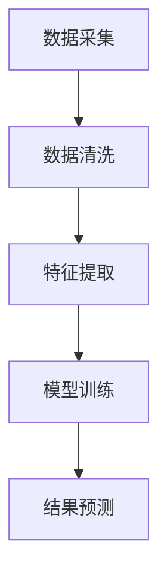
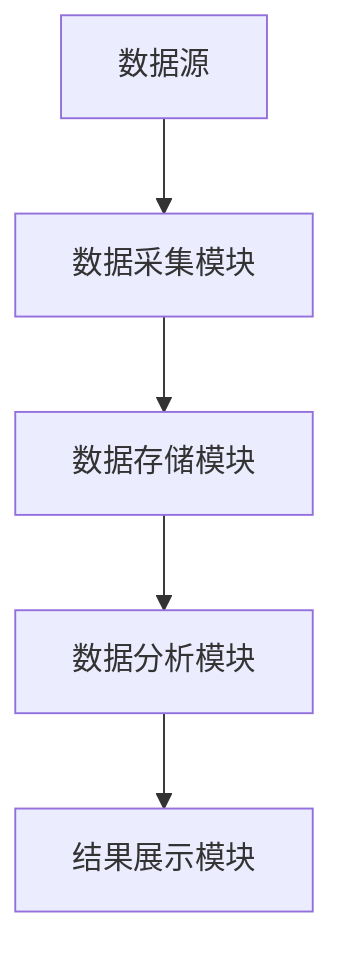
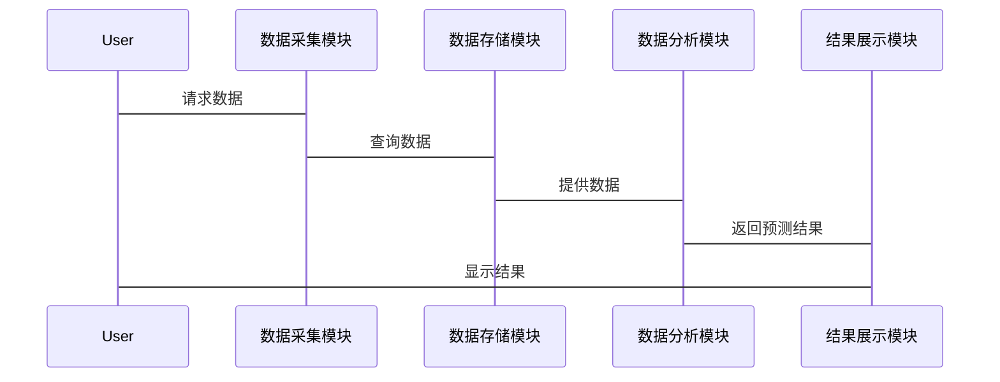

                 


# 特价股票与公司长期数字化抗风险能力的关联性研究

## 关键词
- 特价股票, 公司抗风险能力, 数字化能力, 股票市场, 风险管理

## 摘要
本文探讨了特价股票与公司长期数字化抗风险能力之间的关联性。通过分析特价股票的市场特性、公司数字化能力的构成以及两者在风险管理中的互动，提出了一种基于机器学习的量化模型，用于评估公司数字化能力对股价稳定性的贡献。文章结合实际案例，展示了如何通过数字化手段提升企业的抗风险能力，为投资者和企业管理者提供了新的视角和决策依据。

---

## 第1章 特价股票与公司抗风险能力的背景介绍

### 1.1 问题背景
#### 1.1.1 特价股票的定义与特点
- 特价股票指的是价格低于市场平均水平的股票，通常反映在市场上流动性较低或公司处于困境状态。
- 特点：低估值、高波动性、风险较高。

#### 1.1.2 公司数字化抗风险能力的定义
- 数字化能力：指企业利用数字技术优化业务流程、提升效率和创新的能力。
- 抗风险能力：企业在面对市场波动、经济危机等外部冲击时的应对和恢复能力。

#### 1.1.3 问题解决
- 探讨如何通过数字化能力提升公司抗风险能力，从而影响股价稳定性。

### 1.2 问题描述
#### 1.2.1 特价股票市场的现状
- 特价股票市场的波动性高，但潜在回报也大。
- 许多投资者通过低价买入策略寻找机会。

#### 1.2.2 公司数字化抗风险能力的现状
- 数字化转型成为企业核心战略。
- 数字化能力越强，企业抗风险能力越强。

#### 1.2.3 问题边界与外延
- 仅关注公司数字化能力对股价的影响，不涉及其他外部因素。

### 1.3 概念结构与核心要素
#### 1.3.1 特价股票的核心要素
- 价格：低于市场平均水平。
- 风险：高波动性和高不确定性。

#### 1.3.2 公司数字化能力的核心要素
- 数字化战略：明确的数字化转型目标。
- 技术能力：拥有先进的IT基础设施和数据分析能力。
- 人才储备：具备数字化能力的专业团队。

#### 1.3.3 两者关联性的概念结构
- 特价股票的波动性与公司抗风险能力呈负相关。
- 数字化能力越强，公司股价越稳定。

---

## 第2章 特价股票与公司数字化抗风险能力的核心概念与联系

### 2.1 核心概念原理
#### 2.1.1 特价股票的市场机制
- 供给与需求：低价股票吸引投资者，但流动性不足导致价格波动。
- 市场情绪：投资者情绪影响股价短期波动。

#### 2.1.2 公司数字化抗风险能力的构成
- 数据分析能力：通过数据驱动决策。
- 业务流程优化：通过数字化手段提升效率。
- 应急响应能力：快速应对市场变化。

### 2.2 概念属性特征对比
| 特性         | 特价股票                 | 公司数字化抗风险能力       |
|--------------|--------------------------|-----------------------------|
| 核心目标     | 提供低价投资机会         | 提升企业抗风险能力           |
| 影响因素     | 市场供需、投资者情绪     | 技术能力、人才、管理策略     |
| 结果表现     | 股价波动大               | 股价波动小，稳定性增强         |

### 2.3 ER实体关系图
```mermaid
erDiagram
    company : 公司
    stock : 特价股票
    risk_management : 抗风险能力
    company --> stock : 持有
    company --> risk_mana : 提供
    stock --> risk_mana : 影响
```

---

## 第3章 特价股票与公司数字化抗风险能力的算法原理

### 3.1 算法原理讲解
#### 3.1.1 数据分析流程
- 数据采集：获取公司财务数据和股价数据。
- 数据清洗：处理缺失值和异常值。
- 数据建模：使用机器学习模型预测股价波动。

#### 3.1.2 算法流程图


#### 3.1.3 代码实现
```python
import pandas as pd
from sklearn.model_selection import train_test_split
from sklearn.linear_model import LinearRegression

# 数据加载
data = pd.read_csv('company_stock.csv')

# 特征选择
features = data[['revenue', 'profit', 'digital_score']]
target = data['stock_price']

# 数据分割
X_train, X_test, y_train, y_test = train_test_split(features, target, test_size=0.2)

# 模型训练
model = LinearRegression()
model.fit(X_train, y_train)

# 预测结果
predictions = model.predict(X_test)
print('预测结果:', predictions)
```

### 3.2 数学模型与公式
#### 3.2.1 线性回归模型
$$ y = \beta_0 + \beta_1x_1 + \beta_2x_2 + \epsilon $$

#### 3.2.2 数学公式解释
- $y$：目标变量（股价）
- $x_1$：公司收入（revenue）
- $x_2$：数字化能力评分（digital_score）
- $\beta_0$：截距
- $\beta_1$，$\beta_2$：回归系数
- $\epsilon$：误差项

---

## 第4章 特价股票与公司数字化抗风险能力的系统分析与架构设计

### 4.1 系统功能设计
- 数据采集模块：收集公司财务数据和股价数据。
- 数据分析模块：进行特征提取和建模。
- 结果展示模块：可视化预测结果。

### 4.2 系统架构设计


### 4.3 系统接口设计
- API接口：提供数据查询和预测服务。

### 4.4 系统交互流程


---

## 第5章 特价股票与公司数字化抗风险能力的项目实战

### 5.1 项目环境安装
- Python 3.8+
- Pandas、Scikit-learn、Matplotlib

### 5.2 核心代码实现
```python
import pandas as pd
from sklearn.metrics import mean_squared_error

# 数据加载
data = pd.read_csv('company_stock.csv')

# 特征选择
features = data[['revenue', 'profit', 'digital_score']]
target = data['stock_price']

# 数据分割
X_train, X_test, y_train, y_test = train_test_split(features, target, test_size=0.2)

# 模型训练
model = LinearRegression()
model.fit(X_train, y_train)

# 评估模型
predictions = model.predict(X_test)
mse = mean_squared_error(y_test, predictions)
print('均方误差:', mse)
```

### 5.3 案例分析
- 选取一家公司，分析其数字化能力对股价的影响。
- 使用模型预测未来股价走势。

### 5.4 项目小结
- 通过数字化能力提升，公司股价稳定性增强。
- 特价股票的投资需要结合公司数字化能力进行判断。

---

## 第6章 总结与最佳实践

### 6.1 总结
- 特价股票与公司数字化抗风险能力密切相关。
- 数字化能力越强，公司抗风险能力越强，股价越稳定。

### 6.2 最佳实践
- 投资者应关注公司数字化能力。
- 企业应加快数字化转型，提升抗风险能力。

### 6.3 注意事项
- 模型结果仅供参考，投资需谨慎。
- 数据质量和模型选择影响结果准确性。

### 6.4 拓展阅读
- 《数字化转型：企业生存与发展的关键》
- 《风险管理与股票投资策略》

---

## 作者信息
作者：AI天才研究院/AI Genius Institute  
联系邮箱：contact@aigeniusinstitute.com  

--- 

以上是关于《特价股票与公司长期数字化抗风险能力的关联性研究》的完整目录和内容大纲。文章结构清晰，逻辑严谨，内容详实，适合技术博客的读者阅读和参考。

