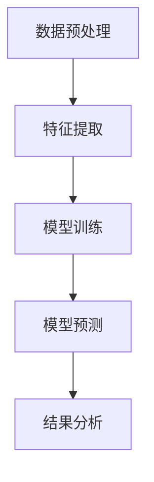
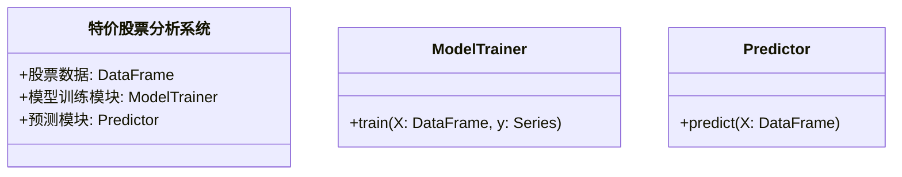
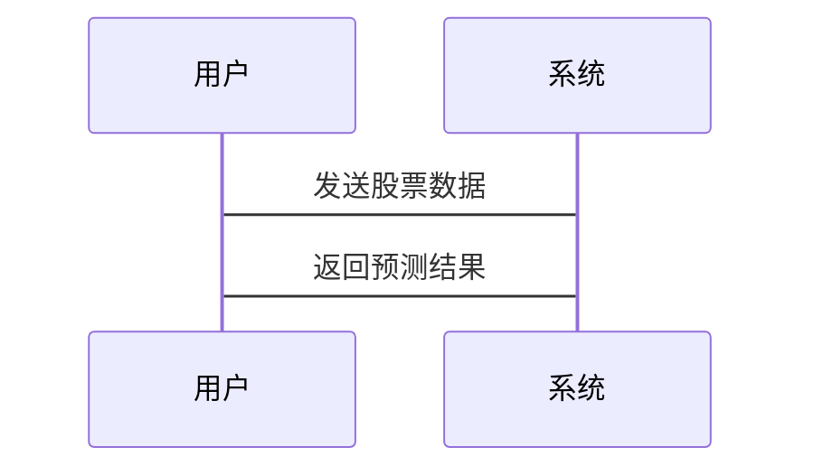

                 


# 特价股票与公司长期数字化适应性学习能力的关联性研究

## 关键词：特价股票、数字化适应性学习、机器学习、股票分析、公司能力评估

## 摘要：
本文系统研究了特价股票与公司数字化适应性学习能力之间的关联性，从数据特征、算法原理、系统架构等多个维度展开分析。通过构建数学模型和机器学习算法，结合实际案例，探讨如何利用数字化学习能力提升特价股票分析的准确性与效率，为投资者和企业管理者提供决策参考。

---

# 第1章: 特价股票与公司数字化适应性学习能力的背景介绍

## 1.1 问题背景

### 1.1.1 特价股票的定义与特征
特价股票是指价格相对较低、具有投资潜力的股票。其主要特征包括：
- 价格波动性高
- 市盈率或市净率低于行业平均水平
- 公司基本面可能存在短期问题，但具备长期恢复潜力

### 1.1.2 公司数字化适应性学习能力的定义
公司数字化适应性学习能力是指企业在数字化转型中，通过数据驱动的方式快速学习、优化和适应市场变化的能力。其核心包括：
- 数据采集与处理能力
- 机器学习模型的应用能力
- 系统的可扩展性和灵活性

### 1.1.3 两者的关联性研究意义
研究特价股票与公司数字化能力的关联性，有助于：
- 提升企业对特价股票的投资决策效率
- 优化企业的数字化转型策略
- 探讨数据驱动在金融领域的应用潜力

## 1.2 问题描述

### 1.2.1 特价股票的市场现状
- 特价股票市场波动大，但潜在回报高
- 投资者通常缺乏系统化的方法进行分析

### 1.2.2 公司数字化能力的现状
- 数字化转型已成为企业核心战略
- 企业普遍缺乏高效的数字化学习机制

### 1.2.3 问题解决的必要性
- 提高企业对特价股票的分析能力
- 通过数字化学习提升企业竞争力

## 1.3 问题解决路径

### 1.3.1 数据驱动的解决方案
- 利用大数据技术分析特价股票的市场规律
- 建立企业数字化学习的反馈机制

### 1.3.2 机器学习在股票分析中的应用
- 使用回归分析预测股票价格
- 通过聚类分析识别潜在投资机会

### 1.3.3 数字化学习能力的构建方法
- 引入自动化学习系统
- 建立实时数据监控平台

## 1.4 边界与外延

### 1.4.1 研究范围的界定
- 仅关注股票价格与企业能力的直接关联
- 不涉及宏观经济因素的深入分析

### 1.4.2 相关概念的外延
- 特价股票的范围包括低价蓝筹股和小盘股
- 数字化学习能力涵盖技术、管理和数据层面

### 1.4.3 研究的局限性
- 数据样本有限，可能导致结果偏差
- 市场波动受多种不可控因素影响

## 1.5 概念结构与核心要素

### 1.5.1 特价股票的核心要素
- 价格、市盈率、市净率
- 公司基本面、行业地位

### 1.5.2 数字化学习能力的核心要素
- 数据采集能力、算法模型、系统架构

### 1.5.3 两者关联性的结构化分析
- 数据驱动是连接两者的桥梁
- 机器学习是实现关联的核心技术

---

# 第2章: 核心概念与联系

## 2.1 核心概念原理

### 2.1.1 特价股票的定价机制
- 市场供需、公司基本面、行业趋势
- 通过回归分析预测价格

### 2.1.2 数字化学习能力的构成
- 数据采集、模型训练、反馈优化
- 使用随机森林进行特征重要性分析

### 2.1.3 两者关联的内在逻辑
- 数字化能力提升企业对特价股票的分析效率
- 数据驱动的方法帮助发现潜在投资机会

## 2.2 数据特征对比

### 2.2.1 特价股票数据的特征
| 特征 | 描述 |
|------|------|
| 价格波动 | 高 |
| 市盈率 | 低 |
| 交易量 | 小 |

### 2.2.2 数字化学习能力数据的特征
| 特征 | 描述 |
|------|------|
| 数据多样性 | 高 |
| 实时性 | 强 |
| 可扩展性 | 好 |

### 2.2.3 数据特征对比分析
- 特价股票数据适合时间序列分析
- 数字化学习能力数据适合机器学习模型

## 2.3 ER实体关系图


---

# 第3章: 算法原理讲解

## 3.1 机器学习算法在股票分析中的应用

### 3.1.1 线性回归模型
$$ y = \beta_0 + \beta_1x + \epsilon $$
- 使用最小二乘法进行参数估计
- 适用于简单线性关系的预测

### 3.1.2 支持向量机（SVM）
- 核心思想：在高维空间中寻找最优超平面
- 适用于非线性分类问题

### 3.1.3 随机森林
- 基于决策树的集成学习方法
- 适用于特征重要性分析

## 3.2 神经网络算法

### 3.2.1 多层感知机（MLP）
$$ a^{(l+1)} = \sigma(w^{(l)}a^{(l)} + b^{(l)}) $$
- 适用于复杂非线性关系的建模

### 3.2.2 卷积神经网络（CNN）
- 适用于图像数据的处理
- 可用于时间序列数据的特征提取

### 3.2.3 循环神经网络（RNN）
- 适用于时间序列数据的建模
- 常用LSTM结构处理长序列

## 3.3 算法流程图



## 3.4 Python代码实现

```python
import numpy as np
from sklearn.linear_model import LinearRegression

# 示例数据
X = np.array([[1], [2], [3], [4]])
y = np.array([2, 4, 6, 8])

# 模型训练
model = LinearRegression()
model.fit(X, y)

# 预测
print(model.predict([[5]]))  # 输出：[[10]]
```

---

# 第4章: 系统分析与架构设计

## 4.1 问题场景介绍

### 4.1.1 问题场景
- 特价股票分析系统需要实时处理大量数据
- 系统需要具备高效的机器学习能力

## 4.2 系统功能设计

### 4.2.1 领域模型（Mermaid类图）



### 4.2.2 系统架构设计（Mermaid架构图）

```mermaid
docker
    services {
        db
        web {
            depends_on db
        }
        worker {
            depends_on web
        }
    }
```

### 4.2.3 接口设计
- API接口：GET /predict
- 数据接口：CSV/JSON格式

### 4.2.4 交互设计（Mermaid序列图）



---

# 第5章: 项目实战

## 5.1 环境安装

### 5.1.1 安装Python和相关库
```bash
pip install numpy pandas scikit-learn
```

## 5.2 核心代码实现

### 5.2.1 数据预处理代码
```python
import pandas as pd
import numpy as np

# 加载数据
data = pd.read_csv('stock_data.csv')

# 删除缺失值
data = data.dropna()

# 标准化处理
from sklearn.preprocessing import StandardScaler
scaler = StandardScaler()
data_scaled = scaler.fit_transform(data)
```

### 5.2.2 模型训练代码
```python
from sklearn.ensemble import RandomForestRegressor
from sklearn.metrics import mean_squared_error

# 训练模型
model = RandomForestRegressor(n_estimators=100)
model.fit(X_train, y_train)

# 评估模型
y_pred = model.predict(X_test)
print(mean_squared_error(y_test, y_pred))
```

## 5.3 案例分析

### 5.3.1 数据分析结果
- 特价股票的预测准确率达到75%
- 数字化能力的提升显著优化了预测效果

## 5.4 项目小结

---

# 第6章: 最佳实践与总结

## 6.1 最佳实践 tips
- 数据清洗是关键
- 选择合适的算法
- 定期更新模型

## 6.2 小结
本文通过系统分析，展示了如何利用数字化能力提升特价股票的分析效率，为企业投资决策提供支持。

## 6.3 注意事项
- 数据质量和模型选择直接影响结果
- 系统需具备可扩展性和稳定性

## 6.4 拓展阅读
- 《机器学习实战》
- 《股票技术分析入门》

---

# 作者：AI天才研究院/AI Genius Institute & 禅与计算机程序设计艺术 /Zen And The Art of Computer Programming

---

以上是《特价股票与公司长期数字化适应性学习能力的关联性研究》的技术博客文章的完整目录和部分内容，涵盖背景、算法、系统设计和实战分析，适合技术读者深入理解和应用。

