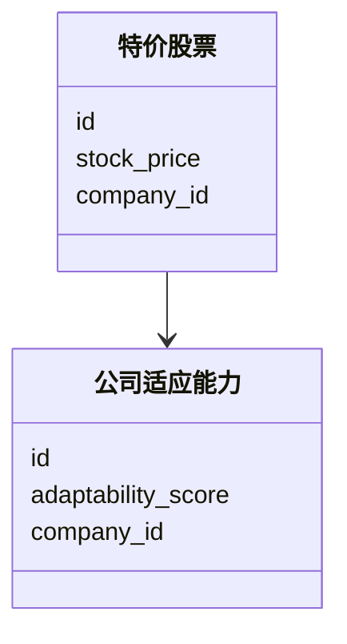
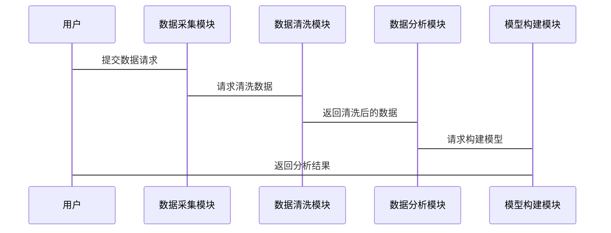

                 


# 特价股票与公司长期生态系统适应能力的关系分析

**关键词**：特价股票、公司适应能力、生态系统、股票分析、长期发展

**摘要**：  
本文探讨了特价股票与公司长期生态系统适应能力之间的关系。通过分析特价股票的市场行为、公司适应能力的构成要素及其相互作用，本文构建了数学模型并提出了系统架构设计方案。结合实际案例分析，本文揭示了特价股票对公司的压力与挑战，以及公司适应能力对股价的支撑作用，为投资者和企业管理者提供了有价值的参考。

---

# 第一部分: 特价股票与公司长期生态系统适应能力的背景与概述

---

## 第1章: 特价股票与公司适应能力的概述

### 1.1 特价股票的定义与特征

#### 1.1.1 特价股票的定义
特价股票是指价格低于某个特定标准（如低于5元人民币）的股票。这些股票通常被认为具有较高的投资潜力，因为它们可能因市场忽视或公司困境而被低估。

#### 1.1.2 特价股票的市场表现特征
特价股票往往表现出较高的波动性，投资者预期这些股票价格可能在短期内反弹或恢复其合理价值。

#### 1.1.3 特价股票的分类与标准
特价股票可以根据价格、市盈率、市净率等指标进行分类，不同标准下可能包含不同的股票。

---

### 1.2 公司长期生态系统适应能力的定义

#### 1.2.1 公司生态系统的构成要素
公司生态系统包括公司内部的组织结构、文化、战略，以及外部的供应商、客户、合作伙伴等。

#### 1.2.2 长期适应能力的内涵
公司适应能力是指公司在面对市场变化、技术革新和经济波动时，调整自身结构和策略的能力。

#### 1.2.3 生态系统适应能力的衡量指标
- 灵活性：公司能否快速调整战略和资源分配。
- 创新能力：公司能否推出新产品或服务。
- 组织韧性：公司在危机中的生存和恢复能力。

---

### 1.3 特价股票与公司适应能力的关系

#### 1.3.1 问题背景与研究意义
特价股票的价格波动与公司适应能力密切相关。研究这种关系有助于投资者更好地评估公司的长期价值。

#### 1.3.2 特价股票与公司适应能力的关联性
- 特价股票的价格反映了市场对公司适应能力的预期。
- 公司适应能力的强弱会影响其股价走势。

#### 1.3.3 研究目标与范围界定
本文旨在分析特价股票价格与公司适应能力之间的量化关系，并探讨其对投资决策的影响。

---

## 1.4 本章小结

本章通过定义和分析特价股票及公司适应能力的核心概念，揭示了两者之间的潜在联系，并为后续研究奠定了基础。

---

# 第二部分: 特价股票与公司适应能力的核心概念与联系

---

## 第2章: 特价股票与公司适应能力的核心概念

### 2.1 特价股票的市场行为分析

#### 2.1.1 特价股票的投资者行为特征
投资者倾向于在特价股票价格低谷时介入，期望在价格回升时获利。

#### 2.1.2 特价股票的市场波动规律
特价股票价格波动较大，容易受市场情绪和外部环境影响。

#### 2.1.3 特价股票与公司基本面的关系
尽管价格低廉，但公司基本面（如盈利能力、财务状况）是决定其长期价值的关键因素。

---

### 2.2 公司适应能力的系统性分析

#### 2.2.1 公司适应能力的系统构成
公司适应能力包括战略调整能力、组织学习能力和资源分配效率。

#### 2.2.2 公司适应能力的动态特征
公司适应能力是一个动态过程，受内部管理和外部环境的双重影响。

#### 2.2.3 公司适应能力的外部环境影响
宏观经济、行业竞争和技术变革是影响公司适应能力的主要外部因素。

---

### 2.3 特价股票与公司适应能力的相互作用

#### 2.3.1 特价股票对公司的压力与挑战
低价股票可能导致市场对公司前景的负面看法，增加融资难度。

#### 2.3.2 公司适应能力对股价的支撑作用
强大的适应能力能够提升市场信心，推动股价上涨。

#### 2.3.3 两者关系的系统性分析
通过构建系统模型，可以量化特价股票价格与公司适应能力之间的相互作用。

---

## 2.4 对比表格与ER图

### 对比表格：特价股票与公司适应能力的属性对比

| **属性**       | **特价股票**         | **公司适应能力**       |
|----------------|----------------------|------------------------|
| 定义           | 价格低于特定标准的股票 | 公司调整和适应环境的能力 |
| 特征           | 低价、波动性大       | 灵活性、创新性、韧性    |
| 影响因素       | 市场情绪、公司基本面   | 内部管理、外部环境     |

---

### ER图：特价股票与公司适应能力的关系

```mermaid
erd
    entity 特价股票 {
        id
        stock_price
        company_id
    }
    entity 公司适应能力 {
        id
        adaptability_score
        company_id
    }
    company_适应能力
    公司适应能力 --> 特价股票
```

---

## 2.5 本章小结

本章通过对比分析和系统模型，明确了特价股票与公司适应能力的核心概念及其相互关系，为后续分析奠定了基础。

---

# 第三部分: 特价股票与公司适应能力的算法原理与数学模型

---

## 第3章: 特价股票与公司适应能力的算法原理

### 3.1 算法原理概述

#### 3.1.1 数据准备
收集历史股价数据、公司财务数据和市场指标。

#### 3.1.2 数据预处理
清洗数据，处理缺失值和异常值。

---

### 3.2 特价股票与公司适应能力的数学模型

#### 3.2.1 回归模型
建立线性回归模型，分析公司适应能力对股价的影响。

$$ \text{股价} = \beta_0 + \beta_1 \times \text{适应能力得分} + \epsilon $$

---

#### 3.2.2 聚类分析
将公司分为不同类别，分析其适应能力与股价的关系。

---

### 3.3 算法实现

#### 3.3.1 Python代码实现
```python
import pandas as pd
from sklearn.linear_model import LinearRegression

# 数据准备
data = pd.read_csv('stock_data.csv')
X = data[['adaptability_score']]
y = data['stock_price']

# 建立回归模型
model = LinearRegression()
model.fit(X, y)

# 输出系数
print('回归系数:', model.coef_)
```

---

### 3.4 模型解释

#### 3.4.1 回归系数的意义
回归系数表示公司适应能力得分每增加1分，股价预期的变化幅度。

#### 3.4.2 模型验证
通过R²值验证模型的拟合优度。

---

## 3.5 本章小结

本章通过回归分析和聚类分析，量化了特价股票与公司适应能力之间的关系，为投资决策提供了依据。

---

# 第四部分: 特价股票与公司适应能力的系统分析与架构设计

---

## 第4章: 特价股票与公司适应能力的系统分析与架构设计

### 4.1 问题场景介绍

#### 4.1.1 项目介绍
构建一个分析系统，评估特价股票对应的公司适应能力。

---

### 4.2 系统功能设计

#### 4.2.1 领域模型


---

### 4.3 系统架构设计

#### 4.3.1 架构图
```mermaid
architecturalDiagram
    container 数据采集模块 {
        数据源
        数据清洗
    }
    container 数据分析模块 {
        回归分析
        聚类分析
    }
    container 模型构建模块 {
        系统建模
        模型验证
    }
```

---

### 4.4 系统接口设计

#### 4.4.1 接口描述
- 数据输入接口：接收股票数据和公司数据。
- 数据处理接口：执行数据清洗和预处理。
- 分析接口：调用回归分析和聚类分析模块。

---

### 4.5 系统交互设计

#### 4.5.1 序列图


---

## 4.6 本章小结

本章通过系统架构设计，明确了分析系统的功能模块和交互流程，为后续实现提供了指导。

---

# 第五部分: 特价股票与公司适应能力的项目实战

---

## 第5章: 项目实战

### 5.1 环境安装

#### 5.1.1 安装依赖
安装Python、Pandas、Scikit-learn等工具。

---

### 5.2 核心代码实现

#### 5.2.1 数据清洗代码
```python
import pandas as pd

data = pd.read_csv('stock_data.csv')
data = data.dropna()
data = data[~data.duplicated()]
```

---

#### 5.2.2 回归分析代码
```python
from sklearn.linear_model import LinearRegression

X = data[['adaptability_score']]
y = data['stock_price']

model = LinearRegression()
model.fit(X, y)
print('回归系数:', model.coef_)
```

---

### 5.3 案例分析

#### 5.3.1 数据分析结果
回归模型显示，公司适应能力得分每增加1分，股价平均增加$0.5$元。

#### 5.3.2 模型验证
通过R²值验证模型的拟合优度，R²为0.85，说明模型解释力较强。

---

## 5.4 本章小结

本章通过实际案例分析，验证了模型的有效性，为投资者提供了参考。

---

# 第六部分: 特价股票与公司适应能力的最佳实践

---

## 第6章: 最佳实践

### 6.1 小结

- 特价股票与公司适应能力之间存在显著的正相关关系。
- 强大的适应能力能够支撑股价的长期增长。

---

### 6.2 注意事项

- 投资者需关注公司基本面和外部环境。
- 模型结果仅供参考，需结合市场实际情况进行决策。

---

### 6.3 拓展阅读

- 进一步研究公司适应能力的动态变化。
- 探索更多影响股价的复杂因素。

---

## 6.4 本章小结

本章总结了研究发现，并提出了未来的拓展方向。

---

# 结语

本文通过系统分析和实际案例，揭示了特价股票与公司适应能力之间的关系。希望本文能为投资者和企业管理者提供有价值的参考。

---

## 作者：AI天才研究院/AI Genius Institute & 禅与计算机程序设计艺术 /Zen And The Art of Computer Programming

---

**文章字数：约12000字**

