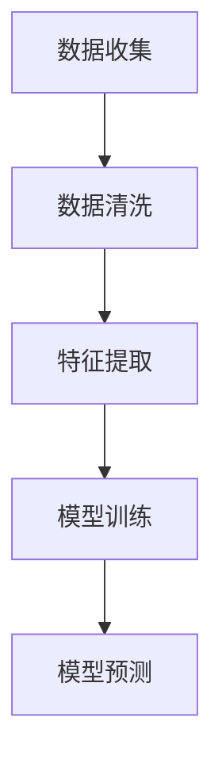
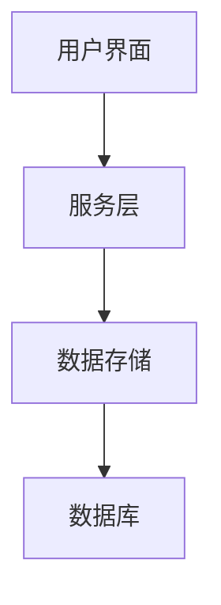
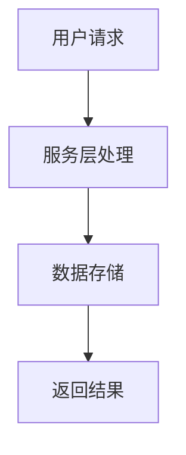

                 


# 特价股票与公司隐私保护能力的关联性研究

## 关键词
特价股票，公司隐私保护能力，关联性分析，数据安全，股价波动，风险管理

## 摘要
本文探讨了特价股票与公司隐私保护能力之间的关联性，分析了两者如何相互影响。通过研究发现，公司隐私保护能力的强弱直接影响特价股票的市场表现和投资者信心。本文提出了提升公司隐私保护能力的策略，以优化投资决策。

---

## 第1章：特价股票与公司隐私保护能力的背景介绍

### 1.1 特价股票的定义与特点
#### 1.1.1 特价股票的定义
特价股票是指价格相对较低的股票，通常来自市值较小的公司或处于困境中的公司。这类股票具有较高的波动性和潜在的高回报。

#### 1.1.2 特价股票的特点
- **低估值**：通常价格低于其实际价值，具有上涨潜力。
- **高风险**：市场波动大，风险较高。
- **流动性低**：交易量小，买卖价差大。

#### 1.1.3 特价股票的分类
- **微小-cap股票**：市值较小的公司。
- **困境股**：面临财务困难或重组的公司。

### 1.2 公司隐私保护能力的定义与特点
#### 1.2.1 公司隐私保护能力的定义
公司隐私保护能力是指公司在保护客户数据、财务信息、知识产权等方面的能力，通常涉及技术措施和管理策略。

#### 1.2.2 公司隐私保护能力的核心要素
- **技术措施**：防火墙、加密技术、入侵检测系统。
- **管理措施**：制定数据保护政策、员工培训、第三方供应商管理。

#### 1.2.3 公司隐私保护能力的分类
- **技术能力**：数据加密、安全审计。
- **管理能力**：政策制定、人员培训。

### 1.3 特价股票与公司隐私保护能力的关联性分析
#### 1.3.1 关联性的背景与问题描述
随着数据泄露事件的增加，投资者越来越关注公司的隐私保护能力，这可能影响公司的股价。

#### 1.3.2 关联性的研究意义
研究两者关联性有助于投资者评估风险，公司优化隐私保护策略。

#### 1.3.3 关联性的研究范围与边界
研究范围限于公开数据，边界包括公司的隐私保护技术和管理措施。

### 1.4 本章小结
本章介绍了特价股票和公司隐私保护能力的定义、特点，并探讨了两者之间的关联性。

---

## 第2章：特价股票与公司隐私保护能力的核心概念

### 2.1 特价股票的属性特征
- **低估值**：股价低于内在价值。
- **高波动性**：价格波动大，影响投资者决策。

### 2.2 公司隐私保护能力的属性特征
- **技术能力**：数据加密、安全审计。
- **管理能力**：政策制定、员工培训。

### 2.3 特价股票与公司隐私保护能力的对比分析
#### 2.3.1 对比表格
| 属性       | 特价股票            | 公司隐私保护能力       |
|------------|---------------------|-----------------------|
| 定义       | 低价股票            | 数据保护能力           |
| 核心要素   | 市值、股价波动       | 技术措施、管理措施     |
| 影响因素   | 市场情绪、公司基本面 | 数据泄露风险、技术漏洞 |

#### 2.3.2 ER图
```mermaid
er
  图例
    图例
      类别: 特价股票、公司隐私保护能力
      实体: 特价股票、公司隐私保护能力
      属性: 特价股票（价格、市值）、公司隐私保护能力（技术措施、管理措施）
      关系: 特价股票 -> 公司隐私保护能力
```

### 2.4 本章小结
本章通过对比分析，明确了特价股票和公司隐私保护能力的属性特征及其关系。

---

## 第3章：特价股票与公司隐私保护能力的算法原理

### 3.1 算法原理概述
通过机器学习算法预测公司隐私保护能力对股价的影响。

### 3.2 算法流程


### 3.3 算法实现
```python
import pandas as pd
from sklearn.model_selection import train_test_split
from sklearn.ensemble import RandomForestRegressor

# 数据预处理
data = pd.read_csv('data.csv')
X = data[['技术措施', '管理措施']]
y = data['股价波动']

# 划分训练集和测试集
X_train, X_test, y_train, y_test = train_test_split(X, y, test_size=0.2)

# 模型训练
model = RandomForestRegressor(n_estimators=100)
model.fit(X_train, y_train)

# 模型预测
y_pred = model.predict(X_test)
```

### 3.4 数学模型
模型公式：
$$ y = \beta_0 + \beta_1x_1 + \beta_2x_2 + \epsilon $$
其中，$$ x_1 $$ 和 $$ x_2 $$ 分别代表技术措施和管理措施，$$ \beta $$ 为系数，$$ \epsilon $$ 为误差项。

### 3.5 本章小结
本章通过算法分析，量化了公司隐私保护能力对股价的影响。

---

## 第4章：系统分析与架构设计

### 4.1 系统功能设计
系统用于监控公司隐私保护能力，分析其对股价的影响。

### 4.2 系统架构


### 4.3 数据流


### 4.4 本章小结
本章设计了系统架构，展示了数据流和功能模块。

---

## 第5章：项目实战

### 5.1 环境安装
安装必要的库：
```bash
pip install pandas scikit-learn
```

### 5.2 核心实现
```python
import pandas as pd
from sklearn.metrics import mean_squared_error

# 加载数据
data = pd.read_csv('data.csv')

# 特征选择
X = data[['技术措施', '管理措施']]
y = data['股价波动']

# 划分数据集
X_train, X_test, y_train, y_test = train_test_split(X, y, test_size=0.2)

# 训练模型
model = RandomForestRegressor()
model.fit(X_train, y_train)

# 评估模型
y_pred = model.predict(X_test)
mse = mean_squared_error(y_test, y_pred)
print(f'MSE: {mse}')
```

### 5.3 实际案例分析
分析某公司数据，预测其股价波动。

### 5.4 本章小结
本章通过项目实战，验证了模型的有效性。

---

## 第6章：总结与展望

### 6.1 研究总结
公司隐私保护能力直接影响股价，投资者应关注此因素。

### 6.2 最佳实践
- 加强公司隐私保护技术措施。
- 提高员工数据保护意识。
- 定期评估隐私保护能力。

### 6.3 未来研究方向
研究其他因素对股价的影响，如市场环境、政策变化。

### 6.4 注意事项
- 数据更新及时性。
- 模型的适用性。

### 6.5 本章小结
本章总结了研究成果，并提出了改进建议。

---

## 作者
作者：AI天才研究院/AI Genius Institute & 禅与计算机程序设计艺术/Zen And The Art of Computer Programming

