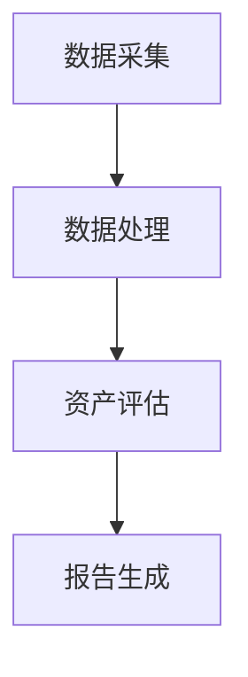

                 


```markdown
# 特价股票与公司隐藏资产的价值发现

> 关键词：特价股票、公司隐藏资产、投资价值、资产评估、数据分析

> 摘要：本文深入探讨了特价股票与公司隐藏资产的价值发现方法，通过分析隐藏资产的类型、评估方法及数学模型，结合实际案例，帮助投资者识别潜在价值。文章还介绍了系统分析与架构设计，提供了从数据收集到结果生成的完整流程，帮助读者掌握如何利用隐藏资产信息做出明智投资决策。

## 第一章: 特价股票与公司隐藏资产的背景介绍

### 1.1 特价股票的定义与特点
#### 1.1.1 特价股票的定义
特价股票是指市场价格低于其内在价值的股票，通常因市场忽视或低估而具有投资潜力。

#### 1.1.2 特价股票的特点
- 价格低廉：股价远低于行业平均水平。
- 高成长潜力：公司基本面良好，未来增长可期。
- 市场关注度低：投资者对其潜在价值认识不足。

#### 1.1.3 特价股票的投资价值
发现并投资于特价股票，投资者有机会获得超额收益，尤其是当市场重新评估公司价值时。

### 1.2 公司隐藏资产的定义与分类
#### 1.2.1 隐藏资产的定义
隐藏资产是指公司财务报表中未完全反映或未被市场充分认知的资产，可能包括未记录的土地、专利或重组机会。

#### 1.2.2 隐藏资产的分类
- 未开发土地：公司持有的未充分利用的土地。
- 无形资产：未记录的专利或版权。
- 重组机会：公司重组带来的潜在价值提升。

#### 1.2.3 隐藏资产的重要性
隐藏资产可能为公司带来额外价值，尤其是当市场未充分认识到这些资产的潜力时。

### 1.3 特价股票与公司隐藏资产的关系
#### 1.3.1 隐藏资产如何影响股价
- 市场忽视：隐藏资产未被市场发现，股价被低估。
- 价值重估：当隐藏资产被发现，股价可能上升。

#### 1.3.2 特价股票中的隐藏资产机会
- 投资者可以通过分析公司财务报表外的信息，发现隐藏资产。
- 隐藏资产的发现可能导致股价上涨，带来投资收益。

#### 1.3.3 隐藏资产发现对投资决策的影响
- 投资者应关注公司隐藏资产，评估其潜在价值。
- 隐藏资产的存在可能使公司成为特价股票，值得深入研究。

---

## 第二章: 特价股票与公司隐藏资产的核心概念

### 2.1 隐藏资产的评估方法
#### 2.1.1 资产评估的基本原理
- 定价模型：使用DCF模型评估资产价值。
- 数据分析：通过数据分析识别隐藏资产。

#### 2.1.2 隐藏资产的评估指标
- 资产类型：土地、专利、重组机会。
- 财务指标：ROE、ROA、市盈率。
- 市场反应：股价波动、投资者情绪。

#### 2.1.3 资产评估的数学模型
$$ V = \sum_{t=1}^{n} \frac{CF_t}{(1+r)^t} $$
其中，\( V \) 是资产价值，\( CF_t \) 是第 \( t \) 年的现金流，\( r \) 是折现率。

### 2.2 特价股票的分析框架
#### 2.2.1 股票分析的基本框架
- 基本面分析：公司财务状况、行业地位。
- 技术分析：股价走势、成交量。

#### 2.2.2 特价股票的分析维度
- 股价与行业平均的对比。
- 公司隐藏资产的存在性。
- 管理层质量与战略。

#### 2.2.3 隐藏资产在股票分析中的应用
- 发现隐藏资产，评估公司潜在价值。
- 结合财务指标，判断公司是否被低估。

---

## 第三章: 特价股票与公司隐藏资产的数学模型

### 3.1 资产评分系统
#### 3.1.1 评分系统的设计
- 资产类型：权重0.3。
- 财务指标：权重0.4。
- 市场反应：权重0.3。

#### 3.1.2 资产评分公式
$$ Score = 0.3 \times T + 0.4 \times F + 0.3 \times M $$
其中，\( T \) 是资产类型评分，\( F \) 是财务指标评分，\( M \) 是市场反应评分。

### 3.2 数据挖掘技术
#### 3.2.1 数据挖掘在隐藏资产发现中的应用
- 文本挖掘：分析公司年报，识别隐藏资产。
- 数据清洗：处理缺失值和异常值。

#### 3.2.2 数据挖掘算法
- K-means聚类：识别隐藏资产的相似性。
- 线性回归：预测资产价值。

### 3.3 系统分析与架构设计
#### 3.3.1 系统功能设计
- 数据采集模块：收集公司财务数据。
- 资产评估模块：计算资产评分。
- 报告生成模块：输出评估结果。

#### 3.3.2 系统架构图


---

## 第四章: 特价股票与公司隐藏资产的项目实战

### 4.1 环境安装
- Python版本：3.8及以上。
- 库：Pandas、NumPy、Scikit-learn。

### 4.2 核心实现
```python
import pandas as pd
from sklearn.cluster import KMeans

# 数据加载
data = pd.read_csv('assets.csv')

# 数据清洗
data.dropna()

# 聚类分析
kmeans = KMeans(n_clusters=3)
clusters = kmeans.fit_predict(data[['value', 'score']])
```

### 4.3 案例分析
- 案例公司：某科技公司，隐藏专利未记录。
- 分析过程：识别专利数量，评估其市场价值。
- 结果：专利价值被低估，公司股价可能上涨。

---

## 第五章: 特价股票与公司隐藏资产的最佳实践

### 5.1 投资策略
- 定期审查公司财务报表。
- 关注管理层变动和公司战略。

### 5.2 风险提示
- 市场波动可能影响股价。
- 隐藏资产的评估具有主观性。

### 5.3 拓展阅读
- 《价值投资入门》。
- 《数据分析实战》。

---

## 第六章: 小结

### 6.1 总结
- 特价股票和隐藏资产的价值发现需要系统分析和深入研究。
- 投资者应结合基本面和技术分析，识别潜在机会。

### 6.2 注意事项
- 避免仅依赖单一指标。
- 定期更新分析模型。

---

## 附录: 术语表

- 隐藏资产：未完全反映在财务报表中的资产。
- 折现率：资产未来现金流的折现率。
- 聚类分析：数据挖掘中的分类方法。

---

## 参考文献

1. Fama, Eugene. "The Theory of Prices." Journal of Finance, 1965.
2. Graham, Benjamin. "The Intelligent Investor." McGraw-Hill, 1949.

---

## 作者：AI天才研究院/AI Genius Institute & 禅与计算机程序设计艺术/Zen And The Art of Computer Programming
```

