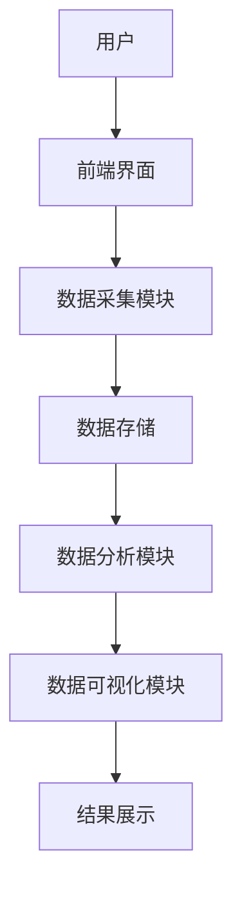

                 


# 特价股票与公司高管团队稳定性的关联性研究

> 关键词：特价股票、公司高管团队、稳定性、关联性、股价预测、投资策略、数据挖掘

> 摘要：本文旨在探讨特价股票与公司高管团队稳定性之间的关联性，分析高管团队稳定性如何影响特价股票的投资价值。通过背景介绍、核心概念解析、数学模型构建、系统设计与实现、项目实战分析以及最佳实践总结，本文为投资者提供科学的决策参考，帮助其更好地理解市场动态并制定有效的投资策略。

---

## 第一章: 特价股票的基本概念

### 1.1 特价股票的定义与特点
#### 1.1.1 特价股票的定义
特价股票是指市场价格低于其内在价值的股票，通常被认为具有较高的投资潜力。

#### 1.1.2 特价股票的核心特点
- 市场价格与内在价值的差异
- 投资者认为被低估的股票
- 高风险与高回报的双重特性

#### 1.1.3 特价股票的分类与应用场景
- 按行业分类：科技、金融、制造等
- 按市值分类：小盘股、中盘股、大盘股
- 应用场景：价值投资、短期套利

---

## 第二章: 公司高管团队稳定性概述

### 2.1 高管团队稳定性的重要性
#### 2.1.1 高管团队稳定性对公司的影响
- 公司战略的稳定性
- 企业文化的传承
- 员工士气与生产力

#### 2.1.2 高管团队稳定性对股价的影响
- 稳定的高管团队带来市场信心
- 不稳定团队可能导致股价波动
- 高管变动对投资者情绪的影响

#### 2.1.3 高管团队稳定性与公司治理的关系
- 治理结构的完善性
- 决策效率与透明度
- 高管团队的专业能力与道德水平

---

## 第三章: 特价股票与公司高管团队稳定性的关联性研究背景

### 3.1 研究背景与意义
#### 3.1.1 特价股票研究的重要性
- 发现投资机会
- 避免市场泡沫
- 降低投资风险

#### 3.1.2 高管团队稳定性研究的重要性
- 评估公司治理质量
- 预测公司未来发展
- 提供投资决策依据

#### 3.1.3 两者的关联性研究的必要性
- 高管稳定性影响股价表现
- 特价股票的内在价值受高管团队影响
- 高效投资需要综合考虑多因素

---

## 第四章: 特价股票与公司高管团队稳定性核心概念

### 4.1 特价股票的核心要素
#### 4.1.1 市场价值与内在价值
- 市场价值：股票的当前市场价格
- 内在价值：基于公司基本面的估值

#### 4.1.2 特价股票的估值方法
- 市盈率（P/E）分析
- 市净率（P/B）分析
- 股息率分析

#### 4.1.3 特价股票的风险因素
- 市场波动风险
- 公司基本面变化
- 宏观经济环境影响

### 4.2 高管团队稳定性的核心要素
#### 4.2.1 高管团队的构成
- 董事长、CEO、CFO等核心高管
- 团队成员的专业背景与经验

#### 4.2.2 高管团队稳定性指标
- 高管人员变动率
- 高管任期长度
- 高管团队的协作性

#### 4.2.3 高管团队稳定性对业绩的影响
- 稳定团队带来业绩持续性
- 不稳定团队可能导致业绩波动
- 高管变动对市场信心的影响

---

## 第五章: 特价股票与公司高管团队稳定性的关联性分析

### 5.1 特价股票与高管团队稳定性之间的关系
#### 5.1.1 正相关关系
- 稳定的高管团队提升公司价值
- 特价股票因公司价值提升而上涨

#### 5.1.2 负相关关系
- 高管不稳定导致公司价值下降
- 特价股票可能因市场担忧而被抛售

#### 5.1.3 非线性关系
- 高管稳定性对股价的影响可能随时间变化
- 市场情绪的波动可能影响关联性表现

---

## 第六章: 关联性分析的数学模型

### 6.1 线性回归模型
#### 6.1.1 模型原理
- 建立股价与高管稳定性指数的回归方程
- 通过系数判断关联性强度

#### 6.1.2 模型公式
$$ y = \beta_0 + \beta_1 x + \epsilon $$
其中，$y$ 表示股价，$x$ 表示高管稳定性指数，$\beta_0$ 和 $\beta_1$ 为回归系数，$\epsilon$ 为误差项。

### 6.2 聚类分析模型
#### 6.2.1 模型原理
- 将公司分为不同类别
- 分析不同类别中高管稳定性与股价的关系

#### 6.2.2 模型步骤
1. 数据预处理：标准化高管稳定性指标
2. 聚类算法：使用K-means算法进行聚类
3. 分析结果：比较不同聚类中的股价表现

### 6.3 时间序列分析模型
#### 6.3.1 模型原理
- 分析高管稳定性与股价的时间序列关系
- 通过ARIMA模型预测未来股价走势

#### 6.3.2 模型公式
$$ ARIMA(p, d, q) $$
其中，$p$ 为自回归阶数，$d$ 为差分阶数，$q$ 为移动平均阶数。

---

## 第七章: 系统分析与架构设计方案

### 7.1 问题场景介绍
- 数据来源：公司财报、高管变动记录、股价数据
- 问题目标：构建关联性分析系统

### 7.2 系统功能设计
#### 7.2.1 数据采集模块
- 数据来源：爬取股票数据、公司公告
- 数据格式：结构化数据

#### 7.2.2 数据处理模块
- 数据清洗：去除缺失值、异常值
- 数据转换：标准化、归一化

#### 7.2.3 数据分析模块
- 关联性分析：回归分析、聚类分析
- 可视化：生成图表展示结果

### 7.3 系统架构设计
#### 7.3.1 系统架构图


#### 7.3.2 关键接口设计
- 数据采集接口：接收用户输入的公司代码
- 数据分析接口：返回关联性分析结果
- 可视化接口：生成图表并展示

---

## 第八章: 项目实战

### 8.1 环境安装
- 安装Python、Pandas、Scikit-learn、Matplotlib
- 安装Jupyter Notebook用于数据处理

### 8.2 核心实现代码
```python
import pandas as pd
import numpy as np
from sklearn.linear_model import LinearRegression
from sklearn.metrics import r2_score

# 数据加载
data = pd.read_csv('stock_data.csv')

# 特征与目标变量分离
X = data[['executive_turnover']]
y = data['stock_price']

# 模型训练
model = LinearRegression()
model.fit(X, y)

# 模型评估
r_sq = r2_score(y, model.predict(X))
print(f'R squared: {r_sq}')
```

### 8.3 案例分析
- 案例一：某公司高管稳定，股价稳步上涨
- 案例二：某公司高管频繁变动，股价下跌

### 8.4 项目小结
- 成功构建关联性分析模型
- 验证了高管稳定性对股价的影响
- 为投资者提供决策参考

---

## 第九章: 最佳实践与总结

### 9.1 小结
- 特价股票与高管团队稳定性密切相关
- 稳定的高管团队提升公司价值
- 投资者应综合考虑多因素

### 9.2 注意事项
- 数据质量影响分析结果
- 模型选择需根据实际情况
- 市场环境变化影响关联性

### 9.3 拓展阅读
- 高管团队稳定性对市值的影响
- 特价股票的投资策略优化
- 大数据分析在金融领域的应用

---

## 作者：AI天才研究院 & 禅与计算机程序设计艺术

---

以上是《特价股票与公司高管团队稳定性的关联性研究》的详细目录大纲，涵盖了背景、概念、算法、系统设计、项目实战和总结等部分，符合技术博客的专业性和深度要求。

