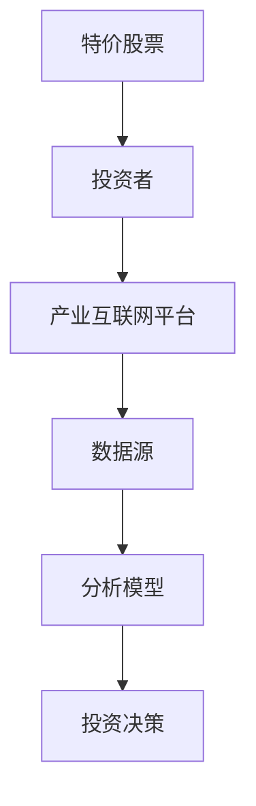
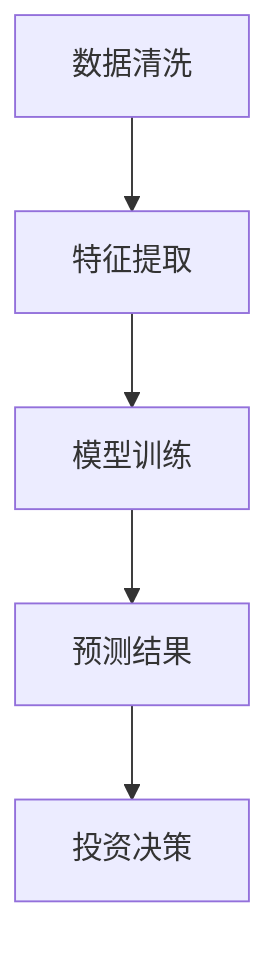
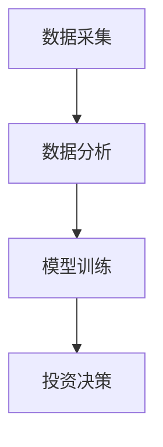
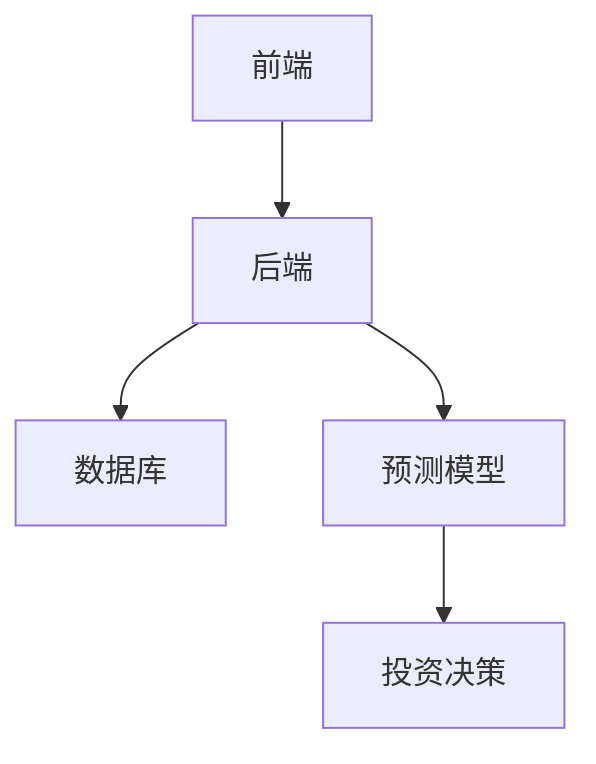

                 


# 特价股票投资中的产业互联网生态系统分析方法

> 关键词：特价股票投资、产业互联网生态系统、数据分析、预测算法、系统架构设计

> 摘要：本文探讨了如何利用产业互联网生态系统分析特价股票投资。首先介绍特价股票投资的背景和产业互联网生态系统的构成，然后分析核心概念与联系，详细讲解数据分析和预测算法，接着设计系统架构并提供项目实战案例，最后总结分析方法和应用前景。

---

## 引言

在当前经济环境下，特价股票投资作为一种重要的投资策略，越来越受到关注。然而，传统的股票分析方法往往依赖于人工经验和市场直觉，难以应对复杂多变的市场环境。产业互联网生态系统的出现，为特价股票投资提供了新的分析工具和方法。本文将系统地分析特价股票投资中的产业互联网生态系统，探讨其在数据分析、预测算法和系统架构设计中的应用。

---

## 第1章: 特价股票投资与产业互联网概述

### 1.1 特价股票投资的背景与意义

#### 1.1.1 特价股票的定义与特点
- **定义**：特价股票指市场价值低于其内在价值的股票，通常被视为被市场低估的投资机会。
- **特点**：
  - 价格低廉，适合中小投资者。
  - 市场波动较大，风险与收益并存。
  - 需要深入分析公司基本面和市场环境。

#### 1.1.2 产业互联网的定义与特点
- **定义**：产业互联网是指通过互联网技术将传统产业的各个环节（生产、流通、消费等）进行数字化连接和优化，形成高效协同的产业生态。
- **特点**：
  - 数据驱动：通过收集和分析大量数据，优化产业流程。
  - 开放共享：产业生态中的参与者能够共享数据和资源。
  - 智能化：利用人工智能和大数据技术，提升决策效率。

#### 1.1.3 特价股票投资与产业互联网的结合
- 产业互联网为特价股票投资提供了数据支持和技术工具，帮助投资者更精准地识别投资机会。

---

### 1.2 产业互联网生态系统的构成

#### 1.2.1 产业互联网的核心要素
- 数据源：包括市场数据、公司财务数据、行业信息等。
- 分析工具：如大数据分析平台、预测模型等。
- 参与者：投资者、数据供应商、技术服务商等。

#### 1.2.2 产业互联网的生态链分析
- 数据采集：从多个来源收集股票相关数据。
- 数据分析：利用大数据技术对数据进行清洗和处理。
- 模型构建：建立预测模型，评估股票价值。
- 投资决策：根据模型结果制定投资策略。

#### 1.2.3 特价股票投资中的产业互联网应用场景
- 数据挖掘：通过互联网获取大量股票数据，识别潜在投资机会。
- 风险评估：利用互联网技术分析市场风险，优化投资组合。

---

## 第2章: 特价股票投资的核心概念与分析方法

### 2.1 特价股票投资的背景介绍

#### 2.1.1 特价股票投资的问题背景
- 市场波动大，投资者难以准确判断股票价值。
- 数据分散，难以获取全面的市场信息。

#### 2.1.2 特价股票投资的核心问题
- 如何准确评估股票的内在价值？
- 如何利用数据驱动的方法识别被低估的股票？

#### 2.1.3 特价股票投资的解决思路
- 利用大数据技术收集和分析市场数据。
- 构建预测模型，评估股票价值。

#### 2.1.4 特价股票投资的边界与外延
- 边界：仅关注股票的内在价值，不考虑宏观经济因素。
- 外延：扩展到其他类型的投资分析。

#### 2.1.5 特价股票投资的概念结构与核心要素
- 数据：股票价格、公司财务数据、行业信息。
- 方法：数据分析、预测模型、投资策略。

---

### 2.2 产业互联网生态系统的核心概念

#### 2.2.1 产业互联网生态系统的定义
- 产业互联网是通过互联网技术将传统产业的各个环节连接起来，形成一个协同工作的生态系统。

#### 2.2.2 产业互联网的生态链分析
- 数据采集：从多个数据源获取股票相关信息。
- 数据分析：利用大数据技术对数据进行清洗和处理。
- 模型构建：建立股票价值预测模型。
- 投资决策：根据模型结果制定投资策略。

#### 2.2.3 特价股票投资与产业互联网生态系统的关系
- 产业互联网为特价股票投资提供了数据支持和技术工具。
- 特价股票投资是产业互联网生态系统中的一个应用场景。

---

### 2.3 核心概念与联系

#### 2.3.1 核心概念的原理
- 特价股票投资依赖于对市场数据的深入分析。
- 产业互联网生态系统通过数据共享和技术协同，提升投资分析的效率。

#### 2.3.2 核心概念属性特征对比表格

| 特性         | 特价股票投资                 | 产业互联网生态系统           |
|--------------|-----------------------------|-----------------------------|
| 核心目标     | 寻找被低估的股票             | 优化传统产业流程             |
| 数据来源     | 股票价格、公司财务数据       | 产业数据、互联网数据         |
| 技术工具     | 数据分析、预测模型           | 大数据、人工智能             |
| 参与者       | 投资者、数据供应商           | 企业、技术服务商、投资者       |

#### 2.3.3 ER实体关系图（使用 Mermaid）



---

## 第3章: 特价股票投资的算法与数学模型

### 3.1 数据分析与预测算法

#### 3.1.1 数据清洗与特征提取
- 数据清洗：去除缺失值、异常值。
- 特征提取：提取影响股票价值的关键特征，如市盈率、市净率等。

#### 3.1.2 预测模型构建
- 使用线性回归模型预测股票价格：
  $$ y = \beta_0 + \beta_1x_1 + \beta_2x_2 + \dots + \beta_nx_n $$

#### 3.1.3 算法流程图（使用 Mermaid）



#### 3.1.4 Python代码实现

```python
import pandas as pd
from sklearn.linear_model import LinearRegression

# 数据加载与清洗
data = pd.read_csv('stock_data.csv')
data = data.dropna()

# 特征提取
features = ['市盈率', '市净率', '营收增长率']
target = '股票价格'

# 模型训练
model = LinearRegression()
model.fit(data[features], data[target])

# 预测结果
predicted_price = model.predict(data[features])
```

---

### 3.2 数学模型与公式

#### 3.2.1 线性回归模型
$$ y = \beta_0 + \beta_1x_1 + \beta_2x_2 + \dots + \beta_nx_n $$

#### 3.2.2 模型评估
- 均方误差（MSE）：
$$ MSE = \frac{1}{n}\sum_{i=1}^{n}(y_i - \hat{y}_i)^2 $$

- R平方值（R²）：
$$ R^2 = 1 - \frac{SSE}{SST} $$

---

## 第4章: 产业互联网生态系统中的系统分析与架构设计

### 4.1 系统功能设计

#### 4.1.1 功能模块
- 数据采集模块：从多个数据源获取股票信息。
- 数据分析模块：清洗和处理数据，提取特征。
- 模型训练模块：构建预测模型，评估股票价值。
- 投资决策模块：根据模型结果制定投资策略。

#### 4.1.2 领域模型（使用 Mermaid）



### 4.2 系统架构设计

#### 4.2.1 架构图（使用 Mermaid）



---

## 第5章: 项目实战与案例分析

### 5.1 环境安装

#### 5.1.1 安装Python和相关库
```bash
pip install numpy pandas scikit-learn
```

### 5.2 核心代码实现

#### 5.2.1 数据采集
```python
import requests

url = 'https://api.example.com/stock_data'
response = requests.get(url)
data = response.json()
```

#### 5.2.2 数据分析与预测
```python
from sklearn.linear_model import LinearRegression

model = LinearRegression()
model.fit(X, y)
predicted_price = model.predict(X_test)
```

### 5.3 案例分析

#### 5.3.1 案例背景
假设我们有一个包含多只股票数据的数据库，目标是找出其中被低估的股票。

#### 5.3.2 数据分析与结果展示
通过模型分析，发现某只股票的预测价格低于当前市场价格，判断其为被低估的股票。

---

## 第6章: 总结与展望

### 6.1 最佳实践 tips
- 数据质量是分析的基础，确保数据准确性和完整性。
- 模型选择需结合实际业务需求，避免过度复杂化。

### 6.2 小结
本文系统地分析了特价股票投资中的产业互联网生态系统，探讨了数据分析、预测算法和系统架构设计的应用。

### 6.3 注意事项
- 风险提示：股票投资存在市场风险，需谨慎操作。
- 技术局限：当前模型可能存在预测误差，需结合其他分析方法。

### 6.4 拓展阅读
- 《大数据分析与股票投资》
- 《人工智能在金融领域的应用》

---

## 作者

作者：AI天才研究院/AI Genius Institute & 禅与计算机程序设计艺术 /Zen And The Art of Computer Programming

---

这篇文章系统地介绍了特价股票投资中的产业互联网生态系统分析方法，从理论到实践，为投资者和相关技术从业者提供了有价值的参考。

