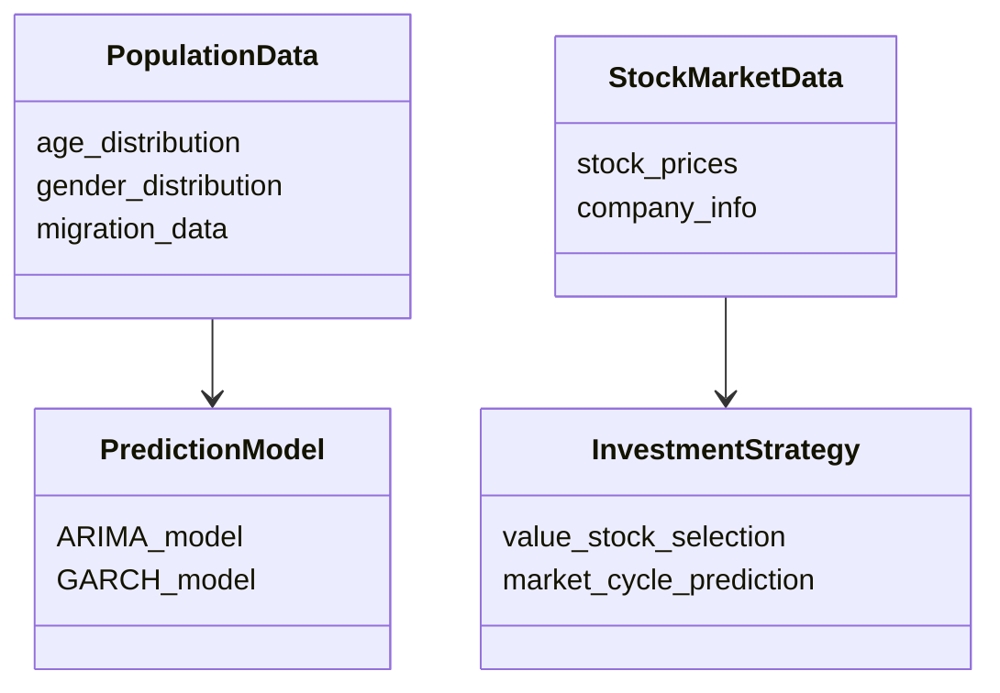

                 


```markdown
# 特价股票投资中的人口结构变化趋势考量

## 关键词：特价股票，人口结构，投资策略，数学模型，算法实现

## 摘要：本文探讨了人口结构变化对特价股票投资的影响，分析了如何通过数学模型和算法预测人口结构变化趋势，并结合实际案例进行投资策略优化。文章从背景介绍、影响分析、策略制定、数学模型构建、算法实现、系统架构设计、项目实战到总结，全面解析了人口结构变化对特价股票投资的重要性。

---

# 第一部分: 人口结构变化与股票投资的背景介绍

## 第1章: 人口结构变化的基本概念

### 1.1 人口结构的定义与组成

- 人口结构是指一个地区内不同年龄段人口的分布情况。
- 人口结构由年龄、性别、家庭结构等因素组成，反映社会经济发展阶段。

### 1.2 人口结构变化的驱动因素

- 自然增长率：出生率、死亡率的变化。
- 迁移率：人口迁入迁出的影响。
- 经济发展水平：工业化、城市化对人口分布的影响。

### 1.3 人口结构变化对经济和社会的影响

- 就业市场：年轻人口比例影响劳动力供给。
- 消费习惯：不同年龄段的消费偏好差异。
- 社会政策：老龄化社会需要更多的社会保障支出。

## 第2章: 特价股票投资的核心理念

### 2.1 特价股票的定义与特征

- 特价股票：市场价格低于其内在价值的股票。
- 特征：低估值、高分红、良好基本面。

### 2.2 人口结构变化与投资策略的关联性

- 人口结构变化影响消费习惯和投资需求。
- 不同年龄段投资者的风险偏好差异影响市场结构。
- 人口老龄化可能导致低风险投资偏好增加。

---

# 第二部分: 人口结构变化对股票市场的影响

## 第3章: 人口老龄化对股票市场的影响

### 3.1 人口老龄化对消费行为的影响

- 老龄人口增加导致消费结构变化，更多关注医疗、养老等服务行业。
- 消费习惯的变化影响相关行业的股票价格。

### 3.2 人口老龄化对投资需求的影响

- 老龄人口更倾向于低风险投资，如债券和蓝筹股。
- 年轻人口增加则可能推高成长型股票的需求。

### 3.3 人口老龄化对市场流动性的冲击

- 老龄人口减少储蓄，可能导致市场流动性下降。
- 年轻人口增加可能带来更多的市场参与者。

## 第4章: 人口结构变化对行业选择的影响

### 4.1 不同行业对人口结构的敏感性分析

- 医疗行业：老龄化社会需求增加。
- 消费品行业：年轻人口增加推动需求。
- 房地产行业：人口迁移和城市化影响需求。

### 4.2 人口结构变化对行业投资价值的评估

- 医疗行业：老龄化社会需求增加，投资价值上升。
- 消费品行业：年轻人口增加，消费习惯变化带来投资机会。
- 房地产行业：人口迁移和城市化对行业的影响。

---

# 第三部分: 人口结构变化对特价股票投资策略的影响

## 第5章: 基于人口结构变化的选股策略

### 5.1 人口结构变化下的价值发现

- 通过分析不同年龄段的消费习惯，寻找被低估的行业龙头股。
- 结合人口迁移趋势，投资新兴城市地区的房地产股。

### 5.2 人口结构变化对个股估值的影响

- 年龄结构变化影响公司的盈利能力和增长潜力。
- 人口迁移趋势影响公司的市场扩展能力和区域竞争优势。

### 5.3 人口结构变化下的投资机会识别

- 关注老龄化社会下的医疗、养老服务等行业。
- 投资年轻人口增加地区的新兴行业股票。

## 第6章: 人口结构变化与市场周期的关系

### 6.1 市场周期的定义与分类

- 牛市、熊市、震荡市：不同市场周期下的人口结构影响不同。

### 6.2 人口结构变化对市场周期的影响

- 老龄化社会可能导致市场波动性增加。
- 年轻人口增加可能推动市场牛市的到来。

### 6.3 基于人口结构变化的市场周期预测

- 通过分析人口结构变化趋势，预测未来市场周期的变化。
- 制定相应的投资策略，规避市场风险。

---

# 第四部分: 人口结构变化的数学模型与预测方法

## 第7章: 人口结构变化的数学模型

### 7.1 人口增长模型

- 指数增长模型：\( P(t) = P_0 e^{rt} \)
- 线性增长模型：\( P(t) = P_0 + rt \)

### 7.2 年龄结构模型

- 年龄中位数：\( \text{中位数} = \frac{\text{总人口数}}{2} \) 的位置。
- 年龄金字塔：通过饼图或柱状图展示不同年龄段人口分布。

### 7.3 人口迁移模型

- 迁移率模型：\( \text{迁入率} - \text{迁出率} = \text{净迁入率} \)

## 第8章: 基于时间序列分析的人口结构预测

### 8.1 时间序列分析的基本概念

- 时间序列数据：按时间顺序排列的数据。
- 时间序列分析方法：ARIMA、GARCH 等。

### 8.2 人口结构变化的时间序列建模

- ARIMA 模型：\( ARIMA(p, d, q) \)
- GARCH 模型：\( GARCH(p, q) \)

### 8.3 预测模型的验证与优化

- 模型评估指标：均方误差（MSE）、平均绝对误差（MAE）。
- 模型优化方法：参数调整、交叉验证。

---

# 第五部分: 基于人口结构变化的股票投资算法

## 第9章: 算法原理

### 9.1 数据预处理与特征提取

- 数据清洗：处理缺失值、异常值。
- 特征提取：从人口统计数据中提取相关特征。

### 9.2 基于人口结构变化的特征选择

- 使用统计方法（如卡方检验）选择重要特征。
- 利用机器学习算法（如Lasso回归）进行特征选择。

### 9.3 投资决策模型的构建

- 使用逻辑回归或支持向量机（SVM）进行分类预测。
- 通过决策树或随机森林进行特征重要性分析。

## 第10章: 算法实现

### 10.1 数据获取与清洗

```python
import pandas as pd

# 获取人口统计数据
data = pd.read_csv('population.csv')

# 清洗数据
data.dropna(inplace=True)
data = data[~data['population'].isnull()]
```

### 10.2 特征选择与模型训练

```python
from sklearn.feature_selection import SelectKBest
from sklearn.ensemble import RandomForestClassifier

# 特征选择
selector = SelectKBest(k=5)
selector.fit(data[['feature1', 'feature2', ...], 'target'])

# 模型训练
model = RandomForestClassifier(n_estimators=100)
model.fit(selector.transform(data[['feature1', 'feature2', ...], 'target'])
```

### 10.3 模型预测与结果分析

```python
# 预测结果
predictions = model.predict(new_data)

# 模型评估
from sklearn.metrics import accuracy_score
print(accuracy_score(y_true, predictions))
```

---

# 第六部分: 系统分析与架构设计

## 第11章: 系统功能设计

### 11.1 领域模型设计



### 11.2 系统架构设计


---

# 第七部分: 项目实战

## 第12章: 项目实现

### 12.1 环境配置

- 安装必要的库：`pip install pandas numpy scikit-learn`

### 12.2 核心代码实现

```python
import pandas as pd
from sklearn.ensemble import RandomForestClassifier

# 数据加载与预处理
data = pd.read_csv('population.csv')
data.dropna(inplace=True)

# 特征选择
features = data[['age', 'gender', 'income']].values
target = data['stock_price'].values

model = RandomForestClassifier(n_estimators=100)
model.fit(features, target)

# 预测新数据
new_features = ...  # 新数据
predictions = model.predict(new_features)

print("预测结果:", predictions)
```

### 12.3 实际案例分析

- 以某行业为例，分析人口结构变化对该行业股票价格的影响。
- 通过历史数据验证模型的准确性。

---

# 第八部分: 总结与展望

## 第13章: 总结

- 人口结构变化是影响股票投资的重要因素。
- 通过数学模型和算法可以有效预测和利用这些变化。
- 综合分析和实战案例表明，基于人口结构变化的策略能够有效指导投资决策。

## 第14章: 未来研究方向

- 结合更多因素（如经济指标、政策变化）构建更复杂的预测模型。
- 探讨人工智能技术在股票投资中的更广泛应用。

---

# 作者：AI天才研究院 & 禅与计算机程序设计艺术

```

