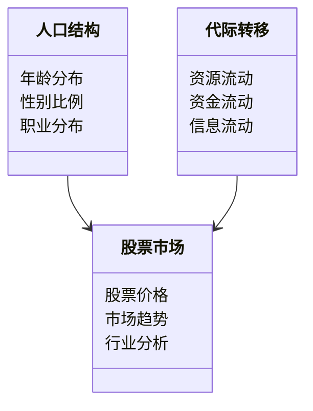
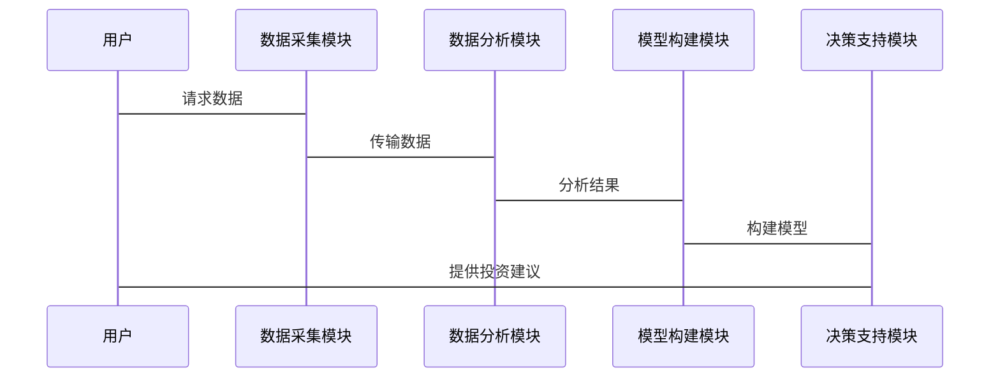

                 


```markdown
# 特价股票投资中的人口结构数字代际转移趋势考量

> **关键词**：特价股票，人口结构，代际转移，股票投资，趋势分析

> **摘要**：本文探讨了在特价股票投资中，人口结构和代际转移趋势对投资决策的影响。通过分析人口结构的变化及其对经济和市场的影响，结合代际转移的趋势，提出了一种基于人口结构和代际转移的特价股票投资策略。文章从基本概念、算法原理、系统设计到项目实战，全面阐述了如何利用人口结构和代际转移趋势进行股票投资。

---

## 第1章: 人口结构与代际转移的基本概念

### 1.1 人口结构的定义与分类

#### 1.1.1 人口结构的定义
人口结构是指一个国家或地区的各类人群在年龄、性别、职业、教育程度等方面的分布情况。它是分析社会经济发展的重要基础。

#### 1.1.2 人口结构的分类
- **按年龄划分**：包括少儿、青年、壮年、老年等不同年龄段的人口分布。
- **按性别划分**：包括男性和女性人口的比例。
- **按职业划分**：包括劳动年龄人口、非劳动年龄人口等。

#### 1.1.3 人口结构对经济的影响
人口结构的变动直接影响消费、投资和生产活动。例如，年轻人口比例较高的地区，消费增长可能更快；而老龄化严重的地区，医疗和养老支出可能增加。

### 1.2 代际转移的定义与特征

#### 1.2.1 代际转移的定义
代际转移是指不同年龄段人群之间的资源、资金、信息等的流动和转移过程。它反映了人口结构变化对经济和社会的影响。

#### 1.2.2 代际转移的主要特征
- **周期性**：代际转移通常与经济周期密切相关。
- **结构性**：不同年龄段的人群在消费、投资行为上存在差异。
- **反馈性**：代际转移对经济结构的影响具有反馈作用。

### 1.3 人口结构与代际转移的关系

#### 1.3.1 人口结构如何影响代际转移
- 人口老龄化可能导致储蓄减少、消费增加，进而影响投资行为。
- 青年比例增加可能推动创新和经济增长。

#### 1.3.2 代际转移对人口结构的反馈作用
- 投资行为的变化会影响就业机会，从而影响人口结构。
- 消费行为的变化会影响市场需求，进一步影响人口结构。

### 1.4 本章小结
本章从基本概念出发，分析了人口结构和代际转移的关系及其对经济的影响。这些分析为后续的股票投资策略提供了理论基础。

---

## 第2章: 特价股票投资的基本原理

### 2.1 特价股票的定义与特点

#### 2.1.1 特价股票的定义
特价股票是指价格相对较低，但具有潜在增长空间的股票。它们通常来自基本面较好的公司，但市场价格尚未被市场充分发现。

#### 2.1.2 特价股票的主要特点
- **价格低**：相对于公司基本面，股价被低估。
- **成长性**：公司具有较高的增长潜力。
- **风险较低**：相对于高价股，风险分散。

### 2.2 股票市场的周期性与波动性

#### 2.2.1 股票市场的周期性分析
股票市场通常经历周期性波动，包括复苏期、增长期、成熟期和衰退期。不同周期对投资策略的影响不同。

#### 2.2.2 股票市场的波动性特征
市场波动性受多种因素影响，包括宏观经济、政策变化、投资者情绪等。波动性高的市场通常伴随着高风险和高收益。

#### 2.2.3 股票市场与经济周期的关系
经济周期的变化直接影响股票市场的表现。例如，在经济复苏期，股票市场可能表现较好；在衰退期，股票市场可能下跌。

### 2.3 特价股票投资的核心要素

#### 2.3.1 公司基本面分析
基本面分析包括对公司的财务状况、盈利能力、行业地位等的分析。基本面良好的公司更容易成为特价股票的投资目标。

#### 2.3.2 行业发展趋势
行业趋势分析包括对行业增长潜力、竞争格局等的分析。选择具有增长潜力的行业可以提高投资成功的概率。

#### 2.3.3 市场情绪与投资者行为
市场情绪和投资者行为会影响股票价格。例如，投资者情绪高涨时，股价可能被高估；情绪低落时，股价可能被低估。

### 2.4 本章小结
本章介绍了特价股票的基本概念和投资核心要素，为后续分析提供了基础。

---

## 第3章: 人口结构与股票市场的关联性分析

### 3.1 人口结构对股票市场的影响路径

#### 3.1.1 人口结构通过消费行为影响股票市场
- 年轻人口比例高，消费增长快，可能推动相关行业股票价格上涨。
- 老年人口比例高，消费偏向保守，可能影响股票市场的整体表现。

#### 3.1.2 人口结构通过投资行为影响股票市场
- 投资者年龄结构的变化会影响投资偏好和风险承受能力。
- 年轻投资者更倾向于高风险高回报的投资，而年长投资者更倾向于稳健投资。

#### 3.1.3 人口结构通过政策制定影响股票市场
- 人口老龄化可能推动政府出台更多的养老政策，影响股票市场的资金流动。

### 3.2 代际转移对股票市场的影响机制

#### 3.2.1 代际转移对消费结构的影响
- 代际转移可能导致消费结构的变化，进而影响相关行业的股票价格。

#### 3.2.2 代际转移对投资结构的影响
- 代际转移可能导致投资行为的变化，例如年轻一代更倾向于科技股投资，而年长一代更倾向于传统行业投资。

#### 3.2.3 代际转移的反馈作用
- 投资行为的变化会影响就业机会，从而影响人口结构，形成一个循环。

### 3.3 本章小结
本章分析了人口结构和代际转移对股票市场的影响路径，为后续的投资策略提供了理论依据。

---

## 第4章: 系统分析与架构设计

### 4.1 问题场景介绍

#### 4.1.1 问题背景
随着人口结构的变化，代际转移趋势对股票市场的影响日益显著。投资者需要一种基于人口结构和代际转移的股票投资策略。

#### 4.1.2 项目介绍
本项目旨在通过分析人口结构和代际转移趋势，构建一个特价股票投资的决策支持系统。

### 4.2 系统功能设计

#### 4.2.1 领域模型


#### 4.2.2 系统架构设计


### 4.3 系统接口设计

#### 4.3.1 数据接口
- 数据采集接口：从公开数据源获取人口结构和股票市场数据。
- 数据分析接口：对数据进行清洗、转换和分析。

#### 4.3.2 系统交互


### 4.4 本章小结
本章通过系统架构设计，展示了如何将人口结构和代际转移趋势分析应用于股票投资。

---

## 第5章: 算法原理与实现

### 5.1 算法原理

#### 5.1.1 时间序列分析
- **ARIMA模型**：用于预测股票价格的变化趋势。
  $$ ARIMA(p, d, q) $$
  其中，p为自回归阶数，d为差分阶数，q为移动平均阶数。

#### 5.1.2 回归模型
- **多元线性回归**：用于分析人口结构对股票价格的影响。
  $$ y = \beta_0 + \beta_1x_1 + \beta_2x_2 + \cdots + \beta_nx_n + \epsilon $$

### 5.2 算法实现

#### 5.2.1 时间序列分析代码
```python
from statsmodels.tsa.arima_model import ARIMA

# 假设data是股票价格序列
model = ARIMA(data, order=(5, 1, 0))
model_fit = model.fit()
forecast = model_fit.forecast(steps=5)[0]
```

#### 5.2.2 回归模型代码
```python
import statsmodels.api as sm

# 假设X是自变量，y是因变量
X = sm.add_constant(X)
model = sm.OLS(y, X)
results = model.fit()
print(results.summary())
```

### 5.3 本章小结
本章通过时间序列分析和回归模型，展示了如何利用人口结构和代际转移趋势进行股票价格预测。

---

## 第6章: 项目实战

### 6.1 数据采集与预处理

#### 6.1.1 数据源
- 公开的股票市场数据（如Yahoo Finance）
- 人口统计数据（如国家统计局）

#### 6.1.2 数据清洗
- 处理缺失值
- 去除异常值
- 标准化数据

### 6.2 模型构建与分析

#### 6.2.1 模型训练
```python
# 假设data_processed是预处理后的数据
model = ARIMA(data_processed, order=(5, 1, 0))
model_fit = model.fit()
```

#### 6.2.2 模型预测
```python
forecast = model_fit.forecast(steps=10)[0]
```

#### 6.2.3 模型评估
- 均方误差（MSE）
- 平均绝对误差（MAE）
- R平方值

### 6.3 实际案例分析

#### 6.3.1 数据分析
- 分析不同年龄段的人口分布对股票市场的影响。
- 分析代际转移趋势对行业投资的影响。

#### 6.3.2 投资策略制定
- 根据模型预测结果，制定投资策略。
- 结合行业趋势和人口结构，选择具有增长潜力的特价股票。

### 6.4 本章小结
本章通过实际案例分析，展示了如何利用人口结构和代际转移趋势进行特价股票投资。

---

## 第7章: 最佳实践与小结

### 7.1 最佳实践

#### 7.1.1 数据选择与处理
- 确保数据的准确性和完整性。
- 处理数据时，注意时间序列的连续性和稳定性。

#### 7.1.2 模型选择与优化
- 根据数据特点选择合适的模型。
- 通过交叉验证优化模型参数。

#### 7.1.3 投资策略制定
- 结合模型预测结果和市场实际情况，制定投资策略。
- 定期评估和调整投资组合。

### 7.2 小结
本文通过分析人口结构和代际转移趋势，提出了基于时间序列分析和回归模型的特价股票投资策略。通过实际案例分析，展示了如何利用这些方法进行投资决策。

### 7.3 注意事项

#### 7.3.1 数据风险
- 数据的准确性和及时性可能影响模型预测结果。

#### 7.3.2 模型风险
- 模型假设可能与实际情况不符，导致预测误差。

#### 7.3.3 市场风险
- 股票市场受多种因素影响，投资需谨慎。

### 7.4 拓展阅读
- 《投资学》
- 《时间序列分析》
- 《人口经济学》

---

## 作者：AI天才研究院/AI Genius Institute & 禅与计算机程序设计艺术 /Zen And The Art of Computer Programming
```

