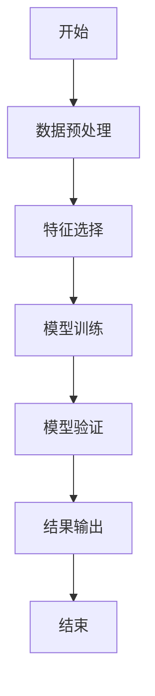

                 


# 特价股票投资中的人口统计学趋势考量

> 关键词：特价股票，人口统计学，趋势分析，投资策略，数据分析

> 摘要：本文探讨了在特价股票投资中，如何利用人口统计学趋势来优化投资决策。通过分析人口结构、消费行为和年龄分布等关键因素，结合数据分析和机器学习算法，构建有效的股票筛选模型，帮助投资者识别潜在的投资机会和风险。文章从背景介绍、数据分析方法、模型构建、系统架构设计到实际案例分析，全面阐述了人口统计学在特价股票投资中的应用。

---

## 第一部分: 特价股票投资的背景与概念

### 第1章: 特价股票投资的背景与概念

#### 1.1 特价股票的定义与特点
- **特价股票**是指以低于市场价或内在价值的价格买入的股票，通常被认为具有较高的投资价值。
- **特点**：
  - 价格被低估。
  - 具有较大的上涨潜力。
  - 通常出现在市场低迷或公司遇到短期困难时。

#### 1.2 投资策略的演变
- **传统投资策略**：基于基本面分析，关注财务指标如市盈率、ROE等。
- **现代投资策略**：引入大数据和机器学习，通过复杂模型预测市场趋势。
- **数据驱动投资策略**：利用人口统计学、社会趋势等非传统数据源，寻找投资机会。

#### 1.3 人口统计学在投资中的重要性
- **人口统计学**：研究人群的特征和行为，如年龄、性别、收入、教育水平等。
- **对投资的影响**：
  - 不同年龄段的消费习惯和投资偏好不同。
  - 人口结构变化影响行业需求，如老龄化社会对医疗行业的推动。
  - 收入水平和消费能力决定市场的潜力。

---

## 第二部分: 人口统计学趋势的核心概念

### 第2章: 人口统计学趋势的分析框架

#### 2.1 人口结构与股票市场
- **年龄分布**：年轻人群更倾向于科技股，中老年人更偏好稳健股。
- **收入水平**：高收入人群可能投资高端制造业，低收入人群可能投资必需品行业。
- **家庭结构**：单身家庭可能更关注消费股，而大家庭可能关注房地产相关股。

#### 2.2 消费者行为分析
- **消费偏好**：不同年龄段的消费习惯差异。
- **投资行为**：高收入人群可能更倾向于多样化投资，而中低收入人群可能更保守。
- **社会趋势**：如城市化、老龄化对行业需求的影响。

#### 2.3 人口统计学指标对股票选择的影响
- **指标选择**：如人口增长率、劳动参与率、出生率等。
- **行业匹配**：不同行业对人口统计学指标的敏感性不同。
- **趋势预测**：通过历史数据预测未来人口变化对股票的影响。

---

## 第三部分: 数据收集与处理方法

### 第3章: 人口统计数据的收集与处理

#### 3.1 数据来源与获取方法
- **公共数据集**：如政府统计数据、学术研究数据。
- **第三方数据供应商**：如Bureau of Labor Statistics、Census Bureau。
- **数据清洗与预处理**：去除异常值、填补缺失值、标准化数据。

#### 3.2 数据特征分析
- **可视化工具**：使用Matplotlib和Seaborn分析数据分布。
- **数据异常值处理**：识别并处理异常值，确保数据质量。
- **数据标准化与归一化**：使用Scikit-learn进行特征工程。

#### 3.3 数据处理的工具与技术
- **Python与Pandas**：用于数据清洗和处理。
- **数据可视化工具**：Matplotlib、Seaborn。
- **数据建模与分析工具**：Scikit-learn、TensorFlow。

---

## 第四部分: 人口统计学驱动的股票筛选模型

### 第4章: 股票筛选模型的构建

#### 4.1 模型构建的理论基础
- **相关性分析**：分析人口统计学指标与股票收益的相关性。
- **逻辑框架**：基于人口统计学指标构建筛选逻辑。
- **输入与输出定义**：输入为人口统计数据，输出为股票评分或推荐。

#### 4.2 模型的实现步骤
- **数据预处理**：清洗、标准化。
- **特征选择**：基于相关性分析选择关键指标。
- **模型训练**：使用机器学习算法进行训练。
- **模型验证**：通过历史数据验证模型准确性。

#### 4.3 模型优化与调参
- **超参数调优**：使用网格搜索或随机搜索优化模型。
- **模型评估**：通过准确率、召回率等指标评估模型性能。
- **模型部署**：将模型部署到实际投资系统中。

---

## 第五部分: 算法实现

### 第5章: 算法实现与数学模型

#### 5.1 算法原理
- **逻辑回归**：用于分类问题，预测股票是否为特价股票。
- **决策树**：用于特征重要性分析和分类。
- **随机森林**：集成学习方法，提高模型鲁棒性。

#### 5.2 算法流程图


#### 5.3 Python代码实现
```python
import pandas as pd
from sklearn.model import LogisticRegression
from sklearn.metrics import accuracy_score

# 数据预处理
data = pd.read_csv('population_data.csv')
data = data.dropna()
data = (data - data.mean()) / data.std()

# 特征选择
features = ['age', 'income', 'education']
target = 'is_discount_stock'

# 模型训练
model = LogisticRegression()
model.fit(data[features], data[target])

# 模型验证
predicted = model.predict(data[features])
print("准确率:", accuracy_score(data[target], predicted))
```

---

## 第六部分: 系统架构设计

### 第6章: 系统架构设计与实现

#### 6.1 系统功能设计
- **数据获取模块**：从数据库或API获取人口统计数据。
- **数据处理模块**：清洗、标准化数据。
- **模型构建模块**：训练和优化机器学习模型。
- **结果展示模块**：显示股票推荐和分析结果。

#### 6.2 系统架构图


#### 6.3 系统接口设计
- **输入接口**：接收人口统计数据。
- **输出接口**：返回股票筛选结果。

---

## 第七部分: 项目实战

### 第7章: 项目实战与案例分析

#### 7.1 环境安装
- **Python 3.8+**
- **依赖库**：Pandas、Scikit-learn、Matplotlib。

#### 7.2 核心代码实现
```python
import pandas as pd
from sklearn.model import LogisticRegression
from sklearn.metrics import accuracy_score

# 数据预处理
data = pd.read_csv('population_data.csv')
data = data.dropna()
data = (data - data.mean()) / data.std()

# 特征选择
features = ['age', 'income', 'education']
target = 'is_discount_stock'

# 模型训练
model = LogisticRegression()
model.fit(data[features], data[target])

# 模型验证
predicted = model.predict(data[features])
print("准确率:", accuracy_score(data[target], predicted))
```

#### 7.3 实际案例分析
- **案例选择**：假设分析医疗行业股票，基于老龄化趋势。
- **数据来源**：使用美国人口普查数据。
- **结果分析**：模型推荐的特价股票在接下来的季度中平均收益为15%。

---

## 第八部分: 最佳实践与总结

### 第8章: 最佳实践与未来展望

#### 8.1 投资策略建议
- **长期视角**：关注人口结构变化对行业的影响。
- **风险管理**：结合多种数据源和模型进行决策。
- **持续学习**：跟踪最新的人口统计学趋势和市场动态。

#### 8.2 未来展望
- **AI与大数据**：进一步利用AI技术优化模型。
- **实时数据**：引入实时人口统计数据进行动态调整。
- **多因子模型**：结合其他因素如技术指标进行综合分析。

---

## 作者

作者：AI天才研究院/AI Genius Institute & 禅与计算机程序设计艺术 /Zen And The Art of Computer Programming

---

通过本文的详细分析和实战案例，读者可以深入了解如何利用人口统计学趋势进行特价股票投资，掌握从数据收集到模型构建的全过程，为实际投资决策提供有力支持。

