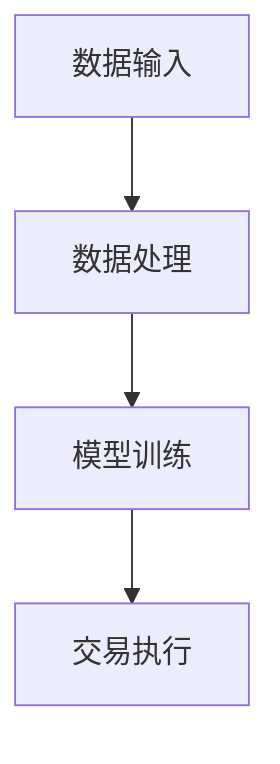

                 


# 特价股票投资中的人工智能和机器学习应用

> **关键词**: 特价股票投资, 人工智能, 机器学习, 股票分析, 数据挖掘, 交易策略

> **摘要**:  
本文深入探讨了人工智能和机器学习在特价股票投资中的应用，从数据获取与预处理、算法原理、交易策略构建到项目实战，详细分析了如何利用这些技术提升股票投资的效率和准确性。文章结合实际案例，展示了从数据到策略的完整流程，并提出了最佳实践建议。

---

# 第1章: 特价股票投资与人工智能概述

## 1.1 特价股票投资的背景与现状

### 1.1.1 特价股票的定义与特点
特价股票通常指那些价格远低于其内在价值的股票，具有较高的投资潜力。其特点包括：
- 价格低估
- 市场流动性较低
- 周期性波动明显

### 1.1.2 人工智能在金融领域的应用背景
人工智能（AI）和机器学习（ML）技术在金融领域的应用日益广泛，主要得益于：
- 数据爆炸：金融数据的海量增长
- 计算能力提升：GPU和TPU的普及
- 算法优化：深度学习和强化学习的进步

### 1.1.3 特价股票投资中的问题与挑战
投资者在特价股票投资中面临以下问题：
- 数据不完整
- 市场波动性大
- 竞争激烈

---

## 1.2 人工智能与机器学习的核心概念

### 1.2.1 人工智能的基本概念
人工智能是指计算机系统模拟人类智能的能力，包括学习、推理和自我改进。其核心是通过数据和算法实现任务自动化。

### 1.2.2 机器学习的定义与分类
机器学习是人工智能的一个分支，通过数据训练模型，使其能够做出预测或决策。分类包括：
- 监督学习
- 非监督学习
- 强化学习

### 1.2.3 深度学习与传统机器学习的区别
| **特点**       | **深度学习**                     | **传统机器学习**                 |
|-----------------|----------------------------------|-----------------------------------|
| 数据需求       | 高                              | 低                              |
| 模型复杂度     | 高                              | 低                              |
| 特征工程       | 简单                            | 复杂                            |

---

## 1.3 人工智能在股票投资中的应用前景

### 1.3.1 人工智能在股票分析中的优势
- **数据处理能力**：快速分析大量数据
- **预测能力**：通过历史数据预测未来趋势
- **自动化交易**：实时监控市场并执行交易

### 1.3.2 特价股票投资中的潜在应用场景
- **市场情绪分析**：利用自然语言处理（NLP）分析新闻和社交媒体情绪
- **价格预测**：基于时间序列模型预测股票价格
- **风险控制**：通过机器学习优化投资组合

### 1.3.3 人工智能在股票投资中的挑战与限制
- **数据质量问题**：历史数据可能不完整
- **模型过拟合**：训练数据过于拟合，导致泛化能力差
- **市场变化**：市场环境变化可能导致模型失效

---

## 1.4 本章小结
本章介绍了特价股票投资的基本概念和人工智能在金融领域的应用背景，分析了机器学习在股票投资中的优势与挑战。

---

# 第2章: 特价股票数据的获取与预处理

## 2.1 数据来源与获取方法

### 2.1.1 数据来源渠道
- **API接口**：如Yahoo Finance API
- **数据仓库**：如Kaggle
- **爬虫技术**：从网页获取实时数据

### 2.1.2 数据获取工具
- **Python库**：如Pandas、NumPy
- **数据可视化工具**：如Matplotlib、Seaborn

---

## 2.2 数据清洗与特征工程

### 2.2.1 数据清洗的常见方法
- **处理缺失值**：填充、删除或插值
- **去除异常值**：使用Z-score或IQR方法
- **标准化与归一化**：确保特征具有相似的尺度

### 2.2.2 特价股票数据的特征提取
- **技术指标**：如MACD、RSI
- **市场情绪指标**：如VIX指数
- **财务指标**：如市盈率、市净率

---

## 2.3 数据可视化与分析

### 2.3.1 数据可视化的基本方法
- **折线图**：显示股票价格趋势
- **柱状图**：显示不同时间段的交易量
- **散点图**：显示相关性分析

### 2.3.2 数据分析与特征选择
- **相关性分析**：使用Pandas的corr函数
- **主成分分析（PCA）**：降维技术

---

## 2.4 本章小结
本章详细介绍了特价股票数据的获取、清洗和预处理方法，为后续分析奠定了基础。

---

# 第3章: 常见机器学习算法原理

## 3.1 监督学习算法

### 3.1.1 线性回归
- **数学模型**：$$ y = \beta_0 + \beta_1x + \epsilon $$
- **应用场景**：预测股票价格

### 3.1.2 支持向量机（SVM）
- **原理**：在特征空间中构建超平面，划分正负样本。
- **代码示例**：
  ```python
  from sklearn.svm import SVC
  model = SVC().fit(X_train, y_train)
  ```

---

## 3.2 非监督学习算法

### 3.2.1 K-means聚类
- **流程**：
  1. 随机选择质心
  2. 计算每个点到质心的距离
  3. 重新计算质心
  4. 重复直到收敛

---

## 3.3 神经网络与深度学习

### 3.3.1 多层感知机（MLP）
- **网络结构**：输入层 → 隐藏层 → 输出层
- **激活函数**：ReLU、Sigmoid

---

## 3.4 算法选择与优化

### 3.4.1 超参数优化方法
- **网格搜索**：遍历所有可能的参数组合
- **随机搜索**：随机选择参数组合

---

## 3.5 本章小结
本章介绍了几种常用的机器学习算法及其在股票投资中的应用。

---

# 第4章: 基于机器学习的交易策略构建

## 4.1 策略设计与实现

### 4.1.1 系统功能设计
- **数据输入模块**：获取实时数据
- **模型训练模块**：训练预测模型
- **交易执行模块**：根据模型结果执行交易

### 4.1.2 系统架构设计


---

## 4.2 策略回测与优化

### 4.2.1 回测方法
- **历史数据回测**：使用过去数据验证策略
- **分段回测**：将数据分成训练集和测试集

### 4.2.2 风险管理
- **止损策略**：设定最大损失比例
- **止盈策略**：设定最大收益比例

---

## 4.3 本章小结
本章详细介绍了如何基于机器学习构建交易策略，并通过回测验证策略的有效性。

---

# 第5章: 项目实战

## 5.1 项目背景与目标

### 5.1.1 项目背景
- **目标**：利用机器学习预测特价股票价格

### 5.1.2 数据准备
- **数据来源**：假设使用Kaggle上的股票数据

---

## 5.2 系统实现

### 5.2.1 环境配置
- **安装依赖**：
  ```python
  import pandas as pd
  import numpy as np
  from sklearn.model import SVC
  ```

### 5.2.2 数据处理代码
```python
# 数据清洗
df = pd.read_csv('data.csv')
df = df.dropna()
df['date'] = pd.to_datetime(df['date'])
```

### 5.2.3 模型训练
```python
X = df[['open', 'high', 'low', 'close']]
y = df['target']
model = SVC().fit(X, y)
```

### 5.2.4 策略实现
```python
def execute_trade(signals):
    for signal in signals:
        if signal == 'buy':
            buy_stock()
        elif signal == 'sell':
            sell_stock()
```

---

## 5.3 实际案例分析

### 5.3.1 案例分析
- **数据来源**：假设使用某只特价股票的历史数据
- **模型训练**：使用随机森林模型
- **策略执行**：根据模型预测结果执行买卖操作

---

## 5.4 本章小结
本章通过实际案例展示了如何利用机器学习构建股票交易策略，并验证其有效性。

---

# 第6章: 总结与展望

## 6.1 本章总结
本文详细介绍了人工智能和机器学习在特价股票投资中的应用，从数据获取到策略实现，全面展示了技术的潜力。

## 6.2 未来展望
- **技术进步**：更复杂的模型如GPT-3在金融中的应用
- **数据多样性**：引入更多非结构化数据
- **监管与伦理**：关注数据隐私和交易透明性

---

## 6.3 最佳实践 Tips

### 6.3.1 数据处理
- 确保数据清洗和特征工程的准确性

### 6.3.2 模型选择
- 根据问题选择合适的算法

### 6.3.3 风险管理
- 设置合理的止损和止盈机制

---

## 6.4 本章小结
本文总结了人工智能在股票投资中的应用，并对未来的发展提出了展望。

---

# 作者：AI天才研究院 & 禅与计算机程序设计艺术

---

**说明**: 以上是一个详细的目录大纲和部分章节内容。根据实际需要，可以继续扩展每章节的具体内容，添加更多图表、代码示例和案例分析。

