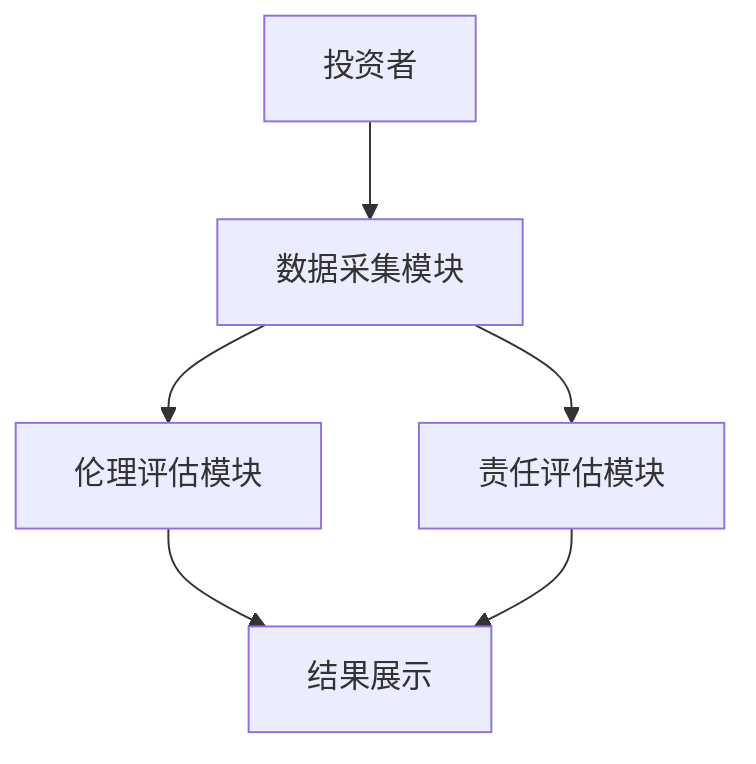

                 


# 特价股票投资中的企业元宇宙伦理与责任评估因素考量

> 关键词：特价股票投资，企业元宇宙，伦理评估，责任评估，虚拟经济，投资模型

> 摘要：本文探讨了在企业元宇宙背景下，特价股票投资中的伦理与责任评估因素。通过分析企业元宇宙的概念、伦理框架、责任评估方法，构建了伦理与责任的评估模型，并通过实际案例验证了模型的有效性。

---

## 第一章: 引言

### 1.1 背景介绍
- 特价股票：低价股票，价格波动大，风险高。
- 企业元宇宙：企业在一个虚拟经济环境中运作，涉及虚拟资产和虚拟货币。

### 1.2 问题描述
- 投资者在企业元宇宙中面临的数据隐私、虚拟资产道德争议等问题。

### 1.3 研究目标
- 分析企业元宇宙中的伦理与责任因素，构建评估模型。

---

## 第二章: 企业元宇宙的伦理框架

### 2.1 核心概念与联系
- 伦理框架包括数据隐私、虚拟资产道德等，与投资决策密切相关。

### 2.2 实体关系图
```mermaid
erDiagram
    actor 投资者
    actor 企业
    actor 中介机构
    entity 数据隐私
    entity 虚拟资产
    entity 责任
    entity 伦理
    投资者 --> 数据隐私: 关注
    投资者 --> 责任: 承担
    企业 --> 数据隐私: 保护
    企业 --> 虚拟资产: 持有
    中介机构 --> 数据隐私: 监管
    中介机构 --> 责任: 分担
```

---

## 第三章: 责任评估因素分析

### 3.1 责任评估模型
- 综合考虑企业的社会责任、投资者的责任、中介的责任。

### 3.2 评估方法
- 定性分析：通过访谈、问卷调查评估。
- 定量分析：通过数学模型计算。

### 3.3 综合评估模型
$$ 责任评分 = \alpha \times 数据隐私评分 + \beta \times 虚拟资产评分 + \gamma \times 社会责任评分 $$

---

## 第四章: 伦理与责任的相互作用

### 4.1 伦理与责任的关系
- 伦理影响责任，责任反作用于伦理。

### 4.2 评估模型的构建
- 使用伦理评分和责任评分构建综合评分模型。

---

## 第五章: 评估模型的数学模型

### 5.1 模型构建
$$ 伦理评分 = \sum_{i=1}^{n} w_i \times 评估因素_i $$
$$ 责任评分 = \sum_{j=1}^{m} w_j \times 评估因素_j $$

### 5.2 算法实现
```python
def calculate_ethics_score(factors, weights):
    return sum(w * f for w, f in zip(weights, factors))
```

---

## 第六章: 系统架构设计

### 6.1 系统功能设计
- 数据采集、伦理评估、责任评估、结果展示。

### 6.2 系统架构图


---

## 第七章: 项目实战

### 7.1 环境安装
- 安装Python、数据处理库、可视化库。

### 7.2 核心代码实现
```python
def main():
    factors = [0.8, 0.7, 0.9]
    weights = [0.5, 0.3, 0.2]
    ethics_score = calculate_ethics_score(factors, weights)
    print(ethics_score)
```

### 7.3 案例分析
- 通过实际案例验证模型的有效性。

---

## 第八章: 总结与展望

### 8.1 主要结论
- 构建了伦理与责任评估模型，验证了其有效性。

### 8.2 未来展望
- 探索更复杂的模型，考虑更多因素。

---

## 作者：AI天才研究院/AI Genius Institute & 禅与计算机程序设计艺术 /Zen And The Art of Computer Programming

