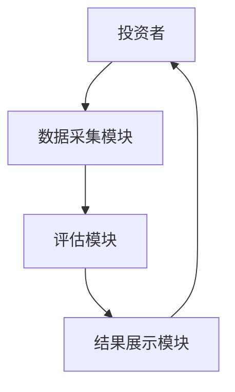
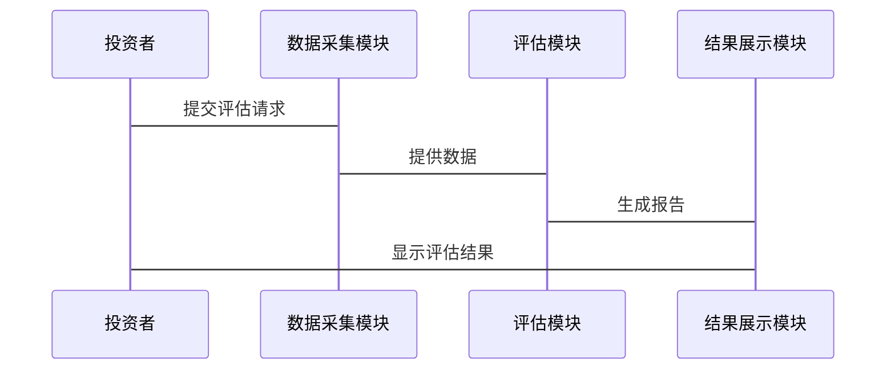

                 


# 特价股票投资中的企业数字伦理评估因素考量

> 关键词：数字伦理，股票投资，企业评估，算法透明度，数据隐私

> 摘要：本文探讨了在特价股票投资中，企业数字伦理评估的重要性及其对投资决策的影响。通过分析数字伦理的核心概念、评估框架、算法原理和系统架构，本文旨在为投资者提供一个全面的视角，帮助其在投资决策中考虑企业的数字伦理因素。文章还结合实际案例，详细讲解了如何通过系统化的方法进行数字伦理评估，并提出了相应的最佳实践建议。

---

## 第一部分: 特价股票投资中的企业数字伦理评估背景介绍

### 第1章: 数字伦理与股票投资概述

#### 1.1 数字伦理的基本概念
- **1.1.1 数字伦理的定义**  
  数字伦理是指在数字技术应用中，个体和组织在数据收集、处理、存储和使用过程中应遵循的道德规范。它关注隐私、透明度、公正性和责任等方面。

- **1.1.2 数字化对企业的影响**  
  数字化转型使得企业能够更高效地运营，但也带来了新的伦理挑战，如数据滥用、算法偏见和隐私泄露等问题。

- **1.1.3 股票投资中的数字伦理问题**  
  在股票投资中，投资者需要关注企业的数据隐私政策、算法透明度以及社会责任等方面，以确保投资行为符合伦理标准。

#### 1.2 特价股票投资的特点
- **1.2.1 特价股票的定义**  
  特价股票通常指价格低于市场平均水平的股票，具有较高的投资潜力，但也伴随着较高的风险。

- **1.2.2 投资者的行为模式**  
  投资者在追求高回报的同时，也需要关注企业的长期可持续性，这包括企业的数字伦理表现。

- **1.2.3 市场中的伦理挑战**  
  在股票市场中，一些企业可能通过不透明的算法或数据滥用来操纵股价，这不仅损害了投资者的利益，也违背了数字伦理的基本原则。

### 第2章: 企业数字伦理评估的必要性

#### 2.1 企业数字伦理的核心要素
- **2.1.1 数据隐私与安全**  
  企业的数据隐私政策直接关系到投资者的信任度。如果企业存在数据泄露或滥用行为，将严重损害其声誉。

- **2.1.2 算法透明度**  
  算法的透明度决定了企业行为的公正性。不透明的算法可能导致市场操纵或其他不公平行为。

- **2.1.3 企业社会责任**  
  企业的社会责任履行情况是投资者评估其伦理表现的重要指标。负责任的企业通常更具可持续性。

#### 2.2 投资者视角下的伦理考量
- **2.2.1 投资决策中的伦理因素**  
  投资者在选择股票时，需要综合考虑企业的财务表现、市场地位和数字伦理表现。

- **2.2.2 企业行为对股价的影响**  
  企业的伦理行为直接影响投资者信心和股价波动。例如，数据泄露事件可能导致股价大幅下跌。

- **2.2.3 伦理风险的量化评估**  
  通过量化模型，投资者可以评估不同企业在数字伦理方面的风险，并据此调整投资策略。

### 第3章: 数字伦理评估框架的构建

#### 3.1 评估框架的设计原则
- **3.1.1 全面性**  
  评估框架应涵盖数据隐私、算法透明度和社会责任等多个维度。

- **3.1.2 可操作性**  
  框架应具有清晰的操作步骤，便于投资者和企业实施。

- **3.1.3 动态性**  
  随着技术的发展和法规的变化，评估框架需要不断更新和调整。

#### 3.2 评估指标体系
- **3.2.1 数据隐私指标**  
  包括数据加密、访问控制和隐私政策透明度等。

- **3.2.2 算法公平性指标**  
  包括算法的可解释性、无偏见性和公正性。

- **3.2.3 社会责任指标**  
  包括环境保护、员工福利和社会贡献等。

#### 3.3 框架的对比分析
- **3.3.1 不同评估框架的对比**  
  比较现有数字伦理评估框架的优缺点，选择最适合投资决策的框架。

- **3.3.2 框架的优缺点分析**  
  例如，某些框架可能过于复杂，而另一些可能缺乏足够的细节。

---

## 第二部分: 企业数字伦理评估的核心概念与联系

### 第4章: 核心概念与原理

#### 4.1 数据隐私与安全
- **4.1.1 数据隐私的定义**  
  数据隐私是指个人或组织对其数据的控制权和使用权。在股票投资中，企业的数据隐私政策直接影响投资者的信任度。

- **4.1.2 数据安全的技术保障**  
  企业需要采用加密技术、防火墙和入侵检测系统等措施，确保数据的安全性。

- **4.1.3 数据泄露的伦理影响**  
  数据泄露可能导致投资者的损失，甚至引发法律诉讼，严重损害企业的声誉。

#### 4.2 算法透明度
- **4.2.1 算法可解释性的定义**  
  算法透明度要求企业能够清晰地解释其算法的运作方式，确保其公正性和合理性。

- **4.2.2 算法偏见的伦理问题**  
  如果算法存在偏见，可能导致不公平的市场行为，损害投资者的利益。

- **4.2.3 透明算法的优势**  
  透明的算法能够增强投资者的信任，减少市场操纵的风险。

#### 4.3 企业社会责任
- **4.3.1 社会责任的定义**  
  企业社会责任是指企业在追求利润的同时，应承担起对社会、环境和员工的责任。

- **4.3.2 企业行为的社会影响**  
  负责任的企业通常更具可持续性，能够吸引更多的投资者。

- **4.3.3 责任履行的评估标准**  
  通过对企业社会责任的评估，投资者可以更好地判断企业的长期发展潜力。

### 第5章: 核心概念的对比分析

#### 5.1 数据隐私与算法透明度的对比
| **维度**       | **数据隐私**                        | **算法透明度**                      |
|-----------------|------------------------------------|------------------------------------|
| 关注点         | 数据的收集、存储和使用              | 算法的设计、运作和结果              |
| 主要挑战       | 数据泄露、滥用                      | 算法偏见、不透明性                  |
| 解决方案       | 加密技术、隐私保护政策              | 可解释性算法、透明度报告            |

#### 5.2 数据隐私与社会责任的对比
| **维度**       | **数据隐私**                        | **社会责任**                        |
|-----------------|------------------------------------|------------------------------------|
| 关注点         | 个人数据的保护                      | 社会、环境和员工的责任              |
| 主要挑战       | 数据滥用、隐私泄露                  | 社会不公、环境破坏                  |
| 解决方案       | 数据加密、隐私政策                  | 可持续发展、员工福利政策            |

#### 5.3 算法透明度与社会责任的对比
| **维度**       | **算法透明度**                      | **社会责任**                        |
|-----------------|------------------------------------|------------------------------------|
| 关注点         | 算法的公正性、可解释性              | 社会、环境和员工的责任              |
| 主要挑战       | 算法偏见、市场操纵                  | 社会不公、环境破坏                  |
| 解决方案       | 透明算法、可解释性报告              | 可持续发展、员工福利政策            |

---

### 第6章: 企业数字伦理评估的系统架构

#### 6.1 系统功能设计
- **6.1.1 数据采集模块**  
  从企业公开数据和第三方平台获取企业的数字伦理相关数据。

- **6.1.2 评估模块**  
  使用预设的评估指标体系对企业的数字伦理表现进行评分。

- **6.1.3 结果展示模块**  
  将评估结果以可视化形式展示，帮助投资者做出决策。

#### 6.2 系统架构设计


#### 6.3 系统接口设计
- **输入接口**  
  从企业公开数据和第三方平台获取数据。

- **输出接口**  
  生成企业的数字伦理评估报告，供投资者参考。

#### 6.4 系统交互流程


---

### 第7章: 项目实战

#### 7.1 环境安装
- **Python安装**  
  使用 `pip install python` 安装Python。

- **依赖库安装**  
  使用 `pip install pandas numpy scikit-learn` 安装所需库。

#### 7.2 核心代码实现
```python
import pandas as pd
from sklearn.metrics import accuracy_score

def preprocess_data(data):
    # 数据预处理
    data = data.dropna()
    return data

def train_model(X, y):
    # 训练模型
    from sklearn.linear_model import LogisticRegression
    model = LogisticRegression()
    model.fit(X, y)
    return model

def evaluate_model(model, X_test, y_test):
    # 模型评估
    y_pred = model.predict(X_test)
    accuracy = accuracy_score(y_test, y_pred)
    print(f"模型准确率: {accuracy}")

# 示例数据
data = pd.DataFrame({
    'feature1': [1, 2, 3],
    'feature2': [4, 5, 6],
    'label': [0, 1, 0]
})

X = data[['feature1', 'feature2']]
y = data['label']

X_train, X_test = X[:2], X[2:]
y_train, y_test = y[:2], y[2:]

model = train_model(X_train, y_train)
evaluate_model(model, X_test, y_test)
```

#### 7.3 实际案例分析
- **案例背景**  
  某科技公司因数据泄露事件导致股价大幅下跌，投资者需要评估其数字伦理表现。

- **评估过程**  
  使用上述模型对公司的数据隐私、算法透明度和社会责任进行评估。

- **结果分析**  
  公司在数据隐私方面得分较低，建议投资者谨慎决策。

---

### 第8章: 最佳实践与注意事项

#### 8.1 最佳实践
- **数据隐私保护**  
  投资者应选择具有严格数据隐私政策的企业。

- **算法透明度**  
  优先选择算法透明的企业，避免不透明的市场操纵行为。

- **社会责任履行**  
  投资具有社会责任感的企业，支持可持续发展。

#### 8.2 小结
企业数字伦理评估是股票投资中不可或缺的一部分。通过科学的评估框架和系统的实施方法，投资者可以更好地识别和规避风险，实现长期收益。

#### 8.3 注意事项
- **动态调整评估框架**  
  随着技术的发展和法规的变化，评估框架需要不断更新。

- **结合多维度信息**  
  投资者应综合考虑企业的财务表现、市场地位和数字伦理表现。

- **关注行业趋势**  
  不同行业可能面临不同的数字伦理挑战，投资者需针对性地进行评估。

#### 8.4 拓展阅读
- 建议阅读《数据隐私与安全》、《算法伦理》等相关书籍，深入了解数字伦理的理论和实践。

---

## 作者：AI天才研究院/AI Genius Institute & 禅与计算机程序设计艺术 /Zen And The Art of Computer Programming

