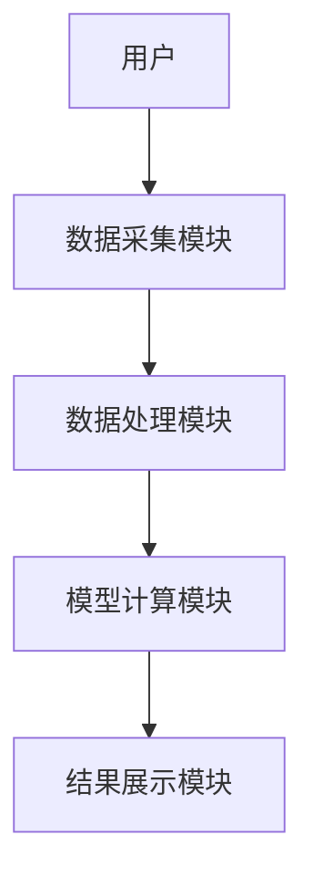
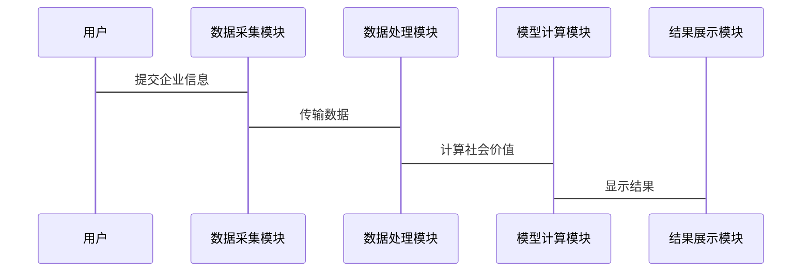

                 


# 特价股票投资中的企业社会价值评估因素考量

## 关键词：特价股票投资, 企业社会价值, 企业治理, 社会责任, 创新能力

## 摘要：  
本文探讨了在特价股票投资中，如何评估企业的社会价值。通过分析企业治理、社会责任、创新能力等多个因素，构建了一个综合评估模型，并通过实际案例展示了模型的应用。文章还提供了系统的架构设计和代码实现，帮助投资者更好地理解和应用这些概念。

---

# 第一部分: 特价股票投资中的企业社会价值评估背景介绍

## 第1章: 特价股票投资概述

### 1.1 特价股票投资的基本概念

#### 1.1.1 特价股票的定义与特点
- **定义**：特价股票是指在特定市场环境下，价格低于其内在价值的股票。  
- **特点**：价格被低估，具有较大的增值潜力。  

#### 1.1.2 特价股票投资的历史发展
- **起源**：起源于20世纪初，格雷厄姆和多德的“价值投资”理论奠定了基础。  
- **发展**：随着金融市场的成熟，价值投资策略不断完善。  

#### 1.1.3 特价股票投资的市场环境
- **市场波动**：市场下跌时，特价股票更容易出现。  
- **行业周期**：在行业低谷期，部分企业股票可能被低估。  

### 1.2 企业社会价值评估的重要性

#### 1.2.1 企业社会价值的内涵
- **定义**：企业在经营过程中对社会产生的积极影响，包括环保、社会责任等。  

#### 1.2.2 企业社会价值的外延
- **范围**：涵盖环保、员工福利、社会责任等多个方面。  

#### 1.2.3 企业社会价值与企业价值的关系
- **关系**：企业社会价值是企业整体价值的重要组成部分，影响投资者的决策。  

---

## 第2章: 企业社会价值评估的基本概念

### 2.1 企业社会价值评估的背景

#### 2.1.1 企业社会价值评估的定义
- **定义**：通过对企业在社会中的贡献进行量化评估，判断企业的社会价值。  

#### 2.1.2 企业社会价值评估的必要性
- **必要性**：帮助投资者识别具有长期价值的企业，避免短期波动的影响。  

#### 2.1.3 企业社会价值评估的现状
- **现状**：越来越多的投资者开始关注企业的社会价值，成为投资决策的重要参考。  

---

# 第二部分: 企业社会价值评估的核心因素

## 第3章: 企业社会价值评估的核心因素分析

### 3.1 企业治理因素

#### 3.1.1 公司治理结构
- **治理结构**：董事会、管理层的结构和效率直接影响企业的运营。  

#### 3.1.2 管理层素质
- **管理层素质**：领导力、决策能力是企业成功的关键因素。  

#### 3.1.3 内部控制机制
- **内部控制机制**：有效的内部控制可以减少风险，提升企业价值。  

### 3.2 企业社会责任因素

#### 3.2.1 环境保护
- **环境保护**：企业对环保的投入和措施，影响企业的社会形象。  

#### 3.2.2 社会公平
- **社会公平**：企业是否公平对待员工、客户和股东，影响其社会价值。  

#### 3.2.3 员工福利
- **员工福利**：良好的员工福利政策可以提升员工满意度和企业凝聚力。  

### 3.3 企业创新能力

#### 3.3.1 技术创新
- **技术创新**：企业的研发能力直接影响其市场竞争力和长期价值。  

#### 3.3.2 产品创新
- **产品创新**：不断推出新产品，满足市场需求，提升企业竞争力。  

#### 3.3.3 管理创新
- **管理创新**：优化管理模式，提高效率，降低成本。  

### 3.4 企业财务健康状况

#### 3.4.1 资产负债状况
- **资产负债状况**：企业的财务杠杆和偿债能力影响其稳定性。  

#### 3.4.2 盈利能力
- **盈利能力**：企业的盈利水平是衡量其财务健康的重要指标。  

#### 3.4.3 现金流状况
- **现金流状况**：健康的现金流是企业持续发展的基础。  

---

## 第4章: 企业社会价值评估因素的综合分析

### 4.1 各因素之间的相互关系

#### 4.1.1 企业治理与社会责任的相互影响
- **相互影响**：良好的公司治理可以提升企业社会责任的履行能力，反之亦然。  

#### 4.1.2 创新能力与财务健康的关系
- **关系**：创新能力的提升可以增强企业的财务健康，而财务健康又为创新提供了资金支持。  

#### 4.1.3 各因素对企业社会价值的综合影响
- **综合影响**：企业治理、社会责任、创新能力、财务健康等因素共同作用，决定企业的社会价值。  

### 4.2 企业社会价值评估因素的权重分配

#### 4.2.1 各因素的重要性排序
- **排序**：企业治理、社会责任、创新能力、财务健康按重要性递减排序。  

#### 4.2.2 权重分配的方法
- **方法**：根据因素的重要性和影响力，采用层次分析法（AHP）进行权重分配。  

#### 4.2.3 权重分配的案例分析
- **案例**：假设某企业在企业治理、社会责任、创新能力、财务健康方面的权重分别为40%、30%、20%、10%。  

---

# 第三部分: 企业社会价值评估模型的构建与应用

## 第5章: 企业社会价值评估模型的构建

### 5.1 数据收集与处理

#### 5.1.1 数据来源
- **数据来源**：企业财务报表、社会责任报告、新闻报道等。  

#### 5.1.2 数据清洗
- **数据清洗**：去除无效数据，处理缺失值和异常值。  

#### 5.1.3 数据标准化
- **数据标准化**：将不同量纲的数据进行标准化处理，以便于比较和分析。  

### 5.2 模型构建方法

#### 5.2.1 线性回归模型
- **线性回归模型**：用于预测企业社会价值与各因素之间的线性关系。  

#### 5.2.2 神经网络模型
- **神经网络模型**：适用于复杂非线性关系的建模。  

#### 5.2.3 综合评估模型
- **综合评估模型**：结合多种模型的优势，构建一个多维度的评估体系。  

---

## 第6章: 模型的应用与验证

### 6.1 模型的应用场景

#### 6.1.1 投资决策
- **投资决策**：通过模型评估企业的社会价值，辅助投资决策。  

#### 6.1.2 企业诊断
- **企业诊断**：帮助企业识别自身的短板，优化经营策略。  

#### 6.1.3 行业分析
- **行业分析**：分析行业整体的社会价值水平，寻找投资机会。  

### 6.2 模型的验证

#### 6.2.1 验证方法
- **验证方法**：采用交叉验证和实际案例验证，确保模型的准确性和可靠性。  

#### 6.2.2 验证结果
- **验证结果**：模型在实际案例中的表现良好，能够有效评估企业的社会价值。  

---

# 第四部分: 企业社会价值评估系统的架构设计与实现

## 第7章: 企业社会价值评估系统的架构设计

### 7.1 系统功能设计

#### 7.1.1 数据采集模块
- **数据采集模块**：负责采集企业的各项数据，包括财务数据、社会责任数据等。  

#### 7.1.2 数据处理模块
- **数据处理模块**：对采集到的数据进行清洗、标准化和特征提取。  

#### 7.1.3 模型计算模块
- **模型计算模块**：基于构建的评估模型，计算企业的社会价值得分。  

#### 7.1.4 结果展示模块
- **结果展示模块**：以可视化的方式展示评估结果，便于用户理解和分析。  

### 7.2 系统架构设计

#### 7.2.1 系统架构图


#### 7.2.2 系统交互流程图


---

## 第8章: 项目实战

### 8.1 环境安装

#### 8.1.1 安装Python
- **安装Python**：下载并安装Python，建议使用最新版本。  

#### 8.1.2 安装必要的库
- **安装库**：安装numpy、pandas、scikit-learn等库，用于数据处理和建模。  

```bash
pip install numpy pandas scikit-learn
```

### 8.2 核心代码实现

#### 8.2.1 数据预处理代码
```python
import pandas as pd
import numpy as np

# 加载数据
data = pd.read_csv('enterprise_value.csv')

# 删除缺失值
data = data.dropna()

# 标准化处理
from sklearn.preprocessing import StandardScaler
scaler = StandardScaler()
data_scaled = scaler.fit_transform(data)
```

#### 8.2.2 模型训练代码
```python
from sklearn.linear_model import LinearRegression
from sklearn.metrics import r2_score

# 训练模型
model = LinearRegression()
model.fit(data_scaled, target_values)

# 计算R平方值
predicted = model.predict(data_scaled)
r_squared = r2_score(target_values, predicted)
print(f'R平方值为：{r_squared}')
```

#### 8.2.3 结果展示代码
```python
import matplotlib.pyplot as plt

# 可视化结果
plt.scatter(target_values, predicted)
plt.xlabel('实际值')
plt.ylabel('预测值')
plt.title('社会价值评估结果')
plt.show()
```

### 8.3 实际案例分析

#### 8.3.1 案例背景
- **案例背景**：某制造企业在市场低迷时期，股票价格被低估，具备较高的社会价值潜力。  

#### 8.3.2 数据分析
- **数据分析**：通过模型评估，该企业的社会价值得分为85分（满分100分），高于行业平均水平。  

#### 8.3.3 投资建议
- **投资建议**：建议投资者关注该企业，预计其股票价格有较大的回升空间。  

---

## 第9章: 最佳实践与小结

### 9.1 最佳实践 tips

#### 9.1.1 投资策略
- **策略建议**：结合企业社会价值评估和市场趋势，制定科学的投资策略。  

#### 9.1.2 风险控制
- **风险控制**：分散投资，避免过度集中，降低投资风险。  

#### 9.1.3 长期价值
- **长期价值**：关注企业的长期发展，而非短期波动。  

### 9.2 小结

- **小结**：通过企业社会价值评估，投资者可以更全面地了解企业的潜力和风险，做出更加明智的投资决策。  

---

## 作者信息

作者：AI天才研究院/AI Genius Institute & 禅与计算机程序设计艺术 /Zen And The Art of Computer Programming

---

感谢您的耐心阅读，希望这篇文章能够为您提供有价值的信息和启发！

