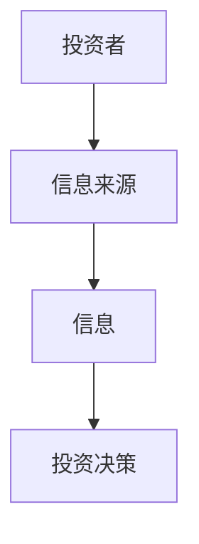
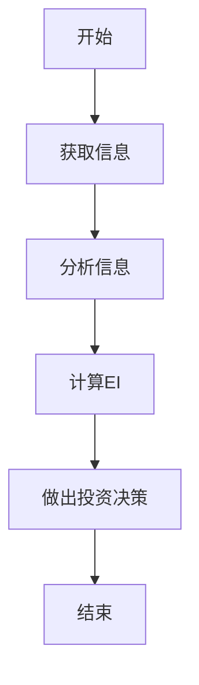
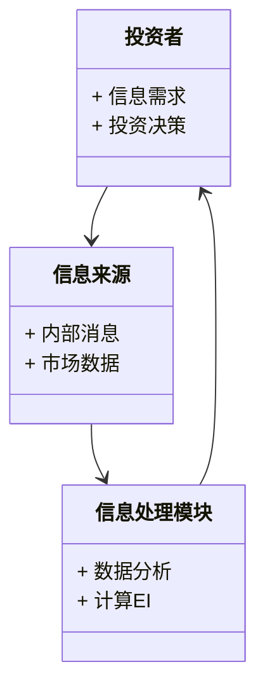
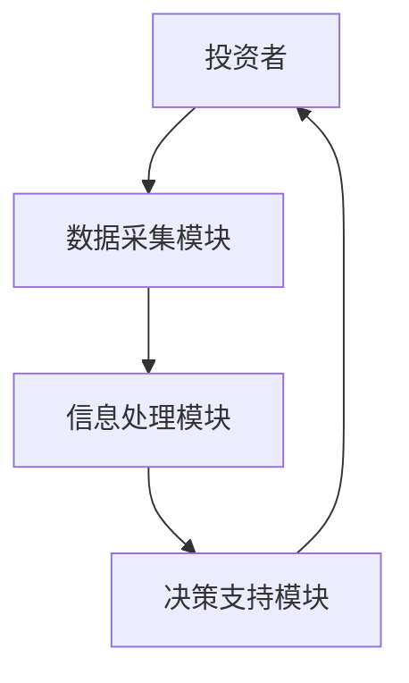

                 


# 特价股票投资中的信息优势如何获取

> 关键词：特价股票，信息优势，投资策略，信息获取，市场分析

> 摘要：本文详细探讨了在特价股票投资中如何获取信息优势，分析了信息优势的来源、获取方法、数学模型以及系统设计，提供了实战案例和最佳实践建议。

---

## 第1章: 特价股票投资的背景与概念

### 1.1 特价股票的定义与特点

#### 1.1.1 特价股票的定义
特价股票是指价格低于面值的股票，通常出现在市场波动或公司财务状况不佳的情况下。

#### 1.1.2 特价股票的特点
- 价格低廉
- 高风险高回报
- 可能隐藏投资机会

#### 1.1.3 特价股票的投资价值
- 低价吸引投资者
- 可能存在市场低估

### 1.2 信息优势的定义与来源

#### 1.2.1 信息优势的定义
信息优势指投资者比其他人更早或更准确地获取信息，从而做出更优决策。

#### 1.2.2 信息优势的来源
- 内部消息
- 市场动态
- 财务数据

#### 1.2.3 信息优势在投资中的作用
- 提高决策准确性
- 把握投资机会

---

## 第2章: 特价股票投资中的信息优势分析

### 2.1 信息优势的原理与特征

#### 2.1.1 信息优势的原理
信息优势通过及时获取和分析信息，帮助投资者预测市场变化。

#### 2.1.2 信息优势的特征对比
| 特征 | 描述 |
|------|------|
| 及时性 | 信息获取速度快 |
| 准确性 | 信息准确可靠 |

#### 2.1.3 信息优势的ER实体关系图


---

## 第3章: 特价股票投资中的信息优势算法

### 3.1 信息优势的量化模型

#### 3.1.1 信息优势的数学模型
信息优势指数公式：
$$
EI = \frac{P_{\text{预期}} - P_{\text{市场}}}{P_{\text{市场}}}
$$

#### 3.1.2 信息优势的计算公式
- 预期价格：根据内部信息预测的价格
- 市场价格：当前市场价格

### 3.2 信息优势的算法实现

#### 3.2.1 算法流程图


#### 3.2.2 核心代码
```python
def calculate_ei(expected_price, market_price):
    return (expected_price - market_price) / market_price
```

---

## 第4章: 特价股票投资中的信息优势系统设计

### 4.1 系统功能设计

#### 4.1.1 功能模块划分
- 数据采集
- 信息处理
- 决策支持

#### 4.1.2 领域模型设计


### 4.2 系统实现方案

#### 4.2.1 系统架构图


---

## 第5章: 特价股票投资中的信息优势项目实战

### 5.1 项目背景与目标

#### 5.1.1 项目背景
某公司股价大跌，出现特价股票机会。

#### 5.1.2 项目目标
利用信息优势找到投资机会。

### 5.2 项目实施与分析

#### 5.2.1 实施过程
1. 获取公司内部消息。
2. 分析市场数据。
3. 计算信息优势指数。
4. 做出投资决策。

#### 5.2.2 案例分析
假设某公司预期价格为20元，市场价格为15元，计算EI为33.33%。

---

## 第6章: 特价股票投资中的信息优势最佳实践

### 6.1 投资策略与技巧

#### 6.1.1 策略
- 及时获取信息
- 综合分析信息

#### 6.1.2 注意事项
- 遵守法律法规
- 控制风险

### 6.2 总结与展望

#### 6.2.1 本章小结
信息优势是投资成功的关键。

#### 6.2.2 未来方向
探索更高效的信息获取方法。

---

## 作者

作者：AI天才研究院 & 禅与计算机程序设计艺术

---

以上是基于用户需求，结合技术博客的特点，逐步分析并撰写的文章结构。如果需要进一步扩展具体内容，可以参考每章节的详细展开。

