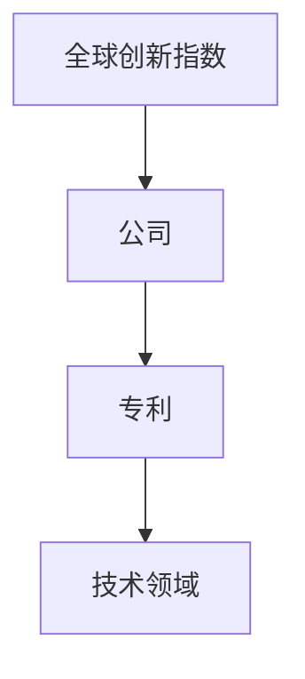
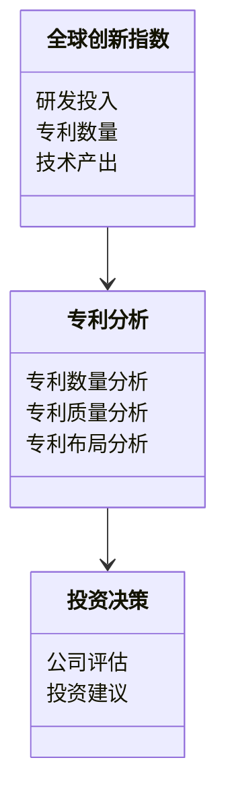
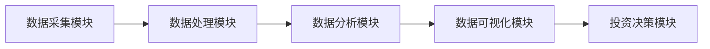
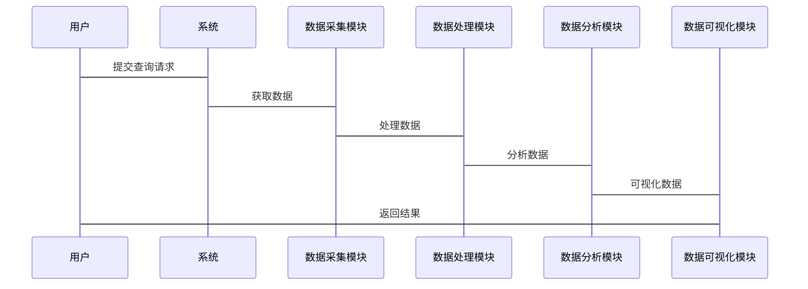

                 


# 特价股票投资中的全球创新指数与专利分析方法

> 关键词：特价股票投资、全球创新指数、专利分析、投资策略、数据分析

> 摘要：本文探讨了如何利用全球创新指数和专利分析方法来进行特价股票投资。通过分析全球创新指数的核心概念、专利分析的主要方法，结合数学模型和算法，构建一个基于全球创新指数的专利分析系统，从而为投资者提供科学的投资决策支持。

---

## 第1章: 特价股票投资的背景与全球创新指数概述

### 1.1 特价股票投资的背景

#### 1.1.1 特价股票的定义与特点
特价股票是指在市场中价格低于其内在价值的股票。其特点是价格低廉、潜力大，但风险较高。投资者通过分析公司的基本面和技术面，寻找被市场低估的股票进行投资。

#### 1.1.2 特价股票投资的市场环境
特价股票投资的市场环境包括经济周期、行业趋势、政策变化等。投资者需要结合宏观经济环境和行业动态，选择具有竞争优势的公司。

#### 1.1.3 特价股票投资的核心问题与目标
特价股票投资的核心问题是如何准确评估公司的内在价值，识别被市场低估的投资机会。目标是通过科学的分析方法，降低投资风险，提高投资回报率。

### 1.2 全球创新指数的定义与特点

#### 1.2.1 全球创新指数的定义
全球创新指数是衡量一个国家或地区创新能力的综合指标，包括研发支出、专利数量、技术产出等多个维度。

#### 1.2.2 全球创新指数的核心指标
- 研发投入强度
- 专利申请量
- 高等教育水平
- 科技产出

#### 1.2.3 全球创新指数的计算方法
全球创新指数通常采用加权平均的方法，根据不同指标的权重进行计算。

### 1.3 专利分析方法的背景与意义

#### 1.3.1 专利分析的基本概念
专利分析是指通过分析专利数据，评估公司的技术创新能力、市场竞争力和未来发展趋势。

#### 1.3.2 专利分析在投资中的作用
专利分析可以帮助投资者评估公司的技术储备、竞争优势和未来增长潜力。

#### 1.3.3 专利分析的主要方法
- 专利数量分析
- 专利质量分析
- 专利布局分析

### 1.4 本章小结
本章介绍了特价股票投资的背景、全球创新指数的定义与特点，以及专利分析方法的背景与意义。这些内容为后续分析奠定了基础。

---

## 第2章: 全球创新指数的核心概念与原理

### 2.1 全球创新指数的核心概念

#### 2.1.1 创新能力的定义与测量
创新能力是指公司或国家在技术创新、产品开发和市场拓展方面的能力。创新能力的测量通常包括专利数量、研发投入、技术产出等指标。

#### 2.1.2 全球创新指数的构成要素
- 研发投入
- 专利数量
- 技术产出
- 市场竞争力

#### 2.1.3 全球创新指数的评价标准
全球创新指数的评价标准包括指标的全面性、数据的可比性和结果的客观性。

### 2.2 全球创新指数的计算模型

#### 2.2.1 数据收集与处理方法
数据收集包括专利数据库查询、公司财报数据整理等。数据处理包括清洗、标准化和归一化。

#### 2.2.2 指数计算的数学模型
全球创新指数的计算模型通常采用加权线性回归模型：
$$ I = \sum_{i=1}^{n} w_i x_i $$
其中，$I$为创新指数，$w_i$为权重，$x_i$为指标值。

#### 2.2.3 指数权重的确定方法
权重通常根据指标的重要性和数据分布进行调整。

### 2.3 专利分析方法的核心原理

#### 2.3.1 专利数量与创新能力的关系
专利数量越多，通常表明公司的创新能力越强。

#### 2.3.2 专利质量的评估方法
专利质量可以通过技术领域分布、引用次数、法律状态等指标进行评估。

#### 2.3.3 专利布局与市场竞争的关系
专利布局反映了公司在市场中的竞争策略和技术创新方向。

### 2.4 全球创新指数与专利分析的联系

#### 2.4.1 全球创新指数中的专利权重
专利数量通常在全球创新指数中占较大比重。

#### 2.4.2 专利分析对全球创新指数的影响
专利分析可以为全球创新指数的计算提供更精准的数据支持。

#### 2.4.3 全球创新指数与专利分析的结合应用
通过结合全球创新指数和专利分析，投资者可以更全面地评估公司的创新能力。

### 2.5 本章小结
本章详细介绍了全球创新指数的核心概念与原理，以及专利分析方法的主要内容和应用。

---

## 第3章: 全球创新指数与专利分析的数学模型与算法

### 3.1 全球创新指数的数学模型

#### 3.1.1 指数计算的线性回归模型
线性回归模型用于评估各指标对创新指数的影响程度：
$$ y = \beta_0 + \beta_1 x_1 + \beta_2 x_2 + \ldots + \beta_n x_n $$

#### 3.1.2 指数权重的调整方法
根据指标的重要性和数据分布，采用主成分分析法调整权重。

### 3.2 专利分析的算法实现

#### 3.2.1 专利数量分析的实现步骤
1. 数据收集：从专利数据库获取专利数据。
2. 数据清洗：去除重复数据和无效专利。
3. 数据统计：计算专利数量和分布情况。

#### 3.2.2 专利质量分析的实现步骤
1. 数据清洗：整理专利数据。
2. 技术领域分布分析：统计各技术领域的专利数量。
3. 引用次数分析：计算专利的引用次数。

#### 3.2.3 专利布局分析的实现步骤
1. 市场竞争分析：识别主要竞争对手的专利布局。
2. 技术趋势分析：预测未来的技术发展方向。

### 3.3 全球创新指数与专利分析的对比

#### 3.3.1 比较全球创新指数和专利分析的特征
| 特征 | 全球创新指数 | 专利分析 |
|------|--------------|-----------|
| 数据来源 | 多指标数据 | 专利数据 |
| 分析目标 | 综合创新能力 | 技术创新能力 |
| 应用场景 | 投资决策 | 技术评估 |

#### 3.3.2 用Mermaid画出实体关系图



### 3.4 本章小结
本章通过数学模型和算法，详细介绍了全球创新指数与专利分析的实现方法，并通过对比分析明确了两者的特点和联系。

---

## 第4章: 系统分析与架构设计方案

### 4.1 问题场景介绍

#### 4.1.1 特价股票投资中的创新指数分析
投资者需要通过全球创新指数和专利分析，评估公司的创新能力，寻找被低估的股票。

### 4.2 项目介绍

#### 4.2.1 项目目标
构建一个基于全球创新指数的专利分析系统，为投资者提供科学的投资决策支持。

### 4.3 系统功能设计

#### 4.3.1 领域模型设计


### 4.4 系统架构设计

#### 4.4.1 系统架构图



### 4.5 系统接口设计

#### 4.5.1 API接口
- 数据接口：提供全球创新指数和专利数据的接口。
- 分析接口：提供创新指数计算和专利分析的API。

### 4.6 系统交互设计

#### 4.6.1 交互流程图



### 4.7 本章小结
本章通过系统分析与架构设计，明确了基于全球创新指数的专利分析系统的实现方案。

---

## 第5章: 项目实战与案例分析

### 5.1 环境安装

#### 5.1.1 安装Python环境
使用Anaconda安装Python 3.8及以上版本。

#### 5.1.2 安装依赖库
安装pandas、numpy、scikit-learn等数据分析库。

### 5.2 系统核心实现

#### 5.2.1 核心代码实现
```python
import pandas as pd
import numpy as np
from sklearn.linear_model import LinearRegression

# 数据加载
data = pd.read_csv('global_innovation_index.csv')

# 数据预处理
X = data[['R&D', 'Patents', 'Technology_Output']]
y = data['Innovation_Index']

# 模型训练
model = LinearRegression()
model.fit(X, y)

# 模型预测
predicted = model.predict(X)
print(predicted)
```

#### 5.2.2 代码应用解读
上述代码实现了全球创新指数的线性回归模型，用于预测公司的创新指数。

### 5.3 实际案例分析

#### 5.3.1 案例背景
以某科技公司为例，分析其专利数量、研发投入和技术创新能力。

#### 5.3.2 数据分析与解读
通过专利数量分析、研发投入分析和技术创新能力分析，评估公司的创新能力。

### 5.4 本章小结
本章通过项目实战和案例分析，展示了如何利用全球创新指数和专利分析方法进行投资决策。

---

## 第6章: 总结与最佳实践

### 6.1 小结

#### 6.1.1 核心内容总结
本文介绍了全球创新指数和专利分析方法在特价股票投资中的应用，构建了一个基于全球创新指数的专利分析系统。

### 6.2 最佳实践

#### 6.2.1 投资策略建议
投资者应结合全球创新指数和专利分析，选择具有强大创新能力的公司进行投资。

#### 6.2.2 数据分析注意事项
注意数据的准确性和完整性，避免因数据问题导致分析偏差。

### 6.3 注意事项

#### 6.3.1 风险提示
专利分析和全球创新指数仅作为参考，投资需谨慎。

### 6.4 拓展阅读

#### 6.4.1 推荐书籍
- 《全球创新指数报告》
- 《专利分析方法论》

### 6.5 本章小结
本章总结了全文内容，并提出了投资策略建议和注意事项。

---

## 作者信息

作者：AI天才研究院/AI Genius Institute & 禅与计算机程序设计艺术 /Zen And The Art of Computer Programming

---

本文通过系统分析和实践案例，展示了如何利用全球创新指数和专利分析方法进行特价股票投资。通过科学的分析方法和系统的架构设计，投资者可以更准确地评估公司的创新能力，降低投资风险，提高投资回报率。

