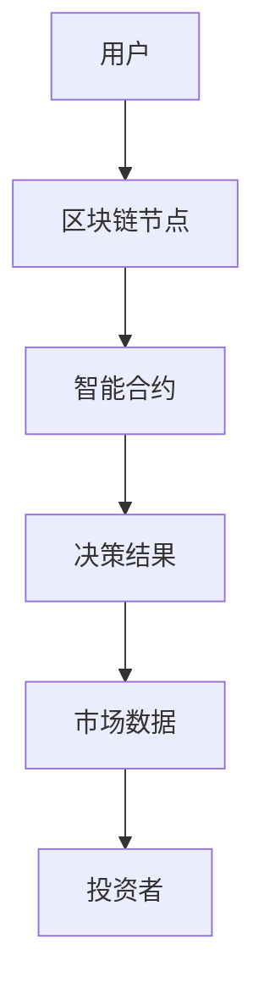
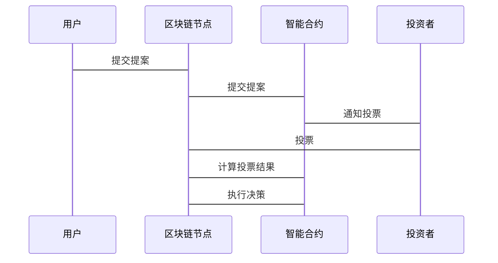

                 


# 特价股票投资中的分布式自治组织(DAO)决策方法

**关键词：分布式自治组织（DAO）、特价股票、投资决策、区块链、共识算法**

**摘要：**  
本文探讨了分布式自治组织（DAO）在特价股票投资中的决策方法，分析了DAO的治理结构、决策算法及其在投资决策中的应用。通过结合区块链技术和分布式决策算法，本文提出了基于DAO的特价股票投资决策模型，并通过实际案例分析验证了其可行性和优势。

---

# 第一部分: 分布式自治组织（DAO）与特价股票投资的背景

## 第1章: 分布式自治组织（DAO）概述

### 1.1 DAO的定义与核心特征
分布式自治组织（Decentralized Autonomous Organization，DAO）是一种基于区块链技术的去中心化组织形式。它通过智能合约自动执行组织的规则和决策，具有以下核心特征：
- **去中心化：** 无须依赖中心化机构，决策和管理由分布式节点完成。
- **透明性：** 所有决策过程和交易记录均在区块链上公开可查。
- **自治性：** 通过智能合约自动执行规则，减少人为干预。
- **抗审查性：** 数据存储在区块链上，无法被篡改或删除。

### 1.2 特价股票投资的基本概念与特点
特价股票投资是指在特定市场条件下，投资者以低于市场价买入股票，期望在价格回升时获利的投资行为。其特点包括：
- **价格敏感性：** 投资者关注股票价格波动，寻找低价买入的机会。
- **市场风险：** 特价股票通常存在较高的市场风险，需谨慎决策。
- **信息对称性：** 特价股票投资依赖于对市场信息的准确分析和判断。

### 1.3 DAO在投资决策中的应用潜力
DAO的去中心化和透明性特点使其成为投资决策的理想选择。通过DAO，投资者可以实现：
- **集体决策：** 通过投票机制共同决定投资策略。
- **风险分散：** 由多个参与者分担投资风险。
- **高效决策：** 利用区块链技术实现快速、透明的决策过程。

---

## 第2章: 分布式自治组织（DAO）在投资决策中的优势

### 2.1 DAO的透明性与去中心化特点
DAO的透明性和去中心化特点使其在投资决策中具有显著优势。通过区块链技术，所有决策过程和交易记录均可公开查询，确保了决策的透明性和公正性。

### 2.2 分布式决策的优势
与传统集中式决策相比，分布式决策具有以下优势：
- **去中心化：** 无须依赖单个决策者，避免了集中式决策的单点故障风险。
- **高效性：** 通过区块链技术实现快速决策，减少人为干预。
- **公平性：** 通过投票机制确保所有参与者平等参与决策过程。

### 2.3 特价股票投资中的DAO应用场景
在特价股票投资中，DAO可以应用于以下场景：
- **集体决策：** 投资者共同投票决定是否购买某只特价股票。
- **风险管理：** 通过智能合约自动执行风险管理策略。
- **信息共享：** 利用区块链技术实现信息的高效共享和分析。

---

## 第3章: 分布式自治组织（DAO）决策的核心概念

### 3.1 DAO的治理结构
DAO的治理结构包括以下几个关键部分：
- **治理机制：** 包括投票机制、权重分配等。
- **决策流程：** 包括提案提交、投票、执行等阶段。
- **角色与权限：** 包括提案者、投票者、执行者等。

### 3.2 特价股票投资中的决策模型
在特价股票投资中，DAO的决策模型包括以下几个关键部分：
- **价格预测：** 基于市场数据和算法进行价格预测。
- **风险评估：** 评估投资的风险水平。
- **决策执行：** 根据预测和评估结果执行投资决策。

### 3.3 分布式决策与传统集中式决策的对比
以下是分布式决策与传统集中式决策的对比：

| 对比维度 | 分布式决策 | 集中式决策 |
|----------|------------|------------|
| 决策效率 | 高          | 较低        |
| 决策透明性 | 高          | 低          |
| 抗风险性 | 强          | 较弱        |
| 成本 | 低          | 高          |

---

## 第4章: 分布式自治组织（DAO）决策的算法原理

### 4.1 分布式决策算法的基本原理
分布式决策算法的核心在于通过去中心化的方式实现决策的高效性和透明性。常见的分布式决策算法包括：
- **共识算法：** 如PoW、PoS、RAFT等。
- **投票机制：** 如加权投票、多数投票等。

### 4.2 共识算法在DAO中的应用
共识算法是DAO决策的核心之一。以下是常见的共识算法及其在DAO中的应用：

#### 4.2.1 工作量证明（PoW）
工作量证明是一种通过计算能力来验证交易的共识机制。其优点是安全性高，缺点是能耗较高。

#### 4.2.2 权益证明（PoS）
权益证明是一种通过持有代币数量来验证交易的共识机制。其优点是能耗低，缺点是存在“富者愈富”的风险。

#### 4.2.3 RAFT一致性算法
RAFT一致性算法是一种适用于分布式系统的一致性算法，常用于DAO的决策过程中。

### 4.3 特价股票投资中的分布式决策算法
以下是特价股票投资中常用的分布式决策算法：

#### 4.3.1 加权投票机制
加权投票机制是一种基于投票者权重的决策机制。其公式为：
$$
\text{总权重} = \sum_{i=1}^{n} w_i
$$
其中，$w_i$ 表示第 $i$ 个投票者的权重。

#### 4.3.2 多数投票机制
多数投票机制是一种基于简单多数的决策机制。其公式为：
$$
\text{决策结果} = \text{是} \text{ 如果 } \text{支持票数} > \text{反对票数}
$$

---

## 第5章: 系统分析与架构设计

### 5.1 系统功能设计
以下是基于DAO的特价股票投资决策系统的功能设计：

#### 5.1.1 用户管理
用户管理模块包括用户注册、登录、权限管理等功能。

#### 5.1.2 决策请求
决策请求模块包括提案提交、投票、执行等功能。

#### 5.1.3 信息共享
信息共享模块包括市场数据共享、决策信息公开等功能。

### 5.2 系统架构设计
以下是基于DAO的特价股票投资决策系统的架构设计：



### 5.3 系统接口设计
以下是系统的接口设计：

#### 5.3.1 提案提交接口
```javascript
// 提案提交接口
interface SubmitProposal {
    function submitProposal(string proposal) external;
}
```

#### 5.3.2 投票接口
```javascript
// 投票接口
interface Voting {
    function vote(uint proposalId, bool support) external;
}
```

#### 5.3.3 决策执行接口
```javascript
// 决策执行接口
interface Execution {
    function execute(uint proposalId) external;
}
```

### 5.4 系统交互流程
以下是系统的交互流程：



---

## 第6章: 项目实战

### 6.1 环境安装
以下是项目实战所需的环境安装步骤：

1. 安装区块链开发环境（如Solidity、Geth）。
2. 安装智能合约开发工具（如 Remix、Truffle）。
3. 安装前端开发工具（如React、Vue）。

### 6.2 核心代码实现
以下是核心代码实现：

#### 6.2.1 智能合约实现
```solidity
// 智能合约实现
contract DaoInvestment {
    struct Proposal {
        uint id;
        string description;
        uint votesFor;
        uint votesAgainst;
    }

    function submitProposal(string proposal) external {
        Proposal memory newProposal = Proposal({
            id: proposals.length,
            description: proposal,
            votesFor: 0,
            votesAgainst: 0
        });
        proposals.push(newProposal);
    }

    function vote(uint proposalId, bool support) external {
        Proposal storage proposal = proposals[proposalId];
        if (support) {
            proposal.votesFor++;
        } else {
            proposal.votesAgainst++;
        }
    }

    function execute(uint proposalId) external {
        Proposal storage proposal = proposals[proposalId];
        if (proposal.votesFor > proposal.votesAgainst) {
            // 执行决策
        }
    }
}
```

#### 6.2.2 前端实现
```javascript
// 前端实现
const DaoInvestment = artifacts.require("DaoInvestment");
const dao = new DaoInvestment.deployed();

dao.submitProposal("买入股票A", { from: accounts[0] });
dao.vote(0, true, { from: accounts[1] });
dao.vote(0, false, { from: accounts[2] });
```

### 6.3 案例分析
以下是基于DAO的特价股票投资决策系统的案例分析：

#### 6.3.1 案例背景
某DAO组织计划投资于一只特价股票，投资者通过投票决定是否买入该股票。

#### 6.3.2 投票过程
1. 投资者提交买入提案。
2. 其他投资者进行投票。
3. 根据投票结果决定是否执行买入操作。

#### 6.3.3 结果分析
通过DAO的投票机制，投资者能够高效、透明地进行决策，避免了集中式决策的单点故障风险。

---

## 第7章: 最佳实践与小结

### 7.1 最佳实践
以下是基于DAO的特价股票投资决策系统中的最佳实践：

1. **治理机制设计：** 设计合理的治理机制，确保决策的公平性和高效性。
2. **风险管理：** 通过智能合约实现自动化的风险管理。
3. **信息共享：** 利用区块链技术实现信息的高效共享和分析。

### 7.2 小结
本文探讨了分布式自治组织（DAO）在特价股票投资中的决策方法，分析了DAO的治理结构、决策算法及其在投资决策中的应用。通过结合区块链技术和分布式决策算法，本文提出了基于DAO的特价股票投资决策模型，并通过实际案例分析验证了其可行性和优势。

### 7.3 注意事项
1. **治理机制设计：** 需要设计合理的治理机制，确保决策的公平性和高效性。
2. **风险管理：** 通过智能合约实现自动化的风险管理。
3. **信息共享：** 利用区块链技术实现信息的高效共享和分析。

### 7.4 拓展阅读
1. 《加密货币投资指南》
2. 《区块链与分布式系统》
3. 《智能合约开发实战》

---

**作者：AI天才研究院/AI Genius Institute & 禅与计算机程序设计艺术 /Zen And The Art of Computer Programming**

---

**结束语：**  
通过本文的探讨，我们看到分布式自治组织（DAO）在特价股票投资中的巨大潜力。未来，随着区块链技术的不断发展，DAO的应用场景将更加广泛，投资决策将更加高效和透明。

