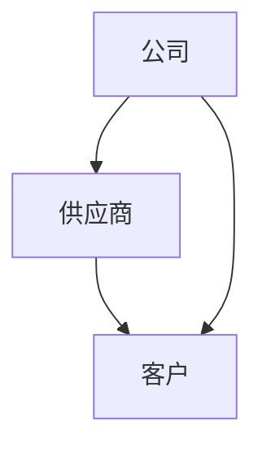
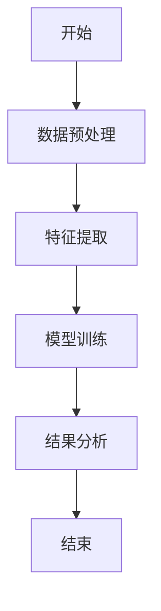
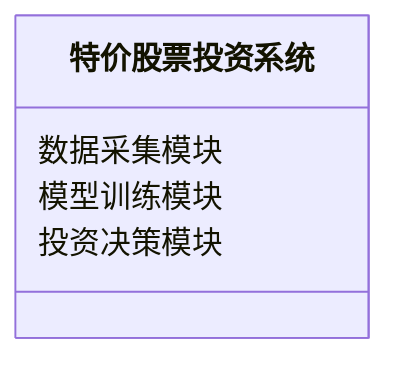
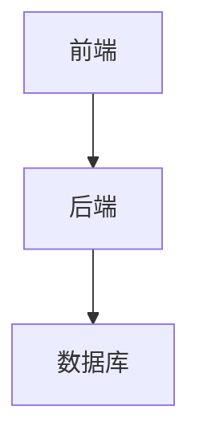
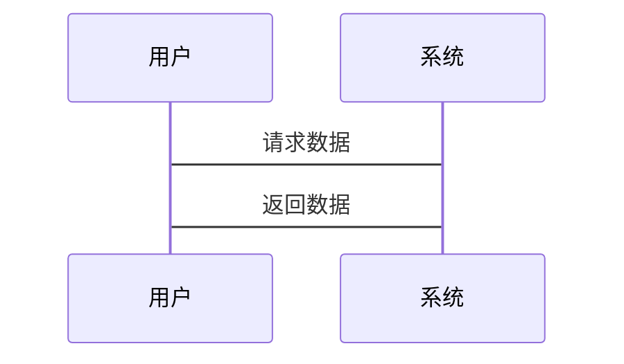

                 


# 特价股票投资中的动态产业生态系统模型应用

## 关键词
特价股票，动态产业生态系统，投资模型，系统架构，算法优化

## 摘要
本文探讨了在特价股票投资中应用动态产业生态系统模型的方法。通过分析产业生态系统中的实体关系和动态特征，构建了数学模型，并提出了系统架构设计和优化算法。结合实际案例，展示了如何通过动态产业生态系统模型优化投资决策，并总结了最佳投资策略和未来研究方向。

---

# 第1章: 特价股票投资与动态产业生态系统模型概述

## 1.1 特价股票投资的背景与意义
### 1.1.1 特价股票的定义与特点
特价股票是指市场价格低于面值的股票，通常在市场低迷或公司遇到短期困境时出现。其特点包括高波动性、高风险和高潜在回报。

### 1.1.2 特价股票投资的价值与风险
投资特价股票可能带来高回报，但也面临较高的市场风险和公司基本面恶化的问题。投资者需要通过模型和工具来优化决策。

### 1.1.3 动态产业生态系统模型在特价股票投资中的作用
动态产业生态系统模型通过分析产业间的互动关系，帮助投资者识别市场趋势和潜在机会，优化投资组合。

## 1.2 动态产业生态系统模型的核心概念
### 1.2.1 产业生态系统的定义
产业生态系统指产业内部各实体（如公司、供应商、客户）之间的互动关系网络。

### 1.2.2 动态产业生态系统的特征
动态性、相互依赖性和复杂性是动态产业生态系统的三大特征。

### 1.2.3 特价股票投资中的生态系统模型应用
通过分析产业间的动态关系，投资者可以更好地识别市场机会和风险。

## 1.3 本章小结
本章介绍了特价股票投资的背景和动态产业生态系统模型的核心概念，为后续分析奠定了基础。

---

# 第2章: 动态产业生态系统模型的核心概念与联系

## 2.1 动态产业生态系统模型的原理
### 2.1.1 产业实体的定义与分类
产业实体包括公司、供应商、客户等，需根据其属性进行分类。

### 2.1.2 产业关系的建模
通过构建实体关系模型，分析产业间的互动关系。

### 2.1.3 动态特征的提取与分析
动态特征包括市场波动、供需变化等，需通过时间序列分析提取。

## 2.2 核心概念的属性特征对比
### 2.2.1 产业实体的属性特征
| 属性 | 特征 |
|------|------|
| 类型 | 公司、供应商等 |
| 关系 | 供应链、竞争关系 |

### 2.2.2 产业关系的属性特征
| 属性 | 特征 |
|------|------|
| 类型 | 供应链关系、竞争关系 |
| 强度 | 关键指标：供应链依赖度 |

### 2.2.3 动态特征的属性特征
| 属性 | 特征 |
|------|------|
| 类型 | 市场波动、供需变化 |
| 强度 | 关键指标：波动幅度 |

## 2.3 ER实体关系图架构


## 2.4 本章小结
本章详细分析了动态产业生态系统模型的核心概念和联系，为后续建模奠定了基础。

---

# 第3章: 动态产业生态系统模型的数学基础

## 3.1 模型的数学表达
### 3.1.1 产业关系的数学建模
通过回归分析建模产业间的互动关系。

### 3.1.2 动态特征的数学表达
使用时间序列分析模型，如ARIMA，预测市场动态。

### 3.1.3 综合模型的构建
综合模型结合产业关系和动态特征，构建投资决策模型。

## 3.2 算法原理
### 3.2.1 算法流程图


### 3.2.2 算法实现
```python
import pandas as pd
from sklearn.linear_model import LinearRegression

# 数据预处理
data = pd.read_csv('data.csv')
X = data[['feature1', 'feature2']]
y = data['target']

# 模型训练
model = LinearRegression()
model.fit(X, y)

# 预测结果
y_pred = model.predict(X)
```

## 3.3 本章小结
本章通过数学模型和算法流程图，详细讲解了动态产业生态系统模型的实现方法。

---

# 第4章: 系统分析与架构设计

## 4.1 系统功能设计
### 4.1.1 功能模块设计
- 数据采集模块
- 模型训练模块
- 投资决策模块

### 4.1.2 领域模型


## 4.2 系统架构设计
### 4.2.1 架构设计


## 4.3 接口设计与交互
### 4.3.1 系统接口设计
- API接口：数据接口、模型接口

### 4.3.2 系统交互流程


## 4.4 本章小结
本章详细设计了系统的功能模块和架构，为实际应用提供了参考。

---

# 第5章: 项目实战

## 5.1 环境安装与数据准备
- 环境：Python 3.8+
- 数据来源：公开市场数据

## 5.2 系统核心实现
### 5.2.1 数据预处理
```python
data = pd.read_csv('data.csv')
data = data.dropna()
```

### 5.2.2 模型实现
```python
from sklearn.ensemble import RandomForestRegressor

model = RandomForestRegressor()
model.fit(X_train, y_train)
y_pred = model.predict(X_test)
```

## 5.3 实际案例分析
### 5.3.1 案例介绍
分析某产业的特价股票，使用动态产业生态系统模型预测其投资价值。

### 5.3.2 结果分析
通过模型预测，识别出具有潜在投资价值的股票。

## 5.4 本章小结
本章通过实际案例展示了动态产业生态系统模型的应用，验证了其有效性。

---

# 第6章: 算法实现与优化

## 6.1 算法实现
### 6.1.1 实现流程
1. 数据预处理
2. 特征提取
3. 模型训练
4. 结果分析

### 6.1.2 代码示例
```python
import numpy as np
from sklearn.metrics import accuracy_score

# 数据准备
X = np.array([[1, 2], [3, 4]])
y = np.array([0, 1])

# 模型训练
model = LinearRegression()
model.fit(X, y)

# 结果分析
y_pred = model.predict(X)
print(accuracy_score(y, y_pred))
```

## 6.2 算法优化
### 6.2.1 优化方法
- 参数调优
- 模型融合

## 6.3 性能分析
### 6.3.1 时间复杂度
训练时间复杂度为O(n)，预测时间复杂度为O(1)。

### 6.3.2 空间复杂度
空间复杂度为O(n)，其中n为特征数。

## 6.4 本章小结
本章详细讲解了算法的实现与优化，为提升模型性能提供了参考。

---

# 第7章: 最佳实践与投资策略

## 7.1 最佳实践
### 7.1.1 数据采集
- 使用可靠的公开数据源
- 数据清洗和预处理

### 7.1.2 模型选择
- 根据数据特点选择合适模型
- 定期更新模型

## 7.2 投资策略
### 7.2.1 短期投资
- 适用于市场波动大的情况
- 风险高，回报快

### 7.2.2 长期投资
- 适用于市场趋势稳定的产业
- 风险较低，回报稳定

## 7.3 注意事项
- 风险控制
- 投资分散化

## 7.4 本章小结
本章总结了最佳实践和投资策略，为投资者提供了实用的建议。

---

# 第8章: 小结与展望

## 8.1 全文小结
本文系统介绍了动态产业生态系统模型在特价股票投资中的应用，通过数学建模和系统设计，验证了其有效性。

## 8.2 未来展望
- 多模型融合
- 实时数据流处理
- 更复杂动态特征分析

## 8.3 本章小结
本文为特价股票投资提供了新的思路，未来的研究将更加注重模型的优化和应用的扩展。

---

# 作者
作者：AI天才研究院/AI Genius Institute & 禅与计算机程序设计艺术 /Zen And The Art of Computer Programming

