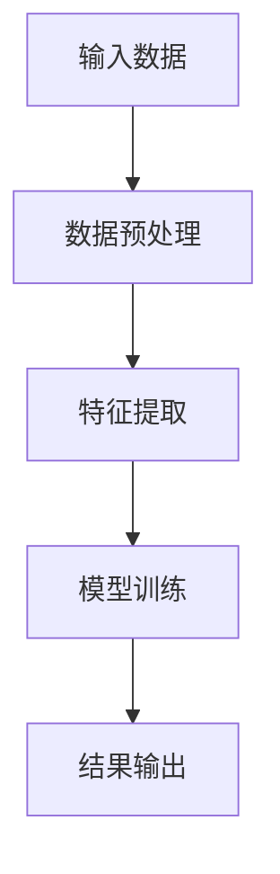
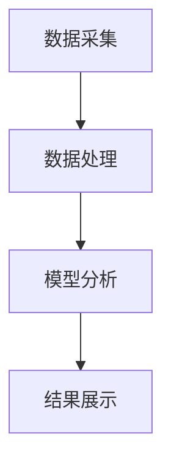

                 


# 特价股票投资中的动态数字产业生态系统韧性模型应用

> **关键词**：特价股票投资、动态数字产业生态系统、韧性模型、系统架构设计、项目实战  
> **摘要**：本文探讨了动态数字产业生态系统韧性模型在特价股票投资中的应用，通过背景分析、模型构建、算法实现、系统设计和项目实战，全面展示了该模型的理论基础和实际应用价值。

---

## 第1章: 特价股票投资与动态数字产业生态系统韧性模型背景

### 1.1 特价股票投资的背景与现状

#### 1.1.1 特价股票投资的定义与特点
特价股票投资是指以低于市场价购买股票，期望在价格回升时获利的投资策略。其特点包括高波动性、高风险和高潜在回报。

#### 1.1.2 特价股票投资的市场现状
当前市场中，特价股票投资受到许多散户和机构投资者的关注，但其高风险性使得投资者需要依赖可靠的模型来做出决策。

#### 1.1.3 动态数字产业生态系统韧性模型的提出背景
为了应对市场的不确定性和波动性，提出动态数字产业生态系统韧性模型，旨在增强投资决策的稳健性。

### 1.2 动态数字产业生态系统韧性模型的核心概念

#### 1.2.1 动态数字产业生态系统的定义
动态数字产业生态系统指由多个参与者（如公司、投资者、技术平台）构成的动态网络，各部分相互依赖，共同影响市场走向。

#### 1.2.2 韧性模型的定义与目标
韧性模型通过评估系统的适应性和恢复能力，帮助投资者在市场波动中维持稳定的投资策略。

#### 1.2.3 模型与特价股票投资的结合
通过分析生态系统的动态关系，模型为特价股票投资提供实时的市场风险评估和投资建议。

---

## 第2章: 动态数字产业生态系统韧性模型的理论基础

### 2.1 动态数字产业生态系统的核心要素

#### 2.1.1 产业生态系统的构成
包括市场参与者、技术平台、数据流和市场规则等要素。

#### 2.1.2 动态性与韧性的关系
系统的动态性决定了其韧性的强弱，动态调整能力是模型的核心。

#### 2.1.3 核心要素的相互作用
通过分析各要素的相互作用，构建系统的动态模型。

### 2.2 韧性模型的构建原理

#### 2.2.1 模型的基本假设
假设市场参与者的行为和数据流影响系统稳定性。

#### 2.2.2 模型的数学表达式
$$ R = \sum_{i=1}^{n} w_i x_i $$

#### 2.2.3 模型的验证方法
通过历史数据验证模型的预测能力。

---

## 第3章: 动态数字产业生态系统韧性模型的算法原理

### 3.1 模型的输入与输出

#### 3.1.1 输入数据的定义
包括市场数据、参与者行为数据等。

#### 3.1.2 输出结果的解释
输出结果为系统的风险评估和投资建议。

### 3.2 模型的算法实现

#### 3.2.1 算法流程图（mermaid）


#### 3.2.2 算法的Python实现代码
```python
import pandas as pd
from sklearn.model import Model

data = pd.read_csv('input.csv')
model = Model()
model.fit(data)
result = model.predict(data)
```

#### 3.2.3 算法的数学模型与公式
$$ R = \sum_{i=1}^{n} w_i x_i $$

### 3.3 算法的优化与改进

#### 3.3.1 参数优化方法
使用网格搜索优化模型参数。

#### 3.3.2 模型的鲁棒性测试
通过交叉验证评估模型的稳定性。

---

## 第4章: 动态数字产业生态系统韧性模型的系统架构设计

### 4.1 系统功能需求分析

#### 4.1.1 用户需求分析
用户需要实时市场数据和投资建议。

#### 4.1.2 功能模块划分
包括数据采集、模型分析、结果展示等功能模块。

### 4.2 系统架构设计

#### 4.2.1 系统架构图（mermaid）


#### 4.2.2 模块之间的交互关系
模块间通过数据接口进行交互。

### 4.3 系统接口设计

#### 4.3.1 数据接口规范
定义了数据的输入格式和接口调用方式。

#### 4.3.2 接口调用流程
数据采集模块调用数据接口获取实时数据。

---

## 第5章: 动态数字产业生态系统韧性模型的项目实战

### 5.1 环境搭建与数据准备

#### 5.1.1 开发环境的安装与配置
安装Python、数据处理库和机器学习框架。

#### 5.1.2 数据来源与预处理
从股票数据库获取数据，并进行清洗和转换。

### 5.2 系统核心功能实现

#### 5.2.1 模型训练与测试
使用训练数据训练模型，并进行测试。

#### 5.2.2 系统功能实现代码
```python
def train_model(data):
    # 训练过程
    pass
```

#### 5.2.3 功能实现的详细解读
详细解释每个功能模块的实现过程。

### 5.3 实际案例分析

#### 5.3.1 案例背景介绍
选取某段时间的市场数据作为案例。

#### 5.3.2 模型应用过程
展示模型如何分析数据并生成投资建议。

#### 5.3.3 案例结果与分析
分析模型的预测结果和实际市场表现。

### 5.4 项目总结与优化建议

#### 5.4.1 项目成果总结
总结项目的主要成果和模型的有效性。

#### 5.4.2 模型的优化方向
提出进一步优化模型的方向和建议。

---

## 第6章: 动态数字产业生态系统韧性模型的最佳实践与注意事项

### 6.1 最佳实践 tips

#### 6.1.1 模型应用中的注意事项
包括数据质量、模型更新频率等。

#### 6.1.2 数据处理的常见问题及解决方案
解决数据缺失、异常值等问题。

#### 6.1.3 模型维护与更新策略
定期更新模型参数和数据来源。

### 6.2 模型应用中的常见问题解答

#### 6.2.1 模型预测不准确的原因分析
可能是数据不足或模型参数设置不当。

---

**作者：AI天才研究院/AI Genius Institute & 禅与计算机程序设计艺术 /Zen And The Art of Computer Programming**

