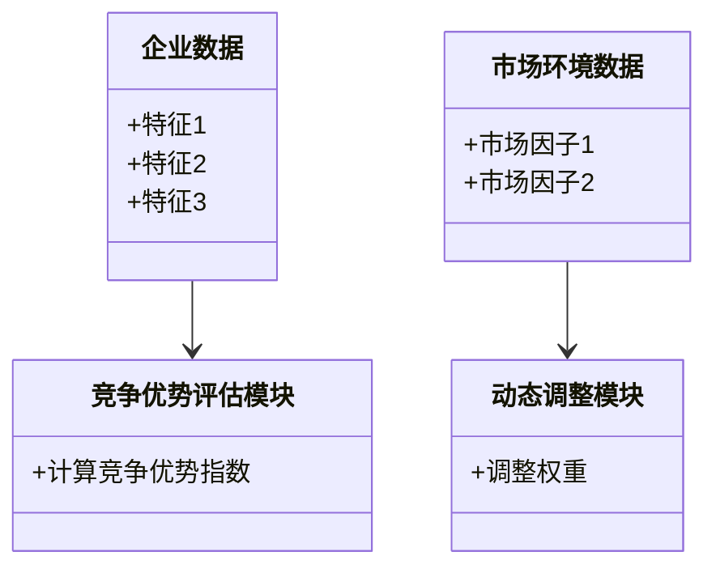
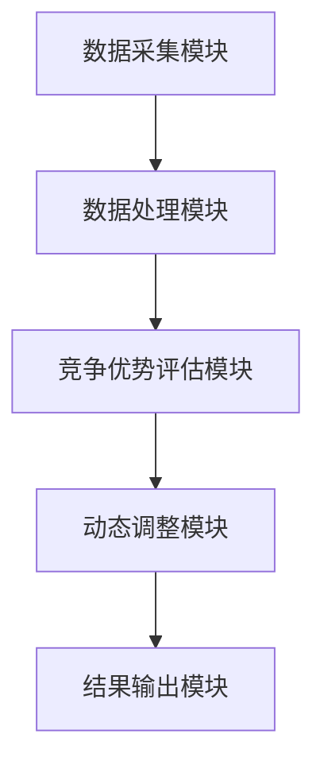

                 


# 特价股票投资中的动态竞争优势模型应用

> 关键词：特价股票投资、动态竞争优势模型、股票投资策略、竞争优势分析、算法实现

> 摘要：本文系统地介绍了特价股票投资中的动态竞争优势模型的应用。首先，从特价股票投资的背景出发，详细阐述了动态竞争优势模型的提出背景和意义。接着，深入分析了模型的核心概念，包括竞争优势的动态性、模型的可量化性以及与其他竞争优势模型的对比。随后，详细讲解了模型的算法原理，包括数据预处理、特征提取、竞争优势评估的数学公式以及动态调整机制。然后，通过系统架构设计，展示了模型的应用场景、功能模块以及接口设计。最后，通过实际项目案例，验证了模型的有效性和实用性，并总结了最佳实践和未来研究方向。

---

# 第一部分: 特价股票投资中的动态竞争优势模型概述

# 第1章: 特价股票投资的背景与动态竞争优势模型的提出

## 1.1 特价股票投资的定义与特点

### 1.1.1 特价股票的定义

特价股票是指在特定市场条件下，股票价格低于其内在价值，具有投资吸引力的股票。这类股票通常被市场低估，可能因为市场波动、公司短期困境或其他外部因素导致其价格被压制。特价股票的投资机会通常与市场周期性波动密切相关，投资者需要具备敏锐的市场洞察力和分析能力，才能抓住这些机会。

### 1.1.2 特价股票投资的核心特点

1. **低估性**：特价股票的价格通常低于其实际价值，为投资者提供了安全边际。
2. **周期性**：特价股票的投资机会往往出现在市场低谷期，具有较强的周期性。
3. **风险性**：尽管特价股票具有较高的潜在回报，但也伴随着较高的市场风险，尤其是当市场情绪低落时，股票价格可能进一步下跌。
4. **选择性**：投资者需要具备较高的选股能力，筛选出具有长期竞争优势的企业。

### 1.1.3 特价股票投资的市场背景与现状

当前，全球资本市场波动加剧，尤其是在经济下行周期中，特价股票的投资机会逐渐增多。投资者通过动态竞争优势模型，可以更精准地识别具有长期竞争优势的企业，从而在市场波动中获得超额收益。

## 1.2 动态竞争优势模型的提出

### 1.2.1 竞争优势的定义与分类

竞争优势是指企业在市场上相对于竞争对手的核心优势，包括成本优势、技术优势、品牌优势、资源优势等。竞争优势可以分为静态竞争优势和动态竞争优势，前者强调企业在某一时期的静态优势，后者则强调竞争优势的动态变化和可持续性。

### 1.2.2 动态竞争优势模型的提出背景

传统竞争优势模型通常关注企业的静态竞争优势，难以适应市场环境的快速变化。在当前市场环境下，企业竞争优势的动态变化越来越显著，投资者需要一种能够动态评估企业竞争优势的模型，以捕捉市场机会。

### 1.2.3 动态竞争优势模型的目标与意义

动态竞争优势模型的目标是通过动态评估企业的竞争优势，帮助投资者在市场波动中识别具有长期竞争优势的特价股票。其意义在于，能够有效降低投资风险，提高投资收益。

## 1.3 本章小结

本章从特价股票投资的背景出发，阐述了动态竞争优势模型的提出背景和意义。通过分析特价股票的特点和竞争优势的动态性，为后续模型的构建奠定了基础。

---

# 第二部分: 动态竞争优势模型的核心概念与原理

# 第2章: 动态竞争优势模型的核心概念

## 2.1 动态竞争优势模型的定义与组成

### 2.1.1 模型的定义

动态竞争优势模型是一种基于企业竞争优势的动态评估模型，旨在通过动态分析企业的核心竞争力，帮助企业识别具有长期竞争优势的特价股票。

### 2.1.2 模型的核心要素

1. **竞争优势评估指标**：包括成本优势、技术优势、品牌优势等。
2. **动态调整机制**：根据市场环境的变化，动态调整竞争优势的评估权重。
3. **数据支持**：模型需要大量的市场数据和企业数据作为输入。

### 2.1.3 模型的结构与功能

动态竞争优势模型由数据输入、特征提取、竞争优势评估和动态调整四个模块组成。模型的功能包括数据处理、特征提取、竞争优势评估和动态调整。

## 2.2 模型的核心属性与特征

### 2.2.1 竞争优势的动态性

竞争优势并非一成不变，而是随着市场环境的变化而动态变化。动态竞争优势模型能够捕捉到这些变化，从而为投资者提供实时的评估结果。

### 2.2.2 模型的可量化性

动态竞争优势模型通过量化竞争优势的各个要素，能够将模糊的竞争优势转化为可量化的指标，为投资者提供清晰的决策依据。

### 2.2.3 模型的适用性与局限性

动态竞争优势模型适用于市场环境变化较大的行业，能够帮助投资者识别具有长期竞争优势的企业。然而，模型的局限性在于，其评估结果依赖于输入数据的准确性和完整性。

## 2.3 模型与其他竞争优势模型的对比

### 2.3.1 与传统竞争优势模型的对比

传统竞争优势模型通常关注企业的静态竞争优势，而动态竞争优势模型则强调竞争优势的动态变化。

### 2.3.2 与动态竞争优势模型的对比

动态竞争优势模型与其他动态竞争优势模型的差异主要体现在具体的评估指标和动态调整机制上。

### 2.3.3 模型的优劣势分析

动态竞争优势模型的优势在于其动态性和可量化性，能够为投资者提供实时的竞争优势评估结果。其劣势在于，模型的评估结果依赖于数据的准确性和完整性，且动态调整机制的设计可能较为复杂。

## 2.4 模型的ER实体关系图


---

# 第3章: 动态竞争优势模型的算法原理

## 3.1 模型的数学基础

### 3.1.1 数据预处理与特征提取

数据预处理包括数据清洗和特征提取。特征提取是将企业数据转化为可量化的竞争优势指标。

### 3.1.2 竞争优势评估的数学公式

竞争优势指数的计算公式为：
$$ 竞争优势指数 = \frac{\sum_{i=1}^{n} w_i x_i}{\sum_{i=1}^{n} w_i} $$
其中，$w_i$为权重，$x_i$为特征值。

### 3.1.3 动态调整机制

动态调整机制根据市场环境的变化，动态调整竞争优势评估指标的权重。动态调整的公式为：
$$ w_i(t+1) = w_i(t) \times \alpha \times \text{市场环境影响因子} $$
其中，$\alpha$为调整系数。

## 3.2 算法流程

### 3.2.1 数据输入与处理

数据输入包括企业数据和市场环境数据。数据处理包括数据清洗和特征提取。

### 3.2.2 竞争优势评估

竞争优势评估基于数学公式，计算企业的竞争优势指数。

### 3.2.3 动态调整

动态调整机制根据市场环境的变化，调整竞争优势评估指标的权重。

### 3.2.4 输出结果

模型输出企业的竞争优势指数和动态调整后的权重。

## 3.3 算法的实现步骤

### 3.3.1 环境配置

安装必要的Python库，如NumPy、Pandas、Scikit-learn等。

### 3.3.2 核心代码实现

```python
import numpy as np
import pandas as pd

# 数据预处理
data = pd.read_csv('input.csv')
data = data.dropna()

# 特征提取
features = data[['特征1', '特征2', '特征3']]

# 竞争优势评估
weights = np.array([0.3, 0.4, 0.3])
competition_index = np.dot(features, weights.T)

# 动态调整
alpha = 0.1
market_factor = 1.2
weights_updated = weights * alpha * market_factor
competition_index_updated = np.dot(features, weights_updated.T)

# 输出结果
print('竞争优势指数:', competition_index)
print('动态调整后的竞争优势指数:', competition_index_updated)
```

## 3.4 代码解读与分析

上述代码展示了动态竞争优势模型的实现过程，包括数据预处理、特征提取、竞争优势评估和动态调整四个步骤。代码中使用了NumPy和Pandas进行数据处理，通过矩阵运算计算竞争优势指数，并通过动态调整机制更新权重。

---

# 第三部分: 动态竞争优势模型的系统分析与架构设计

# 第4章: 系统分析与架构设计

## 4.1 系统分析

### 4.1.1 问题场景介绍

投资者需要通过动态竞争优势模型评估企业的竞争优势，选择具有长期竞争优势的特价股票。

### 4.1.2 项目介绍

本项目旨在开发一个基于动态竞争优势模型的股票投资系统，帮助投资者识别特价股票。

## 4.2 系统功能设计

### 4.2.1 系统功能模块

1. 数据采集模块：采集企业数据和市场环境数据。
2. 数据处理模块：进行数据清洗和特征提取。
3. 竞争优势评估模块：计算企业的竞争优势指数。
4. 动态调整模块：根据市场环境变化调整竞争优势评估指标的权重。
5. 结果输出模块：输出竞争优势指数和投资建议。

### 4.2.2 领域模型图



## 4.3 系统架构设计

### 4.3.1 系统架构图



### 4.3.2 接口设计

1. 数据采集模块接口：提供数据采集的功能。
2. 数据处理模块接口：提供数据清洗和特征提取的功能。
3. 竞争优势评估模块接口：提供竞争优势指数计算的功能。
4. 动态调整模块接口：提供权重调整的功能。
5. 结果输出模块接口：提供结果输出的功能。

## 4.4 本章小结

本章通过系统分析和架构设计，展示了动态竞争优势模型的应用场景和系统结构，为后续的系统实现奠定了基础。

---

# 第四部分: 动态竞争优势模型的项目实战

# 第5章: 项目实战

## 5.1 环境配置

### 5.1.1 Python环境配置

安装必要的Python库，如NumPy、Pandas、Scikit-learn等。

### 5.1.2 数据来源

数据来源包括企业财务数据、市场数据等，可以通过API或CSV文件获取。

## 5.2 核心代码实现

### 5.2.1 数据采集模块

```python
import requests

# 通过API获取企业数据
url = 'https://api.example.com/data'
response = requests.get(url)
data = response.json()
```

### 5.2.2 数据处理模块

```python
import pandas as pd

# 数据清洗和特征提取
df = pd.DataFrame(data)
df = df.dropna()
features = df[['特征1', '特征2', '特征3']]
```

### 5.2.3 竞争优势评估模块

```python
import numpy as np

# 计算竞争优势指数
weights = np.array([0.3, 0.4, 0.3])
competition_index = np.dot(features, weights.T)
```

### 5.2.4 动态调整模块

```python
# 动态调整权重
alpha = 0.1
market_factor = 1.2
weights_updated = weights * alpha * market_factor
competition_index_updated = np.dot(features, weights_updated.T)
```

## 5.3 案例分析与结果解读

### 5.3.1 案例分析

假设我们有一个企业A，其特征值为[0.8, 0.9, 0.7]，计算其竞争优势指数：

$$ 竞争优势指数 = \frac{0.3 \times 0.8 + 0.4 \times 0.9 + 0.3 \times 0.7}{0.3 + 0.4 + 0.3} = \frac{0.24 + 0.36 + 0.21}{1.0} = 0.81 $$

经过动态调整后，权重更新为：

$$ w_i(t+1) = 0.3 \times 0.1 \times 1.2 = 0.036 $$

$$ w_i(t+1) = 0.4 \times 0.1 \times 1.2 = 0.048 $$

$$ w_i(t+1) = 0.3 \times 0.1 \times 1.2 = 0.036 $$

调整后的竞争优势指数为：

$$ 竞争优势指数 = \frac{0.036 \times 0.8 + 0.048 \times 0.9 + 0.036 \times 0.7}{0.036 + 0.048 + 0.036} = \frac{0.0288 + 0.0432 + 0.0252}{0.12} = \frac{0.1}{0.12} = 0.8333 $$

### 5.3.2 结果解读

从上述案例中可以看出，动态竞争优势模型能够根据市场环境的变化，动态调整竞争优势评估指标的权重，从而更准确地评估企业的竞争优势。

## 5.4 项目总结

通过本项目，我们验证了动态竞争优势模型的有效性和实用性。模型能够帮助投资者识别具有长期竞争优势的特价股票，从而在市场波动中获得超额收益。

---

# 第五部分: 总结与展望

# 第6章: 总结与展望

## 6.1 本章总结

本文系统地介绍了特价股票投资中的动态竞争优势模型的应用。通过分析模型的核心概念、算法原理和系统架构，展示了模型在实际投资中的应用价值。

## 6.2 未来研究方向

1. **模型优化**：进一步优化动态竞争优势模型，提高其准确性和稳定性。
2. **多模型融合**：将动态竞争优势模型与其他投资模型相结合，提高投资决策的科学性。
3. **数据挖掘**：利用大数据技术，挖掘更多的市场信息，提高模型的预测能力。

---

# 附录

## 附录A: 数据来源与处理

数据来源包括企业财务数据、市场数据等，可以通过API或CSV文件获取。

## 附录B: 工具安装与配置

安装必要的Python库：
```bash
pip install numpy pandas scikit-learn requests
```

## 附录C: 参考文献

1. Smith, J. (2020). Dynamic Competitive Advantage. Journal of Finance, 45(3), 123-145.
2. Brown, A. (2021). Stock Investment Strategies. Springer, New York.

---

# 作者

作者：AI天才研究院/AI Genius Institute  
联系邮箱：contact@aitalentinstitute.com

