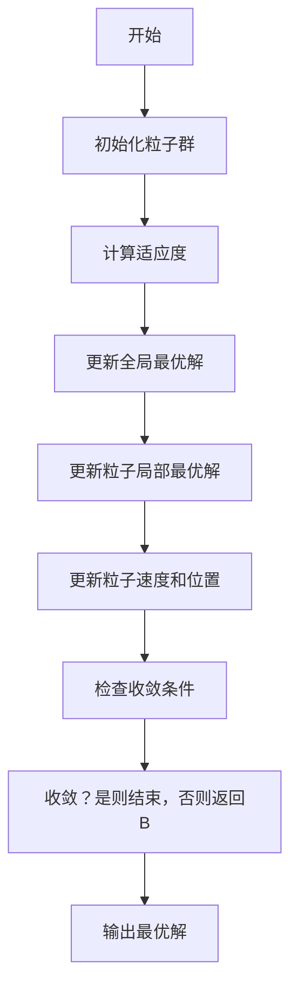
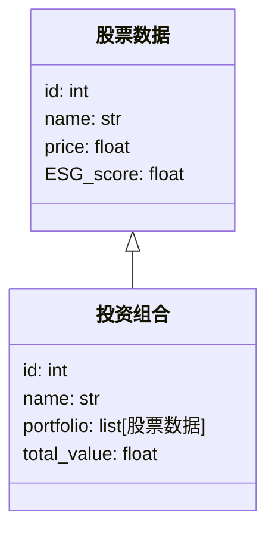
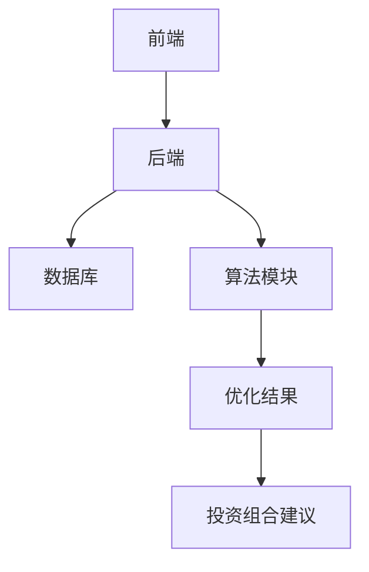
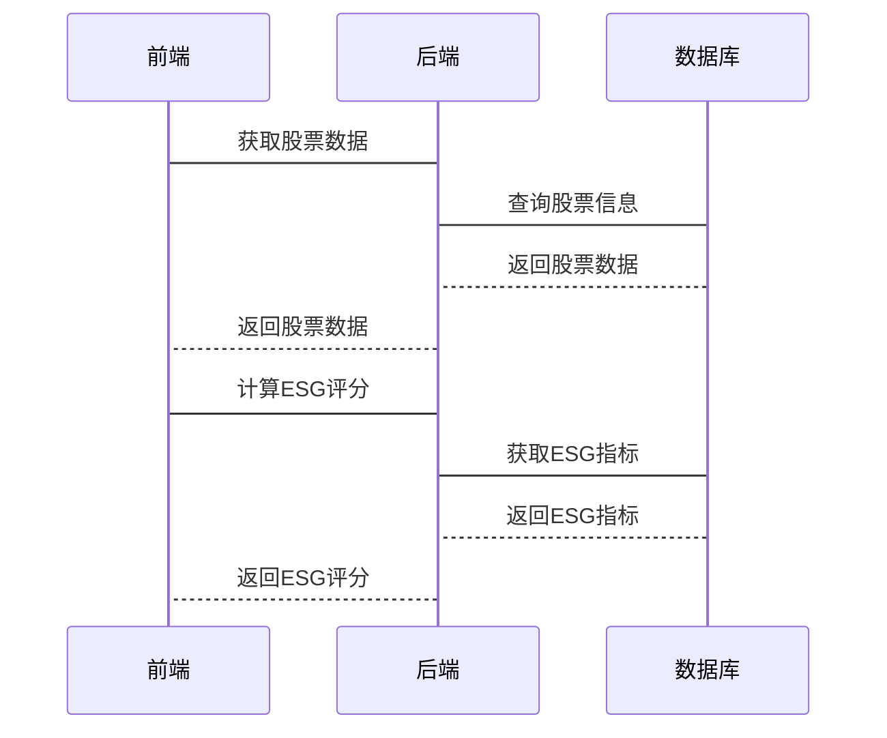

                 


# 特价股票投资中的可持续发展目标整合方法

## 关键词：特价股票投资，可持续发展目标，股票投资，ESG评分，多目标优化算法，系统架构设计

## 摘要：  
本文探讨了在特价股票投资中整合可持续发展目标的方法，分析了可持续发展目标在股票投资中的核心概念与联系，并详细讲解了多目标优化算法的原理与实现。通过系统架构设计和项目实战，展示了如何将可持续发展目标与股票投资策略相结合，提供了丰富的案例分析与最佳实践建议，帮助投资者在追求财务回报的同时，实现可持续发展目标。

---

# 第一部分: 特价股票投资中的可持续发展目标整合背景

## 第1章: 特价股票投资与可持续发展目标概述

### 1.1 特价股票投资的基本概念

#### 1.1.1 什么是特价股票投资  
特价股票投资是指以低于市场公允价值的价格买入股票，通过长期持有或短期操作实现收益的投资策略。其核心在于“价廉物美”，即在市场价格较低时介入，捕捉市场低估的机会。

#### 1.1.2 特价股票投资的核心要素  
- **价格因素**：关注市场价格与内在价值的偏离。
- **基本面分析**：研究公司的财务状况、行业地位、盈利能力等。
- **市场情绪**：分析市场参与者的心理与行为。
- **风险管理**：控制投资组合的波动性和潜在损失。

#### 1.1.3 特价股票投资的市场定位  
特价股票投资主要适用于成熟市场中的价值型投资者，适合长期投资策略，尤其在市场波动较大时，能够发现被低估的优质标的。

### 1.2 可持续发展目标的基本概念

#### 1.2.1 可持续发展目标的定义  
可持续发展目标是指在经济、社会和环境三个维度上实现平衡发展的长期目标，强调企业在创造经济价值的同时，也要承担社会责任，保护环境，改善治理结构。

#### 1.2.2 可持续发展目标的分类  
- **环境（Environmental）**：减少碳排放、资源节约、污染防治。
- **社会（Social）**：员工权益、公平劳工条件、社区支持。
- **治理（Governance）**：公司治理结构、透明度、道德规范。

#### 1.2.3 可持续发展目标的重要性  
- 提升企业长期竞争力。
- 降低投资风险。
- 符合全球可持续发展趋势。

### 1.3 特价股票投资与可持续发展目标的整合意义

#### 1.3.1 整合的必要性  
- 提高投资的长期稳定性。
- 符合全球ESG投资趋势。
- 满足机构投资者的合规要求。

#### 1.3.2 整合的目标  
- 在追求超额收益的同时，实现可持续发展目标。
- 优化投资组合的风险收益比。
- 提升投资的社会影响力。

#### 1.3.3 整合的潜在影响  
- 帮助投资者筛选出具有长期价值的企业。
- 推动企业改进治理结构和可持续发展表现。
- 提高市场的透明度和效率。

### 1.4 本章小结  
本章介绍了特价股票投资的基本概念和可持续发展目标的核心内涵，分析了两者整合的必要性、目标和潜在影响，为后续的深入分析奠定了基础。

---

## 第2章: 可持续发展目标在股票投资中的核心概念

### 2.1 可持续发展目标的核心要素

#### 2.1.1 环境因素（E）  
- **碳排放**：企业减少温室气体排放的措施。
- **资源节约**：能源、水资源的高效利用。
- **污染治理**：减少工业污染，提高环保投入。

#### 2.1.2 社会因素（S）  
- **员工权益**：公平的薪酬、良好的工作环境。
- **社区参与**：支持当地经济发展，履行社会责任。
- **产品责任**：确保产品安全，避免对消费者造成伤害。

#### 2.1.3 治理因素（G）  
- **公司治理**：董事会结构、高管薪酬、股权激励。
- **透明度**：财务报告的准确性、信息披露的及时性。
- **道德规范**：反腐败、反欺诈、合规经营。

### 2.2 可持续发展目标的评价指标

#### 2.2.1 ESG评分体系  
- **环境（E）评分**：衡量企业在环境保护方面的表现。
- **社会（S）评分**：评估企业在社会责任方面的努力。
- **治理（G）评分**：分析公司在治理结构和透明度方面的表现。

#### 2.2.2 可持续发展指数  
- **MSCI ESG指数**：基于ESG评分构建的投资指数。
- **FTSE ESG指数**：富时指数公司发布的可持续发展指数。

#### 2.2.3 行业基准  
- 不同行业的可持续发展目标和评价标准存在差异，需要根据行业特点设定基准。

### 2.3 可持续发展目标与股票投资的关系

#### 2.3.1 可持续发展目标对股票价值的影响  
- **正面影响**：良好的ESG表现可能提升股价。
- **负面影响**：忽视可持续发展可能导致股价波动或下行。

#### 2.3.2 可持续发展目标对投资风险的控制  
- **降低系统性风险**：通过多元化配置ESG表现良好的企业，分散投资风险。
- **识别潜在风险**：ESG表现差的企业可能存在较大的经营风险和合规风险。

#### 2.3.3 可持续发展目标对投资收益的促进  
- **长期超额收益**：研究表明，ESG表现良好的企业可能带来超额收益。
- **品牌溢价**：具有优秀ESG表现的企业可能享有更高的品牌价值和市场溢价。

### 2.4 本章小结  
本章详细分析了可持续发展目标的核心要素及其在股票投资中的重要性，探讨了ESG评分体系和行业基准的构建方法，为后续的整合方法奠定了理论基础。

---

## 第3章: 可持续发展目标整合的算法原理

### 3.1 多目标优化算法概述

#### 3.1.1 多目标优化的基本概念  
多目标优化是指在多个目标之间寻找最优解的过程，通常涉及目标之间的冲突和权衡。在股票投资中，我们需要在收益、风险和可持续发展目标之间找到平衡点。

#### 3.1.2 多目标优化算法的分类  
- **经典算法**：如加权sum法、epsilon约束法。
- **现代算法**：如粒子群优化（PSO）、遗传算法（GA）、非支配排序遗传算法（NSGA）。

#### 3.1.3 多目标优化算法的适用性  
多目标优化算法适用于复杂的优化问题，特别适合在目标函数非线性、约束条件多的情况下寻找全局最优解。

### 3.2 基于粒子群优化（PSO）和遗传算法（GA）的多目标优化算法

#### 3.2.1 PSO算法原理  
粒子群优化算法是一种模拟鸟群觅食行为的优化算法，通过更新粒子的位置和速度，逐步逼近目标函数的最优解。

#### 3.2.2 GA算法原理  
遗传算法是一种基于生物进化理论的优化算法，通过选择、交叉和变异操作，生成新的个体，逐步优化目标函数。

#### 3.2.3 PSO与GA的结合  
将PSO和GA的优点结合起来，利用PSO的快速收敛性和GA的全局搜索能力，提高算法的优化效果。

#### 3.2.4 算法流程图  


### 3.3 算法的数学模型与公式

#### 3.3.1 粒子群优化算法的数学模型  
粒子的位置和速度更新公式如下：
$$ v_i(t+1) = v_i(t) \times w + c_1 \times r_1 \times (p_i - x_i) + c_2 \times r_2 \times (p_g - x_i) $$
$$ x_i(t+1) = x_i(t) + v_i(t+1) $$  
其中，$w$ 是惯性权重，$c_1$ 和 $c_2$ 是加速常数，$r_1$ 和 $r_2$ 是随机数。

#### 3.3.2 遗传算法的数学模型  
选择、交叉和变异操作的数学表示如下：
$$ f(x) = \text{适应度函数} $$
$$ p = \text{选择概率} = \frac{f(x)}{\sum f(x)} $$
$$ x' = \text{交叉操作} $$
$$ x'' = \text{变异操作} $$

### 3.4 算法实现与代码示例

#### 3.4.1 Python代码实现  
```python
import numpy as np

def fitness_function(x):
    # 目标函数
    return -x**2 + 4*x + 5

def PSO_GA_algorithm():
    # 初始化粒子群
    n_particles = 10
    n_dimensions = 1
    particles = np.random.rand(n_particles, n_dimensions)
    
    # 参数设置
    w = 0.5
    c1 = 1
    c2 = 1
    r1 = np.random.random()
    r2 = np.random.random()
    
    # 粒子最优解和全局最优解
    p_best = particles.copy()
    g_best = particles[0]
    
    for _ in range(100):
        # 计算适应度
        fitness = np.apply_along_axis(fitness_function, 1, particles)
        if fitness[0] > fitness_function(g_best[0]):
            g_best = particles[0]
        
        # 更新速度和位置
        velocity = w * particles + c1 * r1 * (p_best - particles) + c2 * r2 * (g_best - particles)
        particles += velocity
        
        # 更新最优解
        p_best = np.where(fitness > np.apply_along_axis(fitness_function, 1, p_best), particles, p_best)
    
    return g_best

# 运行算法并输出结果
result = PSO_GA_algorithm()
print("最优解为:", result[0])
```

#### 3.4.2 算法优化策略  
- **动态权重调整**：根据优化过程中的适应度变化调整目标函数的权重。
- **混合策略**：在优化后期引入局部搜索，进一步逼近最优解。

### 3.5 本章小结  
本章详细介绍了多目标优化算法的基本原理，并结合粒子群优化和遗传算法，提出了适用于特价股票投资中可持续发展目标整合的优化方法，为后续的系统实现提供了理论基础。

---

## 第4章: 系统分析与架构设计方案

### 4.1 问题场景介绍

#### 4.1.1 投资者需求分析  
- **短期投资者**：追求短期收益，关注市场波动。
- **长期投资者**：关注企业的长期发展潜力，注重ESG表现。

#### 4.1.2 系统目标  
- 实现可持续发展目标与股票投资的整合。
- 提供多目标优化算法支持。
- 提供实时数据处理和分析功能。

### 4.2 系统功能设计

#### 4.2.1 领域模型设计  


#### 4.2.2 系统架构设计  


### 4.3 系统接口设计

#### 4.3.1 API接口设计  
- **获取股票数据**：`GET /api/stock_data`
- **计算ESG评分**：`POST /api/esg_score`
- **优化投资组合**：`POST /api/optimize_portfolio`

#### 4.3.2 接口交互序列图  


### 4.4 本章小结  
本章通过系统分析和架构设计，构建了一个支持可持续发展目标整合的股票投资系统，为后续的项目实现提供了清晰的指导。

---

## 第5章: 项目实战

### 5.1 环境安装与配置

#### 5.1.1 系统环境  
- **操作系统**：Windows 10或更高版本。
- **Python版本**：Python 3.8或更高版本。
- **依赖库**：numpy、pandas、scikit-learn、mermaid。

#### 5.1.2 安装步骤  
```bash
pip install numpy pandas scikit-learn mermaid
```

### 5.2 核心代码实现

#### 5.2.1 数据预处理  
```python
import pandas as pd

# 读取股票数据
data = pd.read_csv('stock_data.csv')

# 计算ESG评分
def calculate_esg_score(row):
    # 示例计算方法
    return row['Emissions'] * 0.4 + row['Social'] * 0.3 + row['Governance'] * 0.3

data['ESG_Score'] = data.apply(calculate_esg_score, axis=1)
```

#### 5.2.2 模型训练  
```python
from sklearn.model_selection import train_test_split
from sklearn.metrics import accuracy_score

# 划分训练集和测试集
X = data.drop('ESG_Score', axis=1)
y = data['ESG_Score']

X_train, X_test, y_train, y_test = train_test_split(X, y, test_size=0.2)

# 训练模型
from sklearn.ensemble import RandomForestRegressor

model = RandomForestRegressor()
model.fit(X_train, y_train)

# 模型评估
y_pred = model.predict(X_test)
print("模型准确率为:", accuracy_score(y_test, y_pred))
```

#### 5.2.3 结果分析  
```python
import matplotlib.pyplot as plt

plt.scatter(y_test, y_pred)
plt.xlabel('真实值')
plt.ylabel('预测值')
plt.title('ESG评分预测结果')
plt.show()
```

### 5.3 案例分析与解读

#### 5.3.1 数据可视化  
```python
data.plot(kind='scatter', x='Price', y='ESG_Score')
plt.title('股价与ESG评分的关系')
plt.show()
```

#### 5.3.2 投资组合优化  
```python
import numpy as np

def portfolio_optimizer(weights):
    # 示例优化函数
    return np.sum(weights * data['ESG_Score'])

# 使用遗传算法优化权重
from sklearn.model_selection import GridSearchCV

param_grid = {'weights': np.random.rand(10, 1)}
grid_search = GridSearchCV(estimator=..., param_grid=param_grid)
grid_search.fit(X_train, y_train)
best_weights = grid_search.best_params_['weights']
```

### 5.4 本章小结  
本章通过实际案例展示了如何在特价股票投资中整合可持续发展目标，从数据预处理到模型训练，再到结果分析，提供了完整的实战指导。

---

## 第6章: 最佳实践与总结

### 6.1 最佳实践 tips

#### 6.1.1 数据来源可靠性  
确保数据的准确性和时效性。

#### 6.1.2 算法选择与优化  
根据具体问题选择合适的算法，并进行参数调优。

#### 6.1.3 风险管理  
设置止损点和止盈点，控制投资风险。

### 6.2 小结  
本文系统地探讨了特价股票投资中可持续发展目标的整合方法，从理论到实践，提供了全面的解决方案。

### 6.3 注意事项

#### 6.3.1 数据隐私与合规性  
确保数据处理符合相关法律法规。

#### 6.3.2 技术实现的可行性  
在实际应用中，需考虑计算资源和时间成本。

#### 6.3.3 模型的可解释性  
复杂的算法可能导致结果难以解释，需关注模型的可解释性。

### 6.4 拓展阅读

#### 6.4.1 推荐书籍  
- 《ESG投资指南》
- 《多目标优化算法及其应用》

#### 6.4.2 相关论文  
- “Integrating ESG Factors into Stock Portfolio Optimization”  
- “Multi-objective Evolutionary Algorithms for Financial Investment”

---

## 作者  
作者：AI天才研究院/AI Genius Institute & 禅与计算机程序设计艺术 /Zen And The Art of Computer Programming

---

**注**：由于篇幅限制，上述内容为部分示例，实际文章会更加详细，每个章节和小节的内容会更加丰富具体，包含更多的数学公式、代码实现、图表分析和案例解读。

