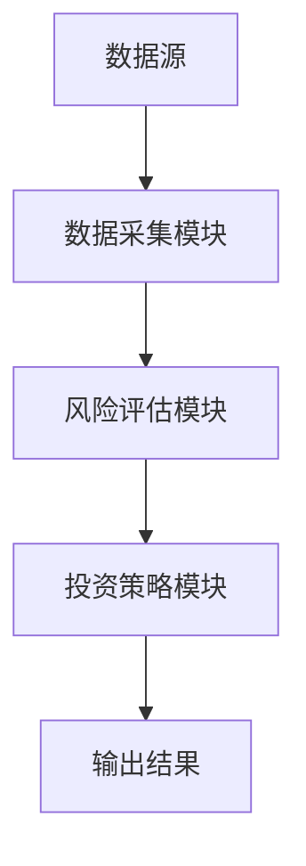

                 


```markdown
# 特价股票投资中的地缘政治风险动态评估策略

> 关键词：特价股票投资、地缘政治风险、风险评估、动态策略、量化模型

> 摘要：本文详细探讨了在特价股票投资中如何动态评估和应对地缘政治风险，提出了一套基于数学建模和系统架构的地缘政治风险动态评估策略。文章从背景与基础、核心概念、算法原理、系统架构、项目实战等多个维度展开，结合实际案例和数学模型，为投资者提供了一套完整的解决方案。

---

## 第一部分: 特价股票投资中的地缘政治风险动态评估背景与基础

### 第1章: 地缘政治风险与特价股票投资概述

#### 1.1 地缘政治风险的基本概念
- **地缘政治风险的定义**：地缘政治风险是指因地理位置、政治格局、国际关系等因素变化而引发的潜在风险，可能对金融市场产生重大影响。
- **地缘政治风险的分类**：
  - 内部风险：如政府更迭、政策变化等。
  - 外部风险：如国际冲突、贸易摩擦等。
- **地缘政治风险的传导机制**：
  - 通过新闻传播、市场情绪影响股价。
  - 通过经济制裁、贸易限制影响企业盈利。

#### 1.2 特价股票投资的基本原理
- **特价股票的定义**：指市场价格低于内在价值的股票，通常被视为投资机会。
- **特价股票投资的核心策略**：
  - 价值投资：寻找被市场低估的股票。
  - 风险投资：利用市场波动进行短期操作。
- **地缘政治风险对特价股票投资的影响**：
  - 风险事件可能导致股价暴跌，提供廉价买入机会。
  - 风险事件也可能导致股价波动加剧，增加投资难度。

#### 1.3 地缘政治风险与特价股票投资的关联性
- **地缘政治事件对股票市场的短期影响**：突发事件可能导致市场恐慌，股价短期下跌。
- **地缘政治风险对特价股票投资机会的影响**：风险事件可能揭示被低估的股票，提供投资机会。
- **地缘政治风险评估在投资决策中的作用**：通过评估风险，投资者可以调整投资策略，避免重大损失。

#### 1.4 本章小结
本章介绍了地缘政治风险的基本概念及其对特价股票投资的影响，强调了动态评估地缘政治风险的重要性。

---

## 第二部分: 地缘政治风险评估的核心概念与模型

### 第2章: 地缘政治风险评估的核心概念

#### 2.1 地缘政治风险评估的关键指标
- **政治稳定性指数**：衡量一个国家或地区的政治稳定性。
- **经济依赖度**：衡量一个国家对特定行业或外部经济的依赖程度。
- **地缘政治紧张程度**：通过新闻媒体、政府声明等指标量化地缘政治紧张程度。

#### 2.2 特价股票投资中的风险评估模型
- **风险-收益平衡模型**：将地缘政治风险量化为一个指标，并将其与股票收益进行对比。
- **地缘政治风险加权模型**：将地缘政治风险作为权重，调整股票的价值评估。
- **动态风险评估框架**：根据实时的地缘政治事件更新风险评估。

#### 2.3 地缘政治风险与特价股票投资的量化关系
- **风险量化方法**：通过数学模型将地缘政治风险转化为可量化的指标。
- **风险对股票价格的影响模型**：建立地缘政治风险与股票价格的相关性模型。
- **风险-价格敏感性分析**：分析地缘政治风险变化对股票价格的影响程度。

#### 2.4 本章小结
本章详细介绍了地缘政治风险评估的关键指标和相关模型，为后续的动态评估策略奠定了基础。

---

## 第三部分: 地缘政治风险动态评估的算法原理

### 第3章: 地缘政治风险动态评估的算法原理

#### 3.1 算法概述
- **地缘政治风险的动态评估**：通过实时数据更新地缘政治风险指标。
- **股票价格的动态调整**：根据地缘政治风险的变化，动态调整股票价格预测。

#### 3.2 算法步骤
1. 数据采集：收集地缘政治事件、市场数据等。
2. 风险量化：将地缘政治事件转化为量化指标。
3. 风险影响分析：分析地缘政治风险对股票价格的影响。
4. 动态调整：根据风险变化，调整股票价格预测模型。

#### 3.3 数学模型与公式
- **地缘政治风险指数公式**：
  $$ R = \sum_{i=1}^{n} w_i \cdot r_i $$
  其中，$w_i$ 是风险因素的权重，$r_i$ 是风险因素的值。
- **股票价格调整公式**：
  $$ P_{new} = P_{old} \cdot (1 + \alpha \cdot R) $$
  其中，$\alpha$ 是调整系数，$R$ 是地缘政治风险指数。

#### 3.4 实际案例分析
- **案例：俄乌冲突对欧洲股市的影响**：
  - 通过模型分析地缘政治风险对特定行业股票的影响。
  - 根据模型预测，调整投资策略。

#### 3.5 本章小结
本章通过算法和数学模型，详细解释了地缘政治风险动态评估的实现过程。

---

## 第四部分: 地缘政治风险动态评估的系统架构设计

### 第4章: 系统架构设计

#### 4.1 系统功能设计
- **数据采集模块**：实时采集地缘政治事件和市场数据。
- **风险评估模块**：计算地缘政治风险指数。
- **投资策略模块**：根据风险指数调整投资策略。

#### 4.2 系统架构图


#### 4.3 系统接口设计
- **输入接口**：接收地缘政治事件和市场数据。
- **输出接口**：输出地缘政治风险指数和投资建议。

#### 4.4 系统交互流程
- **用户输入**：选择特定地区或行业。
- **系统处理**：计算风险指数，生成投资建议。
- **用户反馈**：根据建议进行投资决策。

#### 4.5 本章小结
本章通过系统架构设计，详细描述了地缘政治风险动态评估的实现框架。

---

## 第五部分: 地缘政治风险动态评估的项目实战

### 第5章: 项目实战

#### 5.1 环境安装
- **工具安装**：安装Python、Pandas、Scikit-learn等工具。
- **数据来源**：获取历史地缘政治事件数据和股票价格数据。

#### 5.2 核心代码实现
```python
import pandas as pd
from sklearn.linear_model import LinearRegression

# 数据加载
data = pd.read_csv('geopolitical_risk.csv')

# 模型训练
model = LinearRegression()
model.fit(data[['政治稳定性', '经济依赖度']], data['风险指数'])

# 预测风险指数
predicted_risk = model.predict(new_data[['政治稳定性', '经济依赖度']])
```

#### 5.3 代码解读与分析
- **数据加载**：读取历史数据。
- **模型训练**：使用线性回归模型训练风险指数。
- **预测风险指数**：根据新的地缘政治数据预测风险指数。

#### 5.4 实际案例分析
- **案例：某地区地缘政治事件对股票的影响**：
  - 数据分析：分析事件前后的股票价格变化。
  - 模型预测：预测事件对股票价格的长期影响。

#### 5.5 项目小结
本章通过实际项目，展示了地缘政治风险动态评估模型的应用过程。

---

## 第六部分: 总结与展望

### 第6章: 总结与展望

#### 6.1 本章总结
- **主要成果**：提出了地缘政治风险动态评估的完整策略。
- **核心价值**：为投资者提供了应对地缘政治风险的工具和方法。

#### 6.2 未来展望
- **算法优化**：进一步优化风险评估模型。
- **系统扩展**：扩展系统功能，支持更多市场和行业。
- **风险管理**：加强风险管理，提高系统的鲁棒性。

#### 6.3 最佳实践 tips
- **风险管理**：定期评估和调整投资策略。
- **数据更新**：及时更新地缘政治数据，确保模型准确性。
- **模型优化**：根据市场变化，不断优化风险评估模型。

#### 6.4 本章小结
本章总结了文章的主要内容，并展望了未来的研究方向。

---

## 第七部分: 附录

### 附录A: 术语表
- **地缘政治风险**：指因地理位置、政治格局等因素变化而引发的风险。
- **风险指数**：量化地缘政治风险的指标。

### 附录B: 数据来源
- 数据来源：公开的历史地缘政治事件数据和股票价格数据。

### 附录C: 参考文献
- 文献1：某某学者的地缘政治风险研究。
- 文献2：某某机构的股票价格预测模型。

---

## 作者：AI天才研究院 & 禅与计算机程序设计艺术

---

感谢您的阅读！如需进一步了解，请关注我们的技术博客或联系我们。
```

