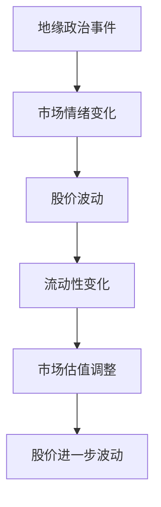
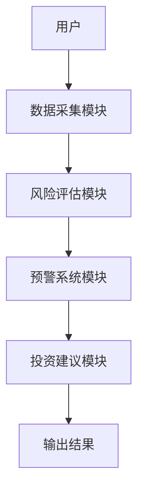

                 

# 特价股票投资中的地缘政治风险评估

> 关键词：特价股票，地缘政治风险，股票投资，风险评估，量化模型

> 摘要：本文从地缘政治风险对特价股票投资的影响入手，系统阐述了地缘政治风险的定义、类型及其对股票市场的冲击机制，重点分析了地缘政治风险评估的核心原理和数学模型，结合实际案例展示了如何构建地缘政治风险评估系统，并提出了相应的投资策略和风险管理建议。本文旨在帮助投资者在特价股票投资中更好地识别和应对地缘政治风险。

---

# 第一部分: 地缘政治风险与特价股票投资概述

## 第1章: 地缘政治风险的基本概念

### 1.1 地缘政治风险的定义与特征

地缘政治风险是指由于政治、经济、军事等领域的冲突或变化，可能导致的地区或全球性的不稳定因素，进而对企业、市场和投资行为产生负面影响。地缘政治风险具有以下特征：

1. **不确定性**：地缘政治事件往往具有突发性和不可预测性。
2. **广泛性**：地缘政治风险可能影响多个行业和市场。
3. **复杂性**：地缘政治风险通常涉及多方利益，难以简单量化。
4. **长期性**：某些地缘政治风险可能持续多年，对市场产生长期影响。

### 1.2 特价股票投资的基本概念

特价股票是指市场价格低于其内在价值的股票。投资者通常认为这些股票具有被市场低估的特性，具有较大的上涨潜力。特价股票投资的核心在于寻找市场中的价值洼地，通过长期持有的方式实现收益。然而，特价股票的高敏感性也使其更容易受到外部风险因素的影响。

---

## 第2章: 地缘政治风险对股票市场的影响

### 2.1 地缘政治事件对股票市场的冲击

地缘政治事件通常会对股票市场产生显著的短期冲击。例如，战争、贸易摩擦、政权更迭等事件都会引发市场恐慌，导致股价波动加剧。以下是地缘政治事件对股票市场的具体影响路径：

1. **市场情绪变化**：地缘政治事件会引发投资者的恐慌情绪，导致市场抛售压力增加。
2. **宏观经济影响**：地缘政治风险可能引发能源价格波动、贸易限制等，进而影响企业的盈利能力和市场预期。
3. **政策变化**：某些地缘政治事件可能导致政府出台新的政策，影响企业的经营环境。

### 2.2 地缘政治风险对特价股票的特殊影响

特价股票通常集中在周期性较强或基本面较差的行业，这些行业对地缘政治风险的敏感性较高。以下是地缘政治风险对特价股票的特殊影响：

1. **股价波动放大**：地缘政治风险会导致特价股票的波动性显著增加。
2. **市场流动性下降**：地缘政治风险可能引发市场流动性下降，导致特价股票的交易难度增加。
3. **估值调整**：地缘政治风险可能导致市场对特价股票的估值进行重新评估，进一步放大股价波动。

---

# 第二部分: 地缘政治风险评估的核心概念与联系

## 第3章: 地缘政治风险评估的核心原理

### 3.1 地缘政治风险评估的理论基础

地缘政治风险评估的核心在于将复杂的地缘政治因素转化为可量化的指标。以下是一些常用的理论工具：

1. **政治风险评估模型**：通过分析政治稳定性、政策连续性等因素，评估地缘政治风险。
2. **经济影响分析**：通过分析地缘政治事件对经济指标（如GDP、就业率等）的影响，评估其对市场的冲击。
3. **市场情绪分析**：通过分析投资者情绪指数（如恐慌指数），评估市场对地缘政治风险的反应。

### 3.2 地缘政治风险评估的核心要素

地缘政治风险评估需要综合考虑以下几个核心要素：

1. **政治风险**：包括政权更迭、政策变化等。
2. **经济风险**：包括经济制裁、贸易摩擦等。
3. **军事风险**：包括战争、军事冲突等。

---

## 第4章: 地缘政治风险与股票价格的关系

### 4.1 地缘政治风险对股票价格的影响路径

地缘政治风险对股票价格的影响路径可以通过以下流程图进行分析：

### 4.2 地缘政治风险对特价股票的特殊影响

特价股票对地缘政治风险的敏感性可以通过以下对比表进行分析：

| 风险类型 | 特价股票的影响 | 普通股票的影响 |
|----------|----------------|----------------|
| 政治风险 | 波动性更大，估值调整更快 | 波动性较小，估值调整较慢 |
| 经济风险 | 受经济制裁影响更大 | 受经济制裁影响较小 |
| 军事风险 | 受战争影响更直接 | 受战争影响较间接 |

---

# 第三部分: 地缘政治风险评估的算法原理

## 第5章: 地缘政治风险评估的数学模型

### 5.1 风险评估的基本数学模型

地缘政治风险评估的核心是构建一个量化模型，用于衡量地缘政治事件对市场的影响。以下是一个简单的风险评估模型：

1. **风险值计算公式**：
   $$ R = \sum_{i=1}^{n} (w_i \times r_i) $$
   其中，$R$ 表示总体风险值，$w_i$ 表示第 $i$ 个风险因素的权重，$r_i$ 表示第 $i$ 个风险因素的风险值。

2. **风险概率分布模型**：
   使用概率论的方法，将地缘政治风险的各个因素进行概率加权，得到风险发生的概率分布。

---

## 第6章: 地缘政治风险评估的系统架构设计

### 6.1 系统功能设计

地缘政治风险评估系统需要具备以下功能模块：

1. **数据采集模块**：采集地缘政治事件、市场数据等信息。
2. **风险评估模块**：基于数学模型计算风险值。
3. **预警系统模块**：根据风险值触发预警。
4. **投资建议模块**：根据风险评估结果提出投资建议。

### 6.2 系统架构设计

以下是一个简化的系统架构图：

---

## 第7章: 地缘政治风险评估的项目实战

### 7.1 实战案例分析

以某地缘政治事件为例，分析其对某行业特价股票的影响：

1. **环境安装**：安装必要的数据分析工具（如Python、Pandas等）。
2. **数据采集**：获取相关股票的历史数据和地缘政治事件信息。
3. **模型构建**：基于上述数学模型，构建风险评估模型。
4. **案例分析**：分析地缘政治事件对股价的具体影响。

---

# 第四部分: 地缘政治风险评估的最佳实践

## 第8章: 最佳实践与投资策略

### 8.1 投资策略建议

1. **分散投资**：避免将所有资金投入到单一地区或行业。
2. **动态调整**：根据地缘政治风险的变化，及时调整投资组合。
3. **风险管理**：设置止损点，控制投资风险。

### 8.2 风险管理注意事项

1. **定期评估**：定期对地缘政治风险进行评估，更新风险模型。
2. **多因素分析**：综合考虑政治、经济、军事等多方面因素。
3. **团队协作**：建立专业的风险管理团队，及时应对地缘政治风险。

---

# 作者

作者：AI天才研究院/AI Genius Institute & 禅与计算机程序设计艺术 /Zen And The Art of Computer Programming

