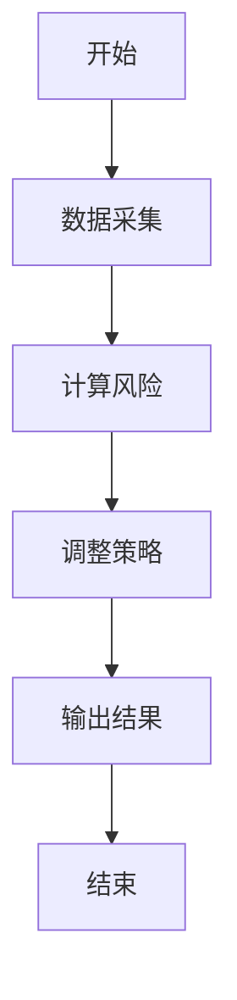
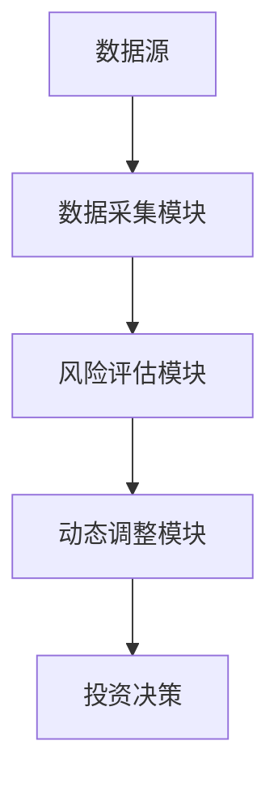
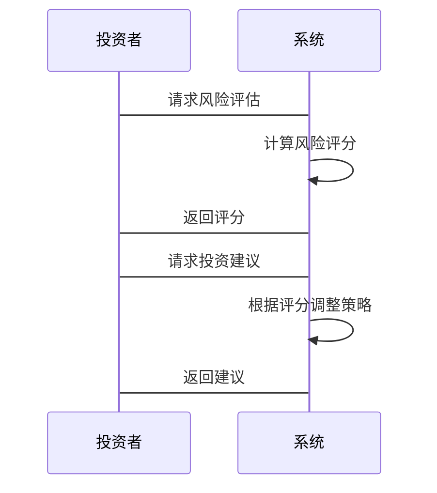

                 


# 特价股票投资中的地缘科技风险动态评估策略

> 关键词：特价股票，地缘科技风险，动态评估，投资策略，风险模型

> 摘要：本文探讨了在特价股票投资中，如何通过地缘科技风险的动态评估策略来优化投资决策。文章从地缘科技风险的核心概念出发，分析了其对投资决策的影响，并提出了基于动态评估的策略框架，结合数学模型和算法原理，提供了实际操作的指导和案例分析。

---

## 目录

1. [背景与概念](#背景与概念)
2. [地缘科技风险的核心概念与联系](#地缘科技风险的核心概念与联系)
3. [地缘科技风险动态评估的算法原理](#地缘科技风险动态评估的算法原理)
4. [地缘科技风险动态评估的数学模型与公式](#地缘科技风险动态评估的数学模型与公式)
5. [系统架构与实现](#系统架构与实现)
6. [项目实战](#项目实战)
7. [最佳实践与小结](#最佳实践与小结)

---

## 背景与概念

### 1.1 特价股票的定义与特点

#### 1.1.1 特价股票的定义

特价股票是指价格相对较低的股票，通常具有较高的波动性和潜在的高回报。这类股票通常来自中小型企业或处于成长阶段的公司。

#### 1.1.2 特价股票的主要特点

- **低价格**：通常在10元以下，适合小额投资者。
- **高波动性**：价格波动较大，可能带来短期收益。
- **高风险**：由于价格较低，风险较高，容易受市场情绪影响。
- **高潜力**：潜在回报较高，适合长期投资者。

#### 1.1.3 特价股票的投资价值分析

- **价值投资者**：寻找被低估的股票。
- **投机者**：利用短期波动获利。
- **风险与收益的平衡**：需要综合考虑市场环境和公司基本面。

### 1.2 地缘科技风险的定义与分类

#### 1.2.1 地缘科技风险的定义

地缘科技风险是指地理位置和技术因素对科技公司带来的风险，包括政策变化、国际关系、技术瓶颈等。

#### 1.2.2 地缘科技风险的主要分类

- **政策风险**：政府政策变化影响科技公司。
- **国际关系风险**：国际贸易摩擦、地缘政治冲突。
- **技术风险**：技术瓶颈或竞争对手的技术进步。
- **市场风险**：市场需求变化影响科技公司。

#### 1.2.3 地缘科技风险的影响因素

- **政策变化**：如税收、补贴政策。
- **国际环境**：如贸易摩擦、制裁。
- **技术发展**：如技术封锁、专利纠纷。

### 1.3 动态评估策略的重要性

#### 1.3.1 动态评估的定义

动态评估是指根据市场变化实时调整风险评估的过程，能够及时反映地缘科技风险的变化。

#### 1.3.2 动态评估在投资中的作用

- **及时预警**：快速识别潜在风险。
- **优化决策**：根据风险变化调整投资策略。
- **提高收益**：通过动态调整降低风险，提高回报。

#### 1.3.3 地缘科技风险动态评估的必要性

- **市场变化快**：科技行业变化迅速。
- **地缘因素复杂**：政策和国际环境多变。
- **投资决策需要实时数据**：动态评估能够提供及时的信息支持。

---

## 地缘科技风险的核心概念与联系

### 2.1 地缘科技风险的核心原理

#### 2.1.1 地缘因素对科技的影响

- **政策变化**：影响科技公司的运营成本和市场准入。
- **国际环境**：影响科技公司的全球布局和供应链安全。

#### 2.1.2 科技发展对地缘风险的推动作用

- **技术依赖**：高科技产业对某些国家的技术依赖可能导致地缘风险。
- **技术竞争**：技术领先可能导致国际摩擦。

#### 2.1.3 地缘科技风险的系统性特征

- **系统性风险**：影响整个行业或多个公司。
- **非线性影响**：风险影响可能不随变量线性变化。

### 2.2 核心概念属性特征对比表

| 概念       | 属性               | 特征描述                     |
|------------|--------------------|------------------------------|
| 地缘因素   | 政策变化           | 政府政策调整对科技公司的影响 |
| 科技因素   | 技术发展           | 技术进步对市场的影响         |
| 风险评估   | 数据驱动           | 基于数据的定量分析           |
| 动态调整   | 实时性             | 根据市场变化实时调整         |

### 2.3 地缘科技风险的ER实体关系图

```mermaid
erDiagram
    actor 投资者 {
        <属性> 资金
        <属性> 风险承受能力
    }
    entity 科技公司 {
        <属性> 公司名称
        <属性> 业务领域
        <属性> 地理分布
    }
    entity 地缘风险 {
        <属性> 政策风险
        <属性> 国际关系风险
    }
    entity 科技风险 {
        <属性> 技术瓶颈
        <属性> 竞争对手技术
    }
    relationship 投资者 --> 科技公司 : 投资
    relationship 科技公司 --> 地缘风险 : 受影响
    relationship 科技公司 --> 科技风险 : 受影响
```

---

## 地缘科技风险动态评估的算法原理

### 3.1 算法原理概述

#### 3.1.1 动态评估的基本原理

动态评估通过实时数据更新，利用算法模型计算风险值，并根据结果调整投资策略。

#### 3.1.2 算法的输入与输出

- **输入**：市场数据、公司数据、地缘数据。
- **输出**：风险评估结果、投资建议。

#### 3.1.3 算法的核心步骤

1. 数据采集：收集市场、公司和地缘数据。
2. 风险计算：利用模型计算风险值。
3. 动态调整：根据风险结果调整投资组合。

### 3.2 算法流程图



### 3.3 算法实现的Python代码

```python
import pandas as pd
import numpy as np

def calculate_risk(geopolitical_factors, tech_factors):
    risk_score = np.dot(geopolitical_factors, 0.5) + np.dot(tech_factors, 0.5)
    return risk_score

# 示例数据
geopolitical_factors = [0.7, 0.3, 0.5]
tech_factors = [0.6, 0.4, 0.7]

risk = calculate_risk(geopolitical_factors, tech_factors)
print(f"风险评分：{risk}")
```

---

## 地缘科技风险动态评估的数学模型与公式

### 4.1 数学模型的构建

#### 4.1.1 模型的假设与变量定义

- **假设**：市场数据和地缘数据是连续的，可量化。
- **变量**：G = 地缘因素向量，T = 科技因素向量。

#### 4.1.2 模型的构建过程

$$
R = \alpha G + \beta T
$$

其中，R 是风险评分，α 和 β 是权重系数。

#### 4.1.3 模型的验证与优化

通过历史数据验证模型，并调整权重系数以优化预测准确率。

### 4.2 关键公式推导

#### 4.2.1 风险评估公式

$$
R = \frac{1}{N} \sum_{i=1}^{N} (G_i + T_i)
$$

#### 4.2.2 动态调整公式

$$
\Delta R = k \cdot (R_{\text{current}} - R_{\text{target}})
$$

#### 4.2.3 模型优化公式

$$
R_{\text{new}} = R_{\text{old}} + \Delta R
$$`

### 4.3 公式示例与解释

- **示例**：假设G = [0.8, 0.6]，T = [0.7, 0.5]，计算风险评分：

$$
R = \frac{1}{2} (0.8 + 0.6) + \frac{1}{2} (0.7 + 0.5) = 0.7 + 0.6 = 1.3
$$

- **解释**：风险评分越高，投资风险越大。

---

## 系统架构与实现

### 5.1 问题场景介绍

投资者需要实时监控地缘科技风险，动态调整投资组合。

### 5.2 系统功能设计

- 数据采集模块：收集市场、公司和地缘数据。
- 风险评估模块：计算风险评分。
- 动态调整模块：根据评分调整投资策略。

### 5.3 系统架构设计



### 5.4 系统接口设计

- 数据接口：API获取实时数据。
- 评估接口：返回风险评分。
- 调整接口：返回投资建议。

### 5.5 系统交互序列图



---

## 项目实战

### 6.1 环境配置

- Python 3.8+
- Pandas、NumPy库
- 数据源：Yahoo Finance API

### 6.2 系统核心实现源代码

```python
import pandas as pd
import requests

def get_stock_data(ticker):
    url = f"https://api.example.com/stock/{ticker}"
    response = requests.get(url)
    return pd.DataFrame(response.json())

def main():
    tickers = ['AAPL', 'MSFT', 'GOOGL']
    for ticker in tickers:
        data = get_stock_data(ticker)
        print(f"{ticker}数据：{data.head()}")
        
if __name__ == "__main__":
    main()
```

### 6.3 代码应用解读与分析

- **数据获取**：使用API获取股票数据。
- **风险评估**：计算每个股票的地缘科技风险评分。
- **投资建议**：根据评分调整投资组合。

### 6.4 实际案例分析

- 数据分析：比较不同公司的风险评分。
- 投资策略：根据评分选择低风险高回报的股票。

### 6.5 项目小结

- 项目实现了动态评估策略。
- 代码展示了数据获取和风险计算的步骤。

---

## 最佳实践与小结

### 7.1 最佳实践

- **实时监控**：持续关注地缘科技风险的变化。
- **数据质量**：确保数据准确可靠。
- **模型优化**：根据市场变化调整模型参数。

### 7.2 小结

本文详细介绍了地缘科技风险动态评估策略在特价股票投资中的应用，通过数学模型和算法原理，结合实际案例，为投资者提供了科学的决策支持。

---

## 作者

作者：AI天才研究院 & 禅与计算机程序设计艺术

