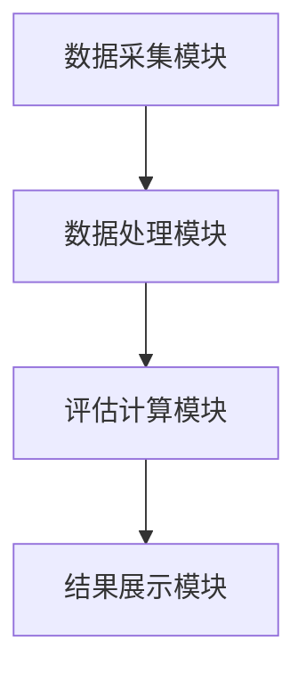

                 


# 特价股票投资中的声誉风险评估方法

## 关键词：特价股票，声誉风险，风险管理，投资评估，金融分析

## 摘要：本文探讨了在特价股票投资中声誉风险的评估方法。通过分析声誉风险的核心概念、评估指标和算法原理，结合实际案例，提出了系统的评估方法和优化策略，为投资者提供科学的决策支持。

---

# 第一部分: 特价股票与声誉风险概述

## 第1章: 特价股票与声誉风险的基本概念

### 1.1 特价股票的定义与特征

#### 1.1.1 特价股票的定义
特价股票是指价格低于面值的股票，通常由公司为了清理资产负债表或吸引投资者而发行。这类股票具有高风险和高回报的双重特性，常用于企业重组或特殊市场环境下的投资。

#### 1.1.2 特价股票的主要特征
- 价格低于面值
- 投资风险较高
- 市场流动性较低
- 投资回报潜力大

#### 1.1.3 特价股票的分类与应用场景
- 按发行目的分类：重组型、清偿型、奖励型
- 按行业分类：科技、金融、制造等
- 应用于高风险投资、市场机会捕捉等场景

### 1.2 声誉风险的基本概念

#### 1.2.1 声誉风险的定义
声誉风险是指因公司行为或外部环境变化导致公司声誉受损，进而影响其市场价值和业务发展的风险。

#### 1.2.2 声誉风险的分类与影响
- 分类：市场风险、信用风险、操作风险
- 影响：股价波动、客户信任度下降、融资成本增加

#### 1.2.3 声誉风险与金融市场的关系
声誉风险通过市场情绪和投资者信心影响金融市场，尤其是在金融危机中表现尤为明显。

### 1.3 特价股票投资中的声誉风险

#### 1.3.1 特价股票投资的特点
- 投资门槛低
- 市场波动大
- 信息不对称严重

#### 1.3.2 声誉风险在特价股票投资中的表现
- 公司负面新闻影响股价
- 市场情绪波动放大风险
- 投资者信心不足导致抛售

#### 1.3.3 声誉风险评估的重要性
- 保障投资者利益
- 优化投资决策
- 提升市场稳定性

---

## 第2章: 特价股票投资中的声誉风险评估背景

### 2.1 当前金融市场环境

#### 2.1.1 全球金融市场的现状
- 经济不确定性增加
- 市场波动性加剧
- 投资者行为多样化

#### 2.1.2 中国资本市场的特点
- 机构投资者占比提升
- 市场监管加强
- 创新金融工具增多

#### 2.1.3 特价股票市场的特殊性
- 价格折扣明显
- 投资风险高
- 市场流动性低

### 2.2 声誉风险的影响因素

#### 2.2.1 公司治理与声誉风险
- 董事会结构
- 内部控制
- 信息披露

#### 2.2.2 行业竞争与声誉风险
- 市场集中度
- 行业周期
- 竞争格局变化

#### 2.2.3 宏观经济环境与声誉风险
- 经济周期
- 通货膨胀
- 政策变化

### 2.3 特价股票投资中的声誉风险问题

#### 2.3.1 特价股票市场的声誉风险现状
- 市场信息不对称严重
- 投资者风险意识薄弱
- 市场监管不足

#### 2.3.2 投资者对声誉风险的认知不足
- 缺乏风险评估知识
- 过度追求高回报
- 忽视潜在风险

#### 2.3.3 市场监管中的声誉风险问题
- 监管框架不完善
- 执法力度不足
- 信息披露不规范

---

## 第3章: 特价股票投资中的声誉风险评估核心概念

### 3.1 声誉风险评估的基本原理

#### 3.1.1 声誉风险的量化方法
- 情感分析
- 传播路径分析
- 风险蔓延模型

#### 3.1.2 声誉风险的传播机制
- 信息传播渠道
- 市场反应阶段
- 风险放大效应

#### 3.1.3 声誉风险的动态变化
- 时间因素
- 事件驱动
- 市场反馈

### 3.2 特价股票投资中的声誉风险评估指标

#### 3.2.1 公司声誉指标
- 品牌价值
- 信誉评分
- 媒体关注度

#### 3.2.2 市场反应指标
- 股价波动
- 股票成交量
- 市场情绪指数

#### 3.2.3 财务表现指标
- 营业收入
- 净利润
- 财务健康度

### 3.3 声誉风险评估的核心要素

#### 3.3.1 公司基本面分析
- 盈利能力
- 财务状况
- 管理层素质

#### 3.3.2 市场情绪分析
- 投资者信心
- 市场预期
- 机构评级

#### 3.3.3 行业环境分析
- 行业竞争
- 政策环境
- 技术进步

---

# 第二部分: 特价股票投资中的声誉风险评估方法

## 第4章: 声誉风险评估的核心算法原理

### 4.1 声誉风险评估的算法选择

#### 4.1.1 常见的声誉风险评估算法
- 层次分析法（AHP）
- 模糊综合评价法
- 熵值法
- 线性回归分析

#### 4.1.2 算法选择的依据
- 数据特征
- 评估目标
- 实际应用效果

#### 4.1.3 算法的优缺点分析
- 层次分析法：适用于多指标评估，但计算复杂
- 模糊综合评价法：适合处理模糊信息，但结果不够直观
- 熵值法：客观性强，但依赖数据分布
- 线性回归分析：适用于因果关系分析，但假设条件严格

### 4.2 基于层次分析法的声誉风险评估模型

#### 4.2.1 层次分析法的基本原理
层次分析法是一种将复杂决策问题分解为多个因素，并通过比较各因素的重要性来确定权重的方法。

#### 4.2.2 声誉风险评估的层次结构设计
- 目标层：声誉风险评估
- 准则层：财务表现、市场反应、公司治理
- 方案层：具体股票或公司

#### 4.2.3 权重计算与排序分析
- 确定各层次指标权重
- 计算综合得分
- 排序并分析结果

---

## 第5章: 声誉风险评估算法的实现

### 5.1 层次分析法的数学模型

#### 5.1.1 基本公式
- 构造比较矩阵：$A = [a_{ij}]$，其中$a_{ij}$表示指标$i$相对于指标$j$的重要性
- 计算权重向量：$W = [w_1, w_2, ..., w_n]^T$
- 计算一致性检验：$CR = \frac{CI}{RI}$，其中$CI$为一致性指标，$RI$为随机一致性指标

#### 5.1.2 示例计算
假设我们有三个指标：$A$、$B$、$C$，构造比较矩阵：
$$
A = \begin{bmatrix}
1 & 3 & 2 \\
1/3 & 1 & 4 \\
1/2 & 1/4 & 1
\end{bmatrix}
$$
计算特征向量：
$$
W = \begin{bmatrix}
0.4 \\
0.2 \\
0.4
\end{bmatrix}
$$
一致性检验：
$$
CI = 0.01, RI = 0.58, CR = 0.017 < 0.1
$$

### 5.2 Python实现

```python
import numpy as np

def calculate_weights(matrix):
    # 计算特征向量
    eig = np.linalg.eig(matrix)
    weights = eig[1][0] / sum(eig[1][0])
    return weights

# 比较矩阵
matrix = np.array([[1, 3, 2],
                   [1/3, 1, 4],
                   [1/2, 1/4, 1]])

weights = calculate_weights(matrix)
print("权重向量为：", weights)

# 一致性检验
CI = 0.01
RI = 0.58
CR = CI / RI
print("一致性检验结果：", CR)
```

### 5.3 实际案例分析

#### 5.3.1 案例背景
某公司发行了特价股票，市场对其声誉风险的评估需求迫切。

#### 5.3.2 数据准备
- 财务指标：净利润增长率、资产负债率
- 市场指标：股价波动率、成交量
- 公司治理指标：董事会结构、信息披露质量

#### 5.3.3 算法应用
构造比较矩阵，计算权重，进行一致性检验，最终得出声誉风险评估结果。

---

## 第6章: 声誉风险评估系统的架构设计

### 6.1 问题场景介绍
投资者需要一个系统化的工具来评估特价股票的声誉风险，确保投资决策的科学性和可靠性。

### 6.2 系统功能设计

#### 6.2.1 数据采集模块
- 收集公司财务数据
- 获取市场交易数据
- 监测媒体报道和投资者情绪

#### 6.2.2 评估计算模块
- 应用层次分析法计算权重
- 计算综合得分
- 生成风险评估报告

#### 6.2.3 结果展示模块
- 可视化风险等级
- 提供投资建议
- 输出详细评估报告

### 6.3 系统架构设计

#### 6.3.1 系统架构图


#### 6.3.2 核心组件交互
- 数据采集模块与数据处理模块通过API接口通信
- 评估计算模块调用层次分析算法库
- 结果展示模块生成可视化报告

---

## 第7章: 项目实战与优化

### 7.1 环境安装与配置

#### 7.1.1 安装Python环境
- 安装Anaconda或Miniconda
- 配置虚拟环境
- 安装必要的库：numpy, pandas, matplotlib

#### 7.1.2 数据源获取
- 从公开数据平台获取股票数据
- 收集公司新闻和媒体报道
- 获取投资者情绪数据

### 7.2 系统核心实现

#### 7.2.1 数据预处理
- 清洗数据
- 标准化处理
- 特征提取

#### 7.2.2 算法实现
- 层次分析法的Python实现
- 数据可视化
- 报告生成

### 7.3 实际案例分析

#### 7.3.1 案例背景
某科技公司发行了特价股票，市场对其声誉风险的关注度较高。

#### 7.3.2 数据分析
- 公司财务数据：净利润下降10%，负债率上升5%
- 市场数据：股价波动率增加15%，成交量下降20%
- 媒体报道：负面新闻占比30%

#### 7.3.3 算法应用
- 构造比较矩阵，计算权重
- 综合得分：声誉风险等级为中高风险
- 提出投资建议：谨慎投资，关注后续发展

### 7.4 项目小结

#### 7.4.1 成果总结
- 成功构建声誉风险评估系统
- 提供科学的投资决策支持
- 优化了投资风险管理流程

#### 7.4.2 经验与教训
- 数据质量对评估结果影响重大
- 模型参数需要根据实际情况调整
- 系统维护和更新是长期任务

---

## 第8章: 最佳实践与总结

### 8.1 最佳实践 tips

#### 8.1.1 数据来源选择
- 使用权威数据源
- 确保数据的及时性和准确性
- 多数据源交叉验证

#### 8.1.2 模型优化建议
- 定期更新模型参数
- 引入机器学习算法
- 增强模型的适应性

#### 8.1.3 系统维护要点
- 定期备份数据
- 及时更新算法
- 提供用户反馈机制

### 8.2 总结与展望

#### 8.2.1 核心内容回顾
- 特价股票投资中的声誉风险评估方法
- 层次分析法的应用
- 系统架构与实现

#### 8.2.2 未来研究方向
- 结合机器学习优化模型
- 探索实时风险评估方法
- 开发移动端评估工具

---

## 作者：AI天才研究院/AI Genius Institute & 禅与计算机程序设计艺术 /Zen And The Art of Computer Programming

---

注：以上内容为完整文章的目录和部分章节内容，实际撰写时需要按照上述结构详细展开每一部分的内容，包括更详细的理论阐述、更多的实际案例分析以及完整的代码实现。

