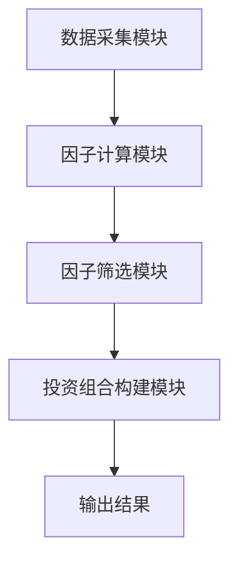
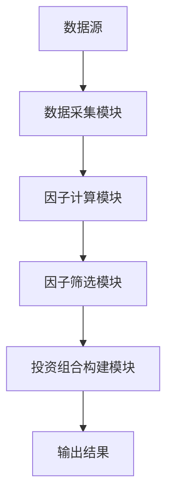

                 


# 特价股票投资中的多因子模型应用

## 关键词：多因子模型、特价股票、投资策略、风险管理、量化分析

## 摘要：  
本文详细探讨了多因子模型在特价股票投资中的应用，从背景介绍、核心概念、算法原理到系统架构和项目实战，结合实际案例分析，揭示了多因子模型在提升投资决策科学性和优化风险控制方面的优势。通过本篇文章，读者将深入了解如何利用多因子模型在特价股票投资中实现更优的收益与风险平衡。

---

# 第1章: 特价股票与多因子模型的背景介绍

## 1.1 多因子模型的起源与发展

### 1.1.1 传统股票投资方法的局限性  
传统股票投资方法，如单一因子模型，往往难以捕捉市场中的多维度信息，导致投资决策的片面性。例如，仅基于市值或市盈率的单一因子难以全面评估股票的投资价值。

### 1.1.2 多因子模型的提出与演变  
为克服单一因子模型的局限性，多因子模型应运而生。多因子模型通过结合多个因子（如市值、价值、动量等）来更全面地评估股票的投资价值。

### 1.1.3 多因子模型在金融领域的应用现状  
目前，多因子模型已在金融领域得到广泛应用，成为机构投资者和量化交易者的重要工具。本文将重点探讨其在特价股票投资中的具体应用。

## 1.2 特价股票的概念与特点

### 1.2.1 特价股票的定义与分类  
特价股票通常指市场价格相对较低的股票，分为低价股、小盘股、价值股等多种类型。

### 1.2.2 特价股票的投资价值分析  
特价股票往往具有较高的潜在收益，但也伴随着较高的风险。通过多因子模型，投资者可以更科学地评估特价股票的投资价值。

### 1.2.3 特价股票与市场周期的关系  
特价股票的表现通常与市场周期密切相关。在熊市中，特价股票可能更具投资吸引力；而在牛市中，高价股可能表现更优。

## 1.3 多因子模型在特价股票投资中的意义

### 1.3.1 提高投资决策的科学性  
多因子模型通过综合考虑多个因子，帮助投资者更全面地评估特价股票的投资价值。

### 1.3.2 优化投资组合的风险控制  
通过多因子模型，投资者可以更好地分散风险，优化投资组合的配置。

### 1.3.3 降低市场波动对投资的影响  
多因子模型通过结合多个因子，减少了单一因子模型的波动性，提高了投资决策的稳定性。

## 1.4 本章小结  
本章介绍了多因子模型的起源与发展，明确了特价股票的定义与特点，并阐述了多因子模型在特价股票投资中的重要意义。

---

# 第2章: 多因子模型的核心概念与联系

## 2.1 多因子模型的原理与构成

### 2.1.1 多因子模型的基本原理  
多因子模型通过构建多个因子，综合评估股票的投资价值。每个因子代表一个影响股票收益的重要因素。

### 2.1.2 多因子模型的核心要素  
多因子模型通常包括以下几个核心要素：  
1. 因子选择：选择具有解释力和预测力的因子。  
2. 因子权重：确定各因子的权重，反映其重要性。  
3. 因子组合：通过组合各因子，构建综合的投资策略。

### 2.1.3 多因子模型的数学表达式  
多因子模型的数学表达式可以表示为：  
$$ R_i = \alpha + \beta_1F_1 + \beta_2F_2 + \dots + \beta_nF_n + \epsilon $$  
其中，$R_i$ 是股票i的收益，$F_j$ 是因子j，$\beta_j$ 是因子j的权重，$\epsilon$ 是误差项。

## 2.2 多因子模型中的关键因子

### 2.2.1 市值因子（Size）  
市值因子反映了股票的市值大小，通常用对数市值（log(size)）表示。

### 2.2.2 价值因子（Value）  
价值因子通过衡量股票的市盈率（PE）、市净率（PB）等指标，反映股票的内在价值。

### 2.2.3 动量因子（Momentum）  
动量因子基于股票的历史收益，反映股票的动量效应。

### 2.2.4 流动性因子（Liquidity）  
流动性因子衡量股票的交易量和换手率，反映股票的流动性。

### 2.2.5 质量因子（Quality）  
质量因子通过衡量公司的盈利能力、ROE等指标，反映公司的经营质量。

## 2.3 多因子模型的因子间关系

### 2.3.1 因子间的相关性分析  
因子间的相关性会影响多因子模型的性能。通常，选择相关性较低的因子可以提高模型的解释力。

### 2.3.2 因子权重的确定方法  
因子权重的确定可以通过回归分析、主成分分析（PCA）等方法实现。

### 2.3.3 因子的动态调整机制  
多因子模型需要根据市场变化动态调整因子权重，以保持模型的有效性。

## 2.4 本章小结  
本章详细介绍了多因子模型的核心概念与构成，分析了各因子的定义、特征及其间的相互关系。

---

# 第3章: 多因子模型的算法原理与数学模型

## 3.1 多因子模型的算法流程

### 3.1.1 数据采集与预处理  
数据采集包括获取股票的历史价格、财务数据等，预处理包括数据清洗、标准化等步骤。

### 3.1.2 因子计算与筛选  
根据选定的因子计算指标，如计算市值因子、价值因子等，并进行因子筛选，剔除相关性较高的因子。

### 3.1.3 因子权重的优化  
通过回归分析或主成分分析（PCA）等方法，确定各因子的权重。

### 3.1.4 投资组合的构建与优化  
根据因子权重构建投资组合，并进行风险调整，优化投资组合的收益与风险比。

## 3.2 多因子模型的数学公式

### 3.2.1 单因子模型的数学表达  
单因子模型的数学表达式为：  
$$ R_i = \alpha + \beta F + \epsilon $$  
其中，$F$ 是因子，$\beta$ 是因子的系数。

### 3.2.2 多因子模型的数学表达  
多因子模型的数学表达式为：  
$$ R_i = \alpha + \beta_1F_1 + \beta_2F_2 + \dots + \beta_nF_n + \epsilon $$  
其中，$F_j$ 是第j个因子，$\beta_j$ 是因子j的权重。

## 3.3 多因子模型的实现步骤

### 3.3.1 数据预处理  
1. 数据清洗：处理缺失值、异常值等。  
2. 数据标准化：对数据进行标准化处理，使其具有可比性。

### 3.3.2 因子计算  
1. 计算各因子指标，如市值因子、价值因子等。  
2. 对因子进行排序或分组，如将股票按因子值分为高、中、低三组。

### 3.3.3 因子筛选  
1. 计算各因子与收益的相关性，剔除相关性较高的因子。  
2. 使用主成分分析（PCA）等方法进一步筛选因子。

### 3.3.4 构建投资组合  
1. 根据因子权重构建投资组合。  
2. 计算投资组合的收益与风险，进行优化调整。

## 3.4 本章小结  
本章详细介绍了多因子模型的算法流程与数学模型，为后续的系统设计与实现奠定了基础。

---

# 第4章: 多因子模型的系统分析与架构设计

## 4.1 项目背景与目标

### 4.1.1 项目背景  
本项目旨在利用多因子模型对特价股票进行投资分析，帮助投资者制定科学的投资策略。

### 4.1.2 项目目标  
通过构建多因子模型，实现对特价股票的量化分析，优化投资组合的收益与风险比。

## 4.2 系统功能设计

### 4.2.1 数据采集模块  
功能：从数据源获取股票的历史价格、财务数据等。  
输入：数据源地址、数据时间范围。  
输出：清洗后的数据集。

### 4.2.2 因子计算模块  
功能：计算各因子指标，如市值因子、价值因子等。  
输入：清洗后的数据集。  
输出：各因子的计算结果。

### 4.2.3 因子筛选模块  
功能：对因子进行筛选，剔除相关性较高的因子。  
输入：各因子的计算结果。  
输出：筛选后的因子列表。

### 4.2.4 投资组合构建模块  
功能：根据因子权重构建投资组合，并进行优化调整。  
输入：筛选后的因子列表。  
输出：优化后的投资组合。

## 4.3 系统架构设计

### 4.3.1 系统架构图  


### 4.3.2 数据流图  


## 4.4 系统接口设计

### 4.4.1 数据接口  
接口名称：GetData  
输入参数：数据类型、数据时间范围。  
输出参数：清洗后的数据集。

### 4.4.2 因子计算接口  
接口名称：ComputeFactor  
输入参数：数据集、因子类型。  
输出参数：因子计算结果。

## 4.5 本章小结  
本章详细介绍了系统的架构设计与功能模块，为后续的系统实现奠定了基础。

---

# 第5章: 多因子模型的项目实战

## 5.1 环境安装与配置

### 5.1.1 安装Python环境  
安装Python 3.8以上版本，安装pip工具。

### 5.1.2 安装依赖库  
安装必要的Python库，如pandas、numpy、scikit-learn、matplotlib等。

### 5.1.3 数据源获取  
从数据源获取股票的历史价格、财务数据等，保存为CSV格式。

## 5.2 系统核心实现

### 5.2.1 数据预处理  
1. 读取数据：使用pandas读取CSV文件。  
2. 数据清洗：处理缺失值、异常值。  
3. 数据标准化：对数据进行标准化处理。

### 5.2.2 因子计算  
1. 计算市值因子：对股票的市值取对数（log(size)）。  
2. 计算价值因子：计算市盈率（PE）和市净率（PB）。  
3. 计算动量因子：计算过去12个月的收益（MOM）。  
4. 计算流动性因子：计算股票的换手率。  
5. 计算质量因子：计算ROE（净资产收益率）。

### 5.2.3 因子筛选  
1. 计算各因子与收益的相关性，剔除相关性较高的因子。  
2. 使用主成分分析（PCA）进一步筛选因子。

### 5.2.4 构建投资组合  
1. 根据因子权重构建投资组合。  
2. 计算投资组合的收益与风险，进行优化调整。

## 5.3 代码实现

### 5.3.1 数据预处理代码  
```python
import pandas as pd
import numpy as np

# 读取数据
data = pd.read_csv('stock_data.csv')

# 数据清洗
data.dropna(inplace=True)
data = data[~data['volume'].isin([0])]

# 数据标准化
data['price'] = data['price'].apply(lambda x: np.log(x))
```

### 5.3.2 因子计算代码  
```python
# 市值因子
data['size'] = data['market_cap'].apply(lambda x: np.log(x))

# 价值因子
data['pe'] = data['price'] / data['eps']
data['pb'] = data['price'] / data['book_value']

# 动量因子
data['mom'] = data['return'].rolling(12).mean()

# 流动性因子
data['volatility'] = data['return'].std()

# 质量因子
data['ro

