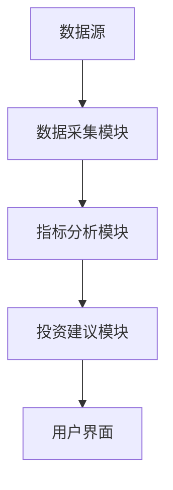
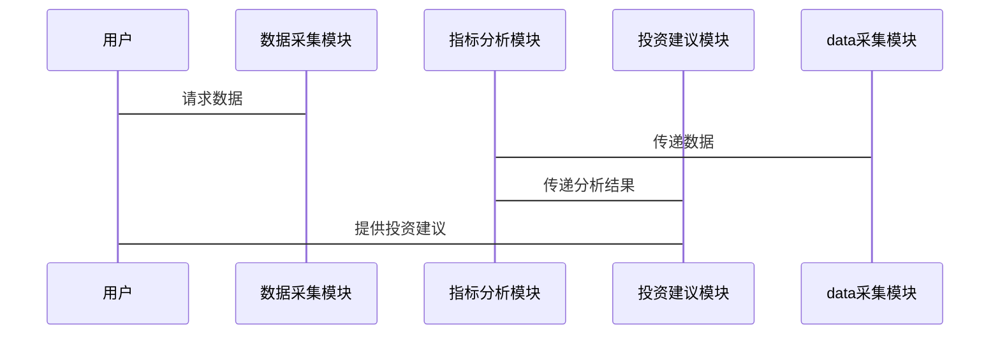

                 


# 特价股票投资中的宏观经济因素分析

## 关键词：特价股票、宏观经济因素、股票投资、经济指标、投资策略

## 摘要：本文系统地探讨了在特价股票投资中宏观经济因素的重要性及其分析方法。通过分析GDP、利率、通货膨胀等宏观经济指标，揭示其对股票市场的影响机制，并构建数学模型指导投资决策。文章结合实际案例，详细讲解了如何量化宏观经济因素，设计投资策略，并通过系统架构实现投资分析。本文旨在为投资者提供科学的分析工具和方法，帮助其在宏观经济波动中做出明智的投资决策。

---

## 第一部分: 特价股票与宏观经济因素概述

### 第1章: 特价股票与宏观经济因素概述

#### 1.1 特价股票的定义与特点

##### 1.1.1 特价股票的定义
特价股票是指价格相对较低的股票，通常属于小盘股或中盘股，具有较高的增长潜力或价值重估空间。这类股票通常被投资者视为“被低估”的投资标的。

##### 1.1.2 特价股票的特点
- **低估值**：市场价格低于内在价值，具有较高的上涨潜力。
- **高波动性**：由于市值较小，容易受到市场情绪和资金流动的影响。
- **风险较高**：相对于大盘股，特价股票的风险通常更高，但潜在回报也更大。

##### 1.1.3 特价股票与普通股票的区别
| 特性 | 特价股票 | 普通股票 |
|------|----------|----------|
| 市值  | 较小     | 较大     |
| 波动性 | 较高     | 较低     |
| 风险  | 较高     | 较低     |
| 潜力  | 较大     | 较稳定   |

#### 1.2 宏观经济因素的基本概念

##### 1.2.1 宏观经济的定义
宏观经济是指整个国家或地区的经济活动，包括GDP、就业率、通货膨胀、利率等关键指标。

##### 1.2.2 宏观经济指标的分类
- **总量指标**：GDP、失业率、通胀率。
- **价格指标**：CPI（消费者物价指数）、PPI（生产者物价指数）。
- **金融指标**：利率、汇率、信贷增速。

##### 1.2.3 宏观经济因素对股票市场的影响
- **直接影响**：通过改变企业盈利能力和市场流动性影响股价。
- **间接影响**：通过影响投资者情绪和市场预期间接影响股价。

#### 1.3 特价股票投资中的宏观经济因素分析

##### 1.3.1 特价股票与宏观经济的关联性
特价股票的价格波动往往与宏观经济环境密切相关，尤其是在经济周期波动时，特价股票的表现更具敏感性。

##### 1.3.2 特价股票投资中的宏观经济分析方法
- **定量分析**：通过宏观经济指标构建量化模型，评估宏观经济环境对特价股票的影响。
- **定性分析**：结合经济周期、行业趋势等进行综合判断，制定投资策略。

##### 1.3.3 特价股票投资中的宏观经济风险
- **经济下行风险**：经济衰退可能导致企业盈利下降，进而影响股票价格。
- **政策风险**：宏观经济政策变化（如加息、财政紧缩）可能对股票市场产生重大影响。

---

## 第二部分: 宏观经济因素对股票市场的影响

### 第2章: 宏观经济因素对股票市场的影响

#### 2.1 宏观经济指标对股票市场的影响

##### 2.1.1 GDP对股票市场的影响
GDP是衡量经济健康状况的重要指标。GDP增长通常意味着企业盈利能力增强，推动股价上涨。

##### 2.1.2 利率对股票市场的影响
- **加息周期**：提高企业融资成本，抑制市场流动性，通常导致股价下跌。
- **降息周期**：降低融资成本，增加市场流动性，通常推动股价上涨。

##### 2.1.3 通货膨胀对股票市场的影响
- **适度通胀**：提升企业盈利能力，推动股价上涨。
- **过热通胀**：可能导致货币政策收紧，抑制股价表现。

#### 2.2 宏观经济政策对股票市场的影响

##### 2.2.1 财政政策对股票市场的影响
- **财政刺激**：增加政府支出，提升企业盈利，推动股价上涨。
- **财政紧缩**：减少政府支出，可能导致企业盈利下降，抑制股价表现。

##### 2.2.2 货币政策对股票市场的影响
- **宽松货币政策**：降低利率，增加市场流动性，通常推动股价上涨。
- **紧缩货币政策**：提高利率，减少市场流动性，通常导致股价下跌。

##### 2.2.3 产业政策对股票市场的影响
- **行业支持政策**：推动特定行业的发展，提升相关股票的表现。
- **行业限制政策**：对某些行业施加限制，可能导致相关股票价格下跌。

#### 2.3 宏观经济环境对特价股票的影响

##### 2.3.1 宏观经济环境对特价股票的直接影响
- **经济繁荣**：投资者倾向于投资高价股，特价股票可能被忽视。
- **经济衰退**：投资者可能转向特价股票，寻找价值重估机会。

##### 2.3.2 宏观经济环境对特价股票的间接影响
- **市场流动性**：宏观经济环境影响市场整体流动性，进而影响特价股票的表现。
- **行业景气度**：宏观经济环境影响行业景气度，进而影响特价股票的投资价值。

##### 2.3.3 宏观经济环境对特价股票投资策略的影响
- **经济周期判断**：在经济衰退期，投资者可以关注具有抗跌性的特价股票。
- **政策环境分析**：根据宏观经济政策调整投资策略，规避政策风险。

---

## 第三部分: 特价股票投资中的宏观经济因素分析方法

### 第3章: 特价股票投资中的宏观经济因素分析方法

#### 3.1 特价股票投资中的宏观经济指标选择

##### 3.1.1 宏观经济指标的选择标准
- **相关性**：选择与股票市场高度相关的宏观经济指标。
- **可量化性**：选择能够量化分析的指标，便于构建数学模型。
- **实时性**：选择具有较高时效性的指标，以便及时调整投资策略。

##### 3.1.2 常用宏观经济指标的筛选
- **GDP增长率**：衡量经济整体表现。
- **CPI**：衡量通货膨胀水平。
- **利率水平**：衡量货币政策对市场的影响。
- ** unemployment rate**：衡量就业市场状况。

##### 3.1.3 宏观经济指标的权重分配
根据历史数据和实际表现，对不同宏观经济指标赋予不同的权重。例如，GDP增长率和利率水平可能具有较高的权重，而CPI和失业率可能权重较低。

#### 3.2 特价股票投资中的宏观经济因素分析模型

##### 3.2.1 模型构建的基本思路
- **数据收集**：收集相关宏观经济指标和股票价格数据。
- **数据预处理**：对数据进行清洗和标准化处理。
- **模型构建**：基于宏观经济指标构建回归模型或其他量化模型。
- **模型验证**：通过历史数据验证模型的有效性。

##### 3.2.2 模型的输入变量与输出变量
- **输入变量**：宏观经济指标（如GDP增长率、利率、CPI等）。
- **输出变量**：股票价格或股票收益预测值。

##### 3.2.3 模型的假设条件与限制
- **假设条件**：宏观经济指标与股票价格存在线性关系。
- **限制条件**：模型仅适用于特定市场环境，可能无法涵盖所有影响因素。

#### 3.3 宏观经济因素对特价股票的影响分析

##### 3.3.1 宏观经济因素对特价股票的直接影响
- **企业盈利**：宏观经济环境影响企业盈利能力，进而影响股票价格。
- **市场流动性**：宏观经济政策影响市场流动性，进而影响股票价格。

##### 3.3.2 宏观经济因素对特价股票的间接影响
- **行业趋势**：宏观经济环境影响行业发展趋势，进而影响特价股票的投资价值。
- **投资者情绪**：宏观经济环境影响投资者情绪，进而影响股票市场整体表现。

##### 3.3.3 宏观经济因素对特价股票投资策略的影响
- **经济周期判断**：在不同经济周期中，调整投资策略。
- **行业选择**：根据宏观经济环境选择具有抗跌性的行业进行投资。

---

## 第四部分: 特价股票投资中的宏观经济因素分析模型

### 第4章: 特价股票投资中的宏观经济因素分析模型

#### 4.1 宏观经济指标的量化分析

##### 4.1.1 宏观经济指标的量化方法
- **标准化处理**：将不同指标的数值标准化，便于比较和分析。
- **加权平均法**：根据权重对不同指标进行加权平均，得出综合指数。

##### 4.1.2 宏观经济指标的量化公式
$$ 综合指数 = \sum_{i=1}^{n} (w_i \times x_i) $$
其中，$w_i$ 是第 $i$ 个指标的权重，$x_i$ 是第 $i$ 个指标的数值。

#### 4.2 宏观经济因素对特价股票的影响模型

##### 4.2.1 模型构建的数学表达
$$ 股票收益 = \beta_0 + \beta_1 \times GDP增长率 + \beta_2 \times 利率 + \epsilon $$
其中，$\beta_0$ 是截距，$\beta_1$ 和 $\beta_2$ 是回归系数，$\epsilon$ 是误差项。

##### 4.2.2 模型的参数估计
通过最小二乘法估计回归系数，构建模型。

##### 4.2.3 模型的验证与优化
通过历史数据验证模型的拟合优度，调整模型参数，优化模型表现。

#### 4.3 宏观经济因素对特价股票的评分系统

##### 4.3.1 评分系统的构建思路
- **指标选择**：选择与特价股票相关的宏观经济指标。
- **指标权重**：根据历史数据确定各指标的权重。
- **评分计算**：根据当前宏观经济指标值，计算评分。
- **投资决策**：根据评分制定投资策略。

##### 4.3.2 评分系统的具体实现
$$ 评分 = \sum_{i=1}^{n} (w_i \times x_i) $$
其中，$w_i$ 是第 $i$ 个指标的权重，$x_i$ 是第 $i$ 个指标的当前值。

---

## 第五部分: 特价股票投资中的宏观经济因素分析系统

### 第5章: 特价股票投资中的宏观经济因素分析系统

#### 5.1 系统背景与目标

##### 5.1.1 系统背景
- **需求背景**：投资者需要基于宏观经济因素进行投资决策。
- **技术背景**：利用大数据和人工智能技术，构建自动化分析系统。

##### 5.1.2 系统目标
- **目标一**：提供宏观经济因素对特价股票影响的量化分析。
- **目标二**：帮助投资者制定基于宏观经济分析的投资策略。

#### 5.2 系统功能设计

##### 5.2.1 系统功能模块
- **数据采集模块**：采集宏观经济指标和股票市场数据。
- **指标分析模块**：对宏观经济指标进行量化分析，计算评分。
- **投资建议模块**：根据分析结果，生成投资建议。

##### 5.2.2 系统功能流程
1. 数据采集模块获取宏观经济指标和股票市场数据。
2. 指标分析模块对数据进行处理，计算综合评分。
3. 投资建议模块根据评分结果，生成投资建议。

#### 5.3 系统架构设计

##### 5.3.1 系统架构图


##### 5.3.2 系统接口设计
- **数据接口**：与数据源对接，获取宏观经济指标和股票数据。
- **用户接口**：向用户展示分析结果和投资建议。

##### 5.3.3 系统交互流程


---

## 第六部分: 特价股票投资中的宏观经济因素分析项目实战

### 第6章: 项目实战

#### 6.1 环境安装与配置

##### 6.1.1 环境要求
- **操作系统**：Windows/Mac/Linux
- **编程语言**：Python 3.8+
- **库与工具**：Pandas、NumPy、Scikit-learn、Plotly

##### 6.1.2 安装步骤
```bash
pip install pandas numpy scikit-learn plotly
```

#### 6.2 核心代码实现

##### 6.2.1 数据采集模块
```python
import pandas as pd

def get_macroeconomic_data():
    # 示例：从数据库或API获取宏观经济指标
    data = {
        'GDP增长率': [3.5, 4.2, 2.8, 3.1],
        '利率': [5.0, 4.5, 6.0, 5.5],
        'CPI': [2.1, 1.8, 2.5, 2.2]
    }
    return pd.DataFrame(data)

def get_stock_data(ticker):
    # 示例：从数据库或API获取股票数据
    stock_data = {
        '日期': ['2023-01-01', '2023-01-02', '2023-01-03', '2023-01-04'],
        '收盘价': [10.5, 11.0, 10.8, 11.2]
    }
    return pd.DataFrame(stock_data)
```

##### 6.2.2 指标分析模块
```python
import numpy as np

def calculate_score(data, weights):
    return np.dot(data, weights)

weights = [0.4, 0.3, 0.3]
data = get_macroeconomic_data()
score = calculate_score(data, weights)
print("综合评分:", score)
```

##### 6.2.3 投资建议模块
```python
from sklearn.linear_model import LinearRegression

def generate_investment_recommendation(data):
    model = LinearRegression()
    model.fit(data[['GDP增长率', '利率', 'CPI']], data['收盘价'])
    return model.predict(data[['GDP增长率', '利率', 'CPI']])

recommendation = generate_investment_recommendation(data)
print("投资建议:", recommendation)
```

#### 6.3 项目小结

##### 6.3.1 项目总结
通过本项目，我们构建了一个基于宏观经济因素的特价股票分析系统，能够量化宏观经济指标对股票价格的影响，并提供投资建议。

##### 6.3.2 项目成果
- **量化分析模型**：基于宏观经济指标的量化分析模型。
- **投资建议系统**：能够根据宏观经济指标变化，自动生成投资建议。

##### 6.3.3 项目经验
- **数据质量**：宏观经济数据的准确性和及时性对模型性能影响较大。
- **模型优化**：需要根据实际情况不断优化模型参数和结构。

---

## 第七部分: 特价股票投资中的宏观经济因素分析最佳实践

### 第7章: 最佳实践

#### 7.1 小结

##### 7.1.1 核心观点回顾
- 宏观经济因素对特价股票投资具有重要影响。
- 通过量化分析和系统设计，可以有效提升投资决策的科学性。

##### 7.1.2 关键点总结
- **数据驱动**：基于数据的量化分析是宏观经济因素分析的基础。
- **模型优化**：需要根据实际情况不断优化分析模型。
- **风险管理**：宏观经济因素分析需要结合风险管理，规避投资风险。

#### 7.2 注意事项

##### 7.2.1 数据来源的可靠性
确保宏观经济数据和股票数据的准确性和及时性。

##### 7.2.2 模型的局限性
宏观经济因素分析模型仅能提供参考，不能完全替代人工判断。

##### 7.2.3 投资风险控制
在实际投资中，需要结合其他因素，如行业趋势和公司基本面，进行综合判断。

#### 7.3 拓展阅读

##### 7.3.1 推荐书籍
- 《投资学》（《Investments》）—— 岩崎哲
- 《宏观经济学》（《Macroeconomics》）—— N. Gregory Mankiw

##### 7.3.2 推荐文章
- 特价股票投资策略
- 宏观经济分析与股票投资

##### 7.3.3 推荐在线资源
- 美联储经济报告
- 国际货币基金组织（IMF）报告

---

## 作者：AI天才研究院/AI Genius Institute & 禅与计算机程序设计艺术 /Zen And The Art of Computer Programming

