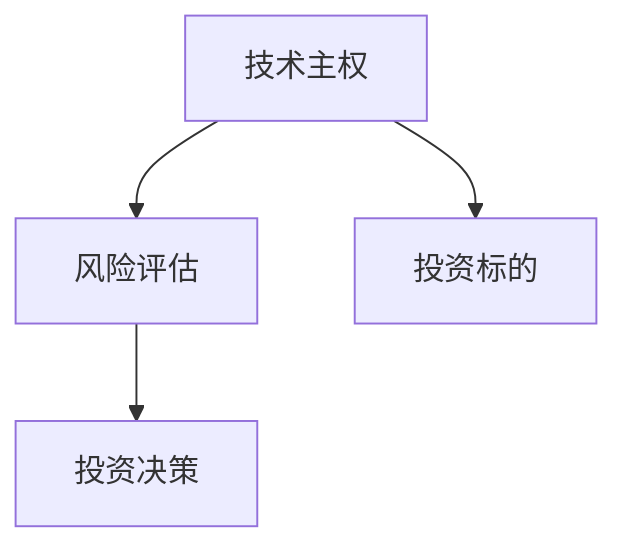
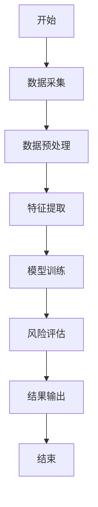
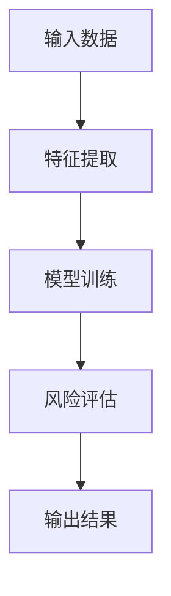
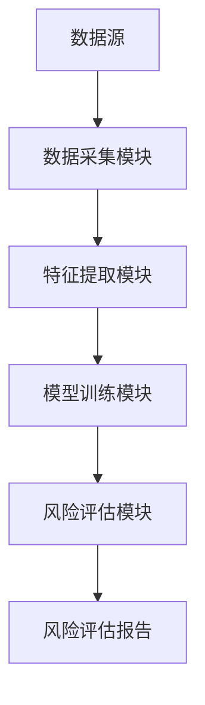
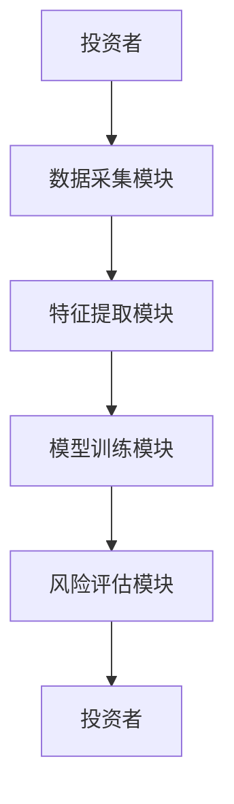

                 


# 特价股票投资中的技术主权风险评估

## 关键词：
特价股票投资、技术主权、风险评估、算法原理、系统设计、项目实战、投资策略

## 摘要：
本文深入探讨了在特价股票投资中技术主权风险的评估方法，结合背景介绍、核心概念、算法原理、系统设计、项目实战等多维度内容，分析了技术主权风险对投资决策的影响。文章通过详细的技术分析和实际案例，提供了从理论到实践的全面指导，帮助投资者在技术主权风险评估中做出明智决策。

---

# 第1章: 特价股票投资与技术主权风险概述

## 1.1 特价股票投资的背景与概念

### 1.1.1 特价股票投资的定义
特价股票投资是指投资者在特定条件下，以低于市场价或折扣价购买股票，以期在价格回升时获利的投资行为。这种投资方式通常涉及较高的市场敏感性和策略性，投资者需要对市场波动、公司基本面和技术因素有深刻理解。

### 1.1.2 特价股票投资的核心特征
- **价格折扣**：投资者以低于市场价购买股票。
- **短期机会**：通常基于市场短期波动，投资周期较短。
- **高风险高收益**：由于价格波动剧烈，风险较高，但潜在收益也较大。

### 1.1.3 技术主权风险的内涵与外延
技术主权风险是指在投资过程中，由于技术依赖或技术缺陷导致的潜在风险，包括数据泄露、技术垄断、技术更新不及时等。其外延涉及技术供应链、技术依赖性、技术安全等多个方面。

---

## 1.2 技术主权风险的基本概念

### 1.2.1 技术主权的定义
技术主权是指一个国家或企业在关键技术和核心领域中，拥有自主可控的技术能力，能够避免对外部技术的过度依赖。在投资领域，技术主权风险指的是由于技术依赖导致的投资损失风险。

### 1.2.2 技术主权风险的分类
- **数据风险**：数据泄露或滥用导致的投资损失。
- **供应链风险**：技术供应链中断影响投资价值。
- **技术更新风险**：技术落后或更新不及时导致投资失败。

### 1.2.3 技术主权风险与投资决策的关系
技术主权风险直接影响投资决策，特别是在选择投资标的和技术依赖性较高的领域，投资者需要评估技术主权风险，以避免潜在损失。

---

## 1.3 技术主权风险评估的重要性

### 1.3.1 技术主权风险对投资的影响
技术主权风险可能导致投资损失、资产贬值或投资机会的丧失。特别是在技术依赖性较高的行业，如科技、金融等，技术主权风险更为显著。

### 1.3.2 技术主权风险评估的必要性
通过评估技术主权风险，投资者可以更好地理解投资标的的技术依赖性，制定更为稳健的投资策略，降低潜在风险。

### 1.3.3 技术主权风险评估的边界与外延
技术主权风险评估的边界包括技术供应链、技术更新和数据安全等方面。其外延涉及技术依赖性较高的行业和领域。

---

## 1.4 本章小结
本章通过对特价股票投资和技术主权风险的定义、分类和重要性的分析，为后续的技术主权风险评估奠定了基础。

---

# 第2章: 技术主权风险评估的核心概念与联系

## 2.1 技术主权风险评估的原理

### 2.1.1 技术主权风险评估的逻辑框架
技术主权风险评估的逻辑框架包括数据采集、特征提取、模型训练和风险评估四个阶段。

### 2.1.2 技术主权风险评估的关键要素
- **数据源**：包括市场数据、公司基本面数据和技术数据。
- **特征提取**：从数据中提取关键特征，如技术依赖性、供应链稳定性等。
- **模型训练**：使用机器学习算法对特征进行训练，生成风险评估模型。

### 2.1.3 技术主权风险评估的数学模型
风险评估模型可以表示为：
$$ R = \sum_{i=1}^{n} w_i x_i $$
其中，$R$ 表示风险值，$w_i$ 表示第 $i$ 个特征的权重，$x_i$ 表示第 $i$ 个特征的值。

---

## 2.2 核心概念与联系的对比分析

### 2.2.1 技术主权与风险评估的对比表格
| 概念 | 定义 | 关系 |
|------|------|------|
| 技术主权 | 自主可控的技术能力 | 技术主权风险评估的核心要素 |
| 风险评估 | 评估潜在风险的过程 | 技术主权风险评估的主要方法 |

### 2.2.2 技术主权风险评估的ER实体关系图


---

## 2.3 技术主权风险评估的流程图


---

## 2.4 本章小结
本章通过分析技术主权风险评估的核心概念和流程，为后续的算法原理和系统设计提供了理论基础。

---

# 第3章: 技术主权风险评估的算法原理

## 3.1 算法原理概述

### 3.1.1 算法选择的依据
选择算法时，需要考虑数据类型、计算复杂度和模型解释性等因素。常用的算法包括层次分析法（AHP）和贝叶斯网络。

### 3.1.2 算法的核心思想
层次分析法通过构建层次结构，对各因素进行权重分配，最终计算出风险值。贝叶斯网络则通过概率推理，评估各因素对风险的影响。

### 3.1.3 算法的优缺点分析
- **层次分析法**：优点是简单易懂，缺点是计算复杂度较高。
- **贝叶斯网络**：优点是计算效率高，缺点是模型构建复杂。

---

## 3.2 算法的Mermaid流程图


---

## 3.3 算法的数学模型与公式

### 3.3.1 风险评估的数学模型
$$ R = \sum_{i=1}^{n} w_i x_i $$
其中，$w_i$ 表示第 $i$ 个特征的权重，$x_i$ 表示第 $i$ 个特征的值。

### 3.3.2 权重计算的公式
$$ w_i = \frac{f_i}{\sum_{j=1}^{m} f_j} $$

---

## 3.4 本章小结
本章详细介绍了技术主权风险评估的算法原理，为后续的系统设计和项目实战奠定了基础。

---

# 第4章: 技术主权风险评估的系统设计

## 4.1 系统分析与架构设计方案

### 4.1.1 问题场景介绍
投资者需要评估特定股票的技术主权风险，以制定投资策略。

### 4.1.2 系统功能设计
- **数据采集模块**：采集市场数据、公司基本面数据和技术数据。
- **特征提取模块**：提取关键特征，如技术依赖性、供应链稳定性等。
- **模型训练模块**：使用机器学习算法对特征进行训练，生成风险评估模型。
- **风险评估模块**：根据模型计算风险值，并生成风险评估报告。

### 4.1.3 系统架构设计


### 4.1.4 系统接口设计
- **输入接口**：接收数据源和用户请求。
- **输出接口**：输出风险评估报告和投资建议。

### 4.1.5 系统交互流程图


---

## 4.2 本章小结
本章通过系统设计，详细描述了技术主权风险评估的实现过程，为项目实战提供了指导。

---

# 第5章: 技术主权风险评估的项目实战

## 5.1 项目环境与工具安装

### 5.1.1 环境要求
- **操作系统**：Windows 10 或更高版本，或 macOS 10.15 或更高版本。
- **编程语言**：Python 3.8 或更高版本。
- **开发工具**：Jupyter Notebook 或 PyCharm。

### 5.1.2 工具安装
- **数据处理工具**：Pandas、NumPy。
- **机器学习库**：Scikit-learn、XGBoost。
- **可视化工具**：Matplotlib、Seaborn。

---

## 5.2 系统核心实现源代码

### 5.2.1 数据处理代码
```python
import pandas as pd
import numpy as np

# 数据加载
data = pd.read_csv('stock_data.csv')

# 数据预处理
data = data.dropna()
data['label'] = data['label'].astype(int)
```

### 5.2.2 特征提取代码
```python
from sklearn.preprocessing import StandardScaler

# 特征提取
features = data[['feature1', 'feature2', 'feature3']]
scaler = StandardScaler()
features_scaled = scaler.fit_transform(features)
```

### 5.2.3 模型训练代码
```python
from sklearn.model_selection import train_test_split
from sklearn.ensemble import RandomForestClassifier

# 数据分割
X_train, X_test, y_train, y_test = train_test_split(features_scaled, data['label'], test_size=0.2)

# 模型训练
model = RandomForestClassifier(n_estimators=100)
model.fit(X_train, y_train)
```

### 5.2.4 风险评估代码
```python
# 风险评估
importances = model.feature_importances_
feature_names = ['feature1', 'feature2', 'feature3']
importance_df = pd.DataFrame({'feature': feature_names, 'importance': importances})
importance_df = importance_df.sort_values(by='importance', ascending=False)
print(importance_df)
```

---

## 5.3 代码应用解读与分析

### 5.3.1 数据处理
数据加载和预处理是技术主权风险评估的第一步，确保数据的完整性和准确性。

### 5.3.2 特征提取
特征提取是关键步骤，选择合适的特征能够提高模型的准确性和可靠性。

### 5.3.3 模型训练
使用随机森林算法进行模型训练，能够有效捕捉特征的重要性，并进行风险评估。

---

## 5.4 实际案例分析

### 5.4.1 案例背景
假设投资者需要评估某科技公司的技术主权风险，数据包括市场数据、公司基本面数据和技术数据。

### 5.4.2 案例分析
通过模型训练和风险评估，得出该公司的技术主权风险值为中等偏高，建议投资者谨慎投资。

---

## 5.5 项目小结
本章通过实际案例分析，展示了技术主权风险评估的实现过程，帮助投资者更好地理解和应用相关技术。

---

# 第6章: 技术主权风险评估的最佳实践

## 6.1 小结与注意事项

### 6.1.1 小结
技术主权风险评估是特价股票投资中不可忽视的重要环节，通过科学的评估方法和系统的实现，能够有效降低投资风险。

### 6.1.2 注意事项
- 数据来源的可靠性。
- 模型的适用性和准确性。
- 技术更新和数据更新的及时性。

---

## 6.2 投资策略优化

### 6.2.1 技术主权风险评估对投资策略的影响
技术主权风险评估能够帮助投资者制定更为稳健的投资策略，降低投资风险。

### 6.2.2 风险控制与投资组合优化
通过技术主权风险评估，投资者可以优化投资组合，降低整体风险。

---

## 6.3 拓展阅读与未来研究方向

### 6.3.1 拓展阅读
建议阅读相关技术主权风险评估的文献和案例分析。

### 6.3.2 未来研究方向
- 更高级的算法研究，如深度学习和强化学习。
- 多因素模型的优化与应用。
- 技术主权风险评估的动态调整与实时监控。

---

# 第7章: 作者总结与致谢

## 7.1 作者总结
技术主权风险评估是特价股票投资中的重要环节，通过科学的方法和系统的实现，能够有效降低投资风险，提高投资收益。

## 7.2 致谢
感谢读者的耐心阅读，感谢相关领域的专家和学者的指导和支持。

---

# 作者信息：
作者：AI天才研究院/AI Genius Institute  
联系邮箱：contact@aicourse.com  
更多信息请访问：https://www.aicourse.com

---

**注**：以上内容为《特价股票投资中的技术主权风险评估》的技术博客文章的完整目录和正文内容，涵盖了从背景介绍到项目实战的各个方面，结合了技术分析和实际案例，帮助读者全面理解技术主权风险评估的核心内容和实现方法。

