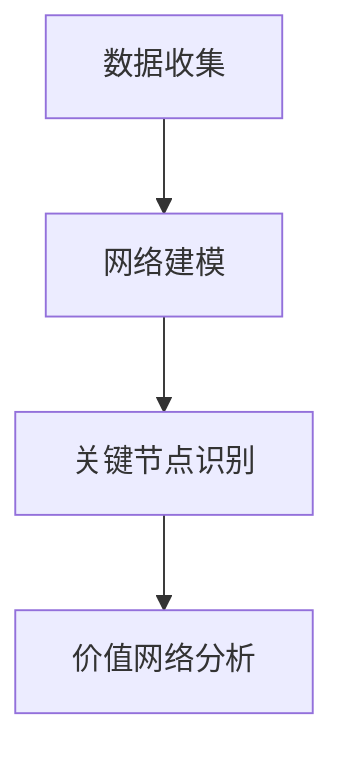
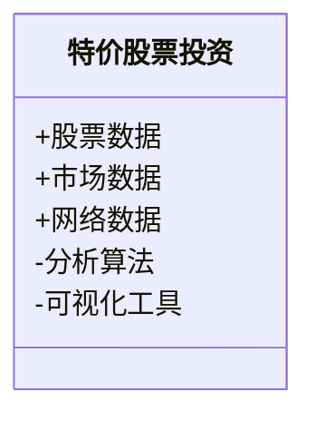
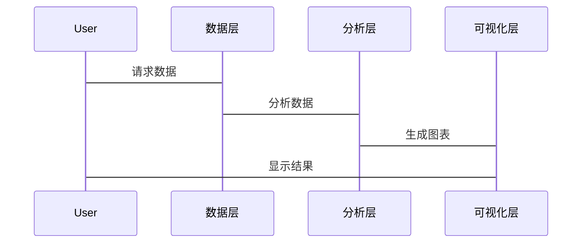

                 


# 特价股票投资中的数字产业价值网络分析方法

## 关键词：
特价股票投资、数字产业、价值网络、网络分析、回归分析、系统架构、投资策略

## 摘要：
本文深入探讨了在数字产业背景下，如何利用价值网络分析方法进行特价股票投资。通过分析数字产业的特征和价值网络的构建，结合网络分析算法和回归分析模型，提出了一种优化投资决策的方法。文章还详细介绍了系统架构设计、项目实战案例以及最佳投资实践，为投资者提供了实用的指导和建议。

---

# 特价股票投资中的数字产业价值网络分析方法

## 第1章：特价股票投资的背景与价值网络分析的重要性

### 1.1 特价股票投资的背景

#### 1.1.1 什么是特价股票
特价股票是指价格被市场低估的股票，通常具有较高的投资潜力。这些股票可能因为市场波动、公司短期问题或其他因素而被低估，但具有长期增值的潜力。

#### 1.1.2 特价股票投资的特点
- **低估值**：市盈率、市净率等指标低于行业平均水平。
- **高潜力**：公司基本面良好，未来增长潜力大。
- **风险较高**：通常涉及较高风险，需要谨慎选择。

#### 1.1.3 特价股票投资的意义
- **高回报**：通过挖掘被低估的股票，投资者可以获得超额回报。
- **分散风险**：通过多样化投资，降低整体投资风险。
- **长期视角**：注重公司基本面，关注长期价值。

### 1.2 数字产业价值网络分析的重要性

#### 1.2.1 数字产业的定义与特征
数字产业是指依赖数字技术进行生产、服务和创新的产业，包括科技、互联网、人工智能等领域。其特征包括：
- **数据驱动**：依赖数据进行决策和创新。
- **快速迭代**：技术更新迅速，市场变化快。
- **网络化**：产业链条复杂，涉及多方合作。

#### 1.2.2 价值网络的概念与作用
价值网络是指在数字产业中，企业、供应商、客户、合作伙伴等之间的价值传递网络。其作用包括：
- **优化资源分配**：通过网络分析，优化资源配置。
- **提升效率**：发现瓶颈，提高整体效率。
- **增强竞争力**：通过网络分析，找到竞争优势。

#### 1.2.3 数字产业价值网络分析的必要性
在数字产业中，企业之间的关系错综复杂，价值网络分析可以帮助投资者更好地理解产业链结构，发现潜在投资机会。

### 1.3 本书的目标与结构
本书旨在通过分析数字产业价值网络，为投资者提供科学的投资决策方法。结构上分为背景介绍、核心概念、算法原理、系统架构、项目实战和最佳实践等部分。

---

## 第2章：数字产业价值网络的构建与分析

### 2.1 数字产业价值网络的构建

#### 2.1.1 数字产业的价值网络构建步骤
1. **数据收集**：收集企业的供应链、客户、合作伙伴等数据。
2. **网络建模**：构建网络图，分析节点之间的关系。
3. **关键节点识别**：识别核心企业或关键节点。

#### 2.1.2 数字产业中的价值网络
- **供应商网络**：企业与供应商之间的关系。
- **客户网络**：企业与客户之间的关系。
- **合作伙伴网络**：企业与其他合作伙伴的关系。

#### 2.1.3 价值网络的可视化
通过工具（如Gephi）将价值网络可视化，帮助投资者更好地理解产业链结构。

### 2.2 价值网络分析方法

#### 2.2.1 网络分析法
- **节点度分析**：分析节点的度数，找出关键节点。
- **中心性分析**：分析节点的影响力。

#### 2.2.2 关键路径分析
- **最短路径分析**：寻找网络中的最短路径，优化资源配置。
- **最长路径分析**：识别网络中的瓶颈。

#### 2.2.3 价值流分析
- **价值流优化**：通过分析价值流，优化企业运营效率。

---

## 第3章：数学模型与算法原理

### 3.1 网络分析算法

#### 3.1.1 算法概述
网络分析算法包括节点度分析、中心性分析、社区发现等。

#### 3.1.2 算法流程图


#### 3.1.3 算法实现代码
```python
import networkx as nx

# 创建图
G = nx.Graph()

# 添加节点
G.add_nodes_from(['A', 'B', 'C'])

# 添加边
G.add_edges_from([('A', 'B'), ('B', 'C')])

# 计算节点度
degrees = dict(G.degree())
print(degrees)
```

### 3.2 回归分析

#### 3.2.1 回归模型的建立
回归分析用于预测股票价格，公式如下：
$$ y = \beta_0 + \beta_1x_1 + \beta_2x_2 + \epsilon $$

其中，$y$为股票价格，$x_1$和$x_2$为影响因素，$\epsilon$为误差项。

#### 3.2.2 回归模型的实现
```python
import statsmodels.api as sm

# 数据准备
X = df[['factor1', 'factor2']]
y = df['price']

# 添加截距项
X = sm.add_constant(X)

# 模型拟合
model = sm.OLS(y, X)
results = model.fit()

# 输出结果
print(results.summary())
```

---

## 第4章：系统架构设计

### 4.1 项目介绍
本项目旨在构建一个数字产业价值网络分析系统，帮助投资者进行特价股票投资。

### 4.2 系统功能设计

#### 4.2.1 领域模型


#### 4.2.2 系统架构设计


#### 4.2.3 接口设计
- 数据接口：与数据源对接，获取股票数据。
- 分析接口：调用网络分析算法，返回结果。
- 可视化接口：生成可视化图表，展示分析结果。

#### 4.2.4 交互流程


---

## 第5章：项目实战

### 5.1 环境安装
- Python 3.8+
- 库：networkx、statsmodels、numpy、pandas

### 5.2 核心代码实现

#### 5.2.1 网络分析代码
```python
import networkx as nx
import matplotlib.pyplot as plt

G = nx.Graph()
G.add_edges_from([('A', 'B'), ('B', 'C'), ('C', 'D')])
nx.draw(G, with_labels=True)
plt.show()
```

#### 5.2.2 回归分析代码
```python
import statsmodels.api as sm
import pandas as pd

# 数据准备
df = pd.DataFrame({'factor1': [1, 2, 3], 'factor2': [4, 5, 6], 'price': [7, 8, 9]})

# 模型拟合
X = sm.add_constant(df[['factor1', 'factor2']])
model = sm.OLS(df['price'], X).fit()
print(model.summary())
```

### 5.3 案例分析
以某科技公司为例，分析其价值网络，发现关键节点和潜在投资机会。

### 5.4 项目小结
通过项目实战，验证了数字产业价值网络分析方法的有效性，为投资者提供了实用的工具和方法。

---

## 第6章：最佳实践与小结

### 6.1 投资策略
- **分散投资**：避免过度集中，降低风险。
- **长期视角**：关注企业基本面，长期持有。
- **持续学习**：保持对市场的敏感性，及时调整策略。

### 6.2 风险管理
- **设置止损**：控制最大亏损。
- **动态调整**：根据市场变化，及时调整投资组合。

### 6.3 未来趋势
- **人工智能**：利用AI技术，提升分析效率。
- **大数据分析**：通过大数据，发现更多投资机会。

---

## 作者：AI天才研究院 & 禅与计算机程序设计艺术

---

通过本文的系统分析和实践案例，读者可以全面了解数字产业价值网络分析方法在特价股票投资中的应用，为投资者提供了科学的投资决策支持。

