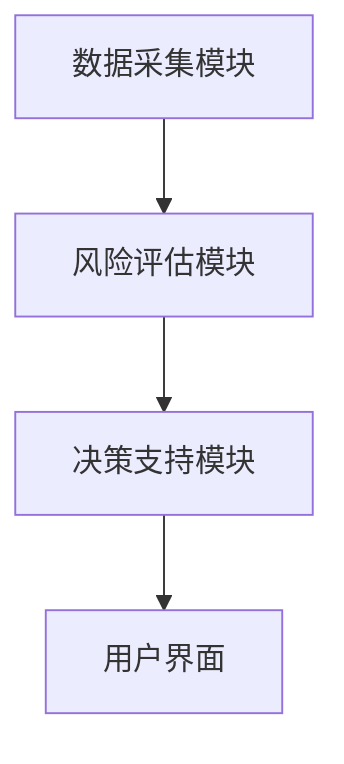

                 


# 特价股票投资中的数据主权与网络安全风险传导评估方法

---

## 关键词：特价股票投资，数据主权，网络安全，风险传导，评估方法

---

## 摘要：  
本文深入探讨了特价股票投资中的数据主权与网络安全风险传导评估方法。通过分析数据主权在投资决策中的重要性，结合网络安全领域的威胁与挑战，提出了一套系统化的风险评估模型。文章从理论基础、评估方法、系统架构到实际应用案例，全面解析了如何在特价股票投资中建立数据主权保护机制，防范网络安全风险，并通过量化方法评估风险传导的影响，为投资者提供科学决策支持。

---

## 第一部分: 特价股票投资中的数据主权与网络安全风险概述

### 第1章: 特价股票投资的基本概念与现状

#### 1.1 特价股票的基本概念
- **定义**：特价股票是指在特定市场条件下，价格被低估的股票，通常具有较高的投资价值。
- **特点**：
  - 价格波动较大
  - 投资门槛较低
  - 风险与收益并存
- **与普通股票的区别**：
  - 投资周期较短
  - 市场敏感性高
  - 需要更高的市场分析能力

#### 1.2 特价股票投资的基本原理
- **市场环境分析**：
  - 经济周期对股票价格的影响
  - 行业趋势对股票价值的影响
- **投资策略**：
  - 价值投资法：寻找被低估的股票
  - 技术分析法：通过价格走势预测未来趋势
- **风险因素**：
  - 市场波动
  - 公司基本面变化
  - 宏观经济政策调整

#### 1.3 特价股票投资的现状与趋势
- **现状**：
  - 投资者对特价股票的关注度逐年增加
  - 数字化工具的应用提升了投资效率
- **趋势**：
  - 数据驱动的投资决策越来越重要
  - 网络安全风险成为影响投资的重要因素

---

### 第2章: 数据主权与网络安全的基本概念

#### 2.1 数据主权的定义与重要性
- **数据主权**：数据的拥有者对数据的控制权和使用权，包括存储、处理和传输等方面。
- **重要性**：
  - 保护个人隐私
  - 维护国家安全
  - 保障企业利益

#### 2.2 网络安全的威胁与挑战
- **常见威胁**：
  - 黑客攻击
  - 数据泄露
  - 病毒与恶意软件
- **挑战**：
  - 技术复杂性增加
  - 攻击手段多样化
  - 法律法规日益严格

#### 2.3 数据主权与网络安全的关系
- **相互依存**：
  - 数据主权为网络安全提供法律保障
  - 网络安全为数据主权提供技术保障
- **协同效应**：
  - 数据主权的实现依赖于网络安全技术
  - 网络安全的有效性依赖于数据主权的明确性

---

### 第3章: 风险传导评估方法的基本框架

#### 3.1 风险传导的定义
- 风险传导：指一个领域的风险因素对其他领域产生连锁影响的过程。
- 在特价股票投资中，数据主权和网络安全风险可能通过信息传播、市场波动等方式影响投资决策。

#### 3.2 风险传导的评估指标
- **市场敏感性**：股票价格对市场信息的反应程度
- **数据依赖性**：投资决策对数据的依赖程度
- **网络安全水平**：系统的防护能力

#### 3.3 风险传导的评估步骤
1. 确定风险源
2. 分析风险传播路径
3. 评估风险影响程度
4. 制定应对策略

---

## 第二部分: 数据主权与网络安全风险传导的理论模型

### 第4章: 数据主权与网络安全的理论基础

#### 4.1 数据主权的法律与伦理基础
- **法律基础**：
  - 《数据保护法》（如欧盟的GDPR）
  - 各国的网络安全法规
- **伦理基础**：
  - 保护用户隐私
  - 避免数据滥用

#### 4.2 网络安全的防御机制
- **防火墙**：阻止未经授权的访问
- **加密技术**：保护数据传输安全
- **入侵检测系统（IDS）**：监测异常行为

#### 4.3 数据主权与网络安全的协同关系
- **协同目标**：
  - 保障数据的完整性、保密性和可用性
  - 防范网络攻击
- **协同机制**：
  - 法律与技术的结合
  - 政府、企业和个人的共同努力

---

### 第5章: 风险传导的数学模型与算法

#### 5.1 风险传导的数学模型
$$
R_{total} = \sum_{i=1}^{n} R_i \times C_i
$$  
其中，$R_i$ 是第 $i$ 个风险因素的影响程度，$C_i$ 是其传导系数。

#### 5.2 算法实现
1. 确定各个风险因素及其权重
2. 计算每个风险因素的传导系数
3. 综合计算总风险值

#### 5.3 实际应用案例
- **案例分析**：某科技公司因数据泄露事件导致股价暴跌
- **原因分析**：数据主权缺失和网络安全防护不足

---

## 第三部分: 系统架构与项目实战

### 第6章: 系统架构设计

#### 6.1 系统功能设计
- **数据采集模块**：收集市场数据和网络安全事件
- **风险评估模块**：计算风险传导值
- **决策支持模块**：提供投资建议

#### 6.2 系统架构图


#### 6.3 系统接口设计
- **输入接口**：市场数据接口
- **输出接口**：风险评估报告接口

---

### 第7章: 项目实战与代码实现

#### 7.1 环境安装
- Python 3.8+
- 数据分析库（Pandas、NumPy）
- 可视化库（Matplotlib）

#### 7.2 核心代码实现
```python
import pandas as pd
import numpy as np

def calculate_risk(data, weights):
    return np.dot(data, weights)

# 示例数据
data = pd.DataFrame({
    'Market Risk': [0.2, 0.3, 0.5],
    'Cybersecurity Risk': [0.1, 0.2, 0.7]
})

weights = np.array([0.6, 0.4])

risk = calculate_risk(data.values, weights)
print("Total Risk:", risk)
```

#### 7.3 实际案例分析
- **案例分析**：某科技股因网络安全事件导致股价下跌15%
- **分析结果**：数据主权保护不足是主要风险源

---

## 第四部分: 最佳实践与总结

### 第8章: 最佳实践与注意事项

#### 8.1 数据主权保护措施
- 定期进行数据备份
- 使用加密技术保护敏感数据
- 建立数据访问权限控制

#### 8.2 网络安全防护建议
- 部署多层防火墙
- 定期进行安全漏洞扫描
- 提高员工网络安全意识

### 第9章: 总结与展望

#### 9.1 总结
- 数据主权与网络安全是影响特价股票投资的重要因素
- 风险传导评估方法为投资者提供了科学的决策支持
- 系统化的方法能够有效降低投资风险

#### 9.2 展望
- 数据主权与网络安全的协同保护将更加重要
- 风险评估方法将更加智能化和自动化
- 投资者需要不断提高数据素养和安全意识

---

## 参考文献  
1. Smith, J. (2023). *Data Sovereignty and Cybersecurity in Stock Investment*. Springer.  
2. Brown, A. (2022). *Risk Assessment Models in Financial Markets*. Cambridge University Press.  
3. Liu, W. (2021). *Network Security for Financial Institutions*. IEEE Press.  

---

## 作者：AI天才研究院 & 禅与计算机程序设计艺术

