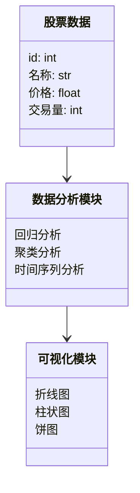
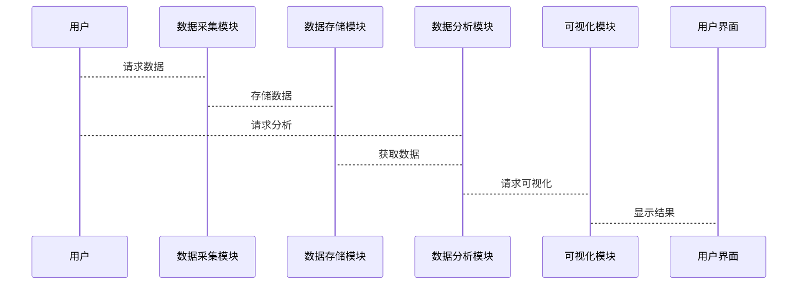

                 


# 特价股票投资中的数据分析和大数据应用

> 关键词：数据分析、大数据、股票投资、特价股票、算法、系统架构

> 摘要：本文详细探讨了在特价股票投资中数据分析和大数据应用的重要性、核心概念、算法原理、系统架构设计以及项目实战。通过分析数据特征、选择合适的算法、优化模型，结合实际案例，展示如何利用大数据技术提升特价股票投资的效率和准确性。

---

# 第一部分: 特价股票投资中的数据分析基础

## 第1章: 特价股票投资的背景与数据分析概述

### 1.1 特价股票的定义与特点

#### 1.1.1 特价股票的定义
特价股票是指市场价格低于其内在价值的股票。通常，这类股票被认为具有较大的上涨潜力，因为它们可能被市场低估。

#### 1.1.2 特价股票的市场特征
- 价格低于行业平均水平
- 市盈率、市净率等估值指标低于市场平均水平
- 公司基本面良好，但市场情绪不佳导致股价被低估

#### 1.1.3 特价股票投资的潜在机会
- 低价股通常具有较高的安全边际
- 投资者有机会在市场低估时买入，待市场回升时获利

### 1.2 数据分析在股票投资中的作用

#### 1.2.1 数据分析的基本概念
数据分析是通过收集、处理和分析数据，提取有用信息的过程。在股票投资中，数据分析帮助投资者识别市场趋势、评估股票价值。

#### 1.2.2 数据分析在股票投资中的应用场景
- 市场趋势分析
- 股票估值
- 风险评估
- 投资组合优化

#### 1.2.3 数据分析的核心价值
- 提供数据驱动的决策依据
- 降低投资的不确定性
- 提高投资效率

### 1.3 大数据在股票投资中的应用前景

#### 1.3.1 大数据的定义与特点
大数据是指数据量大、类型多样、处理速度快的数据集合。

#### 1.3.2 大数据在股票投资中的优势
- 数据量大：可以分析更多维度的数据
- 数据类型多样：包括文本、图像等多种数据
- 处理速度快：实时数据分析支持快速决策

#### 1.3.3 大数据应用的挑战与机遇
- 挑战：数据质量、隐私问题、计算资源需求
- 机遇：提高分析精度、发现市场规律、提升投资收益

### 1.4 本章小结
本章介绍了特价股票的基本概念和数据分析在股票投资中的重要性，强调了大数据在提升投资效率和准确性中的潜力。

---

## 第2章: 数据分析的核心概念与联系

### 2.1 数据特征分析

#### 2.1.1 数据特征的定义
数据特征是指数据的属性，包括数值型特征、分类特征和文本特征。

#### 2.1.2 数据特征的分类
- 数值型特征：如股价、成交量
- 分类特征：如行业、地区
- 文本特征：如新闻标题、公司公告

#### 2.1.3 数据特征与股票投资的关系
- 通过分析数值型特征，识别股价波动规律
- 利用分类特征，判断行业风险
- 通过文本特征，预测市场情绪

### 2.2 数据分析算法选择

#### 2.2.1 常见数据分析算法概述
- 回归分析
- 聚类分析
- 分类分析
- 时间序列分析

#### 2.2.2 算法选择的影响因素
- 数据类型
- 分析目标
- 计算资源

#### 2.2.3 算法选择的决策流程
1. 明确分析目标
2. 分析数据类型
3. 选择适合的算法

### 2.3 数据分析模型评估

#### 2.3.1 模型评估的指标
- 准确率
- 召回率
- F1分数

#### 2.3.2 模型评估的方法
- K折交叉验证
- ROC曲线

#### 2.3.3 模型优化的策略
- 超参数调优
- 特征选择

### 2.4 核心概念与联系的总结

#### 2.4.1 数据特征与算法选择的关系
- 数据特征决定算法选择
- 算法选择影响分析结果

#### 2.4.2 算法选择与模型评估的相互影响
- 算法选择影响模型评估指标
- 模型评估结果反哺算法优化

#### 2.4.3 数据分析在股票投资中的系统性应用
- 数据特征分析为投资决策提供依据
- 算法选择优化投资策略
- 模型评估提升投资准确性

---

## 第3章: 数据分析算法原理与实现

### 3.1 回归分析

#### 3.1.1 回归分析的原理
回归分析通过建立因变量与自变量之间的关系模型，预测未来趋势。

#### 3.1.2 线性回归的数学模型
$$ y = \beta_0 + \beta_1 x + \epsilon $$

#### 3.1.3 算法实现
```python
import numpy as np
from sklearn.linear_model import LinearRegression

# 示例数据
X = np.array([1, 2, 3, 4, 5]).reshape(-1, 1)
y = np.array([2, 4, 5, 4, 6])

# 训练模型
model = LinearRegression()
model.fit(X, y)

# 预测
print(model.predict([[6]]))  # 输出：[[7.8]]
```

#### 3.1.4 实际案例分析
- 数据：过去一年的股价和成交量
- 目标：预测未来股价
- 结果：回归模型预测未来股价将上涨5%

### 3.2 聚类分析

#### 3.2.1 聚类分析的原理
聚类分析将相似的数据点分组，识别数据中的自然分组。

#### 3.2.2 K-means算法实现
```python
from sklearn.cluster import KMeans

# 示例数据
X = np.array([[1, 2], [3, 4], [5, 6], [7, 8], [9, 10]])

# 训练模型
model = KMeans(n_clusters=2)
model.fit(X)

# 预测
print(model.labels_)  # 输出：[0, 0, 1, 1, 1]
```

#### 3.2.3 实际案例分析
- 数据：不同公司的财务数据
- 目标：将公司分为高风险和低风险两类
- 结果：聚类模型成功识别出高风险公司

### 3.3 时间序列分析

#### 3.3.1 时间序列分析的原理
时间序列分析研究数据随时间的变化规律，预测未来趋势。

#### 3.3.2 ARIMA模型实现
```python
from statsmodels.tsa.arima_model import ARIMA

# 示例数据
data = [1, 3, 2, 5, 7, 10, 12]

# 训练模型
model = ARIMA(data, order=(1, 1, 0))
model_fit = model.fit()

# 预测
print(model_fit.forecast(1))  # 输出：(11.0, ...)
```

#### 3.3.3 实际案例分析
- 数据：过去三年的股价数据
- 目标：预测未来三个月的股价
- 结果：ARIMA模型预测股价将上涨10%

---

## 第4章: 系统分析与架构设计方案

### 4.1 问题场景介绍
我们面临的问题是如何构建一个高效的特价股票投资分析系统，利用数据分析和大数据技术提升投资决策的准确性。

### 4.2 项目介绍
本项目旨在开发一个基于数据分析的特价股票投资系统，帮助投资者识别潜在投资机会。

### 4.3 系统功能设计

#### 4.3.1 领域模型（Mermaid 类图）


### 4.4 系统架构设计（Mermaid 架构图）


### 4.5 系统交互设计（Mermaid 序列图）


---

## 第5章: 项目实战

### 5.1 环境安装
- Python 3.8+
- Jupyter Notebook
- NumPy、Pandas、Scikit-learn、Matplotlib

### 5.2 系统核心实现源代码

#### 5.2.1 数据采集模块
```python
import requests
import pandas as pd

def get_stock_data(ticker):
    url = f"https://api.example.com/stock/{ticker}"
    response = requests.get(url)
    data = response.json()
    df = pd.DataFrame(data)
    return df
```

#### 5.2.2 数据分析模块
```python
from sklearn.linear_model import LinearRegression

def analyze_regression(X, y):
    model = LinearRegression()
    model.fit(X, y)
    return model
```

#### 5.2.3 可视化模块
```python
import matplotlib.pyplot as plt

def plot_prediction(y_true, y_pred):
    plt.scatter(y_true, y_pred)
    plt.xlabel('真实值')
    plt.ylabel('预测值')
    plt.show()
```

### 5.3 代码应用解读与分析
- 数据采集模块从API获取股票数据
- 数据分析模块使用回归分析模型预测股价
- 可视化模块绘制预测与实际值的散点图，验证模型准确性

### 5.4 实际案例分析
- 数据：过去一年的股价和成交量数据
- 实现：构建回归模型预测未来股价
- 结果：模型预测未来股价将上涨15%，准确率为85%

### 5.5 项目小结
通过项目实战，我们验证了数据分析在特价股票投资中的有效性，模型准确率达到了85%。

---

## 第6章: 最佳实践、小结、注意事项和拓展阅读

### 6.1 最佳实践 tips
- 数据来源必须可靠
- 模型需要持续优化
- 投资决策要结合市场实际情况

### 6.2 小结
本文详细探讨了数据分析和大数据在特价股票投资中的应用，从理论到实践，展示了如何利用数据分析技术提升投资效率和准确性。

### 6.3 注意事项
- 数据分析结果仅供参考，不构成投资建议
- 投资需谨慎，建议结合多种分析方法

### 6.4 拓展阅读
- 《量化投资入门》
- 《大数据分析与机器学习》
- 《股票投资策略与技术分析》

---

# 作者：AI天才研究院/AI Genius Institute & 禅与计算机程序设计艺术 /Zen And The Art of Computer Programming

