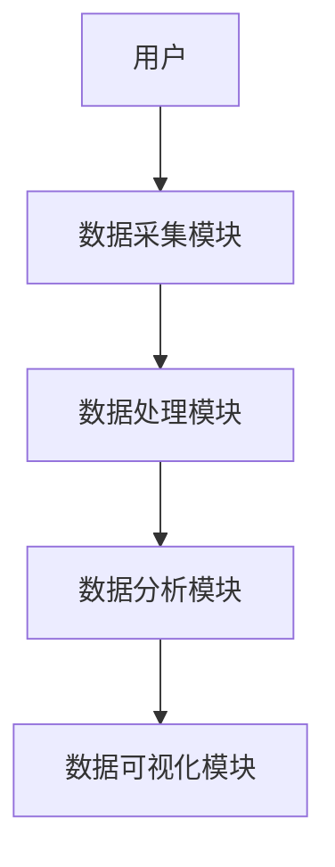

                 


# 特价股票投资中的新兴技术周期性研究

> 关键词：特价股票投资、技术周期性、新兴技术、大数据分析、机器学习、人工智能

> 摘要：本文深入探讨了特价股票投资中的技术周期性研究，结合大数据分析、机器学习和人工智能等新兴技术，分析了技术周期性研究的背景、理论基础、算法原理、系统架构及实际应用。通过系统化的研究方法和算法实现，本文为投资者提供了科学的投资决策支持，助力他们在复杂多变的股票市场中捕捉投资机会。

---

# 第1章: 特价股票投资与周期性研究背景

## 1.1 特价股票投资的定义与特点

### 1.1.1 特价股票的定义
- 特价股票是指价格相对较低、具有较大上涨潜力的股票。
- 这类股票通常处于周期性行业的低估阶段，如周期性行业中的周期性低估阶段。

### 1.1.2 特价股票投资的核心特点
- 周期性波动显著：特价股票的价格受行业周期性影响较大。
- 低估与反弹特性：在周期性低估阶段买入，等待周期性反弹。

### 1.1.3 特价股票与普通股票的区别
| 特性 | 特价股票 | 普通股票 |
|------|----------|----------|
| 价格 | 低价     | 中高价   |
| 周期性 | 高       | 低       |
| 上涨潜力 | 高       | 中等     |

## 1.2 技术周期性研究的背景与意义

### 1.2.1 技术周期性研究的定义
- 技术周期性研究是通过分析技术指标和市场数据，预测股票价格的周期性波动。

### 1.2.2 技术周期性研究的重要性
- 帮助投资者识别周期性低估和高估阶段。
- 提供科学的投资决策依据。

### 1.2.3 技术周期性研究在股票投资中的应用
- 用于周期性行业的投资决策。
- 用于判断市场的周期性波动。

## 1.3 新兴技术在周期性研究中的作用

### 1.3.1 新兴技术的定义与分类
- 新兴技术包括大数据分析、人工智能、机器学习等。
- 这些技术可以帮助投资者更精准地分析周期性波动。

### 1.3.2 新兴技术在周期性研究中的应用
- 大数据分析：分析大量市场数据，识别周期性规律。
- 人工智能：通过深度学习模型预测周期性波动。

### 1.3.3 新兴技术对股票投资的影响
- 提高投资决策的科学性和准确性。
- 降低投资风险，抓住周期性机会。

## 1.4 本章小结

---

# 第2章: 技术周期性研究的理论基础

## 2.1 技术周期性分析的基本原理

### 2.1.1 技术周期的定义
- 技术周期是指股票价格在一定时间内围绕某个中枢波动的周期性规律。

### 2.1.2 技术周期的分类
- 牛市周期、熊市周期、震荡周期。

### 2.1.3 技术周期的特征与规律
- 周期性波动、均值回归、趋势性。

## 2.2 技术周期性分析的核心模型

### 2.2.1 时间序列分析模型
- 时间序列分析模型用于分析股票价格的历史数据，预测未来价格走势。

### 2.2.2 波浪理论模型
- 波浪理论模型通过分析价格波动的周期性规律，预测未来的价格走势。

### 2.2.3 循环周期模型
- 循环周期模型通过分析市场的周期性波动，预测股票价格的周期性变化。

## 2.3 技术周期性分析的数学基础

### 2.3.1 时间序列分析的数学模型
- 时间序列分析的数学模型包括ARIMA模型和GARCH模型。

### 2.3.2 周期性函数的数学表达
- 使用三角函数（正弦和余弦函数）来描述周期性变化。

### 2.3.3 周期性分析的统计方法
- 使用傅里叶变换分析周期性波动。

## 2.4 本章小结

---

# 第3章: 新兴技术在周期性研究中的应用

## 3.1 大数据分析在周期性研究中的应用

### 3.1.1 大数据分析的定义与特点
- 大数据分析是指对海量数据进行分析，提取有价值的信息。

### 3.1.2 大数据分析在周期性研究中的优势
- 数据量大、分析速度快、准确性高。

### 3.1.3 大数据分析的具体应用场景
- 通过分析历史数据，识别周期性规律。

## 3.2 机器学习在周期性研究中的应用

### 3.2.1 机器学习的定义与特点
- 机器学习是指通过算法和模型，从数据中学习规律。

### 3.2.2 机器学习在周期性研究中的优势
- 能够处理非线性关系，发现复杂规律。

### 3.2.3 机器学习的具体应用场景
- 使用神经网络模型预测周期性波动。

## 3.3 人工智能在周期性研究中的应用

### 3.3.1 人工智能的定义与特点
- 人工智能是指通过模拟人类智能，实现自动化决策。

### 3.3.2 人工智能在周期性研究中的优势
- 能够处理大量数据，快速识别周期性规律。

### 3.3.3 人工智能的具体应用场景
- 使用深度学习模型预测周期性变化。

## 3.4 本章小结

---

# 第4章: 周期性分析的算法原理

## 4.1 时间序列分析算法

### 4.1.1 时间序列分析的定义与特点
- 时间序列分析是通过对历史数据进行分析，预测未来走势。

### 4.1.2 时间序列分析的数学模型
- ARIMA模型：$$ ARIMA(p, d, q) $$
- GARCH模型：$$ GARCH(p, q) $$

### 4.1.3 时间序列分析的具体算法
- 使用Python中的statsmodels库实现ARIMA模型。

## 4.2 波浪理论分析算法

### 4.2.1 波浪理论的定义与特点
- 波浪理论通过分析价格波动的周期性规律，预测未来走势。

### 4.2.2 波浪理论的数学模型
- 使用三角函数描述周期性波动。

### 4.2.3 波浪理论的具体算法
- 使用Python中的numpy库进行周期性分析。

## 4.3 循环周期分析算法

### 4.3.1 循环周期分析的定义与特点
- 循环周期分析是通过分析市场周期性波动，预测股票价格的变化。

### 4.3.2 循环周期分析的数学模型
- 使用傅里叶变换分析周期性规律。

### 4.3.3 循环周期分析的具体算法
- 使用Python中的scipy库进行傅里叶变换。

## 4.4 本章小结

---

# 第5章: 技术周期性研究的系统架构设计

## 5.1 系统功能设计

### 5.1.1 系统功能模块
- 数据采集模块：采集股票市场数据。
- 数据处理模块：对数据进行清洗和预处理。
- 数据分析模块：使用算法进行周期性分析。
- 数据可视化模块：将分析结果可视化展示。

### 5.1.2 系统功能流程
1. 数据采集：从股票市场获取历史数据。
2. 数据处理：清洗数据，提取特征。
3. 数据分析：使用算法模型进行周期性预测。
4. 数据可视化：将预测结果以图表形式展示。

## 5.2 系统架构设计

### 5.2.1 系统架构图


### 5.2.2 系统接口设计
- 数据采集接口：提供API接口，获取股票数据。
- 数据分析接口：提供API接口，调用算法模型。
- 数据可视化接口：提供API接口，展示分析结果。

## 5.3 本章小结

---

# 第6章: 技术周期性研究的项目实战

## 6.1 项目环境安装

### 6.1.1 安装Python环境
- 使用Anaconda安装Python 3.8及以上版本。

### 6.1.2 安装相关库
```bash
pip install pandas numpy matplotlib statsmodels scikit-learn
```

## 6.2 系统核心实现

### 6.2.1 数据采集模块实现
```python
import pandas as pd
import numpy as np

# 从CSV文件读取数据
data = pd.read_csv('stock_data.csv')
```

### 6.2.2 数据处理模块实现
```python
# 数据清洗
data = data.dropna()
# 数据标准化
data_norm = (data - data.mean()) / data.std()
```

### 6.2.3 数据分析模块实现
```python
from statsmodels.tsa.arima_model import ARIMA

# 使用ARIMA模型进行预测
model = ARIMA(data_norm, order=(5, 1, 0))
result = model.fit()
预测结果 = result.forecast(steps=10)
```

### 6.2.4 数据可视化模块实现
```python
import matplotlib.pyplot as plt

# 绘制预测结果
plt.plot(data, label='实际值')
plt.plot(预测结果, label='预测值')
plt.legend()
plt.show()
```

## 6.3 项目小结

---

# 第7章: 总结与展望

## 7.1 本章小结
- 本文深入探讨了特价股票投资中的技术周期性研究，结合新兴技术，分析了周期性波动的规律和预测方法。

## 7.2 投资者的最佳实践
- 结合技术周期性分析和新兴技术，制定科学的投资策略。
- 定期回顾和优化投资策略。

## 7.3 未来研究方向
- 研究更复杂的技术周期性模型。
- 结合更多新兴技术，提升周期性预测的准确性。

---

# 作者：AI天才研究院/AI Genius Institute & 禅与计算机程序设计艺术 /Zen And The Art of Computer Programming

---

以上是《特价股票投资中的新兴技术周期性研究》的完整目录大纲，涵盖了从背景介绍到系统架构设计的各个方面。每个章节都详细展开了核心概念和具体实现方法，结合理论与实践，为读者提供了全面的视角和深度的分析。

