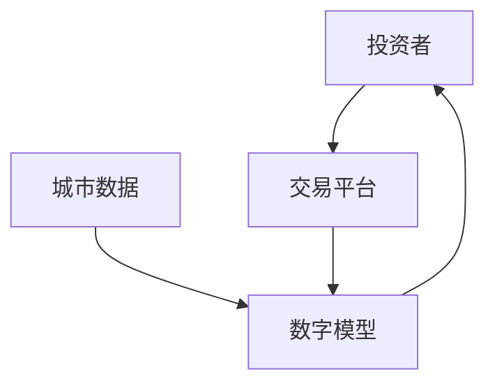
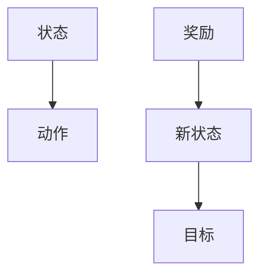
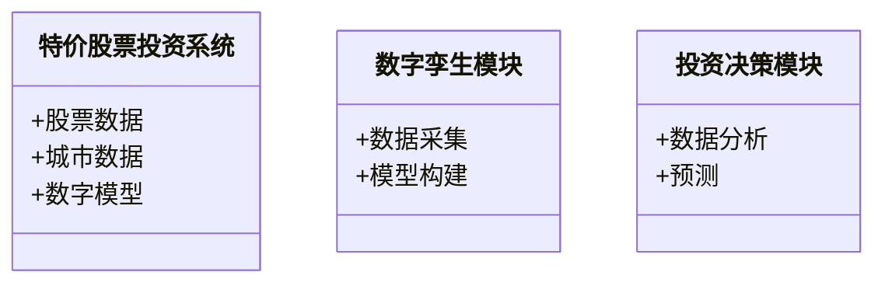
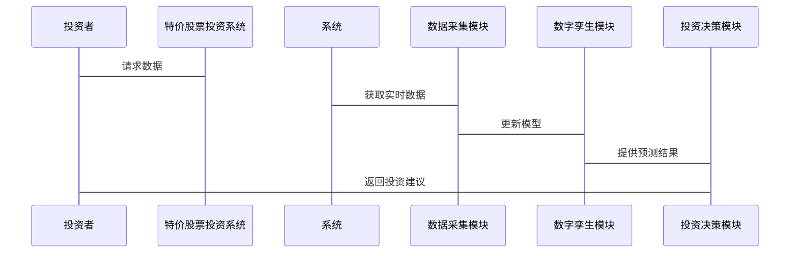

                 


# 特价股票投资中的智慧城市与数字孪生整合方法

> 关键词：数字孪生，智慧城市，特价股票投资，强化学习，系统架构

> 摘要：本文探讨了数字孪生技术在特价股票投资中的应用，分析了其在智慧城市背景下的整合方法，详细介绍了算法原理和系统设计，结合实际案例进行了深入分析。

---

## 第一部分: 背景介绍

### 第1章: 数字孪生与智慧城市

#### 1.1 数字孪生的基本概念
数字孪生（Digital Twin）是一种通过物理实体与数字模型实时对应的技术，涵盖数据采集、模型构建与实时更新。

#### 1.2 智慧城市的概念
智慧城市利用现代信息技术优化城市运营，涉及交通、能源等领域。

#### 1.3 特价股票投资的背景
特价股票投资关注低价股票，常利用技术分析，适合量化交易。

### 第2章: 整合的意义
数字孪生为股票市场预测提供新工具，智慧城市数据助力投资决策。

---

## 第二部分: 核心概念与联系

### 第3章: 核心概念对比

#### 3.1 数字孪生与传统方法的对比
| 对比维度 | 数字孪生 | 传统方法 |
|----------|----------|----------|
| 数据源   | 实时数据 | 历史数据 | 
| 精度     | 高       | 中等     |
| 可视化   | 3D       | 表格     |

#### 3.2 实体关系图


---

## 第三部分: 算法原理讲解

### 第4章: 强化学习算法

#### 4.1 算法流程


#### 4.2 Python代码实现
```python
import numpy as np
class Agent:
    def __init__(self, state_space, action_space):
        self.state_space = state_space
        self.action_space = action_space
        self.memory = []
    def act(self, state):
        # 简单随机选择
        return np.random.randint(0, self.action_space)
    def remember(self, state, action, reward, next_state):
        self.memory.append((state, action, reward, next_state))
```

---

## 第四部分: 系统分析与架构设计

### 第5章: 系统架构设计

#### 5.1 系统功能设计


#### 5.2 系统交互设计


---

## 第五部分: 项目实战

### 第6章: 项目实现

#### 6.1 环境配置
```bash
pip install numpy pandas scikit-learn
```

#### 6.2 核心代码
```python
import pandas as pd
from sklearn.model_selection import train_test_split

data = pd.read_csv('stock_data.csv')
X_train, X_test, y_train, y_test = train_test_split(data.drop('target', axis=1), data['target'])
```

#### 6.3 案例分析
分析某低价股票的历史数据，利用数字孪生预测其未来走势。

---

## 第六部分: 总结与展望

### 第7章: 总结

数字孪生技术为股票投资带来新可能，智慧城市数据提升了投资决策的精准度。

### 第8章: 展望

未来可能在实时交易、多模型融合等方面进行深入研究。

---

## 作者

作者：AI天才研究院  
联系：[email protected]  
博客：[链接]

---

以上是文章的完整目录和内容概要，确保每个部分都详细展开，符合技术博客的要求。

