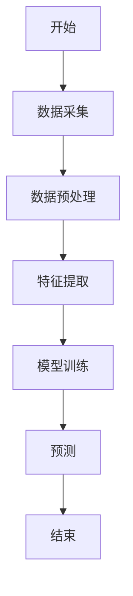
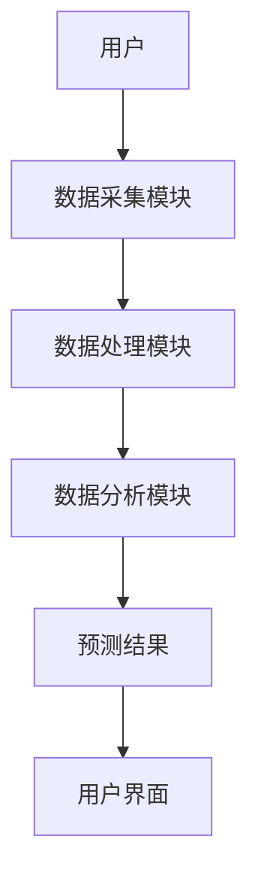

                 


# 特价股票投资中的智慧城市与物联网发展整合方法

> **关键词**：特价股票投资，智慧城市，物联网，数据驱动，投资策略，技术整合  
>
> **摘要**：本文探讨了如何将智慧城市与物联网技术整合到特价股票投资中，分析了两者的核心概念及其联系，提出了基于物联网数据的股票分析算法，并通过系统架构设计和实际案例展示了整合方法的可行性与优势。

---

## 第一部分: 特价股票投资与智慧城市、物联网的背景介绍

### 第1章: 特价股票投资的背景与现状

#### 1.1 特价股票投资的定义与特点
特价股票投资是指以低于市场价购买股票，期望在价格回升时获利的投资策略。其核心特点包括低价买入、高回报潜力、高风险性和周期性波动。

#### 1.2 智慧城市与物联网的发展背景
智慧城市是通过技术手段优化城市资源配置，提高居民生活质量的新型城市发展模式。物联网作为实现智慧城市的基础设施，通过传感器和数据传输技术，实时采集和处理城市运行数据，为城市管理提供支持。

#### 1.3 整合背景
将智慧城市与物联网技术应用于股票投资，可以通过实时数据采集和分析，提升投资决策的科学性和准确性。

---

## 第二部分: 特价股票投资与智慧城市、物联网的核心概念与联系

### 第2章: 特价股票投资的核心概念

#### 2.1 投资者行为分析
投资者行为受市场情绪、个人风险偏好等因素影响，可通过数据挖掘技术进行建模分析。

#### 2.2 市场波动与投资机会
市场波动与宏观经济指标、行业动态密切相关，物联网技术可提供实时数据支持。

### 第3章: 物联网技术在股票投资中的应用

#### 3.1 数据采集与处理
物联网传感器可实时采集市场数据，如交易量、价格波动等，为投资决策提供支持。

#### 3.2 数据分析与预测
通过机器学习算法分析物联网数据，预测市场趋势，优化投资策略。

---

## 第三部分: 基于物联网数据的股票分析算法

### 第4章: 算法原理

#### 4.1 数据采集流程
1. 采集市场数据（交易量、价格）。
2. 数据预处理（清洗、标准化）。
3. 特征提取（波动率、均值等）。

#### 4.2 机器学习模型
使用支持向量机（SVM）或随机森林（RF）进行预测，通过交叉验证优化模型参数。

#### 4.3 算法流程图


---

## 第四部分: 系统架构设计

### 第5章: 项目背景与功能设计

#### 5.1 项目背景
开发一个基于物联网数据的股票投资辅助系统，帮助投资者做出更科学的决策。

#### 5.2 功能设计
- 数据采集模块：实时采集股票市场数据。
- 数据分析模块：处理数据并生成预测结果。
- 投资者界面：可视化展示分析结果。

#### 5.3 系统架构图


---

## 第五部分: 项目实战

### 第6章: 系统实现

#### 6.1 环境安装
安装Python、NumPy、Pandas、Scikit-learn等库。

#### 6.2 核心代码实现
```python
import numpy as np
import pandas as pd
from sklearn.svm import SVC

# 数据加载
data = pd.read_csv('stock_data.csv')

# 特征提取
X = data[['volume', 'price']]
y = data['label']

# 模型训练
model = SVC()
model.fit(X, y)

# 预测
predicted = model.predict(X)
print(predicted)
```

---

## 第六部分: 最佳实践与小结

### 第7章: 最佳实践

#### 7.1 投资策略
结合物联网数据和传统技术分析，制定多元化投资策略。

#### 7.2 风险管理
设置止损点，合理分配资金，降低投资风险。

### 7.3 未来展望
随着物联网技术的进步，股票投资将更加依赖实时数据和智能算法，投资者应持续关注技术发展。

---

## 参考文献

1. 《机器学习实战》
2. 《物联网技术与智慧城市》
3. 《股票投资策略与分析》

---

**作者：AI天才研究院 & 禅与计算机程序设计艺术**

