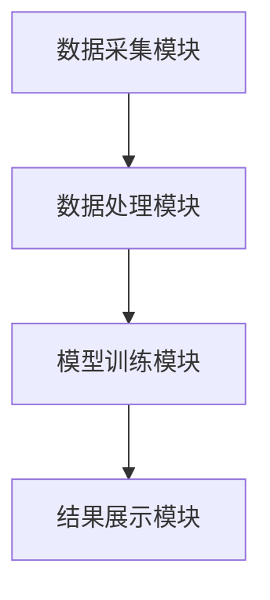
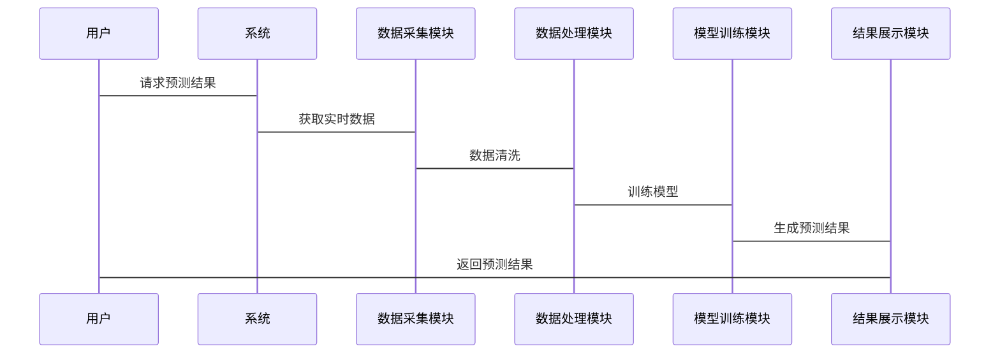

                 


# 特价股票投资中的智慧城市发展整合方法

> 关键词：特价股票投资，智慧城市，数据整合，机器学习，股票预测

> 摘要：本文探讨了如何将智慧城市的发展与特价股票投资相结合，利用智慧城市的海量数据和先进算法，提升股票投资的决策效率和准确性。文章详细介绍了整合方法的背景、核心概念、算法原理、系统设计、项目实战及最佳实践，为投资者和科技人员提供了实用的指导。

---

## 第1章: 特价股票投资与智慧城市发展概述

### 1.1 特价股票投资的基本概念
#### 1.1.1 特价股票的定义与特点
特价股票通常指市盈率低、市值小的股票，具有高增长潜力，但风险较高。其特点包括低估值、高波动性和高敏感性。

#### 1.1.2 特价股票投资的基本原理
投资者通过分析公司基本面、市场趋势和宏观经济指标，寻找被低估的股票进行投资。常用的技术分析和基本面分析方法。

#### 1.1.3 特价股票投资的市场现状
当前市场中，特价股票数量多，但筛选难度大，投资者需要借助数据和技术手段提高效率。

### 1.2 智慧城市发展的基本概念
#### 1.2.1 智慧城市的定义与特点
智慧城市利用物联网、大数据、人工智能等技术优化城市运营，提升居民生活质量。其特点是高效、环保和智能化。

#### 1.2.2 智慧城市的核心组成部分
包括智能交通、能源管理、公共安全、 healthcare 等 subsystems，通过数据共享和协同工作实现整体优化。

#### 1.2.3 智慧城市发展的技术基础
依赖于大数据分析、云计算、人工智能和物联网技术，这些技术为智慧城市提供了数据采集、处理和决策支持能力。

### 1.3 特价股票投资与智慧城市发展的整合意义
#### 1.3.1 整合的背景与必要性
随着智慧城市的发展，产生的海量数据为股票投资提供了新的机会，通过整合可以提高投资决策的科学性。

#### 1.3.2 整合的目标与预期效果
目标是利用智慧城市的数据和算法优化股票筛选和预测，提升投资收益和风险控制能力。

#### 1.3.3 整合的挑战与机遇
挑战包括数据隐私、技术复杂性和市场波动性；机遇则在于数据的丰富性和技术的进步带来的效率提升。

---

## 第2章: 特价股票投资与智慧城市发展的核心概念

### 2.1 智慧城市发展的核心要素
#### 2.1.1 数据采集与处理
通过 IoT 设备和传感器收集城市运行数据，如交通流量、空气质量等，进行清洗和预处理。

#### 2.1.2 数据分析与决策支持
利用大数据技术分析城市数据，为政府和企业提供决策支持，优化城市运营。

#### 2.1.3 智慧城市的技术架构
包括数据采集层、数据处理层、应用层和用户层，各层协同工作实现智慧化管理。

### 2.2 特价股票投资的核心要素
#### 2.2.1 特价股票的投资策略
基于价值投资和趋势分析，选择被低估的股票进行投资，注重长期收益。

#### 2.2.2 特价股票的市场分析方法
使用技术分析和基本面分析，结合市场情绪和宏观经济指标预测股票价格走势。

#### 2.2.3 特价股票的风险评估与控制
通过波动率分析、VaR模型等方法评估投资风险，并采取分散投资和止损策略进行控制。

### 2.3 智慧城市与特价股票投资的整合模型
#### 2.3.1 整合模型的定义与目标
通过整合智慧城市数据和股票市场数据，构建一个综合分析模型，用于指导投资决策。

#### 2.3.2 模型的核心要素与关系
模型包括数据源、数据预处理、特征提取、模型训练和预测输出五个核心要素，各要素相互关联、协同工作。

#### 2.3.3 模型的实现步骤与方法
1. 数据采集与清洗：收集智慧城市和股票市场数据，处理缺失值和异常值。
2. 特征提取：通过统计分析和机器学习方法提取影响股票价格的关键特征。
3. 模型训练：使用机器学习算法训练预测模型，评估模型性能并进行优化。
4. 预测与应用：利用模型预测股票价格，指导投资决策。

---

## 第3章: 智慧城市数据与特价股票投资的整合算法

### 3.1 整合算法的基本原理
#### 3.1.1 数据预处理与清洗
对智慧城市数据和股票数据进行清洗，确保数据的完整性和准确性。

#### 3.1.2 数据特征提取与选择
通过统计分析和相关性分析，提取对股票价格影响较大的特征，如城市交通状况、能源消耗等。

#### 3.1.3 数据建模与预测
基于特征数据，使用机器学习算法构建预测模型，如随机森林、XGBoost等。

### 3.2 基于机器学习的整合算法
#### 3.2.1 算法选择与优化
选择适合股票预测的机器学习算法，通过参数调优和模型集成优化性能。

#### 3.2.2 算法实现步骤
1. 数据预处理：清洗和标准化数据。
2. 特征选择：使用相关性分析选择关键特征。
3. 模型训练：训练机器学习模型，评估性能。
4. 模型预测：利用模型预测股票价格，生成投资信号。

#### 3.2.3 算法的性能评估
通过准确率、召回率和F1分数评估模型性能，分析预测结果的稳定性与可靠性。

### 3.3 算法的数学模型与公式
#### 3.3.1 数据预处理公式
$$
\text{标准化公式：} z = \frac{x - \mu}{\sigma}
$$

#### 3.3.2 特征提取的数学模型
$$
\text{线性回归模型：} y = \beta_0 + \beta_1x_1 + \beta_2x_2 + \ldots + \beta_nx_n
$$

#### 3.3.3 预测模型的数学公式
$$
\text{随机森林预测公式：} y = \sum_{i=1}^{n} \text{树预测结果}
$$

### 3.4 算法的实现与代码示例
#### 3.4.1 Python代码实现
```python
import pandas as pd
import numpy as np
from sklearn.ensemble import RandomForestRegressor
from sklearn.metrics import mean_absolute_error

# 数据加载与预处理
data = pd.read_csv('stock_data.csv')
data = data.dropna()
data['normalized_feature'] = (data['feature'] - data['feature'].mean()) / data['feature'].std()

# 特征选择
selected_features = ['feature1', 'feature2', 'feature3']
X = data[selected_features]
y = data['target']

# 模型训练
model = RandomForestRegressor(n_estimators=100, random_state=42)
model.fit(X, y)

# 模型预测
predictions = model.predict(X)
print("预测结果：", predictions)
print("MAE：", mean_absolute_error(y, predictions))
```

---

## 第4章: 智慧城市与特价股票投资整合的系统设计

### 4.1 系统功能设计
#### 4.1.1 系统架构
系统包括数据采集模块、数据处理模块、模型训练模块和结果展示模块，各模块协同工作实现数据整合与预测。

#### 4.1.2 系统功能模块
1. 数据采集模块：实时采集智慧城市和股票市场数据。
2. 数据处理模块：清洗和预处理数据，提取特征。
3. 模型训练模块：训练机器学习模型，生成预测结果。
4. 结果展示模块：可视化预测结果，提供投资建议。

### 4.2 系统架构设计


### 4.3 系统接口设计
系统通过API接口与第三方数据源对接，获取实时数据并进行处理。

### 4.4 系统交互设计


---

## 第5章: 项目实战——基于智慧城市的特价股票投资系统

### 5.1 项目背景
通过实际案例展示如何利用智慧城市数据优化股票投资决策。

### 5.2 系统实现
#### 5.2.1 环境配置
安装必要的Python库，如Pandas、NumPy、Scikit-learn等。

#### 5.2.2 核心代码实现
```python
import pandas as pd
from sklearn.model_selection import train_test_split
from sklearn.metrics import accuracy_score

# 数据加载与处理
data = pd.read_csv('smart_city_data.csv')
X = data.drop('target', axis=1)
y = data['target']

# 数据分割
X_train, X_test, y_train, y_test = train_test_split(X, y, test_size=0.2, random_state=42)

# 模型训练
model = RandomForestRegressor()
model.fit(X_train, y_train)

# 模型预测
y_pred = model.predict(X_test)
print("准确率：", accuracy_score(y_test, y_pred))
```

### 5.3 案例分析
通过具体案例分析，展示如何利用系统进行股票预测和投资决策。

### 5.4 项目总结
总结项目实施的经验和教训，提出改进建议。

---

## 第6章: 最佳实践与总结

### 6.1 小结
整合智慧城市数据与股票投资，能够显著提升投资决策的科学性和准确性。

### 6.2 注意事项
1. 数据隐私和安全问题需高度重视。
2. 模型的实时性和稳定性需持续优化。
3. 投资者需结合市场实际情况灵活调整策略。

### 6.3 拓展阅读
推荐相关书籍和资源，帮助读者深入学习智慧城市和股票投资的相关知识。

---

## 作者信息

作者：AI天才研究院/AI Genius Institute  
联系邮箱：contact@aicourse.com  
网址：https://www.aicourse.com  

---

通过以上结构和内容，文章系统地介绍了如何将智慧城市的发展与特价股票投资相结合，提供了从理论到实践的全面指导，帮助读者掌握这一整合方法的核心技术和实际应用。

