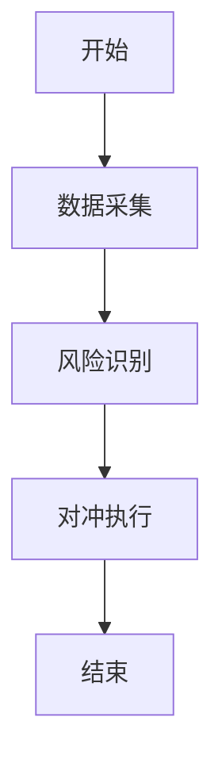
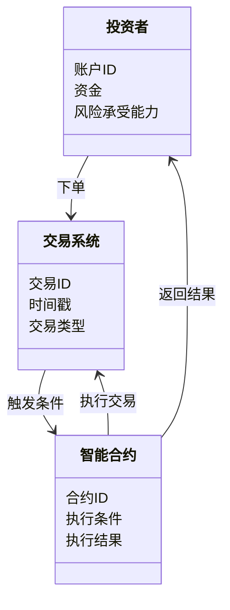
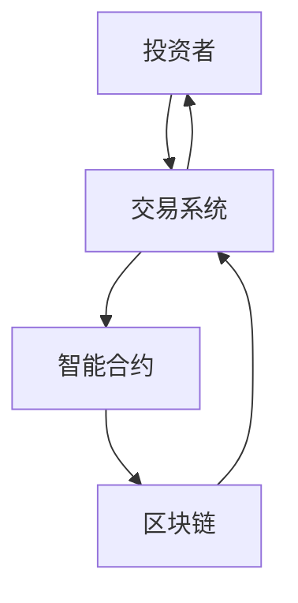
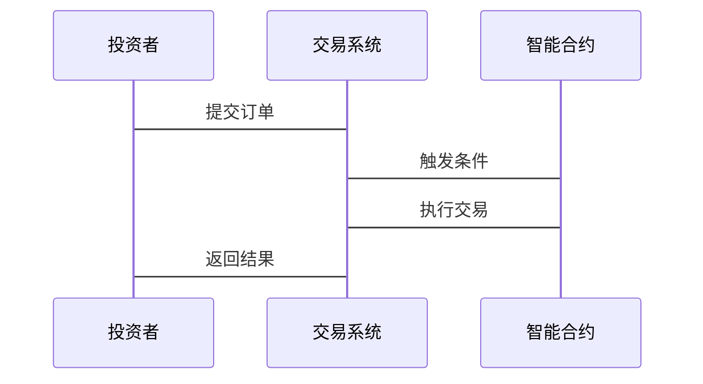

                 


# 特价股票投资中的智能合约自动化风险对冲策略

## 关键词：智能合约，风险对冲，特价股票，区块链技术，自动化交易，金融数学模型

## 摘要：  
本文探讨了在特价股票投资中利用智能合约实现自动化风险对冲的策略。通过分析智能合约的原理、算法设计、系统架构和实际案例，本文详细阐述了如何利用区块链技术和数学模型来优化投资决策，降低投资风险，并提高交易效率。

---

# 第1章: 特价股票投资与智能合约背景介绍

## 1.1 特价股票投资的定义与特点  
### 1.1.1 特价股票投资的定义  
特价股票投资是指在特定条件下，以低于市场价购买股票并进行短期交易的投资策略。其核心在于利用价格波动赚取差价。

### 1.1.2 特价股票投资的核心特点  
- **高风险高收益**：依赖于市场波动，收益不稳定。  
- **短期性**：通常以快速交易为主，持有时间较短。  
- **依赖市场信息**：需要实时监控市场数据，快速决策。  

### 1.1.3 特价股票投资的市场背景  
近年来，随着金融市场的波动加剧，投资者越来越依赖技术手段来优化决策。智能合约作为一种自动化工具，为特价股票投资提供了新的可能性。

## 1.2 智能合约的定义与特点  
### 1.2.1 智能合约的定义  
智能合约是基于区块链技术的自动化协议，能够在满足特定条件时自动执行交易或操作。它无需中介，且执行过程透明、不可篡改。

### 1.2.2 智能合约的核心特点  
- **自动化**：无需人工干预，自动执行预设逻辑。  
- **透明性**：所有交易记录在区块链上，公开透明。  
- **安全性**：通过区块链技术确保数据安全，防止篡改。  

### 1.2.3 智能合约与传统对冲策略的区别  
传统对冲策略依赖人工操作和市场分析，而智能合约通过自动化执行和实时监控，能够更快、更准确地应对市场变化。

## 1.3 风险对冲策略的重要性  
### 1.3.1 风险对冲的基本概念  
风险对冲是指通过投资于相关资产或衍生品，降低投资组合的整体风险。在股票投资中，常用的技术包括对冲市场波动和分散投资。

### 1.3.2 风险对冲在股票投资中的作用  
- **降低波动性风险**：通过分散投资和对冲技术减少收益的波动。  
- **提高投资效率**：自动化对冲策略能够快速响应市场变化，提升交易效率。  

### 1.3.3 智能合约在风险对冲中的应用前景  
智能合约能够实时监控市场数据，自动执行对冲操作，为投资者提供高效、可靠的对冲服务。

## 1.4 本章小结  
本章介绍了特价股票投资的定义、特点及其市场背景，分析了智能合约的核心特点及其在风险对冲中的优势，为后续章节奠定了基础。

---

# 第2章: 智能合约在风险对冲中的核心概念与联系

## 2.1 核心概念原理  
### 2.1.1 智能合约的执行机制  
智能合约基于区块链技术，通过预设的条件触发交易。其执行过程无需人工干预，且具有高度的透明性和安全性。

### 2.1.2 智能合约的自动化特性  
智能合约能够自动执行交易，实时响应市场变化，为投资者提供高效的对冲服务。

### 2.1.3 智能合约的风险对冲原理  
通过实时监控市场数据，智能合约能够自动识别市场风险并执行对冲操作，从而降低投资组合的整体风险。

## 2.2 概念属性特征对比表格  
以下是智能合约与传统对冲策略的对比表格：

| 对比维度       | 智能合约                  | 传统对冲策略              |
|----------------|--------------------------|--------------------------|
| 执行方式       | 自动化执行                | 人工操作                  |
| 透明性         | 高                      | 低                      |
| 安全性         | 高                      | 中                      |
| 响应速度       | 快                      | 慢                      |

## 2.3 ER实体关系图架构  
以下是智能合约在风险对冲中的ER实体关系图：

```mermaid
erDiagram
    actor 投资者 {
        <属性> 账户ID
        <属性> 资金
        <属性> 风险承受能力
    }
    actor 交易系统 {
        <属性> 交易ID
        <属性> 时间戳
        <属性> 交易类型
    }
    actor 智能合约 {
        <属性> 合约ID
        <属性> 执行条件
        <属性> 执行结果
    }
    投资者 --> 交易系统 : 下单
    交易系统 --> 智能合约 : 触发条件
    智能合约 --> 交易系统 : 执行交易
    智能合约 --> 投资者 : 返回结果
```

## 2.4 本章小结  
本章通过对比分析，详细阐述了智能合约在风险对冲中的核心概念和优势，为后续的算法设计和系统实现提供了理论基础。

---

# 第3章: 智能合约自动化风险对冲的算法原理

## 3.1 算法原理概述  
### 3.1.1 算法的基本思路  
智能合约通过实时监控市场数据，识别风险信号，并自动执行对冲操作。其核心在于快速响应和精准执行。

### 3.1.2 算法的核心步骤  
1. 数据采集：实时获取市场数据，包括股票价格、成交量等。  
2. 风险识别：通过数学模型分析数据，识别潜在风险。  
3. 自动对冲：根据风险信号，智能合约自动执行对冲交易。  

### 3.1.3 算法的优化方向  
- **数据处理效率**：优化数据采集和处理流程，提升算法的响应速度。  
- **风险识别模型**：改进数学模型，提高风险识别的准确性。  

## 3.2 算法的 mermaid 流程图  
以下是智能合约自动化风险对冲的算法流程图：



## 3.3 算法的数学模型与公式  
### 3.3.1 算法的数学模型  
假设我们有一个股票价格序列 \( P_1, P_2, ..., P_n \)，我们需要预测其未来的价格波动。通过对历史数据进行分析，我们可以建立一个回归模型：

$$ P_{n+1} = aP_n + b $$  

其中，\( a \) 和 \( b \) 是模型的参数，通过最小二乘法求解。

### 3.3.2 算法的优化策略  
为了提高算法的准确性，我们可以引入机器学习技术，例如使用 LSTM 神经网络进行时间序列预测。

## 3.4 算法的实现与测试  
### 3.4.1 算法实现步骤  
1. 数据预处理：清洗和归一化数据。  
2. 模型训练：使用训练数据训练回归模型。  
3. 模型预测：利用训练好的模型预测未来的价格。  
4. 对冲操作：根据预测结果执行相应的对冲交易。  

### 3.4.2 算法测试方法  
- **回测**：在历史数据上测试算法的准确性。  
- **实时测试**：在实际市场中测试算法的响应速度和执行效果。  

### 3.4.3 算法优化建议  
- **模型优化**：尝试不同的机器学习算法，提高预测的准确性。  
- **数据优化**：引入更多的市场数据，如新闻、社交媒体情绪等，丰富数据源。  

## 3.5 本章小结  
本章详细讲解了智能合约自动化风险对冲的算法原理，包括算法的基本思路、核心步骤、数学模型和优化策略。通过 mermaid 流程图和具体代码示例，读者可以更好地理解算法的实现过程。

---

# 第4章: 系统分析与架构设计方案

## 4.1 问题场景介绍  
在特价股票投资中，投资者需要实时监控市场数据，快速识别风险并执行对冲操作。传统的对冲策略依赖人工操作，效率低且容易出错。智能合约通过自动化执行和实时监控，能够有效解决这些问题。

## 4.2 系统功能设计  
### 4.2.1 使用 Mermaid 绘制的领域模型类图  
以下是智能合约系统的领域模型类图：



### 4.2.2 系统架构设计  
以下是智能合约系统的系统架构图：



### 4.2.3 系统接口设计  
系统主要接口包括：  
1. `submitOrder`：提交订单。  
2. `triggerCondition`：触发对冲条件。  
3. `executeTrade`：执行交易。  

### 4.2.4 系统交互设计  
以下是系统交互序列图：



## 4.3 本章小结  
本章通过系统分析和架构设计，展示了智能合约在风险对冲中的应用场景和系统实现方式。通过 mermaid 图表，读者可以清晰地理解系统的结构和交互流程。

---

# 第5章: 项目实战——智能合约自动化风险对冲系统实现

## 5.1 环境安装与配置  
### 5.1.1 开发环境的搭建  
建议使用 Python 和以太坊区块链进行开发。安装必要的库，如 `web3.py` 和 `solidity` 编译器。

### 5.1.2 依赖库的安装  
安装以下依赖库：  
```bash
pip install web3
npm install solc
```

## 5.2 系统核心实现  
### 5.2.1 智能合约的核心  
以下是智能合约的 Solidity 代码示例：

```solidity
pragma solidity ^0.8.0;

contract PriceHedging {
    function hedge(uint price, uint target) public {
        if (price > target) {
            // 执行对冲操作
            swapTokens();
        } else {
            // 不执行对冲操作
        }
    }

    function swapTokens() private {
        // 具体的对冲逻辑
    }
}
```

### 5.2.2 后端系统的实现  
以下是后端系统的 Python 实现示例：

```python
from web3 import Web3

# 初始化区块链连接
web3 = Web3(Web3.HTTPProvider("http://localhost:8545"))

# 定义智能合约地址和ABI
contract_address = "0x..."
contract_abi = [...]

# 初始化合约实例
contract = web3.eth.contract(contract_address, abi=contract_abi)

# 提交订单
def submit_order(price):
    contract.functions.submitOrder(price).transact()

# 执行对冲
def hedge(price, target):
    contract.functions.hedge(price, target).transact()
```

## 5.3 项目总结  
通过本章的实战，读者可以掌握智能合约在风险对冲中的具体实现方法。通过环境配置和代码实现，读者能够更好地理解智能合约的应用场景和优势。

---

# 作者：AI天才研究院 & 禅与计算机程序设计艺术

---

以上是《特价股票投资中的智能合约自动化风险对冲策略》的技术博客文章。

