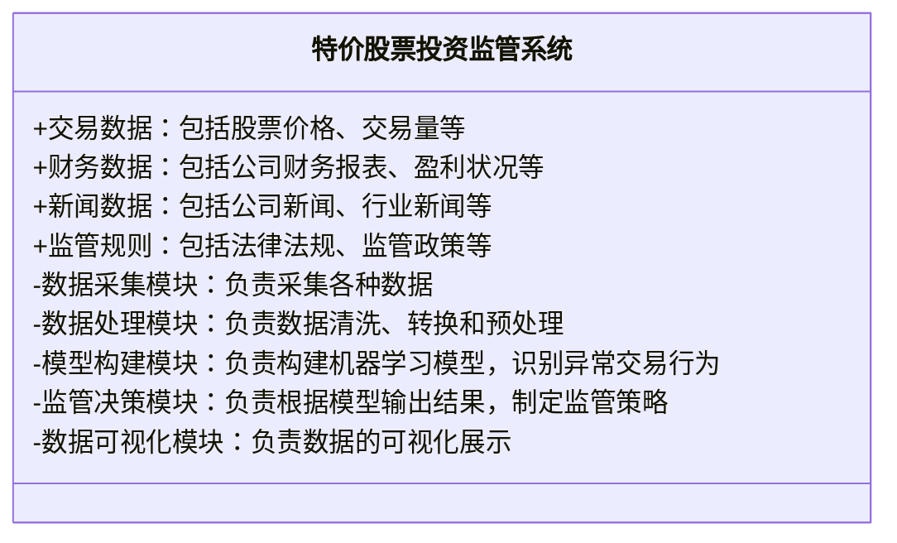

                 


# 特价股票投资中的智能监管合规策略

> 关键词：智能监管，合规策略，特价股票，机器学习，大数据分析

> 摘要：本文探讨了在特价股票投资中，如何通过智能监管和合规策略来确保投资行为的合法性和透明性。文章从背景介绍、核心概念、算法原理、系统设计到项目实战，详细分析了智能监管在特价股票投资中的应用，并提出了基于机器学习的监管框架和合规策略。

---

## 第一章：特价股票投资的基本概念

### 1.1 特价股票的定义与特点

#### 1.1.1 特价股票的定义
特价股票是指价格相对市场平均价格低很多的股票，通常被认为具有较高的投资价值，但也伴随着较高的风险。

#### 1.1.2 特价股票的主要特点
- **低估值**：通常市盈率、市净率等指标低于行业平均水平。
- **高波动性**：价格波动较大，容易受市场情绪影响。
- **高风险**：可能存在财务危机或市场操纵的风险。

#### 1.1.3 特价股票的投资价值与风险
- **投资价值**：可能隐藏着被低估的潜力股，长期投资回报较高。
- **投资风险**：短期波动大，容易受市场情绪影响，存在退市风险。

### 1.2 特价股票投资的背景与现状

#### 1.2.1 特价股票投资的背景分析
随着资本市场的快速发展，投资者对低价股票的关注度逐渐增加，尤其是中小投资者，希望通过投资特价股票实现财富增值。

#### 1.2.2 当前市场中的特价股票投资现状
- **市场热度**：部分投资者热衷于追逐低价股票，认为其具有上涨潜力。
- **监管压力**：监管部门对低价股票的交易行为加大监管力度，以防范市场操纵和虚假信息传播。

#### 1.2.3 特价股票投资的未来发展趋势
- **智能化投资**：通过大数据和人工智能技术，投资者可以更精准地识别潜在的投资机会。
- **合规化监管**：监管部门将更加注重智能化监管，确保市场公平公正。

### 1.3 智能监管与合规的必要性

#### 1.3.1 监管在股票投资中的作用
- **维护市场秩序**：防止市场操纵和虚假信息传播。
- **保护投资者利益**：确保投资者的合法权益不受侵害。
- **促进市场健康发展**：通过监管，引导资金流向优质企业，促进市场长期健康发展。

#### 1.3.2 合规投资的重要性
- **合法合规**：确保投资行为符合相关法律法规。
- **风险控制**：通过合规投资，降低投资风险。
- **长期收益**：合规投资更有可能实现长期稳定的收益。

#### 1.3.3 智能监管与合规的优势
- **高效性**：通过智能化手段，可以快速识别异常交易行为。
- **精准性**：基于大数据分析和机器学习，监管机构可以更精准地定位问题。
- **实时性**：智能化监管可以实现对市场行为的实时监控和反馈。

### 1.4 本章小结
本章介绍了特价股票的基本概念、投资背景和现状，以及智能监管与合规的必要性。通过分析，我们可以看到，智能监管在特价股票投资中的作用日益重要，是确保市场公平和投资者利益的关键手段。

---

## 第二章：特价股票投资中的智能监管框架

### 2.1 智能监管的基本原理

#### 2.1.1 数据采集与处理
- **数据来源**：包括交易所的实时交易数据、公司财务报表、新闻资讯等。
- **数据清洗**：去除无效数据，处理缺失值，标准化数据格式。
- **数据预处理**：将数据转换为适合模型输入的格式，如特征提取、数据增强等。

#### 2.1.2 数据分析与建模
- **数据分析**：通过统计分析和可视化工具，识别数据中的规律和异常。
- **建模**：利用机器学习算法，如支持向量机（SVM）、随机森林（Random Forest）等，构建预测模型。
- **模型优化**：通过交叉验证和网格搜索，优化模型的参数，提高预测准确性。

#### 2.1.3 监管结果的输出与反馈
- **输出结果**：模型输出异常交易行为的预警信号。
- **反馈机制**：根据监管结果，调整模型参数，优化监管策略。

### 2.2 智能监管的核心技术

#### 2.2.1 人工智能在监管中的应用
- **自然语言处理（NLP）**：用于分析新闻、公告等文本数据，识别市场情绪。
- **计算机视觉**：用于分析图表数据，识别价格走势。
- **强化学习**：用于动态调整监管策略，应对市场变化。

#### 2.2.2 大数据分析在监管中的作用
- **数据挖掘**：发现隐藏在数据中的规律和模式。
- **预测分析**：利用历史数据预测未来市场走势。
- **实时监控**：对市场行为进行实时分析和反馈。

#### 2.2.3 机器学习在监管中的具体实现
- **监督学习**：用于分类问题，如识别垃圾邮件、欺诈交易。
- **无监督学习**：用于聚类问题，如识别市场操纵行为。
- **深度学习**：用于复杂模式识别，如图像识别、语音识别。

### 2.3 智能监管框架的设计

#### 2.3.1 框架的整体架构
- **数据采集层**：负责收集各种数据，如交易数据、财务数据、新闻数据等。
- **数据处理层**：对数据进行清洗、转换和预处理，为模型提供输入数据。
- **模型构建层**：利用机器学习算法，构建预测模型，识别异常交易行为。
- **监管决策层**：根据模型输出结果，制定监管策略，发出预警信号。

#### 2.3.2 各模块的功能与交互
- **数据采集模块**：与交易所、新闻网站等数据源对接，获取实时数据。
- **数据处理模块**：对数据进行清洗、转换，提取特征，为模型提供输入。
- **模型构建模块**：选择合适的算法，训练模型，优化参数，评估模型性能。
- **监管决策模块**：根据模型输出，制定监管策略，调整模型参数。

#### 2.3.3 框架的灵活性与可扩展性
- **灵活性**：框架设计应具有灵活性，能够适应市场变化和监管需求的变化。
- **可扩展性**：框架应支持扩展，能够添加新的数据源和新的算法。

### 2.4 本章小结
本章详细介绍了智能监管的基本原理和核心技术，提出了一个智能监管框架，包括数据采集、处理、建模和决策等模块。通过该框架，可以实现对特价股票投资行为的智能化监管，确保市场公平和投资者利益。

---

## 第三章：特价股票投资中的合规策略

### 3.1 合规投资的基本原则

#### 3.1.1 合规投资的核心原则
- **合法性**：确保投资行为符合相关法律法规。
- **透明性**：确保投资行为公开透明，避免虚假信息传播。
- **风险控制**：通过合规投资，降低投资风险。

#### 3.1.2 合规投资的实施步骤
1. **风险评估**：评估投资标的的风险，选择合适的投资策略。
2. **合规审查**：对投资行为进行合规性审查，确保符合法律法规。
3. **持续监控**：对投资行为进行持续监控，及时发现和处理异常情况。

#### 3.1.3 合规投资的注意事项
- **合规意识**：投资者应具备合规意识，遵守法律法规。
- **合规文化**：机构应建立合规文化，加强内部合规管理。
- **合规培训**：定期对员工进行合规培训，提高合规意识和能力。

### 3.2 智能合规策略的设计

#### 3.2.1 合规策略的智能化转型
- **智能化合规**：利用人工智能技术，实现合规管理的智能化。
- **动态合规**：根据市场变化和监管要求，动态调整合规策略。
- **数据驱动合规**：基于数据分析，制定合规策略，提高合规效率。

#### 3.2.2 基于机器学习的合规策略
- **监督学习**：用于分类问题，如识别欺诈交易。
- **无监督学习**：用于聚类问题，如识别市场操纵行为。
- **强化学习**：用于动态调整合规策略，应对市场变化。

#### 3.2.3 合规策略的动态调整与优化
- **动态调整**：根据市场变化和监管要求，动态调整合规策略。
- **策略优化**：通过数据驱动和模型优化，提高合规策略的有效性。
- **持续改进**：定期评估合规策略的效果，发现问题并进行改进。

### 3.3 合规策略的实施与监控

#### 3.3.1 合规策略的实施过程
1. **策略制定**：根据市场情况和监管要求，制定合规策略。
2. **策略执行**：将合规策略应用于实际投资行为中，确保合规性。
3. **策略监控**：对合规策略的执行情况进行监控，发现问题及时调整。

#### 3.3.2 监控机制的建立与运行
- **监控体系**：建立完善的监控体系，包括数据采集、分析、预警和处理。
- **监控工具**：利用技术手段，如大数据分析和人工智能，提高监控效率。
- **监控团队**：组建专业的监控团队，负责监控策略的执行和调整。

#### 3.3.3 合规策略的持续改进
- **问题发现**：通过监控，发现合规策略中的问题。
- **问题分析**：对问题进行深入分析，找出原因。
- **问题解决**：制定解决方案，优化合规策略，避免类似问题再次发生。

### 3.4 本章小结
本章详细探讨了合规投资的基本原则和智能合规策略的设计，提出了基于机器学习的合规策略，能够根据市场变化和监管要求，动态调整合规策略，确保投资行为的合法性和合规性。

---

## 第四章：特价股票投资中的智能监管算法

### 4.1 基于强化学习的监管算法

#### 4.1.1 强化学习的基本原理
- **强化学习**：一种通过试错机制，学习如何在环境中做出最优决策的算法。
- **状态**：环境中的当前情况，如市场价格、交易量等。
- **动作**：算法根据当前状态做出的决策，如买入、卖出或持有。
- **奖励**：根据动作的结果，给予正向或负向的反馈，指导算法调整策略。

#### 4.1.2 强化学习在监管中的应用
- **市场操纵识别**：通过强化学习，识别异常交易行为，防范市场操纵。
- **交易行为预测**：通过强化学习，预测投资者的交易行为，提前制定监管策略。
- **动态调整监管**：根据市场变化，动态调整监管策略，提高监管效率。

#### 4.1.3 基于强化学习的监管算法实现
- **算法选择**：选择适合的强化学习算法，如深度Q网络（DQN）。
- **环境构建**：构建模拟交易环境，模拟市场价格波动和交易行为。
- **算法训练**：通过大量数据训练模型，优化算法参数，提高监管效果。

### 4.2 基于聚类分析的监管算法

#### 4.2.1 聚类分析的基本原理
- **聚类分析**：一种无监督学习算法，用于将数据分成若干簇，簇内的数据具有相似性。
- **距离度量**：计算数据点之间的相似性，如欧氏距离、曼哈顿距离等。
- **聚类算法**：如K均值聚类、层次聚类等。

#### 4.2.2 聚类分析在监管中的应用
- **市场参与者分类**：通过聚类分析，识别不同类型的市场参与者，如机构投资者、散户等。
- **异常交易识别**：通过聚类分析，识别异常交易行为，防范市场操纵。
- **风险评估**：通过聚类分析，评估市场风险，制定相应的监管策略。

#### 4.2.3 基于聚类分析的监管算法实现
- **数据预处理**：对交易数据进行清洗和标准化，确保数据质量。
- **选择聚类算法**：根据数据特点选择合适的聚类算法，如K均值聚类。
- **模型训练**：对数据进行聚类，识别异常交易行为。
- **结果分析**：对聚类结果进行分析，制定相应的监管策略。

### 4.3 合规策略的实施与监控

#### 4.3.1 合规策略的实施过程
1. **策略制定**：根据市场情况和监管要求，制定合规策略。
2. **策略执行**：将合规策略应用于实际投资行为中，确保合规性。
3. **策略监控**：对合规策略的执行情况进行监控，发现问题及时调整。

#### 4.3.2 监控机制的建立与运行
- **监控体系**：建立完善的监控体系，包括数据采集、分析、预警和处理。
- **监控工具**：利用技术手段，如大数据分析和人工智能，提高监控效率。
- **监控团队**：组建专业的监控团队，负责监控策略的执行和调整。

#### 4.3.3 合规策略的持续改进
- **问题发现**：通过监控，发现合规策略中的问题。
- **问题分析**：对问题进行深入分析，找出原因。
- **问题解决**：制定解决方案，优化合规策略，避免类似问题再次发生。

### 4.4 本章小结
本章详细介绍了基于强化学习和聚类分析的监管算法，提出了利用这些算法实现智能监管的策略。通过这些算法，可以更准确地识别异常交易行为，提高监管效率和效果。

---

## 第五章：系统分析与架构设计方案

### 5.1 问题场景介绍

#### 5.1.1 系统目标
- 实现智能监管合规策略，确保特价股票投资行为的合法性和合规性。
- 提供实时监控和预警功能，及时发现异常交易行为。
- 提供数据可视化功能，帮助监管机构和投资者更好地理解和分析市场行为。

#### 5.1.2 项目介绍
- 项目名称：智能监管合规系统
- 项目目标：构建一个智能化的监管系统，实现对特价股票投资行为的实时监控和合规管理。
- 项目范围：包括数据采集、处理、分析、预警和可视化等功能。

### 5.2 系统功能设计

#### 5.2.1 领域模型


#### 5.2.2 系统架构设计


#### 5.2.3 系统接口设计
- **数据接口**：与交易所、新闻网站等数据源对接，获取实时数据。
- **模型接口**：与机器学习模型对接，获取模型输出结果。
- **可视化接口**：与数据可视化工具对接，展示监管结果。

#### 5.2.4 系统交互设计
```mermaid
sequenceDiagram
    客户端 -> 数据采集模块：请求数据采集
    数据采集模块 -> 数据源：获取数据
    数据采集模块 -> 数据处理模块：传递数据
    数据处理模块 -> 模型构建模块：传递处理后的数据
    模型构建模块 -> 监管决策模块：传递模型输出结果
    监管决策模块 -> 数据可视化模块：传递可视化数据
    数据可视化模块 -> 客户端：展示可视化结果
```

### 5.3 系统功能实现

#### 5.3.1 数据采集模块
```python
import requests
import pandas as pd

def fetch_data(api_url):
    response = requests.get(api_url)
    data = response.json()
    df = pd.DataFrame(data)
    return df
```

#### 5.3.2 数据处理模块
```python
def preprocess_data(df):
    # 删除缺失值
    df.dropna(inplace=True)
    # 标准化数据
    df = (df - df.mean()) / df.std()
    return df
```

#### 5.3.3 模型构建模块
```python
from sklearn.ensemble import RandomForestClassifier
from sklearn.metrics import accuracy_score

def build_model(X_train, y_train):
    model = RandomForestClassifier()
    model.fit(X_train, y_train)
    return model

def evaluate_model(model, X_test, y_test):
    y_pred = model.predict(X_test)
    accuracy = accuracy_score(y_test, y_pred)
    return accuracy
```

#### 5.3.4 数据可视化模块
```python
import matplotlib.pyplot as plt

def visualize_data(data):
    plt.figure(figsize=(10, 6))
    plt.plot(data['date'], data['price'], label='Stock Price')
    plt.xlabel('Date')
    plt.ylabel('Price')
    plt.title('Stock Price Trend')
    plt.legend()
    plt.show()
```

### 5.4 系统实现小结
本章详细介绍了系统分析与架构设计方案，包括系统目标、功能设计、系统架构、接口设计和交互设计。通过这些设计，我们可以构建一个智能化的监管系统，实现对特价股票投资行为的实时监控和合规管理。

---

## 第六章：项目实战与案例分析

### 6.1 环境安装

#### 6.1.1 安装Python
```bash
# 安装Python
sudo apt-get install python3 python3-pip
```

#### 6.1.2 安装相关库
```bash
pip install pandas numpy scikit-learn matplotlib requests
```

### 6.2 系统核心实现

#### 6.2.1 数据采集模块
```python
import requests
import pandas as pd

def fetch_stock_data(api_key):
    api_url = f"https://api.example.com/stock_data?api_key={api_key}"
    response = requests.get(api_url)
    data = response.json()
    df = pd.DataFrame(data)
    return df
```

#### 6.2.2 数据处理模块
```python
def preprocess_stock_data(df):
    df.dropna(inplace=True)
    df['date'] = pd.to_datetime(df['date'])
    df.set_index('date', inplace=True)
    return df
```

#### 6.2.3 模型构建模块
```python
from sklearn.ensemble import RandomForestClassifier
from sklearn.model_selection import train_test_split
from sklearn.metrics import accuracy_score

def build_model(df, target_column):
    X = df.drop(columns=[target_column])
    y = df[target_column]
    X_train, X_test, y_train, y_test = train_test_split(X, y, test_size=0.2, random_state=42)
    model = RandomForestClassifier()
    model.fit(X_train, y_train)
    accuracy = accuracy_score(y_test, model.predict(X_test))
    return model, accuracy
```

#### 6.2.4 数据可视化模块
```python
import matplotlib.pyplot as plt

def visualize_stock_data(df, model):
    plt.figure(figsize=(12, 6))
    plt.plot(df['date'], df['price'], label='Actual Price')
    plt.plot(df['date'], model.predict(df.drop(columns=['price'])), label='Predicted Price')
    plt.xlabel('Date')
    plt.ylabel('Price')
    plt.title('Stock Price Prediction')
    plt.legend()
    plt.show()
```

### 6.3 案例分析与详细讲解

#### 6.3.1 数据采集与处理
```python
# 采集数据
data = fetch_stock_data(api_key='your_api_key')

# 处理数据
processed_data = preprocess_stock_data(data)
```

#### 6.3.2 模型构建与训练
```python
# 构建模型
model, accuracy = build_model(processed_data, target_column='price')
print(f"模型准确率：{accuracy}")
```

#### 6.3.3 数据可视化
```python
# 可视化
visualize_stock_data(processed_data, model)
```

### 6.4 项目小结
本章通过一个实际的项目，展示了如何在特价股票投资中应用智能监管合规策略。通过数据采集、处理、建模和可视化，我们可以实现对市场行为的实时监控和合规管理。

---

## 第七章：总结与展望

### 7.1 总结
本文详细探讨了特价股票投资中的智能监管合规策略，提出了基于机器学习的监管框架和合规策略。通过系统的分析和设计，我们可以构建一个智能化的监管系统，实现对市场行为的实时监控和合规管理。

### 7.2 展望
未来，随着人工智能和大数据技术的不断发展，智能监管合规策略将在特价股票投资中发挥越来越重要的作用。我们可以通过以下方式进一步优化监管系统：
- **算法优化**：进一步优化机器学习算法，提高监管效率和准确性。
- **数据源扩展**：引入更多数据源，如社交媒体数据、情绪分析数据等，提高监管的全面性。
- **系统集成**：将智能监管系统与投资管理系统集成，实现更高效的市场管理。

---

## 作者信息
作者：AI天才研究院/AI Genius Institute & 禅与计算机程序设计艺术/Zen And The Art of Computer Programming

