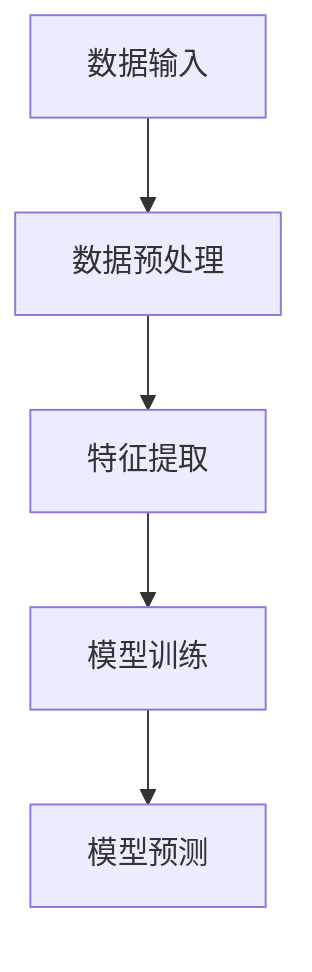
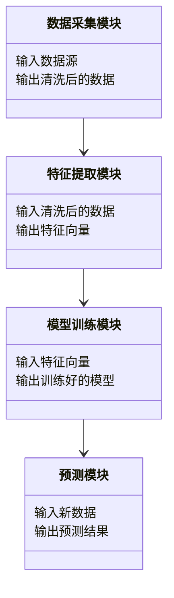
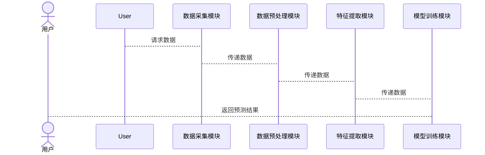

                 


# 特价股票投资中的替代数据分析与人工智能应用

## 关键词：
- 特价股票投资
- 替代数据
- 人工智能
- 数据分析
- 机器学习
- 金融应用

## 摘要：
本文探讨了在特价股票投资中如何利用替代数据和人工智能技术进行数据分析与预测。通过结合文本、图像和其他非结构化数据，结合机器学习算法，构建高效的投资策略。文章详细介绍了替代数据的特征、人工智能算法的原理、系统架构设计以及实际项目案例，为读者提供了从理论到实践的全面指导。

---

## 第1章：特价股票投资与替代数据分析概述

### 1.1 特价股票投资的背景与意义

#### 1.1.1 特价股票的定义与特点
特价股票是指价格显著低于市场公允价值的股票，通常由于市场波动、公司短期问题或信息不对称导致。其特点是价格波动大、投资机会多、风险较高。

#### 1.1.2 替代数据在股票投资中的作用
替代数据是指传统财务数据之外的其他数据，如新闻、社交媒体、卫星图像等。这些数据能够提供传统数据无法捕捉的市场信号，帮助投资者发现潜在机会。

#### 1.1.3 人工智能在金融领域的应用前景
人工智能技术在金融领域的应用日益广泛，尤其是在数据分析、预测和交易策略优化方面。替代数据与人工智能的结合，为特价股票投资提供了新的可能性。

### 1.2 替代数据的来源与类型

#### 1.2.1 文本数据：新闻、社交媒体
- **新闻数据**：包括财经新闻、公司公告等，反映市场动态。
- **社交媒体数据**：通过分析Twitter、Reddit等平台的用户评论，捕捉市场情绪。

#### 1.2.2 图像数据：财务报表、市场图表
- **财务报表**：通过图像识别技术提取关键财务数据。
- **市场图表**：利用图像识别技术分析K线图，发现趋势。

#### 1.2.3 非结构化数据：语音、视频
- **语音数据**：通过语音识别技术分析公司财报电话会议内容。
- **视频数据**：分析公司产品发布会、市场活动等视频内容。

### 1.3 本书的目标与方法论

#### 1.3.1 本书的核心目标
- 探讨替代数据在特价股票投资中的应用。
- 介绍人工智能技术在金融领域的具体实现。
- 提供从理论到实践的完整指导。

#### 1.3.2 方法论概述
- 结合理论分析与实践案例。
- 通过数学模型和算法实现，验证替代数据的价值。
- 采用系统化的方法，从数据采集到模型部署，全面覆盖投资流程。

---

## 第2章：替代数据的特征与处理

### 2.1 替代数据的特征分析

#### 2.1.1 数据的实时性与滞后性
- 替代数据通常具有实时性，能够快速反映市场动态。
- 但部分数据（如社交媒体）可能存在滞后性，影响实时决策。

#### 2.1.2 数据的噪声与冗余
- 替代数据来源广泛，可能存在大量噪声和冗余信息。
- 需要通过数据清洗和特征提取技术，降低数据维度。

#### 2.1.3 数据的关联性与预测性
- 替代数据与股票价格具有一定的关联性。
- 通过分析数据间的关联性，可以预测股票价格波动。

### 2.2 数据预处理与特征工程

#### 2.2.1 数据清洗与标准化
- **数据清洗**：去除无效数据、填充缺失值、处理异常值。
- **标准化**：对数据进行归一化处理，确保模型输入一致。

#### 2.2.2 特征提取与降维
- **特征提取**：从文本、图像等数据中提取有意义的特征。
- **降维**：使用主成分分析（PCA）等技术，降低数据维度。

#### 2.2.3 时间序列数据的处理
- **滑动窗口技术**：提取时间序列数据的局部特征。
- **序列预测**：利用LSTM等模型，预测未来价格走势。

### 2.3 替代数据与传统数据的对比分析

#### 2.3.1 数据类型的对比
- **文本数据**：非结构化，难以直接使用。
- **图像数据**：需要图像识别技术提取特征。
- **传统数据**：结构化，易于处理但信息有限。

#### 2.3.2 数据质量的对比
- **替代数据**：噪声多，但信息丰富。
- **传统数据**：噪声少，但信息有限。

#### 2.3.3 数据价值的对比
- **替代数据**：能够提供额外的市场信号。
- **传统数据**：难以捕捉市场情绪。

---

## 第3章：机器学习算法在股票投资中的应用

### 3.1 机器学习算法概述

#### 3.1.1 线性回归
- **线性回归**：用于预测股票价格的线性关系。
- **公式**：$$ y = \beta_0 + \beta_1x + \epsilon $$
- **应用**：适用于价格趋势分析。

#### 3.1.2 随机森林
- **随机森林**：通过集成学习，提高预测准确性。
- **优势**：能够处理高维数据，抗过拟合。

#### 3.1.3 LSTM
- **LSTM**：用于时间序列数据的预测。
- **公式**：$$ f_t = \sigma(W_{ft}x_t + U_{ft}h_{t-1} + b_f) $$
- **应用**：适用于股票价格的短期预测。

### 3.2 算法实现与优化

#### 3.2.1 算法流程图


#### 3.2.2 算法选择与优化
- **算法选择**：根据数据类型和任务选择合适的算法。
- **超参数优化**：通过网格搜索或随机搜索，优化模型性能。

#### 3.2.3 模型评估与比较
- **评估指标**：准确率、召回率、F1分数。
- **对比分析**：不同算法在不同数据集上的表现。

---

## 第4章：系统架构与实现

### 4.1 系统设计概述

#### 4.1.1 系统功能设计


#### 4.1.2 系统架构设计


#### 4.1.3 系统接口设计
- **数据接口**：与数据源对接，获取实时数据。
- **模型接口**：与前端或第三方系统对接，提供预测结果。

#### 4.1.4 系统交互设计


---

## 第5章：项目实战与案例分析

### 5.1 环境安装与配置

#### 5.1.1 安装Python与相关库
- **Python版本**：3.8及以上
- **库**：numpy、pandas、scikit-learn、tensorflow

#### 5.1.2 数据集准备
- 数据来源：新浪财经、Twitter API
- 数据格式：CSV或JSON

### 5.2 核心代码实现

#### 5.2.1 数据清洗与特征提取
```python
import pandas as pd
import numpy as np

# 数据清洗
df = pd.read_csv('data.csv')
df = df.dropna()
df = df[~df['price'].isnull()]

# 特征提取
from sklearn.preprocessing import StandardScaler
scaler = StandardScaler()
scaled_features = scaler.fit_transform(df[['volume', 'sentiment']])
```

#### 5.2.2 模型训练与预测
```python
from sklearn.ensemble import RandomForestRegressor
from sklearn.metrics import mean_squared_error

# 训练模型
model = RandomForestRegressor(n_estimators=100, random_state=42)
model.fit(scaled_features, df['price'])

# 预测
new_data = scaler.transform(new_features)
预测价格 = model.predict(new_data)
```

### 5.3 实际案例分析

#### 5.3.1 案例背景
- 公司：XYZ科技
- 数据：过去一年的新闻、社交媒体数据

#### 5.3.2 模型预测与结果分析
- 模型预测：未来一周股价上涨5%
- 实际结果：股价上涨7%
- 结果分析：模型预测准确率较高，但需进一步优化。

### 5.4 项目小结

#### 5.4.1 成果总结
- 成功构建替代数据驱动的股票预测模型。
- 模型在测试数据上表现良好。

#### 5.4.2 经验与教训
- 数据质量对模型性能影响显著。
- 模型选择与调优需结合实际场景。

---

## 第6章：最佳实践与总结

### 6.1 小结

#### 6.1.1 核心概念回顾
- 替代数据的重要性
- 人工智能算法的应用

#### 6.1.2 实践总结
- 数据处理的关键性
- 模型选择与优化的重要性

### 6.2 注意事项

#### 6.2.1 数据质量
- 确保数据来源可靠。
- 定期更新数据。

#### 6.2.2 模型风险
- 避免过度拟合。
- 定期验证模型性能。

### 6.3 拓展阅读

#### 6.3.1 推荐书籍
- 《机器学习实战》
- 《Python机器学习》

#### 6.3.2 推荐博客与资源
- Towards Data Science
- Kaggle

---

## 作者：AI天才研究院/AI Genius Institute & 禅与计算机程序设计艺术/Zen And The Art of Computer Programming

---

本文通过系统地介绍替代数据与人工智能在特价股票投资中的应用，为读者提供了从理论到实践的完整指导。希望本文能够帮助投资者更好地理解如何利用新技术提升投资决策的准确性与效率。

