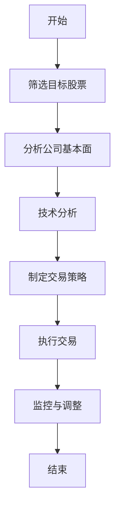
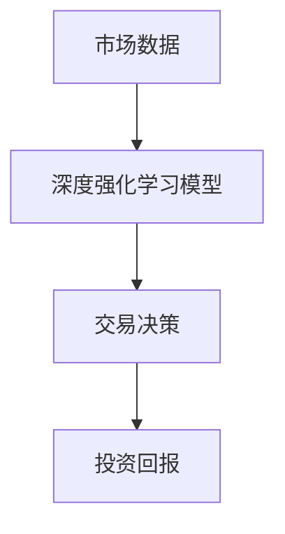
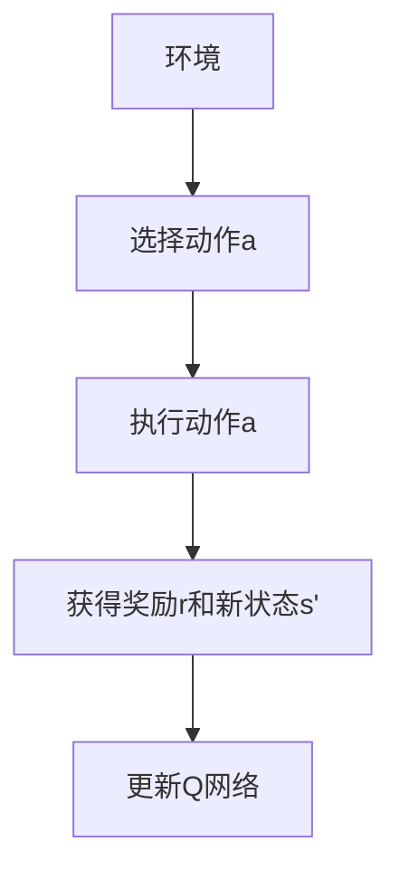
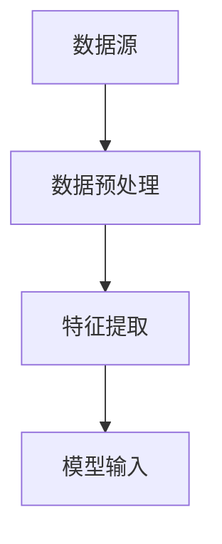
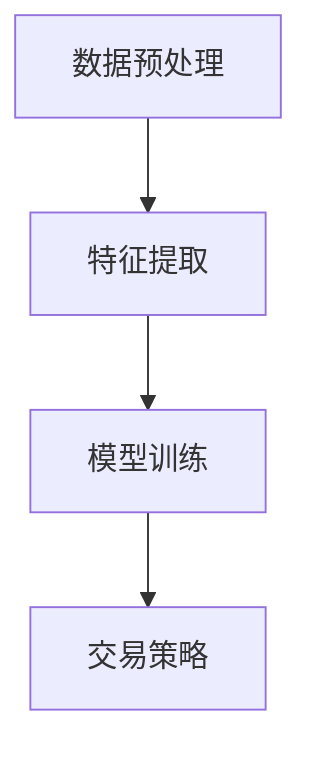
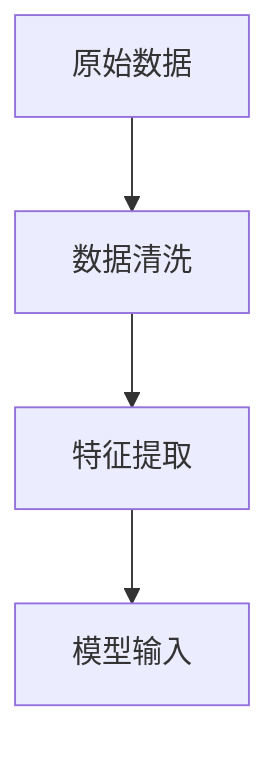
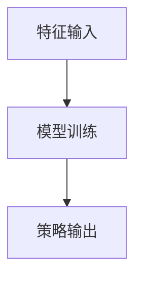
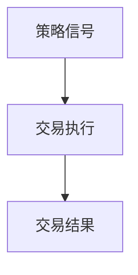

                 


# 特价股票投资中的深度强化学习模型构建与优化

> 关键词：深度强化学习、股票投资、DQN算法、策略梯度、神经网络

> 摘要：本文详细探讨了深度强化学习在特价股票投资中的应用，从算法原理到系统架构，从项目实现到优化与展望，全面分析了如何利用深度强化学习构建高效的股票投资模型。通过理论与实践的结合，本文为投资者提供了一种全新的视角和方法，以应对股票市场中的不确定性。

---

## 第一部分: 特价股票投资中的深度强化学习基础

### 第1章: 特价股票投资与深度强化学习概述

#### 1.1 特价股票的概念与特点

##### 1.1.1 特价股票的定义

特价股票是指在特定时间段内，由于市场波动、公司业绩或外部事件等因素，价格被市场低估的股票。这类股票通常具有较高的潜在回报，但同时也伴随着较高的风险。

##### 1.1.2 特价股票的投资策略

投资者在投资特价股票时，通常采用以下策略：

1. **价值投资**：寻找市场价格低于内在价值的股票。
2. **技术分析**：通过价格走势预测未来的市场行为。
3. **套利机会**：利用市场价差进行无风险或低风险投资。

##### 1.1.3 特价股票与传统股票投资的区别

| 特点 | 特价股票 | 传统股票 |
|------|----------|----------|
| 投资目标 | 高潜在回报 | 稳定收益 |
| 风险 | 高 | 中低 |
| 持股时间 | 中长期 | 长期 |

##### 1.1.4 特价股票的投资流程



#### 1.2 深度强化学习的基本原理

##### 1.2.1 深度学习与强化学习的结合

深度学习通过神经网络提取数据特征，强化学习通过奖励机制优化决策。两者的结合使得模型能够从经验中学习并做出最优决策。

##### 1.2.2 深度强化学习的核心特点

| 特点 | 描述 |
|------|------|
| 端到端学习 | 直接从输入到输出 |
| 高维状态 | 能处理复杂状态空间 |
| 离线与在线学习 | 支持多种学习模式 |

##### 1.2.3 深度强化学习在金融领域的应用潜力



---

## 第二部分: 深度强化学习算法原理

### 第2章: 深度强化学习的核心算法

#### 2.1 Q-Learning与深度Q-Learning

##### 2.1.1 Q-Learning的基本原理

Q-Learning通过状态-动作值函数（Q值）来学习最优策略：

$$ Q(s,a) = Q(s,a) + \alpha (r + \gamma \max Q(s',a') - Q(s,a)) $$

其中：
- \( \alpha \) 是学习率
- \( \gamma \) 是折扣因子
- \( r \) 是奖励

##### 2.1.2 深度Q-Learning的网络结构

深度Q-Learning使用神经网络来近似Q值函数：

```mermaid
graph TD
    A[输入状态s] --> B[DNN]
    B --> C[输出Q(s,a)]
```

##### 2.1.3 DQN算法的实现流程



#### 2.2 策略梯度方法

##### 2.2.1 策略梯度的基本概念

策略梯度方法直接优化策略，通过梯度上升法更新参数：

$$ \theta = \theta + \alpha \nabla_\theta J(\theta) $$

其中：
- \( J(\theta) \) 是目标函数
- \( \alpha \) 是学习率

##### 2.2.2 基于策略梯度的深度强化学习算法

PPO（Proximal Policy Optimization）是一种常用的策略梯度算法，通过限制策略更新的幅度来保证稳定性。

##### 2.2.3 策略梯度方法的优势与挑战

| 优势 | 挑战 |
|------|------|
| 稳定性 | 高维状态空间处理复杂 |
| 离线学习能力 | 收敛速度慢 |

#### 2.3 其他主流深度强化学习算法

##### 2.3.1 A3C算法

A3C通过分布式训练提升训练效率，适用于复杂环境。

##### 2.3.2 PPO算法

PPO通过限制策略更新幅度，确保算法稳定性。

##### 2.3.3 AC算法

AC（Actor-Critic）算法结合了值函数和策略函数，适用于连续动作空间。

#### 2.4 深度强化学习算法的数学模型

##### 2.4.1 Q-Learning的数学公式

$$ Q(s,a) = Q(s,a) + \alpha (r + \gamma \max Q(s',a') - Q(s,a)) $$

##### 2.4.2 DQN的网络结构与损失函数

DQN使用双神经网络，分别用于当前策略和目标策略，损失函数为：

$$ \text{损失函数} = \mathbb{E}[(r + \gamma Q(s',a') - Q(s,a))^2] $$

---

## 第三部分: 深度强化学习在股票投资中的系统架构

### 第3章: 深度强化学习股票投资系统架构

#### 3.1 系统功能设计

##### 3.1.1 数据收集模块

数据收集模块负责获取历史股价、财务数据等输入数据。

##### 3.1.2 特征提取模块

特征提取模块将原始数据转换为模型可识别的特征。

##### 3.1.3 模型训练模块

模型训练模块通过深度强化学习算法训练模型。

##### 3.1.4 交易策略模块

交易策略模块根据模型输出生成交易信号。

#### 3.2 系统架构设计

##### 3.2.1 数据流设计



##### 3.2.2 模块之间的交互关系



##### 3.2.3 系统的可扩展性设计

系统支持多种深度强化学习算法的扩展，如DQN、PPO等。

#### 3.3 系统接口设计

##### 3.3.1 数据接口

数据接口负责与数据源交互，获取实时数据。

##### 3.3.2 模型接口

模型接口负责与深度强化学习模型交互，获取交易信号。

##### 3.3.3 交易接口

交易接口负责与交易系统交互，执行交易指令。

#### 3.4 系统交互流程

##### 3.4.1 数据预处理流程



##### 3.4.2 模型训练流程



##### 3.4.3 交易策略执行流程



---

## 第四部分: 项目实战与优化

### 第4章: 深度强化学习股票投资系统实现

#### 4.1 环境安装与配置

##### 4.1.1 Python环境搭建

安装Python和必要的库，如TensorFlow、Keras、Pandas等。

##### 4.1.2 深度学习框架的选择

推荐使用TensorFlow或PyTorch框架。

#### 4.2 核心代码实现

##### 4.2.1 数据预处理代码

```python
import pandas as pd
import numpy as np

# 加载数据
data = pd.read_csv('stock_data.csv')

# 数据清洗
data.dropna(inplace=True)

# 特征提取
features = data[['open', 'high', 'low', 'close']]
```

##### 4.2.2 模型训练代码

```python
import tensorflow as tf
from tensorflow.keras import layers

# 定义DQN模型
class DQNModel:
    def __init__(self, state_space, action_space):
        self.state_space = state_space
        self.action_space = action_space
        self.model = self.build_model()

    def build_model(self):
        model = tf.keras.Sequential()
        model.add(layers.Dense(64, activation='relu', input_dim=self.state_space))
        model.add(layers.Dense(64, activation='relu'))
        model.add(layers.Dense(self.action_space, activation='linear'))
        model.compile(optimizer=tf.keras.optimizers.Adam(), loss='mse')
        return model
```

##### 4.2.3 交易策略代码

```python
import numpy as np

# 定义交易策略
class TradingStrategy:
    def __init__(self, model):
        self.model = model

    def get_action(self, state):
        # 输入状态，输出动作
        return self.model.predict(state)[0]
```

#### 4.3 实际案例分析

##### 4.3.1 数据分析

假设我们有某只股票的历史数据，通过数据预处理后，提取开盘价、收盘价等特征。

##### 4.3.2 模型训练

使用历史数据训练DQN模型，模型学习在不同状态下选择最优动作。

##### 4.3.3 交易策略执行

根据模型输出的交易信号，执行买入或卖出操作。

#### 4.4 项目小结

通过项目实战，我们可以看到深度强化学习在股票投资中的潜力，但也需要注意到市场的不确定性可能导致模型失效。

---

## 第五部分: 深度强化学习的优化与应用

### 第5章: 模型优化与策略改进

#### 5.1 模型优化方法

##### 5.1.1 网络结构优化

调整神经网络的层数和节点数，优化模型性能。

##### 5.1.2 超参数优化

通过网格搜索或随机搜索优化学习率、折扣因子等超参数。

##### 5.1.3 噪声注入

在输入中加入噪声，增强模型的鲁棒性。

#### 5.2 策略改进方法

##### 5.2.1 多目标优化

在模型中加入多个目标函数，如风险调整后的收益。

##### 5.2.2 动态调整

根据市场变化动态调整策略参数。

##### 5.2.3 风险控制

引入风险控制机制，如止损、止盈策略。

#### 5.3 应用场景扩展

##### 5.3.1 跨市场投资

将模型扩展到多个市场，进行跨市场投资。

##### 5.3.2 跨资产投资

将模型应用于不同资产类别，如股票、债券、期货等。

##### 5.3.3 自适应投资

根据市场变化自适应调整投资策略。

---

## 第六部分: 总结与展望

### 第6章: 总结与展望

#### 6.1 总结

通过本文的探讨，我们可以看到深度强化学习在特价股票投资中的巨大潜力，但同时也需要注意到市场的不确定性可能导致模型失效。

#### 6.2 展望

未来，随着深度强化学习算法的不断改进和计算能力的提升，特价股票投资将更加智能化和自动化。

---

## 作者

作者：AI天才研究院/AI Genius Institute & 禅与计算机程序设计艺术 /Zen And The Art of Computer Programming

