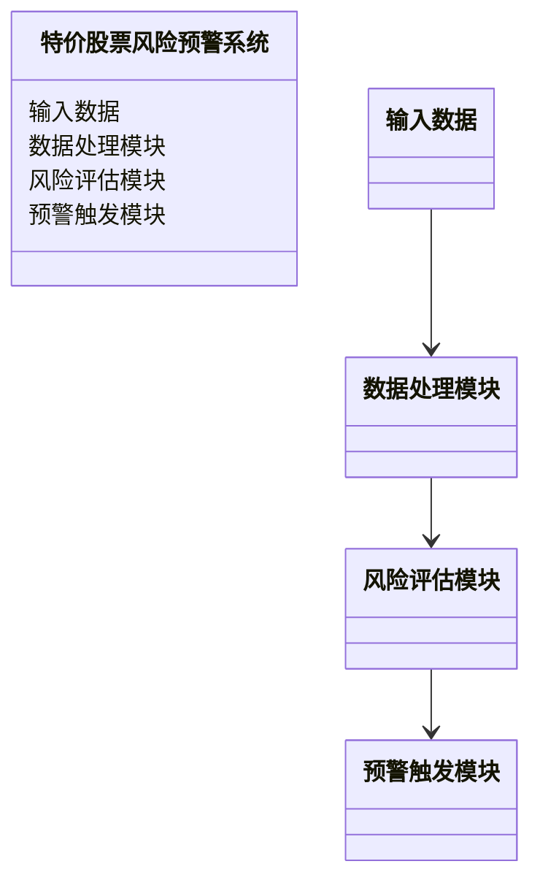
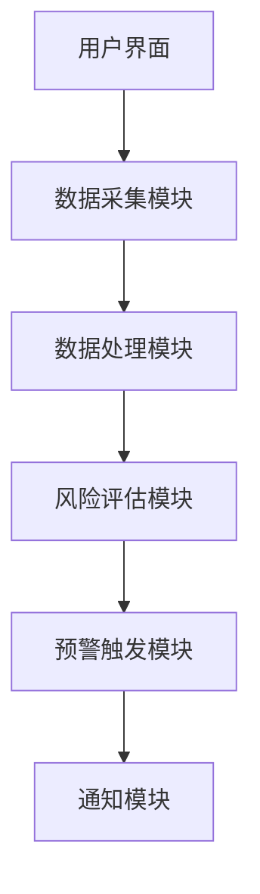

                 


# 特价股票投资中的监管科技风险预警策略

> 关键词：监管科技，风险预警，特价股票，大数据分析，人工智能，区块链技术

> 摘要：本文探讨了监管科技在特价股票投资中的应用，重点分析了如何利用大数据分析、人工智能和区块链技术来构建风险预警系统。文章从背景介绍、核心技术、算法原理、系统架构设计到实战项目，详细阐述了监管科技在风险预警中的作用，并提供了具体的实现方案和案例分析。

---

## # 第1章: 特价股票与监管科技概述

### ## 1.1 特价股票的定义与特点

#### ### 1.1.1 特价股票的定义  
特价股票通常指价格较低的股票，通常具有高波动性和高风险。这类股票可能来自小型公司或新兴行业，具有较高的增长潜力，但也面临较大的市场风险。

#### ### 1.1.2 特价股票的特点与投资机会  
- **高波动性**：价格波动较大，容易受到市场情绪和外部因素的影响。  
- **高风险**：由于公司规模较小，抗风险能力较弱。  
- **高增长潜力**：部分公司可能通过技术创新或市场拓展实现快速增长。  

#### ### 1.1.3 特价股票的投资风险与挑战  
- **市场风险**：宏观经济波动、行业政策变化等可能对股价产生重大影响。  
- **流动性风险**：部分特价股票交易量小，变现能力差。  
- **信息不对称**：投资者可能无法及时获取公司的最新信息。  

---

### ## 1.2 监管科技的定义与核心要素

#### ### 1.2.1 监管科技的定义与背景  
监管科技（RegTech）是指利用技术手段（如大数据、人工智能、区块链等）来优化金融监管、降低合规成本、提高透明度的新兴领域。随着金融市场的复杂化，监管科技的应用越来越广泛。

#### ### 1.2.2 监管科技的核心技术与应用场景  
- **大数据分析**：用于识别市场风险、欺诈行为等。  
- **人工智能**：通过机器学习模型预测市场趋势、识别异常交易。  
- **区块链技术**：用于提高交易透明度、降低数据篡改风险。  

#### ### 1.2.3 监管科技在金融领域的价值与意义  
监管科技的应用可以提高监管效率、降低合规成本、增强市场透明度，从而为投资者和金融机构创造更大的价值。

---

### ## 1.3 特价股票投资中的监管科技需求

#### ### 1.3.1 特价股票投资中的风险类型  
- **市场风险**：整体市场波动对股价的影响。  
- **信用风险**：公司财务状况不佳导致的股价下跌。  
- **操作风险**：交易过程中的错误或欺诈行为。  

#### ### 1.3.2 监管科技在风险预警中的作用  
- **实时监控**：通过大数据分析实时监测市场动态，发现潜在风险。  
- **异常检测**：利用人工智能技术识别异常交易行为。  
- **预测模型**：基于历史数据构建预测模型，提前预警风险。  

#### ### 1.3.3 特价股票投资中的监管科技需求分析  
- **数据采集与分析**：需要实时采集市场数据，分析股价波动趋势。  
- **风险评估模型**：需要构建基于机器学习的风险评估模型。  
- **预警系统**：需要设计高效的预警机制，及时通知投资者潜在风险。  

---

## # 第2章: 特价股票投资中的风险预警策略

### ## 2.1 风险预警的核心概念

#### ### 2.1.1 风险预警的定义与目标  
风险预警是指通过技术手段提前识别和预测潜在风险，从而采取措施降低损失。其目标是通过实时监控和数据分析，提前发现和预警潜在风险。

#### ### 2.1.2 风险预警的分类与层次  
- **市场风险预警**：预测市场整体波动对股价的影响。  
- **信用风险预警**：评估公司财务状况，预测信用风险。  
- **操作风险预警**：识别交易过程中的异常行为。  

#### ### 2.1.3 风险预警的实施步骤与流程  
1. **数据采集**：收集市场数据、公司财务数据、交易数据等。  
2. **数据清洗**：对数据进行预处理，去除噪声数据。  
3. **数据分析**：利用大数据分析和机器学习技术分析数据，识别潜在风险。  
4. **风险评估**：构建风险评估模型，评估潜在风险的严重程度。  
5. **预警触发**：当风险达到预设阈值时，触发预警机制，通知相关人员。  

---

### ## 2.2 监管科技在风险预警中的应用

#### ### 2.2.1 大数据分析在风险预警中的作用  
- **数据采集与处理**：利用大数据技术实时采集市场数据，分析股价波动趋势。  
- **异常检测**：通过异常检测算法识别市场中的异常波动。  
- **趋势预测**：基于历史数据构建时间序列模型，预测未来股价走势。  

#### ### 2.2.2 人工智能在风险识别中的应用  
- **机器学习模型**：利用监督学习、无监督学习等技术识别潜在风险。  
- **自然语言处理**：分析新闻、社交媒体等非结构化数据，预测市场情绪。  
- **深度学习**：通过神经网络模型捕捉复杂的市场模式。  

#### ### 2.2.3 区块链技术在风险预警中的创新应用  
- **数据透明性**：通过区块链技术确保数据的真实性和不可篡改性。  
- **智能合约**：利用智能合约自动化执行风险预警机制。  
- **分布式架构**：通过分布式架构提高系统的可靠性和抗攻击能力。  

---

## # 第3章: 监管科技的核心技术与算法原理

### ## 3.1 监管科技中的大数据分析

#### ### 3.1.1 大数据在监管科技中的应用  
- **数据采集**：通过网络爬虫、API接口等手段实时采集市场数据。  
- **数据清洗**：对数据进行预处理，确保数据的准确性和完整性。  
- **数据分析**：利用数据挖掘技术分析数据，发现潜在风险。  

#### ### 3.1.2 数据采集与清洗的流程  
1. **数据采集**：通过多种渠道获取市场数据。  
2. **数据清洗**：去除重复数据、填补缺失值、处理异常值。  
3. **数据转换**：将数据转换为适合分析的格式。  

#### ### 3.1.3 数据分析与挖掘的算法选择  
- **聚类分析**：识别市场中的相似股票，分析其价格走势。  
- **回归分析**：预测股价走势，评估影响股价的关键因素。  
- **时间序列分析**：分析股价的波动趋势，预测未来走势。  

---

### ## 3.2 监管科技中的机器学习算法

#### ### 3.2.1 机器学习在风险预警中的应用  
- **监督学习**：利用历史数据训练分类模型，预测股票风险等级。  
- **无监督学习**：通过聚类分析识别市场中的异常交易行为。  
- **强化学习**：通过策略优化算法优化投资决策。  

#### ### 3.2.2 常见机器学习算法的原理与优缺点  
| 算法类型 | 原理 | 优缺点 |  
|----------|------|--------|  
| 监督学习 | 基于标记数据进行分类或回归 | 数据需求量大，适合有标签的数据 |  
| 无监督学习 | 基于数据的内在结构进行聚类或降维 | 数据需求量小，适合无标签的数据 |  
| 强化学习 | 通过策略优化和反馈机制进行决策 | 算法复杂，适合动态环境 |  

#### ### 3.2.3 基于机器学习的风险预警模型构建  
1. **数据准备**：收集和整理市场数据。  
2. **特征提取**：提取影响股价的关键特征。  
3. **模型训练**：利用机器学习算法训练风险预警模型。  
4. **模型评估**：通过测试数据评估模型的准确性和稳定性。  

---

### ## 3.3 监管科技中的区块链技术

#### ### 3.3.1 区块链在监管科技中的应用场景  
- **数据存储**：将市场数据存储在区块链上，确保数据的真实性和不可篡改性。  
- **智能合约**：通过智能合约自动化执行风险预警机制。  
- **分布式架构**：利用区块链的分布式特性提高系统的抗攻击能力。  

#### ### 3.3.2 区块链技术在风险预警中的实现机制  
1. **数据存储**：将市场数据加密后存储在区块链上。  
2. **智能合约**：编写智能合约，实现风险预警的自动化触发。  
3. **共识机制**：通过共识机制确保数据的准确性和一致性。  

---

## # 第4章: 监管科技风险预警系统的架构设计

### ## 4.1 系统功能设计

#### ### 4.1.1 领域模型设计  


#### ### 4.1.2 系统架构设计  


---

## # 第5章: 监管科技风险预警系统的实现

### ## 5.1 项目实战

#### ### 5.1.1 环境安装  
- **Python环境**：安装Python 3.8及以上版本。  
- **数据处理库**：安装Pandas、NumPy等库。  
- **机器学习库**：安装Scikit-learn、XGBoost等库。  
- **区块链框架**：安装Solidity、Web3.py等工具。  

#### ### 5.1.2 核心代码实现  
```python
import pandas as pd
from sklearn.model_selection import train_test_split
from sklearn.ensemble import RandomForestClassifier

# 数据加载
data = pd.read_csv('stock_data.csv')

# 特征提取
X = data[['volume', 'price_change', 'market_sentiment']]
y = data['risk_level']

# 数据分割
X_train, X_test, y_train, y_test = train_test_split(X, y, test_size=0.2)

# 模型训练
model = RandomForestClassifier()
model.fit(X_train, y_train)

# 模型预测
y_pred = model.predict(X_test)

# 模型评估
print('准确率:', model.score(X_test, y_test))
```

#### ### 5.1.3 案例分析与总结  
通过实际案例分析，验证模型的准确性和稳定性。例如，利用历史数据训练模型，预测某只股票的风险等级，并与实际结果进行对比，评估模型的性能。

---

## # 第6章: 监管科技风险预警系统的优化与展望

### ## 6.1 小结与总结  
本文详细探讨了监管科技在特价股票投资中的应用，重点分析了大数据分析、人工智能和区块链技术在风险预警中的作用，并提出了具体的实现方案。

### ## 6.2 注意事项与建议  
- **数据质量**：确保数据的准确性和完整性。  
- **模型优化**：通过参数调优和模型融合提高模型的性能。  
- **技术融合**：结合多种技术，构建更加完善的监管科技系统。  

### ## 6.3 拓展阅读与深入研究  
- **监管科技前沿**：关注监管科技领域的最新研究和技术进展。  
- **实际应用案例**：研究更多实际应用案例，积累经验。  

---

## # 作者信息

作者：AI天才研究院/AI Genius Institute & 禅与计算机程序设计艺术 /Zen And The Art of Computer Programming

---

以上是一个完整的目录大纲和文章内容的框架，您可以根据需要进一步扩展每个部分的内容，添加更多的细节和案例分析。

