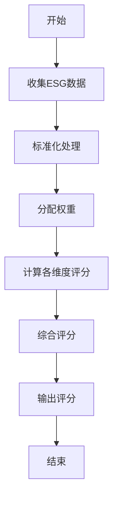
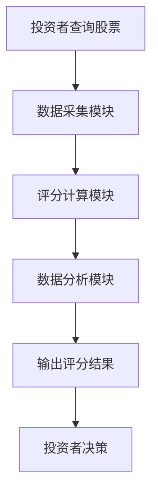
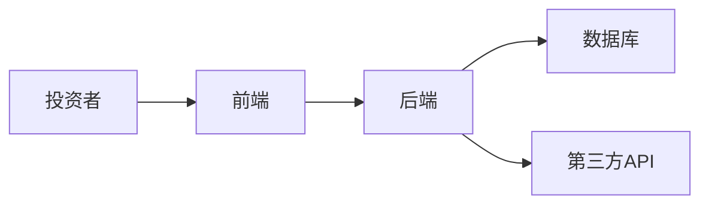
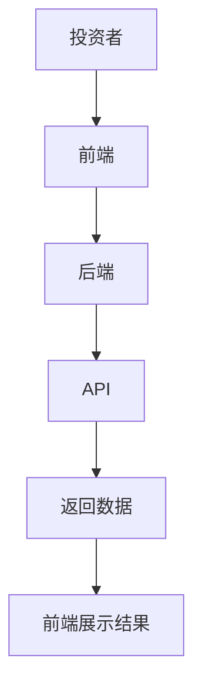

                 


# 特价股票投资中的社会责任投资因素

> 关键词：特价股票，社会责任投资，SRI，投资策略，评分模型

> 摘要：本文探讨了在特价股票投资中引入社会责任投资（SRI）因素的重要性和方法。通过分析社会责任投资的核心概念、评估指标和算法模型，结合实际案例，提出了一种基于社会责任的股票评分系统，为投资者提供了新的视角和策略。

---

## 第1章: 特价股票与社会责任投资的背景介绍

### 1.1 特价股票的基本概念
#### 1.1.1 特价股票的定义
特价股票是指市场价格显著低于其内在价值的股票。这类股票通常被认为具有较高的投资潜力，因为市场可能尚未充分认识到其价值。

#### 1.1.2 特价股票的投资价值
- **低估的估值**：特价股票通常因为市场忽视或低估其价值，导致股价低于合理水平。
- **潜在的高回报**：一旦市场重新发现其价值，股价可能迅速回升，带来丰厚的利润。
- **风险与机会并存**：特价股票的投资风险较高，但潜在回报也较大。

#### 1.1.3 特价股票的市场特征
- **周期性波动**：特价股票往往出现在市场低迷或行业衰退期。
- **低关注度**：这些股票通常不受主流投资者关注，流动性较低。
- **分散性**：特价股票可能分布在多个行业，投资者需要具备广泛的知识储备。

### 1.2 社会责任投资的定义与特点
#### 1.2.1 社会责任投资的核心概念
社会责任投资（SRI）是一种投资策略，旨在通过投资具有良好环境、社会和公司治理（ESG）表现的公司，实现财务回报和社会价值的双重目标。

#### 1.2.2 社会责任投资的特征
- **长期视角**：SRI注重公司的长期可持续发展，而非短期收益。
- **多维度评估**：SRI不仅关注财务指标，还考虑环境、社会和治理因素。
- **透明性**：SRI要求公司公开其ESG表现，以便投资者进行评估。

#### 1.2.3 社会责任投资的分类
- **负面筛选**：排除不符合ESG标准的公司。
- **正面筛选**：选择在ESG方面表现优异的公司。
- **股东参与**：通过持股和投票，推动公司改善ESG表现。

### 1.3 特价股票与社会责任投资的结合
#### 1.3.1 特价股票投资中的社会责任因素
- **行业选择**：在选择特价股票时，优先考虑具有社会责任感的行业，如清洁能源、可持续农业等。
- **公司治理**：评估公司的治理结构，确保其具备良好的管理团队和透明的财务报告。
- **环境影响**：考虑公司在环境保护方面的表现，避免投资对环境破坏严重的公司。

#### 1.3.2 社会责任投资对股票价值的影响
- **正面影响**：良好的ESG表现可能提升公司的声誉和市场地位，从而提高股价。
- **负面影响**：忽视社会责任可能导致公司面临法律风险或舆论压力，进而影响股价。

#### 1.3.3 特价股票投资中的社会责任评价体系
- **环境指标**：如碳排放、能源消耗等。
- **社会指标**：如员工福利、社区贡献等。
- **治理指标**：如董事会结构、高管薪酬等。

---

## 第2章: 特价股票投资中的社会责任因素分析

### 2.1 社会责任投资的核心要素
#### 2.1.1 环境因素（E）
- **定义**：环境因素关注公司在环境保护方面的表现，包括能源使用、碳排放、资源利用等。
- **重要性**：随着环保意识的增强，投资者越来越关注公司的环境影响。

#### 2.1.2 社会因素（S）
- **定义**：社会因素关注公司在社会责任方面的表现，包括员工权益、社区贡献、产品安全等。
- **重要性**：良好的社会表现有助于提升公司的品牌形象和市场信任度。

#### 2.1.3 治理因素（G）
- **定义**：治理因素关注公司的治理结构和管理效率，包括董事会结构、高管薪酬、公司透明度等。
- **重要性**：良好的治理结构有助于提升公司的运营效率和抗风险能力。

### 2.2 特价股票中的社会责任评价指标
#### 2.2.1 环境指标
- **碳排放强度**：单位产出的碳排放量。
- **能源消耗效率**：单位产出的能源消耗量。

#### 2.2.2 社会指标
- **员工满意度**：员工对公司的满意度调查结果。
- **社区贡献**：公司对社区的捐赠和公益活动的参与情况。

#### 2.2.3 治理指标
- **董事会多样性**：董事会成员的性别、背景等多样性。
- **高管薪酬差距**：高管与普通员工的薪酬差距。

### 2.3 特价股票投资中的社会责任评价模型
#### 2.3.1 模型构建思路
- **数据收集**：收集公司的ESG数据，包括环境、社会和治理三个维度。
- **权重分配**：根据行业特点和投资目标，分配各维度的权重。
- **评分计算**：通过加权计算，得出公司的社会责任评分。

#### 2.3.2 模型评价标准
- **评分范围**：通常采用0到10分的评分标准，分数越高表示社会责任表现越好。
- **评分更新频率**：根据公司每年的ESG报告更新评分。

#### 2.3.3 模型应用案例
- **案例1**：某清洁能源公司，环境指标优秀，但治理结构存在问题，最终评分为7.5分。
- **案例2**：某科技公司，环境和社会指标良好，治理结构完善，最终评分为9分。

---

## 第3章: 特价股票社会责任投资的数学模型与算法

### 3.1 社会责任评分模型
#### 3.1.1 模型输入变量
- **环境指标（E）**：碳排放强度、能源消耗效率。
- **社会指标（S）**：员工满意度、社区贡献。
- **治理指标（G）**：董事会多样性、高管薪酬差距。

#### 3.1.2 模型输出变量
- **社会责任评分（SRI\_score）**：0到10分的评分。

#### 3.1.3 模型构建过程
1. 收集公司的ESG数据。
2. 标准化处理各指标数据。
3. 根据权重分配，计算各指标的加权评分。
4. 综合各维度评分，得出最终的社会责任评分。

### 3.2 基于社会责任的股票评分算法
#### 3.2.1 算法流程图


#### 3.2.2 算法实现步骤
1. **数据收集**：从公司年报、ESG报告等渠道收集环境、社会和治理指标数据。
2. **标准化处理**：对各指标数据进行标准化处理，确保数据可比性。
3. **权重分配**：根据行业特点和投资目标，分配各维度的权重。例如，环境权重为40%，社会权重为30%，治理权重为30%。
4. **计算各维度评分**：根据标准化数据和权重，计算各维度的评分。
5. **综合评分**：将各维度评分加权相加，得到最终的社会责任评分。

#### 3.2.3 算法优化建议
- **动态调整权重**：根据市场变化和投资目标，动态调整各维度的权重。
- **引入时间因素**：考虑公司历史表现，调整评分计算方式。

### 3.3 数学模型与公式
#### 3.3.1 社会责任评分公式
$$ SRI\_score = \alpha \cdot E + \beta \cdot S + \gamma \cdot G $$

其中：
- $\alpha$、$\beta$、$\gamma$ 分别为环境、社会、治理维度的权重，满足 $\alpha + \beta + \gamma = 1$。
- $E$、$S$、$G$ 分别为环境、社会、治理维度的标准化评分。

#### 3.3.2 评分权重调整公式
$$ \alpha + \beta + \gamma = 1 $$

---

## 第4章: 特价股票社会责任投资的系统分析与架构设计

### 4.1 系统功能需求分析
#### 4.1.1 用户需求分析
- **投资者**：需要获取特价股票的ESG数据，评估其社会责任表现。
- **公司**：需要展示其ESG表现，吸引社会责任投资者。

#### 4.1.2 系统功能模块划分
- **数据采集模块**：收集公司ESG数据。
- **评分计算模块**：根据模型计算社会责任评分。
- **数据分析模块**：对评分结果进行分析和可视化。

#### 4.1.3 系统功能流程图


### 4.2 系统架构设计
#### 4.2.1 系统架构图


#### 4.2.2 数据流设计
- **输入**：投资者输入股票代码。
- **处理**：后端调用API获取ESG数据，计算社会责任评分。
- **输出**：前端展示评分结果。

#### 4.2.3 接口设计
- **API接口**：提供RESTful API，供前端调用。
- **数据格式**：返回JSON格式的评分结果。

### 4.3 系统交互设计
#### 4.3.1 用户界面设计
- **前端界面**：简洁直观，展示股票代码、社会责任评分和详细报告。
- **后端接口**：处理请求，调用API获取数据并返回结果。

#### 4.3.2 系统交互流程图


---

## 第5章: 特价股票社会责任投资的项目实战

### 5.1 环境安装
- **工具安装**：安装Python、Pandas、Mermaid等工具。
- **数据来源**：使用公开的ESG数据源，如MSCI、Sustainalytics等。

### 5.2 核心实现源代码
```python
import pandas as pd

def calculate_sri_score(e_score, s_score, g_score, alpha=0.4, beta=0.3, gamma=0.3):
    return alpha * e_score + beta * s_score + gamma * g_score

# 示例数据
e_score = 0.8  # 环境评分
s_score = 0.7  # 社会评分
g_score = 0.6  # 治理评分

sri_score = calculate_sri_score(e_score, s_score, g_score)
print(f"社会责任评分：{sri_score}")
```

### 5.3 代码应用解读与分析
- **数据输入**：从数据库中读取公司的ESG数据。
- **评分计算**：调用`calculate_sri_score`函数，计算社会责任评分。
- **结果展示**：将评分结果可视化，帮助投资者做出决策。

### 5.4 实际案例分析
- **案例1**：某科技公司，环境评分0.8，社会评分0.7，治理评分0.6，最终评分为：
$$ SRI\_score = 0.4 \times 0.8 + 0.3 \times 0.7 + 0.3 \times 0.6 = 0.32 + 0.21 + 0.18 = 0.71 $$

### 5.5 项目小结
- **项目总结**：通过实际案例分析，验证了社会责任评分模型的有效性。
- **经验总结**：权重的动态调整可以进一步提升模型的准确性。

---

## 第6章: 总结与展望

### 6.1 本章总结
- **主要观点**：社会责任投资为特价股票投资提供了新的视角，帮助投资者在追求财务回报的同时，实现社会价值。
- **核心结论**：通过构建社会责任评分模型，投资者可以更好地评估公司的可持续发展能力。

### 6.2 未来展望
- **算法优化**：引入机器学习技术，提升模型的预测精度。
- **数据扩展**：增加更多维度的ESG数据，如供应链管理、产品安全等。
- **应用推广**：推动社会责任投资在更广泛的领域应用，促进可持续发展。

---

## 作者：AI天才研究院/AI Genius Institute & 禅与计算机程序设计艺术 /Zen And The Art of Computer Programming

