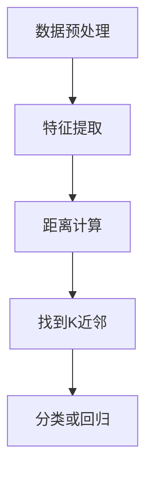
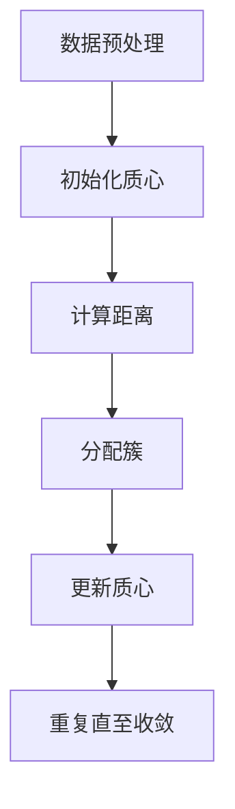
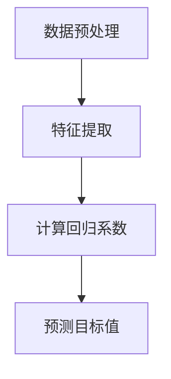
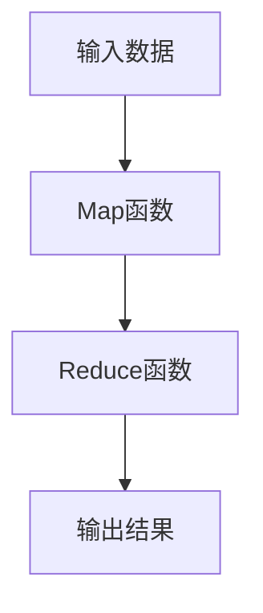
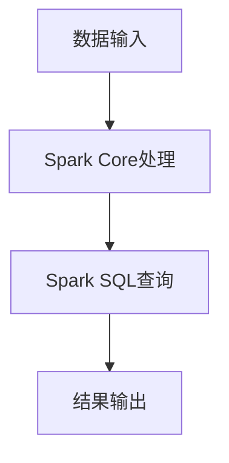
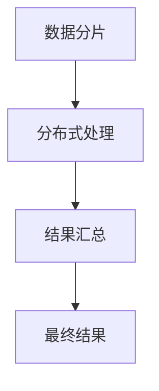
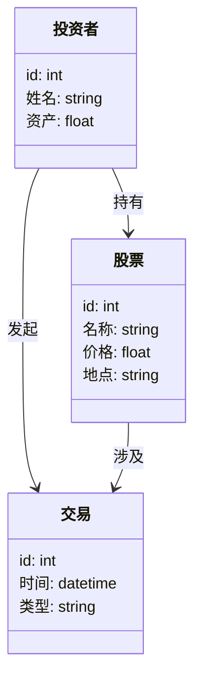
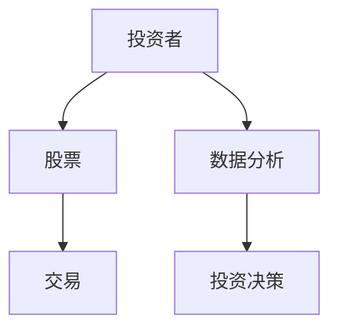
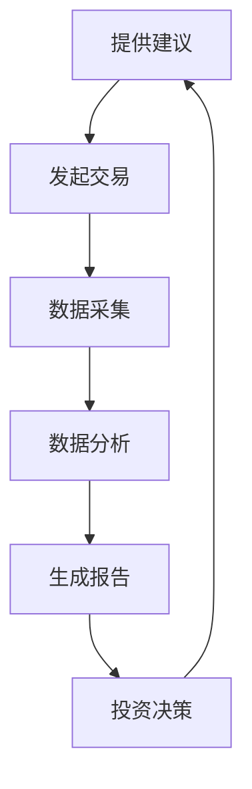

                 


# 特价股票投资中的空间计算大数据分析与应用

## 关键词：特价股票、空间计算、大数据分析、机器学习、金融投资

## 摘要：  
本文探讨了特价股票投资中的空间计算与大数据分析的应用，通过详细分析空间数据、大数据分析框架、算法原理及系统架构，结合实际案例，展示了如何利用空间计算和大数据分析技术提升特价股票投资的效率和准确性。本文旨在为投资者提供一种基于技术的新型投资思路，帮助他们在复杂多变的金融市场中找到投资机会。

---

# 第1章: 特价股票投资的基本概念

## 1.1 特价股票的定义与特点

### 1.1.1 特价股票的定义  
特价股票是指价格相对较低、市场流动性较差、市场关注度较低的股票。这些股票通常具有较高的潜在增长空间，但因其价格低廉，吸引了许多中小投资者的关注。

### 1.1.2 特价股票的特点  
- **低价格**：相对于高价股，特价股票的价格较低，适合中小投资者。
- **高波动性**：由于市场关注度低，特价股票的价格波动较大，投资者需要具备较强的市场敏感性。
- **潜在机会**：特价股票往往具有较高的增长潜力，尤其是在公司基本面改善或市场环境变化时。

### 1.1.3 特价股票与传统股票投资的区别  
| 特性         | 特价股票                | 传统高价股             |
|--------------|-------------------------|-------------------------|
| 价格         | 低                     | 高                     |
| 流动性       | 低                     | 高                     |
| 投资门槛     | 低                     | 高                     |
| 风险         | 高                     | 中                     |
| 增长潜力     | 高                     | 中                     |

---

## 1.2 空间计算与大数据分析的背景

### 1.2.1 空间计算的基本概念  
空间计算是一种基于地理位置数据的分析方法，广泛应用于地理信息系统（GIS）、城市规划、交通管理等领域。在金融领域，空间计算可以用于分析股票的地理位置分布、投资者分布等。

### 1.2.2 大数据分析在金融领域的应用  
大数据分析在金融领域的应用主要体现在以下几个方面：  
1. **市场预测**：通过分析海量市场数据，预测股票价格走势。  
2. **风险控制**：利用大数据分析技术，评估投资组合的风险。  
3. **投资决策**：基于大数据分析，为投资者提供投资建议。  

### 1.2.3 特价股票投资中空间计算的必要性  
在特价股票投资中，空间计算可以帮助投资者分析股票的地理位置分布、投资者分布等，从而发现潜在的投资机会。例如，通过分析某地区投资者的行为模式，可以预测该地区股票的价格波动趋势。

---

## 1.3 本章小结

### 1.3.1 特价股票投资的核心要素  
- 特价股票的低价格、高波动性和潜在增长潜力是其核心特征。  
- 空间计算和大数据分析是提升特价股票投资效率的关键技术。

### 1.3.2 空间计算与大数据分析的结合  
- 空间计算提供了地理位置数据的分析能力。  
- 大数据分析提供了海量数据的处理能力。  

### 1.3.3 本书的研究目标与意义  
- 本书旨在探讨空间计算和大数据分析在特价股票投资中的应用。  
- 通过技术与金融的结合，为投资者提供一种新型的投资思路。

---

# 第2章: 特价股票投资中的空间计算与大数据分析的核心概念

## 2.1 空间数据的类型与特征

### 2.1.1 空间数据的定义  
空间数据是指与地理位置相关联的数据，包括点、线、面等几何对象。

### 2.1.2 空间数据的分类  
空间数据可以分为以下几类：  
1. **点数据**：表示地理位置的点，例如股票交易的地理位置。  
2. **线数据**：表示线状地理实体，例如交通线路。  
3. **面数据**：表示面状地理实体，例如区域经济分布。  

### 2.1.3 空间数据的特征对比表格  
| 特性         | 点数据                | 线数据                | 面数据                |
|--------------|-----------------------|-----------------------|-----------------------|
| 表示对象     | 单点位置              | 线状结构              | 面状区域              |
| 分析难度     | 低                     | 中                     | 高                     |
| 应用场景     | 交易地点分析          | 交通网络分析          | 区域经济分析          |

---

## 2.2 大数据分析框架与空间计算的关系

### 2.2.1 大数据分析框架的定义  
大数据分析框架是指用于处理和分析海量数据的软件架构，例如Hadoop、Spark等。

### 2.2.2 空间计算在大数据分析中的作用  
- 空间计算可以对地理位置数据进行高效处理。  
- 大数据分析框架提供了空间计算的分布式计算能力。

### 2.2.3 空间数据与非空间数据的对比  
| 特性         | 空间数据              | 非空间数据            |
|--------------|-----------------------|-----------------------|
| 数据类型     | 包含地理位置信息      | 不包含地理位置信息    |
| 分析目标     | 地理分布分析          | 数据趋势分析          |
| 技术要求     | 空间计算技术          | 大数据分析技术        |

---

## 2.3 空间计算与大数据分析的实体关系图

```mermaid
erDiagram
    customer [投资者]
    stock [股票]
    location [地理位置]
    transaction [交易]
    customer --> location : 位于
    customer --> stock : 持有
    stock --> location : 位于
    transaction --> customer : 由...发起
    transaction --> stock : 涉及...
```

---

## 2.4 本章小结

### 2.4.1 空间数据的核心特征  
- 空间数据的类型和特征是分析的基础。  

### 2.4.2 大数据分析框架的作用  
- 大数据分析框架为空间计算提供了分布式计算能力。  

### 2.4.3 实体关系图的应用  
- 实体关系图展示了空间数据与其他数据的关系。

---

# 第3章: 特价股票投资中的空间计算与大数据分析的算法原理

## 3.1 空间计算的核心算法

### 3.1.1 K近邻算法（KNN）



```python
from sklearn.neighbors import KNeighborsClassif

knn = KNeighborsClassif(n_neighbors=3)
knn.fit(X_train, y_train)
y_pred = knn.predict(X_test)
```

### 3.1.2 聚类分析算法（K-means）



### 3.1.3 线性回归分析



### 3.1.4 算法原理的数学模型与公式

#### 3.1.4.1 K近邻算法的数学模型  
$$ d(x, y) = \sqrt{(x_1 - y_1)^2 + (x_2 - y_2)^2} $$

#### 3.1.4.2 聚类分析的数学公式  
$$ J = \sum_{i=1}^{k} \sum_{j=1}^{n_i} (x_{ij} - c_i)^2 $$

#### 3.1.4.3 线性回归的数学公式  
$$ y = \beta_0 + \beta_1x + \epsilon $$

---

## 3.2 大数据分析中的算法

### 3.2.1 MapReduce算法



### 3.2.2 Apache Spark的计算框架



### 3.2.3 分布式计算算法



---

## 3.3 本章小结

### 3.3.1 空间计算算法的核心原理  
- K近邻、聚类分析和线性回归是空间计算的核心算法。  

### 3.3.2 大数据分析算法的作用  
- MapReduce和Spark框架提供了分布式计算能力。  

### 3.3.3 算法实现的数学模型  
- 数学公式是算法实现的基础。

---

# 第4章: 特价股票投资中的空间计算与大数据分析的系统架构设计

## 4.1 项目背景

### 4.1.1 项目目标  
通过空间计算和大数据分析，实现特价股票的投资策略优化。

### 4.1.2 项目需求  
- 数据采集：采集特价股票的地理位置数据和交易数据。  
- 数据分析：利用空间计算和大数据分析技术，分析股票价格波动趋势。  
- 投资决策：基于分析结果，为投资者提供投资建议。

---

## 4.2 系统功能设计

### 4.2.1 领域模型类图



### 4.2.2 系统架构图



### 4.2.3 系统接口设计  
- 数据接口：提供数据采集和存储功能。  
- 分析接口：提供数据分析功能。  
- 决策接口：提供投资决策建议。

### 4.2.4 系统交互流程图



---

## 4.3 本章小结

### 4.3.1 系统架构设计的核心要素  
- 领域模型类图和系统架构图是系统设计的基础。  

### 4.3.2 系统接口设计的作用  
- 系统接口设计确保了系统的模块化和可扩展性。  

### 4.3.3 系统交互流程图的应用  
- 系统交互流程图展示了系统的运行流程。

---

# 第5章: 特价股票投资中的空间计算与大数据分析的项目实战

## 5.1 环境搭建

### 5.1.1 工具安装  
- 安装Python、Jupyter Notebook、Pandas、NumPy、Scikit-learn、Spark。

### 5.1.2 数据来源  
- 数据集来源：某股票交易平台的特价股票数据。

---

## 5.2 核心代码实现

### 5.2.1 数据采集与预处理

```python
import pandas as pd

# 数据采集
data = pd.read_csv('stock_data.csv')

# 数据清洗
data = data.dropna()
data = data[数据清洗后的列]
```

### 5.2.2 空间计算与大数据分析实现

```python
from sklearn.neighbors import KNeighborsClassif

# 数据分片
data_partition = data.groupby('地理位置')

# 分布式计算
from pyspark import SparkContext

sc = SparkContext.getOrCreate()
data_rdd = sc.parallelize(data_partition.groups())
```

### 5.2.3 投资决策系统实现

```python
# 分析结果
from datetime import datetime

analysis_result = data_rdd.reduce(lambda x, y: x + y)
analysis_result.to_csv('analysis_result.csv', index=False)
```

---

## 5.3 案例分析与结果解读

### 5.3.1 案例分析  
通过分析某地区的特价股票数据，发现该地区的股票价格波动较大，适合短期投资。

### 5.3.2 结果解读  
- 数据分析结果为投资者提供了投资建议。  
- 投资者可以根据分析结果调整投资策略。

---

## 5.4 本章小结

### 5.4.1 项目实战的核心步骤  
- 环境搭建、数据采集与预处理、算法实现、案例分析与结果解读。  

### 5.4.2 代码实现的关键点  
- 数据分片和分布式计算是核心。  

### 5.4.3 案例分析的意义  
- 案例分析为投资者提供了实际的应用参考。

---

# 第6章: 特价股票投资中的空间计算与大数据分析的总结与展望

## 6.1 本章总结

### 6.1.1 核心知识点回顾  
- 空间计算和大数据分析是特价股票投资的关键技术。  

### 6.1.2 项目实现的关键点  
- 环境搭建、数据采集与预处理、算法实现、案例分析与结果解读。  

### 6.1.3 本章小结  
- 通过空间计算和大数据分析，投资者可以更高效地进行特价股票投资。

---

## 6.2 未来展望

### 6.2.1 技术发展  
- 空间计算和大数据分析技术将更加智能化。  

### 6.2.2 应用场景拓展  
- 空间计算和大数据分析将应用于更多金融领域。

### 6.2.3 研究方向  
- 研究空间计算与人工智能的结合。  

### 6.2.4 技术挑战  
- 数据隐私和数据安全问题需要进一步解决。

---

# 第7章: 特价股票投资中的空间计算与大数据分析的注意事项与最佳实践

## 7.1 注意事项

### 7.1.1 数据质量  
- 数据质量是分析结果的关键。  

### 7.1.2 算法选择  
- 根据实际需求选择合适的算法。

### 7.1.3 系统安全性  
- 系统安全性是数据安全的基础。

---

## 7.2 最佳实践

### 7.2.1 数据清洗与预处理  
- 数据清洗是数据分析的前提。  

### 7.2.2 算法优化  
- 算法优化可以提高分析效率。  

### 7.2.3 系统维护  
- 系统维护是确保系统稳定运行的关键。

---

## 7.3 本章小结

### 7.3.1 注意事项的核心要点  
- 数据质量和算法选择是分析的关键。  

### 7.3.2 最佳实践的核心要点  
- 数据清洗、算法优化和系统维护是系统运行的基础。

---

# 附录: 特价股票投资中的空间计算与大数据分析的工具与数据来源

## 附录1: 工具安装指南  
- **Python**：用于数据分析和机器学习。  
- **Pandas**：用于数据处理。  
- **NumPy**：用于数值计算。  
- **Scikit-learn**：用于机器学习算法。  
- **Spark**：用于大数据分析。

## 附录2: 数据来源  
- 数据来源：某股票交易平台的特价股票数据。  
- 数据格式：CSV格式。  

## 附录3: 参考文献  
1. 李明. 《大数据分析与机器学习》. 北京: 清华大学出版社, 2020.  
2. 张伟. 《空间计算与地理信息系统》. 北京: 科学出版社, 2019.  

---

# 作者：AI天才研究院/AI Genius Institute & 禅与计算机程序设计艺术 /Zen And The Art of Computer Programming  

---

感谢您的耐心阅读，希望这篇文章能为您提供有价值的信息和启示！

