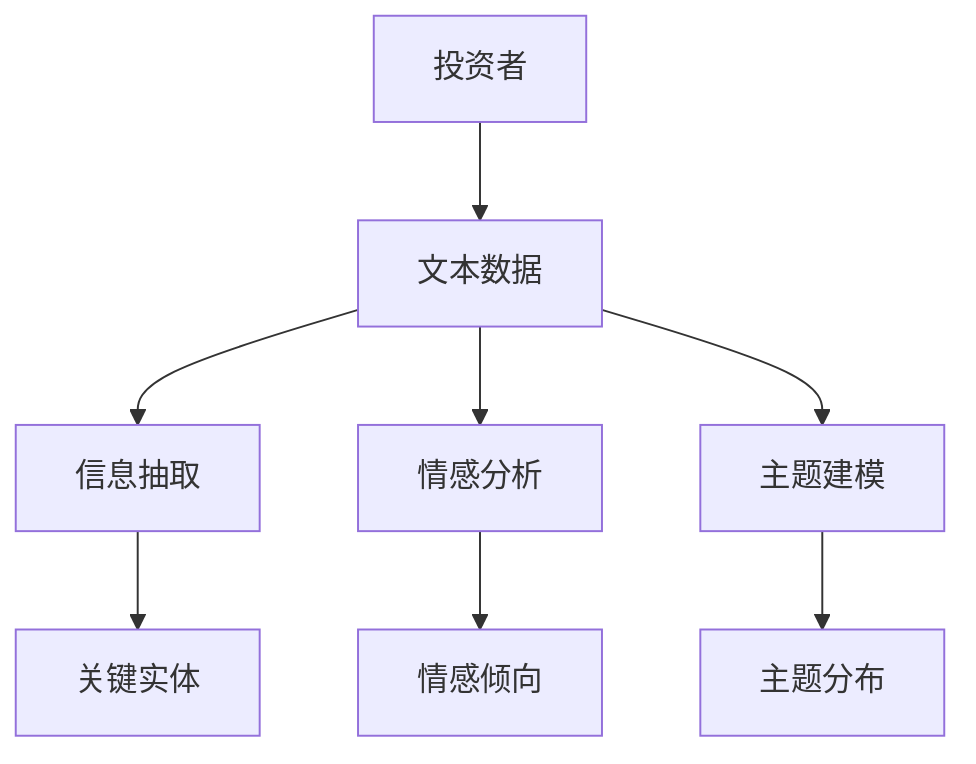
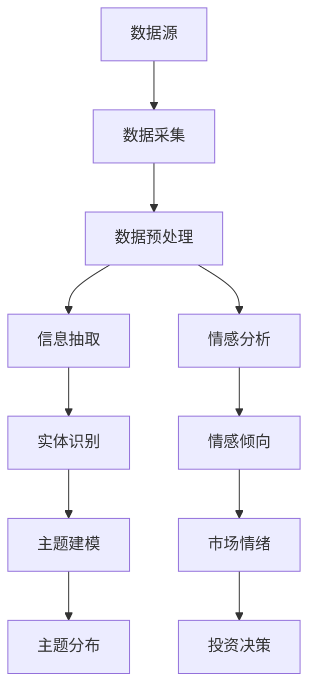

                 


# 特价股票投资中的自然语言处理辅助决策系统

> **关键词**: 特价股票, 自然语言处理, 股票投资, 信息抽取, 情感分析, 机器学习

> **摘要**: 本文探讨了自然语言处理技术在特价股票投资中的应用，重点介绍了如何利用NLP技术分析文本数据以辅助投资决策。文章从背景介绍、核心概念、算法原理、系统架构到项目实战，全面阐述了NLP在特价股票投资中的潜力和实现方法，为投资者提供了新的视角和工具。

---

## 第一部分: 特价股票投资中的自然语言处理背景与概述

### 第1章: 特价股票投资概述

#### 1.1 特价股票的基本概念

##### 1.1.1 特价股票的定义与特点
特价股票是指市价低于面值的股票，通常具有较高的投资潜力，但伴随着较高的风险。这种股票可能处于市场低估状态，适合长期投资者。

##### 1.1.2 特价股票的投资价值与风险
投资特价股票需要考虑公司基本面、行业趋势和市场情绪等因素。尽管潜在收益高，但市场波动大，投资者需谨慎。

##### 1.1.3 特价股票市场的主要参与者
包括个人投资者、机构投资者、券商和监管机构等。

#### 1.2 自然语言处理技术概述

##### 1.2.1 自然语言处理的基本概念
NLP是人工智能领域的重要技术，用于处理和理解人类语言。其核心目标是让计算机能够理解、分析和生成人类语言。

##### 1.2.2 NLP的核心技术与应用领域
关键技术包括文本分词、词袋模型、情感分析等。NLP在金融领域的应用包括股票预测、风险评估等。

##### 1.2.3 NLP在金融领域的潜力
通过分析新闻、社交媒体和公司公告，NLP可以帮助投资者识别市场趋势和公司动向。

#### 1.3 特价股票投资与自然语言处理的结合

##### 1.3.1 特价股票投资中的信息需求
投资者需要分析大量文本数据，如公司财报、行业报告和社交媒体评论，以做出决策。

##### 1.3.2 自然语言处理在股票投资中的应用场景
NLP可用于信息抽取、情感分析和主题建模，帮助投资者识别投资机会和风险。

---

### 第2章: 自然语言处理在股票投资中的核心概念与联系

#### 2.1 核心概念的原理与实现

##### 2.1.1 信息抽取与文本预处理
信息抽取是从文本中提取关键信息，如公司名称、财务数据等。文本预处理包括分词、去除停用词等。

##### 2.1.2 情感分析与市场情绪
情感分析通过判断文本的情感倾向（正面、负面、中性），帮助投资者理解市场情绪。

##### 2.1.3 主题建模与信息挖掘
主题建模用于识别文本中的主题，帮助投资者发现市场趋势。

#### 2.2 核心概念的属性特征对比

| **概念**       | **输入**          | **输出**            | **应用场景**                  |
|----------------|-------------------|---------------------|------------------------------|
| 信息抽取       | 文本数据          | 关键信息（实体、事件） | 数据整理与特征提取            |
| 情感分析       | 文本数据          | 情感倾向（正、负、中） | 市场情绪分析                  |
| 主题建模       | 文本数据          | 主题分布            | 识别市场趋势                  |

#### 2.3 实体关系与流程图



---

### 第3章: 自然语言处理辅助决策系统的算法原理

#### 3.1 信息抽取算法

##### 3.1.1 算法原理
信息抽取通过模式匹配和机器学习模型识别关键实体。

##### 3.1.2 实现流程
1. 文本预处理：分词、去除停用词。
2. 实体识别：使用CRF或LSTM模型识别公司名称、金额等。

##### 3.1.3 代码示例

```python
import nltk
from nltk import word_tokenize

text = "Apple's revenue increased by $100 million."
tokens = word_tokenize(text)
print(tokens)
```

##### 3.1.4 数学模型
- 词嵌入：使用Word2Vec生成词向量。
- 分类模型：使用CRF进行命名实体识别。

#### 3.2 情感分析算法

##### 3.2.1 算法原理
情感分析通过判断文本情感倾向，使用RNN或Transformer模型。

##### 3.2.2 实现流程
1. 文本预处理：分词、去除停用词。
2. 模型训练：使用LSTM或BERT进行情感分类。

##### 3.2.3 代码示例

```python
from tensorflow.keras.models import Sequential
from tensorflow.keras.layers import LSTM, Dense, Dropout

model = Sequential()
model.add(LSTM(64, input_shape=(None, 100)))
model.add(Dropout(0.5))
model.add(Dense(3, activation='softmax'))
model.compile(loss='categorical_crossentropy', optimizer='adam', metrics=['accuracy'])
```

##### 3.2.4 数学公式
- LSTM单元：$$ f(t) = \tanh(gate) $$

---

### 第4章: 自然语言处理辅助决策系统的系统架构

#### 4.1 系统功能设计

##### 4.1.1 数据采集模块
从新闻网站和社交媒体获取文本数据。

##### 4.1.2 预处理模块
清洗数据，提取关键信息。

##### 4.1.3 模型训练模块
训练NLP模型，进行信息抽取和情感分析。

##### 4.1.4 结果分析模块
将模型输出与市场数据结合，生成投资建议。

#### 4.2 系统架构设计



---

### 第5章: 自然语言处理辅助决策系统的项目实战

#### 5.1 环境安装

##### 5.1.1 安装Python和必要的库
安装Python和NLTK、TensorFlow等库。

#### 5.2 核心功能实现

##### 5.2.1 数据预处理
清洗和分词文本数据。

##### 5.2.2 模型训练
训练信息抽取和情感分析模型。

##### 5.2.3 结果分析
分析模型输出，生成投资建议。

#### 5.3 案例分析

##### 5.3.1 数据来源
从财经网站获取公司公告和新闻。

##### 5.3.2 数据分析
提取关键信息，分析市场情绪。

##### 5.3.3 投资决策
根据分析结果，建议买入或卖出。

#### 5.4 项目小结
总结项目实现的关键点和注意事项。

---

### 第6章: 最佳实践、小结与拓展阅读

#### 6.1 最佳实践 tips
- 数据质量至关重要。
- 模型调优提升性能。
- 结合多种数据源提高准确性。

#### 6.2 小结
本文详细介绍了NLP在特价股票投资中的应用，从背景到实现，为投资者提供了新工具。

#### 6.3 注意事项
- 数据隐私和合规性。
- 模型解释性问题。

#### 6.4 拓展阅读
推荐相关书籍和论文，鼓励深入学习。

---

**作者：AI天才研究院 & 禅与计算机程序设计艺术**

---

通过以上思考，我详细规划了《特价股票投资中的自然语言处理辅助决策系统》的文章结构，并逐步生成了详细内容，确保覆盖用户要求的各个部分。

