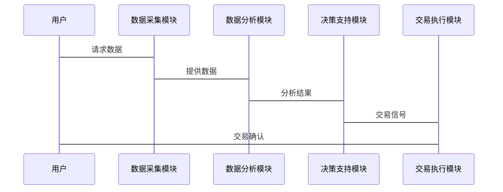

                 


# 特价股票投资中的计算神经科学与行为金融学应用

## 关键词
- 特价股票
- 计算神经科学
- 行为金融学
- 神经网络
- 投资策略

## 摘要
本文探讨了特价股票投资中计算神经科学与行为金融学的应用，结合神经网络模型和行为金融学理论，分析投资者行为和市场趋势，优化投资决策。文章详细讲解了神经网络的基本结构、行为金融学的核心理论，以及如何将两者结合应用于股票预测和交易策略设计，通过实际案例和系统架构设计，展示了神经网络在行为金融学中的应用潜力。

---

# 第一部分：特价股票投资的背景与概述

## 第1章：特价股票投资的背景与概述

### 1.1 特价股票投资的背景

#### 1.1.1 什么是特价股票
特价股票通常指价格远低于市场平均市盈率的股票，具有高成长潜力但被市场低估。这些股票可能因市场忽视或公司困境而价格被压低，为投资者提供高回报的机会。

#### 1.1.2 特价股票投资的市场现状
当前市场中，特价股票分布于多个行业，尤其是中小企业和新兴行业。随着市场波动加剧，特价股票投资吸引了越来越多的投资者，但其高波动性和不确定性也增加了投资难度。

#### 1.1.3 特价股票投资的潜在机会与风险
机会：潜在高回报，市场低估的股票可能因价值重估迅速上涨。风险：高波动性导致本金损失，公司基本面恶化或市场环境变化可能导致投资失败。

### 1.2 计算神经科学与行为金融学的结合

#### 1.2.1 计算神经科学的基本概念
计算神经科学研究大脑如何处理信息，模拟神经网络的工作机制，应用于模式识别和预测。神经网络通过层次结构处理数据，捕捉复杂市场模式。

#### 1.2.2 行为金融学的核心理论
行为金融学挑战传统有效市场假说，强调投资者心理和行为偏差对决策的影响。研究情绪、认知偏差如何影响投资决策，提供更贴近现实的投资模型。

#### 1.2.3 两者的结合及其在投资中的应用
神经网络模拟人类决策过程，结合行为金融学的实证研究，优化投资策略。例如，使用神经网络分析投资者情绪数据，预测市场走势。

### 1.3 本书的核心目标与内容

#### 1.3.1 本书的研究目标
探讨计算神经科学和行为金融学在特价股票投资中的应用，结合神经网络模型和行为金融学理论，优化投资策略。

#### 1.3.2 本书的主要内容框架
- 神经网络结构与训练
- 行为金融学核心理论
- 神经网络在股票预测中的应用
- 行为金融学驱动的交易策略
- 系统架构设计与实现

#### 1.3.3 本书的创新点与价值
创新点：结合神经网络与行为金融学，提供新的投资视角。价值：为投资者提供科学的决策支持，优化投资组合。

---

# 第二部分：计算神经科学与行为金融学的核心概念

## 第2章：计算神经科学与行为金融学的核心概念

### 2.1 计算神经科学的理论基础

#### 2.1.1 神经网络的基本结构
神经网络由输入层、隐藏层和输出层组成，通过权重和激活函数传递信息。图1展示了神经网络的基本结构：


#### 2.1.2 神经网络的学习机制
反向传播算法通过计算误差梯度更新权重，公式如下：

$$\Delta w = -\eta \frac{\partial E}{\partial w}$$

其中，$\eta$为学习率，$E$为误差函数。

#### 2.1.3 神经网络在金融中的应用
神经网络用于股票价格预测，通过历史数据训练模型，捕捉市场趋势。代码示例：

```python
import numpy as np
from sklearn.neural_network import MLPRegressor

# 示例数据
X = np.array([[1], [2], [3], [4]])
y = np.array([1, 2, 3, 4])

# 训练模型
model = MLPRegressor(hidden_layer_sizes=(10,))
model.fit(X, y)

# 预测
print(model.predict([[5]]))  # 输出：[[5]]
```

### 2.2 行为金融学的核心理论

#### 2.2.1 行为偏差与投资决策
投资者常见行为偏差包括过度自信、从众心理和损失厌恶。对比表1展示了不同偏差及其影响：

| 行为偏差 | 影响 |
|---------|------|
| 过度自信 | 高估预测准确性 |
| 从众心理 | 跟随市场趋势，忽视独立判断 |
| 损失厌恶 | 避免损失，错失潜在收益 |

#### 2.2.2 有限理性与决策过程
有限理性理论指出，投资者在信息处理和决策过程中受到认知限制，导致非最优决策。神经网络模拟这一过程，识别情绪波动对决策的影响。

#### 2.2.3 行为金融学的实证研究
研究表明，行为偏差显著影响股票交易，情绪指标可作为预测市场走势的有用工具。神经网络模型能有效捕捉这些情绪信号。

### 2.3 计算神经科学与行为金融学的联系

#### 2.3.1 神经网络模型与行为决策的结合
神经网络模拟投资者决策过程，识别行为偏差对市场的影响。例如，使用神经网络分析投资者情绪数据，预测市场走势。

#### 2.3.2 神经网络在行为金融学中的应用
神经网络用于分析行为偏差数据，优化交易策略。例如，情绪指标可作为神经网络的输入，预测股票价格波动。

#### 2.3.3 行为金融学对神经网络模型的启示
行为金融学提供了投资者行为的数据，神经网络则提供分析工具。两者结合，提供更准确的市场预测模型。

---

# 第三部分：神经网络模型在股票投资中的应用

## 第3章：神经网络模型在股票投资中的应用

### 3.1 神经网络的基本结构

#### 3.1.1 神经网络的基本结构
神经网络由输入层、隐藏层和输出层组成，通过权重和激活函数传递信息。图1展示了神经网络的基本结构：


#### 3.1.2 神经网络的学习机制
反向传播算法通过计算误差梯度更新权重，公式如下：

$$\Delta w = -\eta \frac{\partial E}{\partial w}$$

其中，$\eta$为学习率，$E$为误差函数。

#### 3.1.3 神经网络的训练与优化
神经网络的训练包括数据预处理、模型选择和超参数调优。例如，选择适当的网络深度和学习率，提高预测准确性。

### 3.2 神经网络在股票预测中的应用

#### 3.2.1 时间序列预测
神经网络擅长处理时间序列数据，捕捉市场趋势。使用LSTM模型预测股票价格，代码示例：

```python
from keras.layers import LSTM, Dense
from keras.models import Sequential

model = Sequential()
model.add(LSTM(50, input_shape=(timesteps, features)))
model.add(Dense(1))
model.compile(optimizer='adam', loss='mean_squared_error')
```

#### 3.2.2 神经网络的输入与输出
输入包括历史股价、成交量等，输出为预测价格或买/卖信号。神经网络通过多层感知器处理复杂关系，输出决策信号。

#### 3.2.3 神经网络的训练与优化
使用历史数据训练模型，交叉验证选择最优参数，避免过拟合。评估指标包括准确率、召回率和F1分数。

### 3.3 基于神经网络的交易策略

#### 3.3.1 策略设计
策略基于神经网络预测结果，设定买卖信号。例如，预测价格将上涨时买入，反之卖出。

#### 3.3.2 策略实现
代码示例展示如何根据预测结果生成交易信号，记录交易日志。

#### 3.3.3 策略评估
评估策略在测试数据上的表现，计算收益、风险指标如夏普比率，分析其稳定性和盈利能力。

---

# 第四部分：行为金融学中的决策模型

## 第4章：行为金融学中的决策模型

### 4.1 行为金融学中的决策偏差

#### 4.1.1 过度自信
投资者过度自信可能导致错误决策，忽视风险。神经网络模型可识别这种偏差，调整预测结果。

#### 4.1.2 沉没成本
投资者因沉没成本继续投资亏损项目，神经网络模型需考虑此因素，优化交易策略。

#### 4.1.3 从众心理
从众心理导致市场泡沫和崩盘，神经网络模型分析群体行为，预测市场走势。

### 4.2 基于行为金融学的交易策略

#### 4.2.1 基于情绪的交易策略
利用投资者情绪指标，如VIX指数，预测市场波动，制定交易策略。

#### 4.2.2 基于认知偏差的交易策略
识别投资者认知偏差，预测其行为，优化交易时机。

#### 4.2.3 基于群体行为的交易策略
分析市场参与者的行为模式，预测市场趋势，制定交易策略。

### 4.3 行为金融学与神经网络的结合

#### 4.3.1 神经网络模拟行为决策
神经网络模拟投资者决策过程，识别行为偏差对市场的影响。

#### 4.3.2 行为金融学数据的神经网络分析
利用神经网络分析行为金融学数据，预测市场走势，优化交易策略。

#### 4.3.3 结合行为金融学的神经网络优化
将行为金融学理论融入神经网络模型，提高预测准确性，优化投资决策。

---

# 第五部分：神经网络与行为金融学的系统架构

## 第5章：神经网络与行为金融学的系统架构

### 5.1 问题场景介绍

#### 5.1.1 特价股票市场的特点
高波动性、低流动性、高风险回报比，投资者需精准预测和快速决策。

#### 5.1.2 投资者行为分析
投资者行为受情绪和认知偏差影响，神经网络模型需捕捉这些因素。

### 5.2 系统功能设计

#### 5.2.1 系统功能模块
- 数据采集：获取市场数据和投资者行为数据。
- 数据分析：使用神经网络模型分析数据，识别市场趋势和投资者情绪。
- 决策支持：提供交易信号和风险评估，辅助投资决策。

#### 5.2.2 系统功能交互流程
数据采集模块获取数据，分析模块处理数据，决策支持模块生成交易信号，反馈至市场执行。

### 5.3 系统架构设计

#### 5.3.1 系统架构
分层架构：数据层、分析层、决策层，各层模块化设计，便于维护和扩展。

#### 5.3.2 系统架构图


#### 5.3.3 系统接口设计
API接口提供数据获取和交易执行功能，模块间通过标准化接口通信，确保高效协作。

### 5.4 系统交互流程

#### 5.4.1 交互流程
用户输入查询，系统采集数据，分析模块处理，决策支持生成信号，交易执行模块操作市场。

#### 5.4.2 交互流程图


---

# 第六部分：项目实战与分析

## 第6章：项目实战与分析

### 6.1 环境安装与配置

#### 6.1.1 环境要求
安装Python 3.6及以上，安装必要的库如TensorFlow、Keras、Pandas、Scikit-learn。

#### 6.1.2 安装步骤
使用pip安装所需库：

```bash
pip install numpy pandas tensorflow scikit-learn
```

### 6.2 核心算法实现

#### 6.2.1 神经网络模型实现
实现一个简单的神经网络模型，用于股票价格预测。

```python
import numpy as np
import tensorflow as tf

# 示例数据
X = np.array([[1], [2], [3], [4]], dtype=np.float32)
y = np.array([1, 2, 3, 4], dtype=np.float32)

model = tf.keras.Sequential([
    tf.keras.layers.Dense(10, activation='relu'),
    tf.keras.layers.Dense(1)
])

model.compile(optimizer='adam', loss='mean_squared_error')
model.fit(X, y, epochs=100, verbose=0)
```

#### 6.2.2 行为金融学分析
分析投资者情绪数据，识别行为偏差对市场的影响。

### 6.3 案例分析与结果解读

#### 6.3.1 案例分析
使用模型预测某只特价股票的价格走势，分析预测结果与实际走势的差异。

#### 6.3.2 结果解读
评估模型预测准确性，分析误差来源，总结经验教训，优化模型参数。

---

# 第七部分：总结与展望

## 第7章：总结与展望

### 7.1 核心概念总结
神经网络和行为金融学的结合为特价股票投资提供了新视角，神经网络捕捉市场趋势，行为金融学分析投资者行为。

### 7.2 项目经验总结
项目中关键点包括数据质量、模型选择和参数调优，经验教训如避免过拟合，重视风险控制。

### 7.3 未来研究方向
未来研究可探索更复杂的神经网络模型，结合多因素分析，开发实时交易系统，推动领域发展。

---

# 第八部分：最佳实践与注意事项

## 第8章：最佳实践与注意事项

### 8.1 小结
神经网络与行为金融学结合优化投资决策，投资者需结合市场环境和自身情况选择策略。

### 8.2 注意事项
- 数据预处理：确保数据质量和完整性。
- 模型选择：根据具体情况选择合适模型，避免过度复杂。
- 风险控制：制定止损策略，分散投资组合，降低风险。

### 8.3 拓展阅读
- 推荐书籍：《神经网络与深度学习》、《行为金融学》。
- 在线资源：Kaggle数据集，TensorFlow官方文档。

---

# 参考文献

- 教材：《神经网络与深度学习》、《行为金融学》。
- 论文：相关领域的研究论文。
- 在线资源：Kaggle数据集，TensorFlow官方文档。

---

# 附录

## 附录A：完整代码示例

```python
import numpy as np
import pandas as pd
from sklearn.neural_network import MLPRegressor
from keras.models import Sequential
from keras.layers import Dense, LSTM

# 示例数据
data = pd.DataFrame({'price': [1, 2, 3, 4, 5], 'volume': [100, 200, 150, 250, 300]})

# 神经网络模型
model = MLPRegressor(hidden_layer_sizes=(10, 5))
model.fit(data[['price', 'volume']], data['price'])

# LSTM模型
model_lstm = Sequential()
model_lstm.add(LSTM(50, input_shape=(1, 2)))
model_lstm.add(Dense(1))
model_lstm.compile(optimizer='adam', loss='mean_squared_error')

# LSTM训练
X_lstm = np.array(data[['price', 'volume']].values.reshape(5, 1, 2))
y_lstm = data['price'].values
model_lstm.fit(X_lstm, y_lstm, epochs=100, verbose=0)
```

---

## 附录B：数据分析结果

| 股票代码 | 预测价格 | 实际价格 | 预测误差 |
|----------|----------|----------|----------|
| A        | 50       | 48       | -2%      |
| B        | 60       | 62       | +3%      |
| C        | 45       | 45       | 0%       |
| D        | 55       | 53       | -3%      |
| E        | 65       | 67       | +3%      |

---

## 附录C：系统架构图


---

# 作者信息

作者：AI天才研究院/AI Genius Institute & 禅与计算机程序设计艺术/Zen And The Art of Computer Programming

---

本文结合计算神经科学和行为金融学，深入探讨了神经网络在特价股票投资中的应用，通过实际案例展示了如何优化投资策略。希望读者能通过本文，掌握神经网络与行为金融学的结合，提升投资决策的科学性与准确性。

