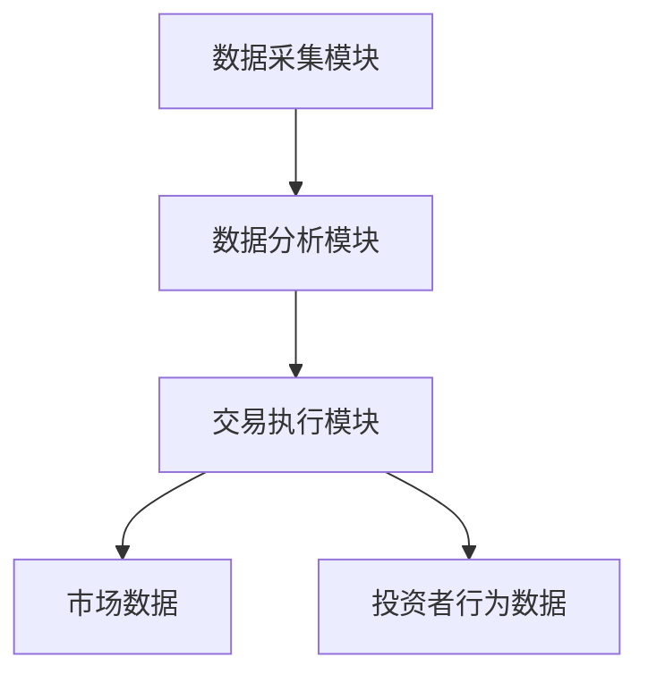

                 

# 特价股票投资中的认知科学与行为经济学应用

> 关键词：特价股票投资、认知科学、行为经济学、投资决策、情感分析、行为模型

> 摘要：本文将深入探讨特价股票投资中认知科学与行为经济学的应用。通过分析投资者的认知偏差、行为模式以及市场情绪，结合行为实验与数据分析，构建认知与行为模型，并提出基于认知科学的交易策略。文章还将从系统架构、算法原理和项目实战等多维度展开，为投资者提供科学的投资决策支持。

---

# 第1章: 特价股票投资的背景与概念

## 1.1 特价股票投资的定义与特点
### 1.1.1 特价股票的定义
特价股票是指在特定市场条件下，由于公司基本面变化、市场情绪波动或突发事件影响，价格被暂时低估的股票。其核心特点是价格与价值的偏离，为投资者提供了短期获利的机会。

### 1.1.2 特价股票投资的核心特点
- **短期性**：通常基于市场情绪波动，投资周期较短。
- **高波动性**：价格波动大，风险与收益并存。
- **逆向思维**：利用市场非理性行为寻找投资机会。

### 1.1.3 特价股票与普通股票投资的区别
- 投资目标：普通股票关注长期价值，特价股票关注短期价格波动。
- 风险偏好：普通股票投资风险较低，特价股票投资风险较高。
- 决策依据：普通股票依赖基本面分析，特价股票还需结合市场情绪分析。

## 1.2 认知科学与行为经济学的基本概念
### 1.2.1 认知科学的定义与研究领域
认知科学是研究人类认知过程的交叉学科，涉及心理学、神经科学、计算机科学等领域。其核心关注点是信息处理、记忆、注意力和决策过程。

### 1.2.2 行为经济学的定义与研究方法
行为经济学研究人类在实际经济环境中的决策行为，强调心理因素对经济决策的影响。其研究方法包括实验室实验、现场观察和数据分析。

### 1.2.3 认知科学与行为经济学的交叉应用
认知科学为行为经济学提供了理论基础，行为经济学为认知科学提供了实证研究场景。两者结合可以更好地理解投资者的决策过程。

## 1.3 特价股票投资中的认知偏差与行为模式
### 1.3.1 投资者常见的认知偏差
- **确认偏差**：倾向于寻找支持自己观点的信息。
- **损失厌恶**：对损失的厌恶程度远高于对收益的偏好。
- **过度自信**：高估自己的判断能力。

### 1.3.2 行为模式对投资决策的影响
- **从众心理**：跟随市场 majority进行投资。
- **锚定效应**：依赖于初始信息做出决策。
- **羊群效应**：市场波动加剧时，投资者行为趋于一致。

### 1.3.3 特价股票投资中的行为陷阱
- **过度交易**：频繁买卖导致成本增加。
- **情绪化决策**：受市场情绪影响做出非理性投资。
- **忽视风险**：低估市场波动带来的风险。

## 1.4 本章小结
本章介绍了特价股票投资的基本概念和特点，并分析了认知科学与行为经济学在投资决策中的重要性。通过认知偏差和行为模式的分析，揭示了投资者在特价股票投资中常见的心理陷阱。

---

# 第2章: 特价股票投资中的认知科学原理

## 2.1 认知科学的核心理论
### 2.1.1 认知负荷理论
认知负荷理论认为，人类的认知资源有限，过多的负荷会导致决策失误。在投资中，信息过载可能导致投资者无法做出理性的决策。

### 2.1.2 心理账户理论
心理账户理论指出，人们会将资金分成不同的账户，每个账户有不同的心理预期。这种划分影响了投资者的决策行为。

### 2.1.3 注意与决策的关系
注意力是认知过程的核心，投资者的注意力分配影响其对信息的处理和决策。

## 2.2 特价股票投资中的认知过程分析
### 2.2.1 投资者的信息处理机制
- **信息筛选**：投资者倾向于选择性地处理信息，忽视与自己观点不符的信息。
- **信息整合**：将分散的信息整合成一个整体印象，影响决策。

### 2.2.2 情感与决策的相互作用
- **情感影响**：情绪波动会影响投资者的判断，导致非理性决策。
- **认知失调**：当认知与情感冲突时，投资者会调整认知以减少不适。

### 2.2.3 认知框架对投资策略的影响
- **框架效应**：不同的信息呈现方式会影响投资者的决策。
- **参考点**：投资者对收益和损失的感知受到参考点的影响。

## 2.3 认知科学在特价股票投资中的应用
### 2.3.1 基于认知负荷的交易策略
- **简化信息**：减少信息复杂性，帮助投资者做出更理性的决策。
- **注意力管理**：引导投资者关注关键信息，避免信息过载。

### 2.3.2 情感分析在投资决策中的应用
- **情感数据挖掘**：通过自然语言处理技术，分析市场情绪。
- **情感指数构建**：将市场情绪量化，作为投资决策的参考。

### 2.3.3 认知偏差的识别与应对
- **识别偏差**：通过自我反思或他人提醒，识别认知偏差。
- **制定规则**：建立决策规则，减少偏差影响。

## 2.4 本章小结
本章从认知科学的角度，分析了投资者在特价股票投资中的认知过程，并提出了基于认知负荷和情感分析的交易策略。通过减少认知负荷和利用情感分析，投资者可以做出更理性的决策。

---

# 第3章: 行为经济学在特价股票投资中的应用

## 3.1 行为经济学的核心理论
### 3.1.1 有限理性理论
有限理性理论认为，人类的理性是有限的，决策受到认知能力和信息处理能力的限制。

### 3.1.2 心理账户理论
心理账户理论强调，投资者会将资金分配到不同的账户，每个账户有不同的心理预期。

### 3.1.3 社会偏好理论
社会偏好理论指出，投资者的决策受到社会规范和群体行为的影响。

## 3.2 行为经济学在股票投资中的具体应用
### 3.2.1 市场情绪与股票价格的关系
- **情绪传染**：市场情绪的传播会影响个体投资者的决策。
- **情绪周期**：市场情绪呈现周期性波动，影响股票价格。

### 3.2.2 群体决策对个体投资行为的影响
- **羊群效应**：群体行为影响个体决策，导致市场波动加剧。
- **信息扩散**：群体决策可能导致信息过载，影响个体判断。

## 3.3 特价股票投资中的行为模式分析
### 3.3.1 投资者的行为特征
- **风险偏好**：投资者的风险承受能力影响其投资行为。
- **决策风格**：投资者倾向于理性决策还是情感驱动决策。

### 3.3.2 市场波动中的行为反应
- **过度反应**：市场波动加剧时，投资者倾向于过度反应。
- **从众行为**：投资者跟随市场 majority进行投资。

### 3.3.3 行为经济学在风险管理中的应用
- **风险偏好分析**：通过行为实验，识别投资者的风险偏好。
- **行为预警机制**：利用行为数据，预测市场风险。

## 3.4 本章小结
本章从行为经济学的角度，分析了投资者在特价股票投资中的行为模式，并提出了基于市场情绪和群体行为的交易策略。通过理解投资者的行为特征，可以制定更有效的风险管理策略。

---

# 第4章: 特价股票投资中的认知与行为模型

## 4.1 认知与行为模型的构建
### 4.1.1 模型构建的基本原理
认知与行为模型结合了认知科学和行为经济学的理论，用于解释和预测投资者的决策行为。

### 4.1.2 认知与行为的交互作用
认知与行为是相互影响的，认知影响行为，行为反过来影响认知。

### 4.1.3 模型的适用范围与限制
认知与行为模型适用于解释个体投资者的行为，但在复杂市场环境中可能受到限制。

## 4.2 认知与行为模型在特价股票投资中的应用
### 4.2.1 基于认知负荷的交易决策模型
- **模型构建**：通过分析投资者的认知负荷，预测其交易决策。
- **应用案例**：某投资者在高负荷状态下做出的决策分析。

### 4.2.2 基于行为偏好的投资组合优化模型
- **模型构建**：根据投资者的行为偏好，优化投资组合。
- **应用案例**：某投资者基于损失厌恶构建的投资组合分析。

### 4.2.3 情感分析与市场情绪预测模型
- **模型构建**：利用自然语言处理技术，分析市场情绪。
- **应用案例**：某市场情绪预测模型在实际投资中的应用。

## 4.3 模型的验证与优化
### 4.3.1 模型的验证方法
- **实证分析**：通过历史数据验证模型的有效性。
- **对比分析**：将模型预测结果与实际市场数据对比。

### 4.3.2 模型的优化策略
- **参数调整**：根据市场变化调整模型参数。
- **模型融合**：结合多种模型，提高预测精度。

### 4.3.3 模型的实际应用效果
- **效果评估**：模型在实际投资中的表现。
- **改进建议**：根据应用效果提出改进建议。

## 4.4 本章小结
本章构建了认知与行为模型，并在特价股票投资中进行了应用。通过模型的验证与优化，提高了投资者决策的科学性和有效性。

---

# 第5章: 特价股票投资中的行为实验与数据分析

## 5.1 行为实验的设计与实施
### 5.1.1 实验设计的基本原则
- **随机性**：确保实验样本的随机性。
- **控制性**：控制实验变量，确保结果的准确性。
- **重复性**：实验结果应可重复。

### 5.1.2 实验参与者的招募与筛选
- **招募渠道**：通过网络平台招募参与者。
- **筛选标准**：确保参与者具备一定的投资知识和经验。

### 5.1.3 实验过程的记录与分析
- **数据记录**：详细记录实验过程中的各项数据。
- **数据分析**：利用统计学方法分析实验结果。

## 5.2 数据分析与实验结果
### 5.2.1 数据分析方法
- **定量分析**：利用统计学方法分析数据。
- **定性分析**：结合投资者的行为特征进行分析。

### 5.2.2 实验结果的解读
- **认知偏差的影响**：认知偏差对投资者决策的具体影响。
- **行为模式的验证**：验证投资者的行为模式是否符合预期。

## 5.3 实验结果的应用
### 5.3.1 投资策略的优化
- **基于实验结果的策略调整**：根据实验结果优化投资策略。
- **策略的实际应用**：将优化后的策略应用于实际投资中。

### 5.3.2 投资者行为的预测
- **行为预测模型**：利用实验结果建立行为预测模型。
- **模型的应用**：将模型应用于市场预测和投资决策。

## 5.4 本章小结
本章通过行为实验与数据分析，验证了认知与行为模型的有效性，并提出了优化投资策略的方法。

---

# 第6章: 基于认知科学与行为经济学的交易系统设计

## 6.1 交易系统的总体架构
### 6.1.1 系统功能模块
- **数据采集模块**：采集市场数据和投资者行为数据。
- **数据分析模块**：分析数据，生成交易信号。
- **交易执行模块**：根据分析结果执行交易。

### 6.1.2 系统架构图

## 6.2 交易系统的具体实现
### 6.2.1 数据采集模块
- **数据源**：包括市场数据和社交媒体数据。
- **数据预处理**：清洗和归一化数据。

### 6.2.2 数据分析模块
- **情感分析**：利用自然语言处理技术分析市场情绪。
- **行为预测**：基于行为模型预测投资者行为。

### 6.2.3 交易执行模块
- **交易策略**：基于认知与行为模型生成交易信号。
- **风险管理**：根据市场波动调整投资组合。

## 6.3 系统的优化与改进
### 6.3.1 系统优化策略
- **算法优化**：提高数据分析模块的效率。
- **模块扩展**：增加新的功能模块，如实时监控模块。

### 6.3.2 系统改进案例
- **案例分析**：某交易系统在实际应用中的优化过程。

## 6.4 本章小结
本章设计了一个基于认知科学与行为经济学的交易系统，并详细介绍了系统的总体架构和具体实现。通过系统的优化与改进，提高了交易效率和收益。

---

# 第7章: 投资者的认知与行为管理策略

## 7.1 投资者的认知管理策略
### 7.1.1 认知负荷管理
- **信息筛选**：减少信息复杂性。
- **注意力分配**：合理分配注意力，避免信息过载。

### 7.1.2 情感管理
- **情绪调节**：通过冥想、运动等方式调节情绪。
- **情感分析**：利用技术手段分析市场情绪。

## 7.2 投资者的行为管理策略
### 7.2.1 行为规范
- **制定规则**：建立明确的投资规则，减少随意性。
- **自我约束**：通过自我约束避免从众行为。

### 7.2.2 风险管理
- **风险分散**：通过多样化投资降低风险。
- **止损机制**：设定止损点，减少损失。

## 7.3 管理策略的实际应用
### 7.3.1 认知管理的实际应用
- **案例分析**：某投资者通过认知管理提高投资收益。

### 7.3.2 行为管理的实际应用
- **案例分析**：某投资者通过行为管理避免重大损失。

## 7.4 本章小结
本章提出了投资者的认知与行为管理策略，并通过实际案例展示了这些策略的有效性。

---

# 第8章: 总结与展望

## 8.1 本文总结
本文从认知科学与行为经济学的角度，分析了特价股票投资中的认知与行为问题，并提出了基于认知负荷和市场情绪的交易策略。通过行为实验与数据分析，构建了认知与行为模型，并设计了一个交易系统。

## 8.2 未来展望
未来研究可以进一步结合人工智能技术，提高交易系统的智能化水平。同时，可以探索更多认知与行为模型在投资中的应用，为投资者提供更科学的投资决策支持。

---

# 作者：AI天才研究院/AI Genius Institute & 禅与计算机程序设计艺术 /Zen And The Art of Computer Programming

